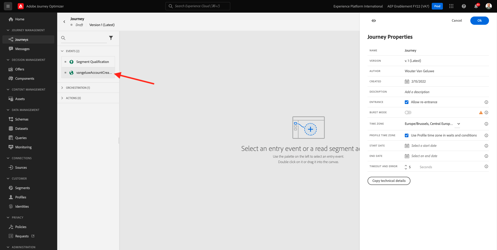
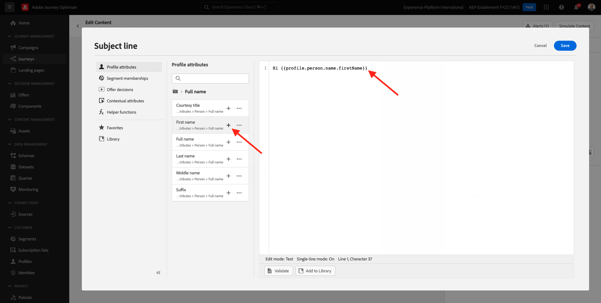
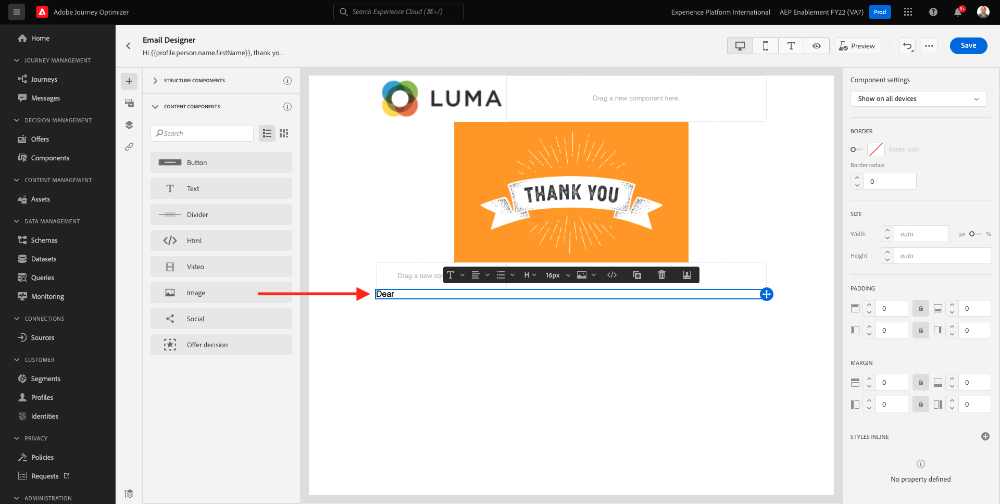
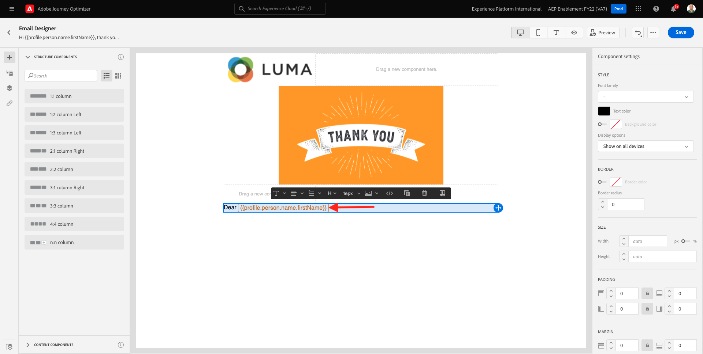
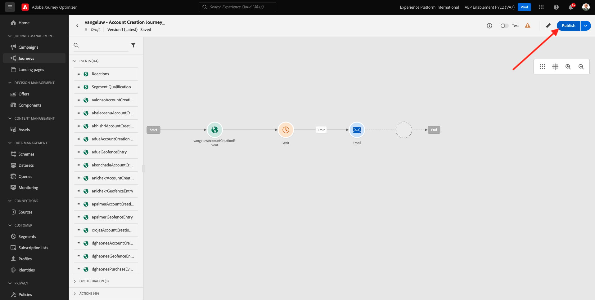

# 7.2建立您的歷程和電子郵件訊息

在本練習中，您將設定歷程，以及當某人在示範網站上建立帳戶時需要觸發的訊息。

前往登入Adobe Journey Optimizer [Adobe Experience Cloud](https://experience.adobe.com). 按一下 **Journey Optimizer**.

系統會將您重新導向至 **首頁**  檢視。 首先，請確定您使用的沙箱正確無誤。 系統會呼叫要使用的沙箱 `--aepSandboxId--`. 若要從一個沙箱變更為另一個沙箱，請按一下 **生產產品(VA7)** 並從清單中選取沙箱。 在此範例中，沙箱的名稱為 **2022財年AEP啟用**. 那你就在 **首頁** 沙箱檢視 `--aepSandboxId--`.

## 7.2.1建立您的歷程

在左側功能表中，按一下 **歷程**. 下一步，按一下 **建立歷程** 來建立新歷程。

然後您會看到空白的歷程畫面。

在上一個練習中，您建立了 **事件**. 你給它起了這個名字 `ldapAccountCreationEvent` 和 `ldap` 的LDAP。 這是建立事件的結果：

您現在需要將此活動視為此歷程的開始。 您可以前往畫面左側，並在事件清單中搜尋您的事件，以執行此操作。

選取您的事件，將其拖放至歷程畫布。 您的歷程現在看起來像這樣：

作為歷程的第二步，您需要新增簡短 **等待** 步驟。 前往畫面左側的 **協調** 區段來尋找此項目。 您將使用設定檔屬性，且需要確定這些屬性已填入「即時客戶設定檔」中。

你的旅程現在看起來像這樣。 在畫面右側，您需要設定等待時間。 設為1分鐘。 這將提供充足的時間讓設定檔屬性在事件引發後可用。

按一下 **確定** 來儲存變更。

作為歷程的第三個步驟，您需要新增 **電子郵件** 動作。 前往畫面左側，前往 **動作**，請選取 **電子郵件** 動作，然後將其拖放至歷程中的第二個節點。 你現在看到這個。

設定 **類別** to **行銷** 並選取電子郵件介面，讓您傳送電子郵件。 在此情況下，要選取的電子郵件表面是 **電子郵件**. 確保的複選框 **電子郵件的點按次數** 和 **電子郵件開啟** 都會啟用。

下一步是建立訊息。 若要這麼做，請按一下 **編輯內容**.

## 7.2.2建立訊息

若要建立訊息，請按一下 **編輯內容**.

你現在看到這個。

按一下 **主旨行** 文字欄位。

在文本區域開始寫 **你好**

尚未完成主題行。 接下來，您需要為欄位帶入個人化代號 **名字** 儲存於 `profile.person.name.firstName`. 在左側功能表中，向下捲動以尋找 **人員** 元素，然後按一下箭頭以深入了解層級。

現在找到 **全名** 元素，然後按一下箭頭以深入了解層級。

最後，找到 **名字** 欄位，然後按一下 **+** 簽到旁邊。 然後，您會看到個人化代號出現在文字欄位中。

接下來，新增文字 **，感謝您註冊！**。按一下「**儲存**」。

你會回來的。 按一下 **電子郵件設計工具** 來建立電子郵件內容。

在下一個畫面中，系統會以3種不同方法提示您提供電子郵件的內容：

- **從頭設計**:從空白畫布開始，使用WYSIWYG編輯器來拖放結構和內容元件，以視覺化方式建立電子郵件的內容。
- **自行編碼**:使用HTML對您自己的電子郵件範本進行編碼，以建立您的電子郵件範本
- **匯入HTML**:匯入您將能編輯的現有HTML範本。

按一下 **從頭設計**.

在左側功能表中，您會找到可用來定義電子郵件結構（列和欄）的結構元件。

拖放 **左1:2欄** 從功能表移入畫布。 這將是標誌影像的預留位置。

拖放 **1:1欄** 在上一個元件下。 這會是橫幅區塊。

拖放 **左1:2欄** 在上一個元件下。 這將是實際內容，左側是影像，右側是文字。

接下來，拖放 **1:1欄** 在上一個元件下。 這是電子郵件的頁尾。 您的畫布現在應該如下所示：

接下來，我們使用「內容元件」來在這些區塊中新增內容。 按一下 **內容元件** 功能表項目

拖放 **影像** 元件。 按一下&#x200B;**「瀏覽」**。

你會看到這個。 導覽至資料夾 **啟用資產** 並選取檔案 **luma-logo.png**. 按一下&#x200B;**「選取」**。

你現在回來了：

前往 **內容元件** 拖放 **影像** 元件。 按一下&#x200B;**「瀏覽」**。

在 **資產** 快顯視窗，前往 **啟用資產** 檔案夾。 在此資料夾中，您會找到創意團隊先前準備和上傳的所有資產。 選擇 **module23-thankyou-new.png** 按一下 **選擇**.

然後，您會擁有此功能：

選取您的影像，然後在右側功能表中向下捲動，直到您看到 **大小** 寬度滑桿元件。 使用滑桿將寬度變更為f.i。 **60%**.

接下來，轉到 **內容元件** 拖放 **文字** 元件（位於第四列的結構元件中）。

選取預設文字 **請在這裡鍵入您的文本。** 與任何文字編輯器的操作方式相同。 寫入 **親愛的** 。 注意您處於文字模式時顯示的文字工具列。

在工具列中按一下 **新增個人化** 表徵圖。

接下來，你要把 **名字** 儲存於 `profile.person.name.firstName`. 在功能表中，尋找 **人員** 元素，向下切入 **完整名稱** 元素，然後按一下 **+** 圖示將「名字」欄位新增至運算式編輯器。

按一下「**儲存**」。

您現在會注意到個人化欄位已新增至文字的方式。

在相同的文字欄位中，點擊 **輸入** 加兩行並寫 **感謝您與Luma建立帳戶！**.

執行的最終檢查，以確保您的電子郵件已就緒，即可預覽，請按一下 **模擬內容** 按鈕。

首先，找出您要用於預覽的設定檔。 選取 **電子郵件** 命名空間，方法是按一下 **輸入身分命名空間** 欄位。

在身分識別命名空間清單中，選取 **電子郵件** 命名空間。

在 **身分值** 欄位中，輸入已儲存在即時客戶設定檔中之先前示範設定檔的電子郵件地址。 例如 **woutervangeluwe+06022022-01@gmail.com** 並按一下 **查找測試配置檔案** 按鈕

設定檔顯示在表格中後，按一下 **預覽** 頁簽以訪問預覽螢幕。

預覽就緒時，驗證主旨行中的個人化是否正確，內文及取消訂閱連結會以超連結的形式強調顯示。

按一下 **關閉** 來關閉預覽。

按一下 **儲存** 來儲存訊息。

按一下 **箭頭** 在左上角的主旨行文字旁邊。

您現在已完成建立註冊電子郵件。 按一下左上角的箭頭，返回您的歷程。

按一下 **確定**.

## 7.2.3發佈您的歷程

您仍需為歷程命名。 您可以按一下 **屬性** 圖示。

然後，您可以在此處輸入歷程的名稱。 請使用 `--demoProfileLdap-- - Account Creation Journey`. 按一下 **確定** 來儲存變更。

您現在可以按一下 **發佈**.

按一下 **發佈** 。

接著，您會看到綠色的確認列，指出您的歷程現已發佈。

你已經完成了這個練習。

下一步： [7.3更新資料收集屬性並測試您的歷程](./ex3.md)

[返回模組7](./journey-orchestration-create-account.md)

[返回所有模組](../../overview.md)
