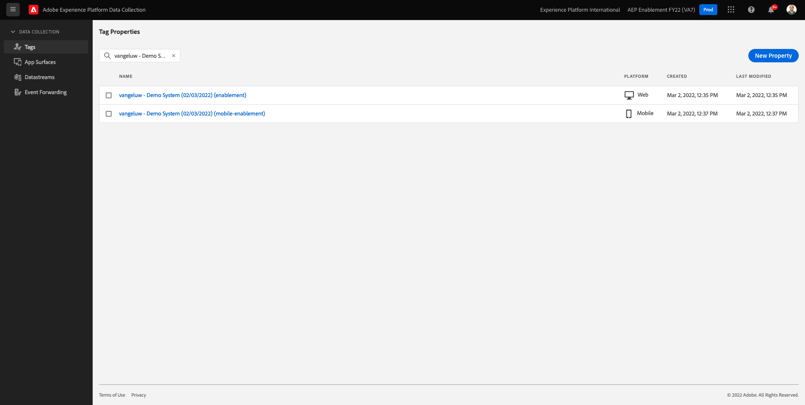

# 7.3更新資料收集屬性並測試您的歷程

## 7.3.1更新資料收集屬性

前往 [Adobe Experience Platform資料收集](https://experience.adobe.com/launch/) 選取 **標籤**.

這是您之前看到的Adobe Experience Platform資料收集屬性頁面。

在模組0中，演示系統為您建立了兩個客戶端屬性：一個用於網站，一個用於行動應用。 通過搜索來查找 `--demoProfileLdap--` 在 **[!UICONTROL 搜尋]** 框。 按一下以開啟 **Web** 屬性。

你會看到這個。

在左側功能表中，前往 **規則** 和搜尋規則 **註冊配置檔案**. 按一下規則 **註冊配置檔案** 來開啟它。

然後您會看到此規則的詳細資訊。 按一下以開啟動作 **將「註冊事件」傳送至AEP — 觸發JO**.

接著，您就會看到觸發此動作時，會使用特定資料元素來定義XDM資料結構。 您需要更新該資料元素，且需要定義 **事件ID** 的 [練習7.1](./ex1.md).

您現在需要更新資料元素 **XDM — 註冊事件**. 若要這麼做，請前往 **資料元素**. 搜尋 **XDM — 註冊事件** 並按一下以開啟該資料元素。

然後您會看到：

導覽至欄位 `_experience.campaign.orchestration.eventID`. 移除目前值，然後將eventID貼到該處。

提醒您，事件ID位於Adobe Journey Optimizer的 **設定>事件** 而您會在偶數的範例裝載中找到事件ID，如下所示： `"eventID": "227402c540eb8f8855c6b2333adf6d54d7153d9d7d56fa475a6866081c574736"`.

貼上eventID後，您的畫面應該如下所示。 下一步，按一下 **儲存** 或 **儲存至程式庫**.

最後，您需要發佈變更。 前往 **發佈流程** 的上界。

按一下 **新增所有已變更的資源** 然後按一下 **儲存並建置至開發**.

程式庫隨後會更新，1-2分鐘後，您就可以繼續測試您的設定。

## 7.3.2測試您的歷程

前往 [https://builder.adobedemo.com/projects](https://builder.adobedemo.com/projects). 使用您的Adobe ID登入後，您會看到這個。 按一下您的網站專案以開啟。

在 **Screens** 頁面，按一下 **執行**.

然後，您會看到示範網站已開啟。 選取URL並複製到剪貼簿。

開啟新的無痕瀏覽器窗口。

貼上您在上一步複製的示範網站URL。 然後系統會要求您使用Adobe ID登入。

選取您的帳戶類型並完成登入程式。

然後，您會在無痕瀏覽器視窗中看到您的網站載入。 對於每個演示，您都需要使用全新的無痕瀏覽器窗口來載入演示網站URL。

按一下螢幕左上角的Adobe標誌圖示，開啟「設定檔檢視器」。

查看「設定檔檢視器」面板和「即時客戶設定檔」，其中 **Experience CloudID** 作為此目前未知客戶的主要識別碼。

前往註冊/登入頁面。 按一下 **建立帳戶**.

填寫詳細資訊，然後按一下 **註冊** 之後，系統會將您重新導向至上一頁。

開啟「設定檔檢視器」面板，然後前往「即時客戶設定檔」。 在「設定檔檢視器」面板上，您應該會看到所有個人資料顯示，例如新新增的電子郵件和電話識別碼。

建立帳戶後1分鐘，您會收到Adobe Journey Optimizer寄來的帳戶建立電子郵件。

下一步： [摘要和優點](./summary.md)

[返回模組7](./journey-orchestration-create-account.md)

[返回所有模組](../../overview.md)
