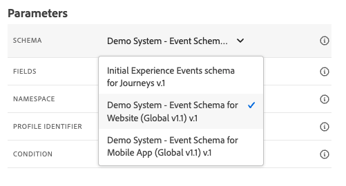

# 8.1定義事件

前往登入Adobe Journey Optimizer [Adobe Experience Cloud](https://experience.adobe.com). 按一下 **Journey Optimizer**.

系統會將您重新導向至 **首頁**  檢視。 首先，請確定您使用的沙箱正確無誤。 系統會呼叫要使用的沙箱 `--aepSandboxId--`. 若要從一個沙箱變更為另一個沙箱，請按一下 **生產產品(VA7)** 並從清單中選取沙箱。 在此範例中，沙箱的名稱為 **2022財年AEP啟用**. 那你就在 **首頁** 沙箱檢視 `--aepSandboxId--`.

在左側功能表中，向下捲動並按一下 **配置**. 下一步，按一下 **管理** 按鈕 **事件**.

之後，您將會看到所有可用事件的概觀。 按一下 **建立事件** 以開始建立您自己的事件。

接著會出現新的空事件視窗。

作為事件的名稱，請使用 `--demoProfileLdap--GeofenceEntry`. 在此範例中，事件名稱為 `vangeluwGeofenceEntry`.

將說明設定為： `Geofence Entry Event`.

接下來，請確定 **類型** 設為 **單一**，和 **事件ID類型** 選擇，選擇 **系統生成**

接下來，您需要選取結構。 此處顯示的所有結構均為Adobe Experience Platform結構。

您會發現並非所有結構皆已顯示。 Adobe Experience Platform有更多可用的結構描述。
若要顯示在此清單中，結構需要有一個非常特定的欄位群組連結到該群組。 此處顯示所需的欄位群組稱為 `Orchestration eventID`.

讓我們快速了解這些結構在Adobe Experience Platform中的定義。

在左側功能表中，前往 **結構** 並在新的瀏覽器標籤中開啟它。 在 **結構**，前往 **瀏覽** ，查看可用結構清單。
開啟結構 `Demo System - Event Schema for Website (Global v1.1)`.

開啟結構後，您會看到欄位群組 `Orchestration eventID` 是架構的一部分。
此欄位組只有兩個欄位， `_experience.campaign.orchestration.eventID` 和 `originJourneyID`.

一旦此欄位群組和此特定eventID欄位成為結構的一部分，該結構便可供Adobe Journey Optimizer使用。

返回Adobe Journey Optimizer中的事件設定。

在此使用案例中，您想要監聽地理柵欄事件以了解客戶是否位於特定位置，因此，請立即選取結構 `Demo System - Event Schema for Website (Global v1.1)` 作為事件的結構。

Adobe Journey Optimizer接著會自動選取一些必要欄位，但您可以編輯可供Adobe Journey Optimizer使用的欄位。

按一下 **鉛筆** 圖示來編輯欄位。

然後，您會看到彈出式視窗，其中包含可讓您選取欄位的架構階層。

ECID和Orchestration eventID等欄位為必要欄位，並且已預先選取。

不過，行銷人員必須能有彈性地存取提供歷程內容的所有資料點。 因此，我們也請務必至少選取下列欄位（可在「放置」內容節點中找到）:

- 城市

完成後，按一下 **確定**.

Adobe Journey Optimizer也需要識別碼來識別客戶。 由於Adobe Journey Optimizer已連結至Adobe Experience Platform，因此系統會自動將結構的主要識別碼視為歷程的識別碼。
主要識別碼也會自動將Adobe Experience Platform的完整身分圖表納入考量，並將所有可用身分、裝置和管道的所有行為連結至相同的設定檔，讓Adobe Journey Optimizer與情境相關、相關且一致。

按一下 **儲存** 以儲存自訂事件。

您的事件將成為可用事件清單的一部分。

最後，您需要恢復 `Orchestration eventID` 自訂事件。

在事件清單中按一下事件，以再次開啟事件。
在您的事件上，按一下 **檢視裝載** 表徵圖 **欄位**.

按一下 **檢視裝載** 圖示會開啟此事件的XDM裝載範例。

向下捲動 **裝載** 直到你看到這條線 `eventID`.

記下 `eventID` 因為您最後需要它來測試您的設定。

在此範例中， `eventID` is `fa42ab7982ba55f039eacec24c1e32e5c51b310c67f0fa559ab49b89b63f4934`.

您現在已定義會觸發我們建立之歷程的事件。 觸發歷程後，地理欄位（例如「城市」）以及您選擇的任何其他欄位（例如「國家」、「經緯度」）將可供歷程使用。

如使用案例說明所述，我們接著需要根據天氣提供情境式促銷活動。 為了獲得天氣資訊，我們需要定義外部資料源，為我們提供該位置的天氣資訊。 您將使用 **OpenWeather** 為我們提供這些資訊，作為2的一部分。

下一步： [8.2定義外部資料來源](./ex2.md)

[返回模組8](journey-orchestration-external-weather-api-sms.md)

[返回所有模組](../../overview.md)
