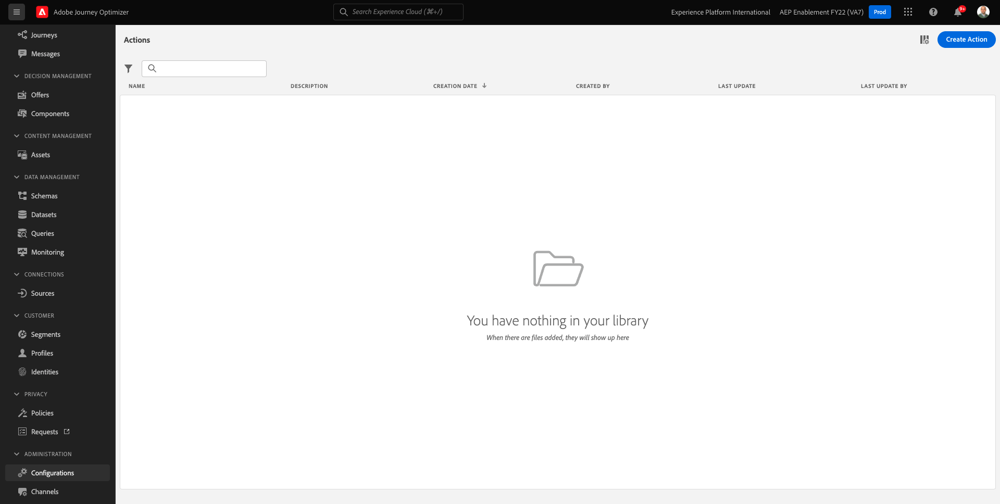
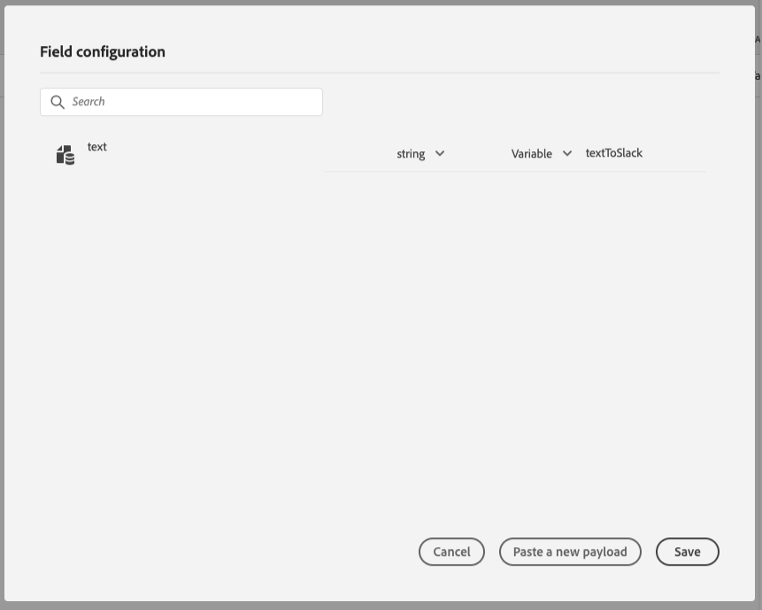

# 8.3定義自訂動作

在本練習中，您將結合使用Adobe Journey Optimizer來建立兩個自訂動作。

前往登入Adobe Journey Optimizer [Adobe Experience Cloud](https://experience.adobe.com). 按一下 **Journey Optimizer**.


系統會將您重新導向至 **首頁**  檢視。 首先，請確定您使用的沙箱正確無誤。 系統會呼叫要使用的沙箱 `--aepSandboxId--`. 若要從一個沙箱變更為另一個沙箱，請按一下 **生產產品(VA7)** 並從清單中選取沙箱。 在此範例中，沙箱的名稱為 **2022財年AEP啟用**. 那你就在 **首頁** 沙箱檢視 `--aepSandboxId--`.


在左側功能表中，向下捲動並按一下 **配置**. 下一步，按一下 **管理** 按鈕 **動作**.


然後您會看到 **動作** 清單。



您將定義一個將文字傳送至Slack管道的動作。

## 8.3.1行動：將文字傳送至Slack通道

您現在將使用現有的Slack通道，並傳送訊息至該Slack通道。 Slack有簡單易用的API，我們將使用Adobe Journey Optimizer來觸發其API。


按一下 **建立動作** 以開始新增動作。


您會看到空白的「動作」快顯視窗。


作為動作的名稱，請使用 `--demoProfileLdap--TextSlack`. 在此範例中，動作名稱為 `vangeluwTextSlack`.

將說明設定為： `Send Text to Slack`.


若 **URL設定**，請使用下列項目：

- URL: `https://2mnbfjyrre.execute-api.us-west-2.amazonaws.com/prod`
- 方法： **POST**

>[!NOTE]
>
>上述URL會參照AWS Lambda函式，之後會將您的要求轉送至上述的Slack通道。 這麼做是為了保護對Adobe擁有之Slack管道的存取權。 如果您有自己的Slack管道，則應透過 [https://api.slack.com/](https://api.slack.com/)，則您需要在該Slack應用程式中建立傳入Webhook，然後以您的傳入Webhook URL取代上述URL。

您不需要變更標題欄位。


**驗證** 應設為 **無驗證**.


若 **動作參數**，您需要定義應將哪些欄位傳送至Slack。 邏輯上，我們希望Adobe Journey Optimizer和Adobe Experience Platform是個人化的大腦，所以要傳送至Slack的文字應由Adobe Journey Optimizer定義，然後傳送至Slack以執行。

所以對於 **動作參數**，按一下 **編輯裝載** 表徵圖。


然後您會看到空白的快顯視窗。


複製下方的文字，並貼到空白的快顯視窗中。

```json
{
 "text": {
  "toBeMapped": true,
  "dataType": "string",
  "label": "textToSlack"
 }
}
```

答：指定下列欄位後，這些欄位便可從您的Customer Journey存取，而您將能夠從Journey動態填入這些欄位：

**&quot;toBeMapped&quot;:true,**

**&quot;dataType&quot;:&quot;string&quot;,**

**&quot;label&quot;:&quot;textToSlack&quot;**

然後您會看到：



按一下「**儲存**」。


向上捲動並按一下 **儲存** 再次儲存自訂動作。


您的自訂動作現在是 **動作** 清單。


您已定義事件、外部資料來源和動作。 現在，讓我們在一個歷程中整合所有這些。

下一步： [8.4建立您的歷程和訊息](./ex4.md)

[返回模組8](journey-orchestration-external-weather-api-sms.md)

[返回所有模組](../../overview.md)
