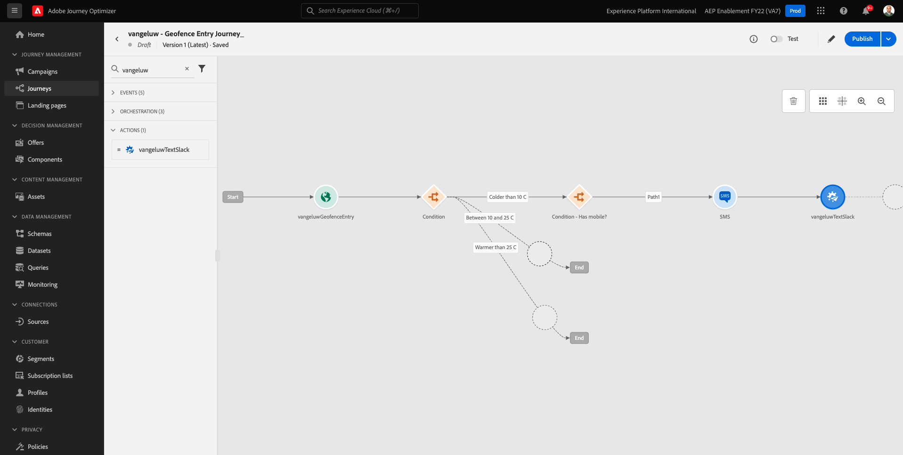
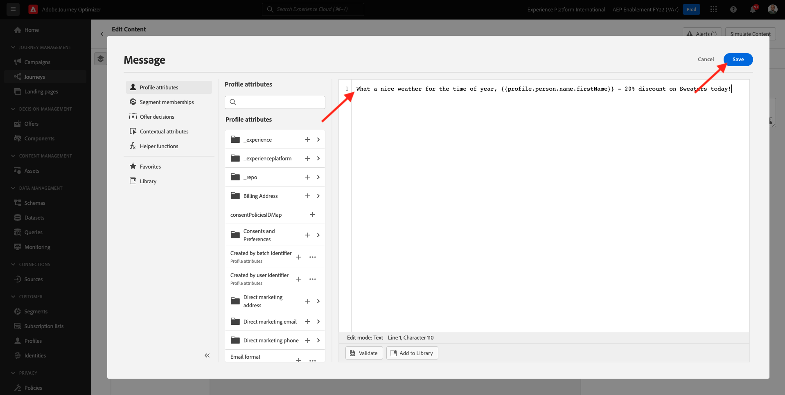
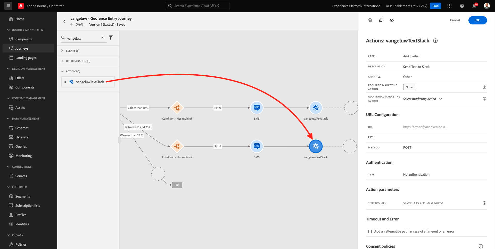
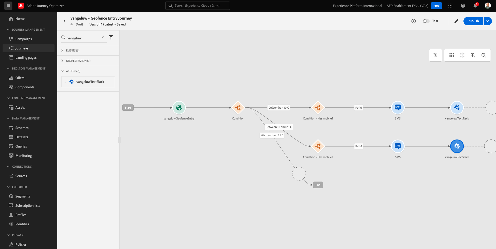
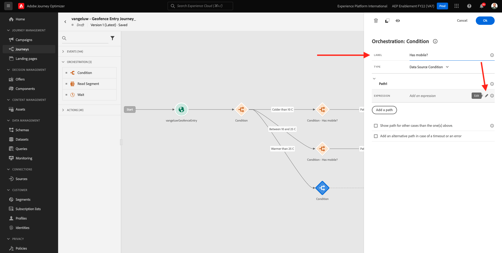
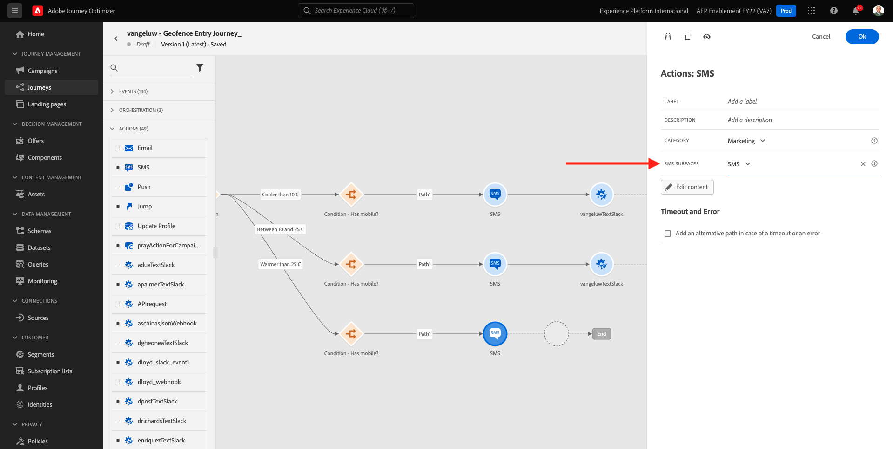
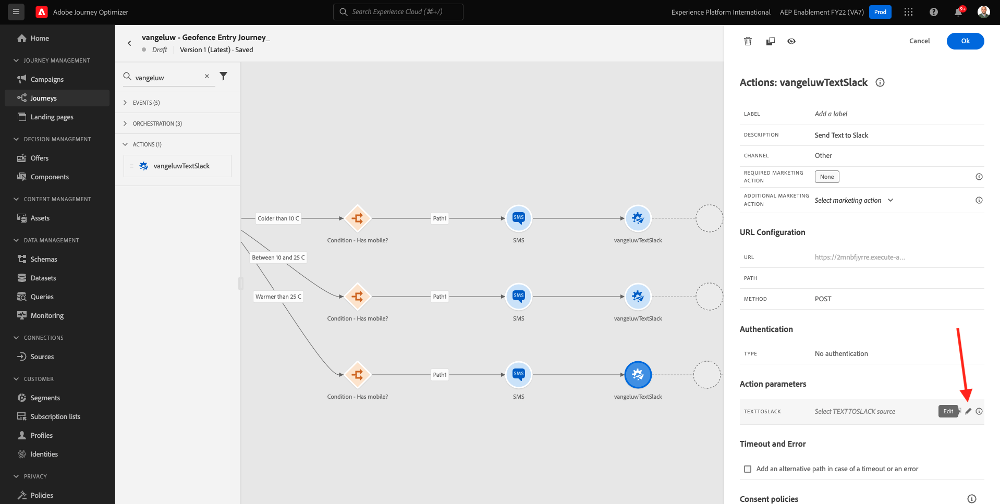

# 8.4建立您的歷程和訊息

在本練習中，您將利用Adobe Journey Optimizer建立歷程和數個文字訊息。

針對此使用案例，目標是根據客戶所在位置的天氣條件傳送不同的SMS訊息。 已定義3個案例：

- 低於10° C
- 10°至25°攝氏度
- 熱於25° C

針對這3個條件，您需要在Adobe Journey Optimizer中定義3個SMS訊息。

## 8.4.1建立您的歷程

前往登入Adobe Journey Optimizer [Adobe Experience Cloud](https://experience.adobe.com). 按一下 **Journey Optimizer**.


系統會將您重新導向至 **首頁**  檢視。 首先，請確定您使用的沙箱正確無誤。 系統會呼叫要使用的沙箱 `--aepSandboxId--`. 若要從一個沙箱變更為另一個沙箱，請按一下 **生產產品(VA7)** 並從清單中選取沙箱。 在此範例中，沙箱的名稱為 **2022財年AEP啟用**. 那你就在 **首頁** 沙箱檢視 `--aepSandboxId--`.


在左側功能表中，前往 **歷程** 按一下 **建立歷程** 來開始建立您的歷程。


您應該先命名您的歷程。

作為歷程的名稱，請使用 `--demoProfileLdap-- - Geofence Entry Journey`. 在此範例中，歷程名稱為 `vangeluw - Geofence Entry Journey`. 目前不得設定其他值。 按一下&#x200B;**「確定」**。


在螢幕的左側，查看 **事件**. 您應該會在該清單中看到先前建立的事件。 選取它，然後將其拖放至歷程畫布上。 你的旅程就是這樣。 按一下 **確定**.


下一步，按一下 **協調**. 您現在會看到可用的 **協調** 功能。 選擇 **條件**，然後將其拖放至歷程畫布上。


您現在必須定義三個條件：

- 冷於10°C
- 溫度在10°至25°C之間
- 熱於25°C

讓我們定義第一個條件。

### 條件1:低於10° C

按一下 **條件**.  按一下 **路徑1** 和編輯路徑的名稱 **冷於10攝氏度**. 按一下 **編輯** 表徵圖。


然後你會看到一個空的 **簡單編輯器** 螢幕。 您的查詢會更進階，因此您需要 **進階模式**. 按一下 **進階模式**.


然後您會看到 **進階編輯器** 允許輸入程式碼。


選取下列程式碼，並貼到 **進階編輯器**.

`#{--demoProfileLdap--WeatherApi.--demoProfileLdap--WeatherByCity.main.temp} <= 10`

你會看到這個。


為了在此條件中檢索溫度，您需要提供客戶當前所在的城市。
此 **城市** 需要連結至動態參數 `q`，就像之前在「開放氣象API檔案」中看到的一樣。

按一下欄位 **動態值：q** 如螢幕擷圖所示。


然後，您需要在其中一個可用的資料來源中，找到包含客戶目前所在城市的欄位。


您可以導覽至 `--demoProfileLdap--GeofenceEntry.placeContext.geo.city`.

按一下該欄位，即會將其新增為參數的動態值 `q`. 此欄位將會填入，例如您已在行動應用程式中實作的地理位置服務。 在此案例中，我們將透過示範網站的admin console來模擬。 按一下&#x200B;**「確定」**。


### 條件2:10°至25°攝氏度

新增第一個條件後，您會看到此畫面。 按一下 **新增路徑**.


按兩下 **路徑1** 並將路徑名稱編輯為 **在10到25攝氏度之間**. 按一下 **編輯** 表徵圖。


然後你會看到一個空的 **簡單編輯器** 螢幕。 您的查詢會更進階，因此您需要 **進階模式**. 按一下 **進階模式**.


然後您會看到 **進階編輯器** 允許輸入程式碼。


選取下列程式碼，並貼到 **進階編輯器**.

`#{--demoProfileLdap--WeatherApi.--demoProfileLdap--WeatherByCity.main.temp} > 10 and #{--demoProfileLdap--WeatherApi.--demoProfileLdap--WeatherByCity.main.temp} <= 25`

你會看到這個。


為了在此條件中檢索溫度，您需要提供客戶當前所在的城市。
此 **城市** 需要連結至動態參數 **q**，就像之前在「開放氣象API檔案」中看到的一樣。

按一下欄位 **動態值：q** 如螢幕擷圖所示。


然後，您需要在其中一個可用的資料來源中，找到包含客戶目前所在城市的欄位。


您可以導覽至 `--demoProfileLdap--GeofenceEntry.placeContext.geo.city`. 按一下該欄位，即會將其新增為參數的動態值 **q**. 此欄位將會填入，例如您已在行動應用程式中實作的地理位置服務。 在此案例中，我們將透過示範網站的admin console來模擬。 按一下&#x200B;**「確定」**。


接下來，添加第3個條件。

### 條件3:熱於25° C

新增第二個條件後，您會看到此畫面。 按一下 **新增路徑**.


按兩下路徑1以將名稱變更為 **熱於25攝氏度**.
然後按一下 **編輯** 表徵圖。


然後你會看到一個空的 **簡單編輯器** 螢幕。 您的查詢會更進階，因此您需要 **進階模式**. 按一下 **進階模式**.


然後您會看到 **進階編輯器** 允許輸入程式碼。


選取下列程式碼，並貼到 **進階編輯器**.

`#{--demoProfileLdap--WeatherApi.--demoProfileLdap--WeatherByCity.main.temp} > 25`

你會看到這個。


為了在此條件中檢索溫度，您需要提供客戶當前所在的城市。
此 **城市** 需要連結至動態參數 **q**，就像之前在「開放氣象API檔案」中看到的一樣。

按一下欄位 **動態值：q** 如螢幕擷圖所示。


然後，您需要在其中一個可用的資料來源中，找到包含客戶目前所在城市的欄位。


您可以導覽至 ```--demoProfileLdap--GeofenceEntry.placeContext.geo.city```. 按一下該欄位，即會將其新增為參數的動態值 **q**. 此欄位將會填入，例如您已在行動應用程式中實作的地理位置服務。 在此案例中，我們將透過示範網站的admin console來模擬。 按一下&#x200B;**「確定」**。


您現在有三個已設定的路徑。 按一下 **確定**.


由於這是學習的歷程，我們現在將設定幾個動作，以展示行銷人員現在必須傳送訊息的各種選項。

## 8.4.2傳送路徑的訊息：低於10° C

對於每個溫度環境，我們將嘗試向客戶發送簡訊。 只有當客戶有可用的行動電話號碼時，我們才能傳送簡訊，因此我們必須先確認是否有。

讓我們集中注意 **冷於10攝氏度**.


我們再拿一個 **條件** 元素，並如下方螢幕擷圖所示拖曳元素。 我們會確認是否有可用的行動電話號碼給此客戶。


因為這只是範例，我們只會設定客戶有可用行動號碼的選項。 新增標籤 **有手機嗎？**.

按一下 **編輯** 表達式的 **路徑1** 路徑。


在左側顯示的「資料來源」中，導覽至 **ExperiencePlatform.ProfileFieldGroup.profile.mobilePhone.number**. 您現在可以直接從Adobe Experience Platform的即時客戶個人檔案讀取行動電話號碼。


選取欄位 **數字**，然後將其拖放至條件畫布。

選取運算子 **非空白**. 按一下 **確定**.


你會看到這個。 按一下 **確定** 。


然後您的歷程會變成這樣。 按一下 **動作** 如螢幕擷圖所示。


選取動作 **簡訊**，然後在您剛新增的條件之後拖放。


設定 **類別** to **行銷** 並選取簡訊表面，讓您傳送簡訊 在此情況下，要選取的電子郵件表面是 **簡訊**.


下一步是建立訊息。 若要這麼做，請按一下 **編輯內容**.


您現在會看到訊息控制面板，您可在其中設定SMS的文字。 按一下 **撰寫訊息** 區域來建立訊息。


輸入以下文字： `Brrrr... {{profile.person.name.firstName}}, it's freezing. 20% discount on jackets today!`. 按一下「**儲存**」。


你會看到這個。 按一下左上角的箭頭，返回您的歷程。


你會回來的。 按一下 **確定**.


在左側功能表中，返回 **動作**，選取動作 `--demoProfileLdap--TextSlack`，然後將其拖放至 **訊息** 動作。


前往 **動作參數** 並按一下 **編輯** 圖示 `TEXTTOSLACK`.


在快顯視窗中，按一下 **進階模式**.


選取下列程式碼，複製並貼到 **進階模式編輯器**. 按一下 **確定**.

`"Brrrr..." + #{ExperiencePlatform.ProfileFieldGroup.profile.person.name.firstName} + " It's freezing. 20% discount on Jackets today!"`


您會看到您已完成的動作。 按一下 **確定**.


此歷程路徑現已準備就緒。

## 8.4.3傳送路徑的訊息：10°至25°攝氏度

對於每個溫度環境，我們將嘗試向客戶發送簡訊。 只有當客戶有可用的行動電話號碼時，我們才能傳送簡訊，因此我們必須先確認是否有。

讓我們集中注意 **在10到25攝氏度之間** 路徑。



我們再拿一個 **條件** 元素，並如下方螢幕擷圖所示拖曳元素。 我們會確認是否有可用的行動電話號碼給此客戶。


因為這只是範例，我們只會設定客戶有可用行動號碼的選項。 新增標籤 **有手機嗎？**.

按一下 **編輯** 表達式的 **路徑1** 路徑。


在左側顯示的「資料來源」中，導覽至 **ExperiencePlatform.ProfileFieldGroup.profile.mobilePhone.number**. 您現在可以直接從Adobe Experience Platform的即時客戶個人檔案讀取行動電話號碼。


選取欄位 **數字**，然後將其拖放至條件畫布。

選取運算子 **非空白**. 按一下 **確定**.


你會看到這個。 按一下 **確定**.


然後您的歷程會變成這樣。 按一下 **動作** 如螢幕擷圖所示。


選取動作 **簡訊**，然後在您剛新增的條件之後拖放。


設定 **類別** to **行銷** 並選取簡訊表面，讓您傳送簡訊 在此情況下，要選取的電子郵件表面是 **簡訊**.


下一步是建立訊息。 若要這麼做，請按一下 **編輯內容**.


您現在會看到訊息控制面板，您可在其中設定SMS的文字。 按一下 **撰寫訊息** 區域來建立訊息。


輸入以下文字： `What a nice weather for the time of year, {{profile.person.name.firstName}} - 20% discount on Sweaters today!`. 按一下「**儲存**」。



你會看到這個。 按一下左上角的箭頭，返回您的歷程。


您現在會看到已完成的動作。 按一下 **確定**.


在左側功能表中，返回 **動作**，選取動作 `--demoProfileLdap--TextSlack`，然後將其拖放至 **訊息** 動作。



前往 **動作參數** 並按一下 **編輯** 圖示 `TEXTTOSLACK`.


在快顯視窗中，按一下 **進階模式**.


選取下列程式碼，複製並貼到 **進階模式編輯器**. 按一下 **確定**.

`"What nice weather for the time of year, " + #{ExperiencePlatform.ProfileFieldGroup.profile.person.name.firstName} + " 20% discount on Sweaters today!"`


您會看到您已完成的動作。 按一下 **確定**.


此歷程路徑現已準備就緒。

## 8.4.4傳送路徑的訊息：熱於25° C

對於每個溫度環境，我們將嘗試向客戶發送簡訊。 只有當客戶有可用的行動電話號碼時，我們才能傳送簡訊，因此我們必須先確認是否有。

讓我們集中注意 **熱於25攝氏度** 路徑。



我們再拿一個 **條件** 元素，並如下方螢幕擷圖所示拖曳元素。 您會驗證是否針對此客戶，您有可用的行動電話號碼。


因為這只是範例，我們只會設定客戶有可用行動號碼的選項。 新增標籤 **有手機嗎？**.

按一下 **編輯** 表達式的 **路徑1** 路徑。



在左側顯示的「資料來源」中，導覽至 **ExperiencePlatform.ProfileFieldGroup.profile.mobilePhone.number**. 您現在可以直接從Adobe Experience Platform的即時客戶個人檔案讀取行動電話號碼。


選取欄位 **數字**，然後將其拖放至條件畫布。

選取運算子 **非空白**. 按一下 **確定**.


你會看到這個。 按一下&#x200B;**「確定」**。


然後您的歷程會變成這樣。 按一下 **動作** 如螢幕擷圖所示。


選取動作 **簡訊**，然後在您剛新增的條件之後拖放。


設定 **類別** to **行銷** 並選取簡訊表面，讓您傳送簡訊 在此情況下，要選取的電子郵件表面是 **簡訊**.



下一步是建立訊息。 若要這麼做，請按一下 **編輯內容**.


您現在會看到訊息控制面板，您可在其中設定SMS的文字。 按一下 **撰寫訊息** 區域來建立訊息。


輸入以下文字： `So warm, {{profile.person.name.firstName}}! 20% discount on swimwear today!`. 按一下「**儲存**」。


你會看到這個。 按一下左上角的箭頭，返回您的歷程。


您現在會看到已完成的動作。 按一下 **確定**.


在左側功能表中，返回 **動作**，選取動作 `--demoProfileLdap--TextSlack`，然後將其拖放至 **訊息** 動作。


前往 **動作參數** 並按一下 **編輯** 圖示 `TEXTTOSLACK`.



在快顯視窗中，按一下 **進階模式**.


選取下列程式碼，複製並貼到 **進階模式編輯器**. 按一下 **確定**.

`"So warm, " + #{ExperiencePlatform.ProfileFieldGroup.profile.person.name.firstName} + "! 20% discount on swimwear today!"`


您會看到您已完成的動作。 按一下 **確定**.


此歷程路徑現已準備就緒。

## 8.4.5發佈您的歷程

您的歷程現在已完全設定。 按一下 **發佈**.


按一下 **發佈** 。


您的歷程現在已發佈。


下一步： [8.5觸發您的歷程](./ex5.md)

[返回模組8](journey-orchestration-external-weather-api-sms.md)

[返回所有模組](../../overview.md)
