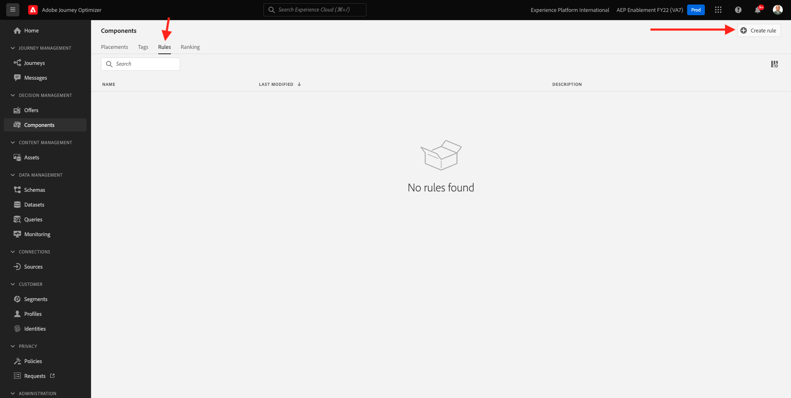

# 9.1Offer decisioning101

## 9.1.1術語

為了進一步了解Offer decisioning，強烈建議您閱讀 [概述](https://experienceleague.adobe.com/docs/journey-optimizer/using/offer-decisioniong/get-started-decision/starting-offer-decisioning.html?lang=en) 關於Offer decisioning應用程式服務如何與Adobe Experience Platform搭配運作的資訊。

使用Offer decisioning時，您需要了解下列概念：

| 詞語 | 解釋 |
| ------------------------- | -------------------------------------------------------------------------------------------------------------------------------------------------------------------------------------------------------------------------------------------------------- |
| **選件** | 優惠方案是行銷訊息，可能會有與其相關聯的規則，用以指定誰有資格看見優惠方案。 選件的狀態為：草稿、核准或封存。 |
| **版位** | 位置（或頻道類型）與內容（或內容類型）的組合，一般使用者會在其中看到選件。 實際上，它是行動裝置、網路、社交、即時訊息和非數位頻道中文字、HTML、影像、JSON的組合。 |
| **規則** | 定義並控制一般使用者資格的優惠方案邏輯。 |
| **個人化優惠方案** | 根據適用性規則和限制的可自訂行銷訊息。 |
| **備援優惠方案** | 當使用者不符合所使用集合中任何選件的資格時，所顯示的預設選件。 |
| **限定** | 用於選件定義，以定義一個選件可總呈現給特定使用者的次數。 |
| **優先順序** | 從選件集決定優先順序排名的層級。 |
| **集合** | 用於從個人化優惠方案清單中篩選出子集優惠方案，以加速offer decisioning程式。 |
| **決策** | 一組優惠方案、版位和設定檔的組合，行銷人員想要決策引擎提供最佳優惠方案。 |
| **AEM Assets Essentials** | 跨Adobe Experience Cloud解決方案和Adobe Experience Platform儲存、尋找和選取資產的通用且集中化體驗。 |

{style=&quot;table-layout:auto&quot;}

## 9.1.2Offer decisioning

前往登入Adobe Journey Optimizer [Adobe Experience Cloud](https://experience.adobe.com). 按一下 **Journey Optimizer**.

系統會將您重新導向至 **首頁**  檢視。 首先，請確定您使用的沙箱正確無誤。 系統會呼叫要使用的沙箱 `--aepSandboxId--`. 若要從一個沙箱變更為另一個沙箱，請按一下 **生產產品(VA7)** 並從清單中選取沙箱。 在此範例中，沙箱的名稱為 **2022財年AEP啟用**. 那你就在 **首頁** 沙箱檢視 `--aepSandboxId--`.

在左側功能表中，按一下 **選件**. 您現在會看到「選件」功能表，其中包含「選件」、「集合」和「決策」等項目。

按一下 **元件**. 您現在會看到「優惠方案」功能表，其中包含「版位」、「標籤」、「規則」和「排名」等項目。

## 9.1.3版位

前往 **版位**.

在 **版位** 索引標籤，您可以定義優惠方案的版位。 當您定義決策時，版位會定義結果優惠方案的顯示位置（管道類型），以及形狀或形式（內容類型）。

如果您在Adobe Experience Platform例項中看不到任何版位，請依照下方和螢幕擷取中的指示建立版位。

| 名稱 | 渠道類型 | 內容類型 |
| ---------------------- | ------------ | ------------ |
| **非數位 — 文字** | 非數位 | 文字 |
| **網頁 — JSON** | Web | JSON |
| **Web -HTML** | Web | HTML |
| **Web — 文本** | Web | 文字 |
| **Web — 影像** | Web | 影像 |
| **電子郵件 — JSON** | 電子郵件 | JSON |
| **電子郵件 — HTML** | 電子郵件 | HTML |
| **電子郵件 — 文字** | 電子郵件 | 文字 |
| **電子郵件 — 影像** | 電子郵件 | 影像 |

{style=&quot;table-layout:auto&quot;}

**附註**:請勿將任何內容變更為已可用的版位。

按一下任何「版位」以視覺化其設定。

您現在會看到「版位」的所有欄位：

- **名稱** 版位
- **版面 ID**
- **管道類型** 的
- **內容類型** 版位， **文字**, **HTML**, **影像** 或 **JSON**
- **說明** 欄位，可為版位新增其他說明

## 9.1.4決定規則

規則（又稱為適用性規則）等同於 **區段**. 規則事實上是區段本身，其唯一差異在於規則可與選件搭配使用，以為Adobe Experience Platform中的設定檔提供最佳選件。

如您已了解如何根據先前的啟用模組定義區段，讓我們快速重新造訪區段環境：

前往 **規則**. 按一下 **+建立規則**.

接著您會看到Adobe Experience Platform的區段環境。

您現在可以存取屬於即時客戶設定檔聯合結構的所有欄位，並可建置任何規則。

同樣有趣的是，您可以直接在Adobe Experience Platform中重複使用已定義的區段，方法是前往 **對象** > ``--aepTenantIdSchema--``.

然後您會看到：

您現在可以視需要設定自己的規則。 在本練習中，您需要兩個規則：

- 全部 — 男性客戶
- 全部 — 女性客戶

如果這些規則尚未存在，請建立它們。 如果它們已存在，請使用這些規則，而不要建立新規則。

用來建立規則的屬性為 **XDM個別設定檔** > **人員** > **性別**.

例如，以下是規則的規則定義 **全部 — 男性客戶**:

例如，以下是規則的規則定義 **全部 — 女性客戶**:

## 9.1.5選件

前往 **選件** 選取 **選件**. 按一下 **+建立選件**.

然後你會看到這個彈出畫面。

現在不要建立任何選件 — 您將在下一個練習中執行此操作。

您現在會看到有兩種選件類型：

- 個人化優惠方案
- 回退優惠方案

「個人化優惠方案」是特定情況中應顯示的特定內容。 個人化優惠方案是專門建置，以便在符合特定條件時提供個人和情境體驗。

備援優惠方案是當不符合個人化優惠方案的條件時，就會顯示的優惠方案。

## 9.1.6決定

決策會結合版位、個人化優惠方案的集合，以及備援優惠方案，最終供Offer decisioning引擎根據每個個別化優惠方案特性（例如優先順序、資格限制和總計/使用者上限），來尋找特定設定檔的最佳優惠方案。

若要設定 **決策**，按一下 **決策**.

在下一個練習中，您將設定您自己的優惠方案和決策。

下一步： [9.2設定優惠方案和決策](./ex2.md)

[返回模組9](./offer-decisioning.md)

[返回所有模組](./../../overview.md)
