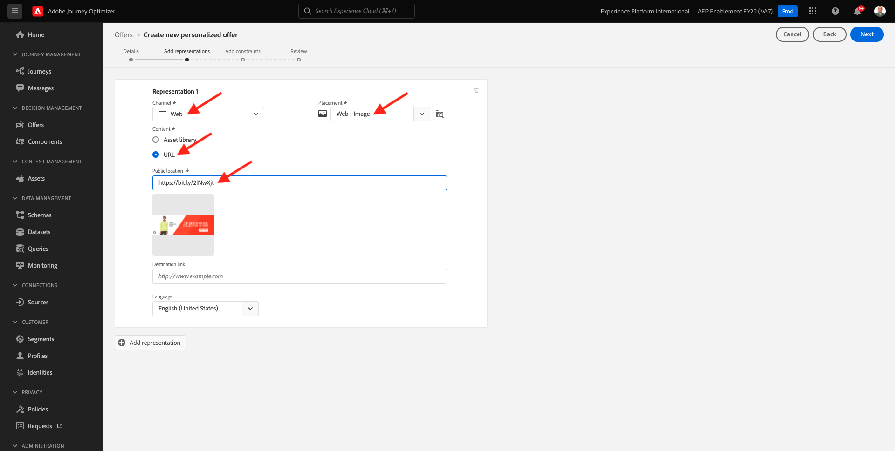
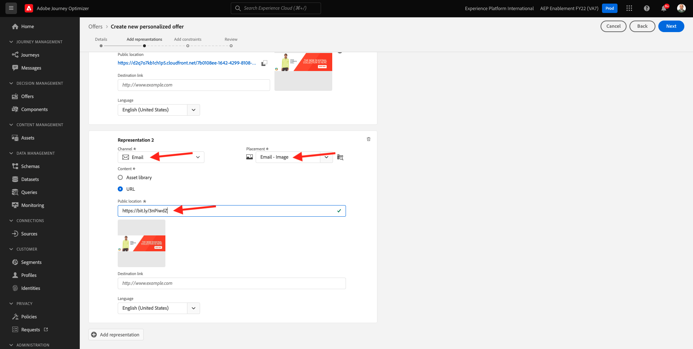
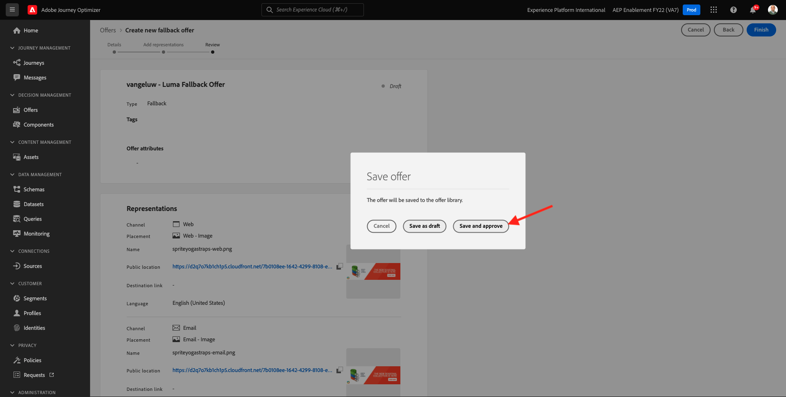
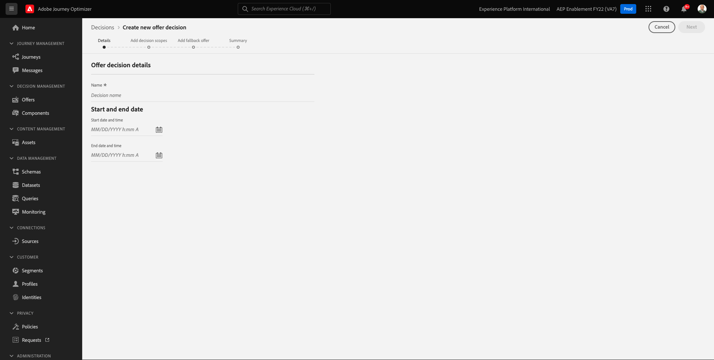
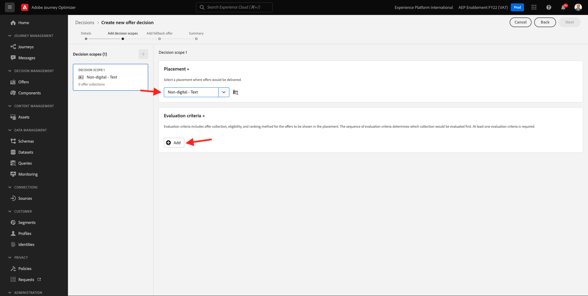

# 9.2設定優惠方案和決策

## 9.2.1建立個人化優惠方案

在本練習中，您將建立4個 **個人化優惠方案**. 以下是建立這些優惠方案時要考慮的詳細資訊：

| 名稱 | 日期範圍 | 電子郵件的影像連結 | 網頁影像連結 | 文字 | 優先等級 | 資格 | 語言 |
|-----|------------|----------------------|--------------------|------|:--------:|--------------|:-------:|
| `--demoProfileLdap-- - Nadia Elements Shell` | 今天 — 1個月後 | https://bit.ly/3nPiwdZ | https://bit.ly/2INwXjt | `{{ profile.person.name.firstName }}, 10% discount on Nadia Elements Shell` | 25 | 全部 — 女性客戶 | 英語（美國） |
| `--demoProfileLdap-- - Radiant Tee` | 今天 — 1個月後 | https://bit.ly/2HfA17v | https://bit.ly/3pEIdzn | `{{ profile.person.name.firstName }}, 5% discount on Radiant Tee` | 15 | 全部 — 女性客戶 | 英語（美國） |
| `--demoProfileLdap-- - Zeppelin Yoga Pant` | 今天 — 1個月後 | https://bit.ly/2IOaItW | https://bit.ly/2INZHZd | `{{ profile.person.name.firstName }}, 10% discount on Zeppelin Yoga Pant` | 25 | 全部 — 男性客戶 | 英語（美國） |
| `--demoProfileLdap-- - Proteus Fitness Jackshirt` | 今天 — 1個月後 | https://bit.ly/330a43n | https://bit.ly/36USaQW | `{{ profile.person.name.firstName }}, 5% discount on Proteus Fitness Jackshirt` | 15 | 全部 — 男性客戶 | 英語（美國） |

{style=&quot;table-layout:auto&quot;}

前往登入Adobe Journey Optimizer [Adobe Experience Cloud](https://experience.adobe.com). 按一下 **Journey Optimizer**.

系統會將您重新導向至 **首頁**  檢視。 首先，請確定您使用的沙箱正確無誤。 系統會呼叫要使用的沙箱 `--aepSandboxId--`. 若要從一個沙箱變更為另一個沙箱，請按一下 **生產產品(VA7)** 並從清單中選取沙箱。 在此範例中，沙箱的名稱為 **2022財年AEP啟用**. 那你就在 **首頁** 沙箱檢視 `--aepSandboxId--`.

在左側功能表中，按一下 **選件** 然後， **選件**. 按一下 **+建立選件**.

然後你會看到這個彈出畫面。 選擇 **個人化優惠方案** 按一下 **下一個**.

你現在在 **詳細資料** 檢視。

在此情況下，您需要設定選件 `--demoProfileLdap-- - Nadia Elements Shell`. 使用上表中的資訊填寫欄位。 在此範例中，個人化優惠方案的名稱為 **vangeluw - Nadia元素殼**. 此外，設定 **開始日期和時間** 設為昨天，並將 **結束日期和時間** 一個月後的日期。

完成後，你就應該擁有這個。 按&#x200B;**「下一步」**。

您現在需要建立 **表示**. 表示是 **版位** 和真正的資產。

針對 **代表1**，選擇：

- 管道：Web
- 版位：Web — 影像
- 內容：URL
- 公共位置：從欄複製URL **網頁影像連結** 上表

或者，您也可以選取 **資產庫** ，然後按一下 **瀏覽**.

接著，您會看到「資產資料庫」的快顯視窗，前往資料夾 **啟用資產** 並選取影像檔案 **nadia-web.png**. 然後，按一下 **選擇**.

然後您會看到：

按一下 **+新增表示法**.

針對 **代表2**，選擇：

- 管道：電子郵件
- 版位：電子郵件 — 影像
- 內容：URL
- 公共位置：從欄複製URL **電子郵件的影像連結** 上表

或者，您也可以選取 **資產庫** ，然後按一下 **瀏覽**.

接著，您會看到「資產資料庫」的快顯視窗，前往資料夾 **啟用資產** 並選取影像檔案 **nadia-email.png**. 然後，按一下 **選擇**.

然後您會看到：

下一步，按一下 **+新增表示法**.

針對 **代表3**，選擇：

- 管道：非數位
- 版位：非數位 — 文字

接下來，您需要新增內容。 在此情況下，這表示新增要作為動作呼叫使用的文字。

按一下 **新增內容**.

然後你會看到這個彈出畫面。

選擇 **自訂文字** 並填寫以下欄位：

查看 **文字** 欄位，並在此處輸入該文字，在此情況下： `{{ profile.person.name.firstName }}, 10% discount on Nadia Elements Shell`.

您也會注意到，您可以選取任何設定檔屬性，並將其納入選件文字中作為動態欄位。 在此範例中，欄位 `{{ profile.person.name.firstName }}` 將確保接收此優惠方案之客戶的名字會包含在優惠方案文字中。

你會看到這個。 按一下「**儲存**」。

你現在有了這個。 按&#x200B;**「下一步」**。

然後您會看到：

選擇 **依定義的決策規則** 並按一下 **+** 圖示以新增規則 **全部 — 女性客戶**.

你會看到這個。 填寫 **優先順序** 如上表所示。 按&#x200B;**「下一步」**。

然後您會看到新 **個人化優惠方案**.

最後，按一下 **儲存並核准**.

之後，您會在優惠方案概覽中看到您新建立的個人化優惠方案可供使用：

您現在應重複上述步驟，為Rudiant Tee、Zeppelin Yoga Pant和Proteus Fittiness Jackshirt等產品建立另外三個個性化優惠。

完成後，您的 **選件概覽** 螢幕 **個人化優惠方案** 應會顯示所有選件。

## 9.2.2建立您的備援優惠方案

建立四個個人化優惠方案後，您現在應將 **備援優惠方案**.

確定你在 **選件** 檢視：

按一下 **+建立選件**.

然後你會看到這個彈出畫面。 選擇 **備援優惠方案** 按一下 **下一個**.

然後您會看到：

為備援優惠方案輸入以下名稱： `--demoProfileLdap-- - Luma Fallback Offer`. 按&#x200B;**「下一步」**。

您現在需要建立 **表示**. 表示是 **版位** 和真正的資產。

針對 **代表1**，選擇：

- 管道：Web
- 版位：Web — 影像
- 內容：URL
- 公共位置： `https://bit.ly/3nBOt9h`

或者，您也可以選取 **資產庫** ，然後按一下 **瀏覽**.

接著，您會看到「資產資料庫」的快顯視窗，前往資料夾 **啟用資產** 並選取影像檔案 **spriteyogasts-web.png**. 然後，按一下 **選擇**.

然後您會看到：

針對 **代表2**，選擇：

- 管道：電子郵件
- 版位：電子郵件 — 影像
- 內容：URL
- 公共位置： `https://bit.ly/3nF4qvE`

或者，您也可以選取 **資產庫** ，然後按一下 **瀏覽**.

接著，您會看到「資產資料庫」的快顯視窗，前往資料夾 **啟用資產** 並選取影像檔案 **spriteyogasts-email.png**. 然後，按一下 **選擇**.

然後您會看到：

下一步，按一下 **+新增表示法**.

針對 **代表3**，選擇：

- 管道：非數位
- 版位：非數位 — 文字

接下來，您需要新增內容。 在此情況下，這表示要新增影像連結。

按一下 **新增內容**.

然後你會看到這個彈出畫面。

選擇 **自訂文字** 並填寫以下欄位：

輸入文字 `{{ profile.person.name.firstName }}, discover our Sprite Yoga Straps!` 按一下 **儲存**.

你會看到這個。 按&#x200B;**「下一步」**。

然後您會看到新 **備援優惠方案**. 按一下&#x200B;**完成**。

最後，按一下 **儲存並核准**.

在 **選件概覽** 螢幕上，您現在會看到：

## 9.2.3建立集合

集合用於 **篩選** 從個人化優惠方案清單中取出優惠方案的子集，並將其用作決策的一部分，以加速決策程式。

前往 **集合**. 按一下 **+建立集合**.

然後你會看到這個彈出畫面。 像這樣設定您的集合。 按&#x200B;**「下一步」**。

- 集合名稱：use `--demoProfileLdap-- - Luma Collection`
- 選擇 **建立靜態集合**.

在下一個畫面中，選取四個 **個人化優惠方案** 您在上一個練習中建立。 按一下「**儲存**」。

您現在會看到：

## 9.2.4建立您的決策

決策會結合版位、個人化優惠方案集合和備援優惠方案，最終供Offer decisioning引擎根據每個個別化優惠方案特性（例如優先順序、資格限制和總計/使用者上限），來尋找特定設定檔的最佳優惠方案。

若要設定 **決策**，前往 **決策**. 按一下 **+建立活動**.

然後您會看到：

像這樣填寫欄位。 按&#x200B;**「下一步」**。

- 名稱: `--demoProfileLdap-- - Luma Decision`
- 開始日期和時間：昨天
- 結束日期和時間：今天+1個月

在下一個畫面中，您需要將版位新增至決策範圍。 您需要為版位建立決策範圍 **Web — 影像**, **電子郵件 — 影像** 和 **非數位 — 文字**.

首先，為 **非數位 — 文字** 在下拉式清單中選取該位置即可。 然後，按一下 **新增** 按鈕添加評估標準。

選取您的集合 `--demoProfileLdap-- - Luma Collection` 按一下 **新增**.

你會看到這個。 按一下 **-** 按鈕添加新的決策範圍。

選取投放位置 **Web — 影像** 新增您的集合 `--demoProfileLdap-- - Luma Collection` 在評價標準下。 然後，按一下 **+** 按鈕，添加新的決策範圍。

選取投放位置 **電子郵件 — 影像** 新增您的集合 `--demoProfileLdap-- - Luma Collection` 在評價標準下。 然後，按一下 **下一個**.

您現在需要選取 **備援優惠方案**，此名稱為 `--demoProfileLdap-- - Luma Fallback Offer`. 按&#x200B;**「下一步」**。

檢閱您的決定。 按一下&#x200B;**完成**。

在快顯視窗中，按一下 **儲存並啟動**.

最後，您現在可以在概述中看到您的決定：

您現在已成功設定您的決策。 您的決策現在已上線，可用來即時提供最佳化和個人化優惠方案給客戶。

下一步： [9.3準備資料收集用戶端屬性和Web SDK設定以進行Offer decisioning](./ex3.md)

[返回模組9](./offer-decisioning.md)

[返回所有模組](./../../overview.md)
