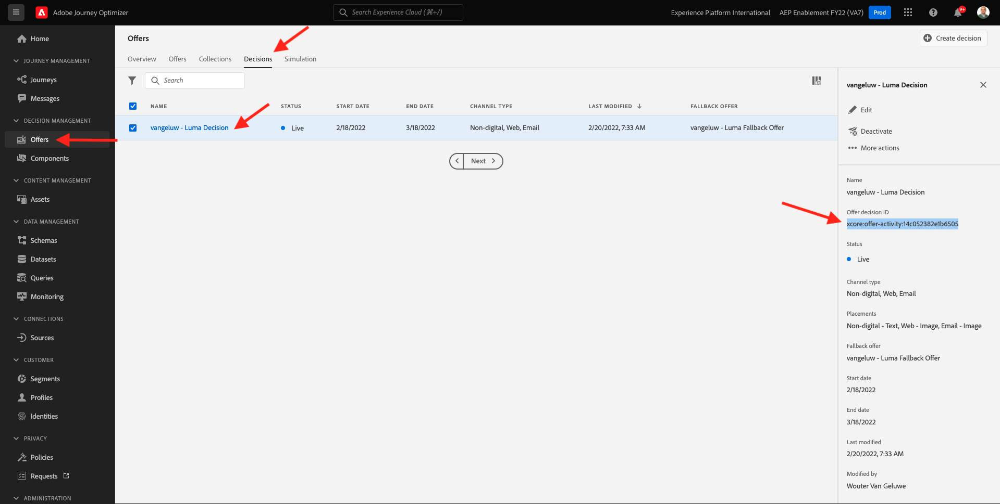

# 9.3準備Adobe Experience Platform資料收集用戶端屬性和Web SDK設定以進行Offer decisioning

>[!NOTE]
>
>Adobe Experience Platform Web SDK中目前可提前存取特定使用者，以使用Offer decisioning。 並非所有IMS組織都能使用此功能。

## 9.3.1更新資料流

在 [練習0.2](./../../modules/module0/ex2.md)，您已建立自己的 **[!UICONTROL 資料流]**. 然後您使用名稱 `--demoProfileLdap-- - Demo System Datastream`.

在本練習中，您需要設定 **[!UICONTROL 資料流]** 與 **[!DNL Offer Decisioning]**.

若要這麼做，請前往 [https://experience.adobe.com/#/data-collection/](https://experience.adobe.com/#/data-collection/). 你會看到這個。 按一下 **[!UICONTROL 資料流]** 或 **[!UICONTROL 資料流（測試版）]**.

在畫面的右上角，選取沙箱名稱，名稱應為 `--aepSandboxId--`.


搜尋 **[!UICONTROL 資料流]**，此名稱為 `--demoProfileLdap-- - Demo System Datastream`. 按一下 **[!UICONTROL 資料流]** 來開啟它。


你會看到這個。 按一下 **...** 下一頁 **Adobe Experience Platform** 然後按一下 **編輯**.


啟用 **[!DNL Offer Decisioning]**，勾選 **[!DNL Offer Decisioning]**. 按一下「**儲存**」。


您的 **[!UICONTROL 資料流]** 現在已準備好與 **[!DNL Offer Decisioning]**.


## 9.3.2設定您的Adobe Experience Platform資料收集用戶端屬性以請求個人化優惠方案

前往 [https://experience.adobe.com/#/data-collection/](https://experience.adobe.com/#/data-collection/)，到 **[!UICONTROL 用戶端]**. 搜尋您的資料收集屬性，其名稱為 `--demoProfileLdap-- - Demo System (DD/MM/YYYY)`. 開啟Web的資料收集用戶端屬性。


在您的屬性中，前往 **[!UICONTROL 規則]** 並開啟規則 **[!UICONTROL 頁面檢視]**.


按一下以開啟 [!UICONTROL 動作] **[!UICONTROL AEP Web SDK — 傳送事件]**.


你會看到這個。 您會注意到 **[!UICONTROL 決策範圍]**.


對於傳送至Edge和Adobe Experience Platform的每個請求，都可提供一或多個 **[!UICONTROL 決策範圍]**. A **[!UICONTROL 決策範圍]** 是兩個元素的組合：

- [!UICONTROL 決策ID]
- [!UICONTROL 版面 ID]

首先，讓我們看一下您可以在哪裡找到這兩個元素。

### 9.3.2.1檢索 [!UICONTROL 版位ID]

此 [!UICONTROL 版位ID] 識別所需資產的位置和類型。 例如，Luma網站首頁上的主圖影像會與 [!UICONTROL 版位ID] for [!UICONTROL Web — 影像].

>[!NOTE]
>
>在模組6中，您已設定Adobe Target體驗鎖定目標活動，此活動將變更首頁上主圖位置的影像，如螢幕擷圖所示。 為了練習，您現在會讓您的選件顯示在主圖影像下方的影像上，如螢幕擷圖所示。


若要尋找 [!UICONTROL 版位ID] for [!UICONTROL Web — 影像] 去Adobe Journey Optimizer [Adobe Experience Cloud](https://experience.adobe.com). 按一下 **Journey Optimizer**.


系統會將您重新導向至 **首頁**  檢視。 首先，請確定您使用的沙箱正確無誤。 系統會呼叫要使用的沙箱 `--aepSandboxId--`. 若要從一個沙箱變更為另一個沙箱，請按一下 **生產產品(VA7)** 並從清單中選取沙箱。 在此範例中，沙箱的名稱為 **2022財年AEP啟用**. 那你就在 **首頁** 沙箱檢視 `--aepSandboxId--`.


接下來，轉到 [!UICONTROL 元件] 然後 [!UICONTROL 版位]. 按一下 [!UICONTROL Web — 影像] 版位以查看其詳細資訊。


如上圖所示，在此範例中， [!UICONTROL 版位ID] is `xcore:offer-placement:14bf09dc4190ebba`. 記下 [!UICONTROL 版位ID] 為你的 [!UICONTROL Web — 影像] 你在下次練習中會需要它。

### 9.3.2.2檢索 [!UICONTROL 決策ID]

此 [!UICONTROL 決策ID] 識別您要使用的個人化優惠方案和備援優惠方案組合。 在上一個練習中，您建立了自己的 [!UICONTROL 決策] 並命名了 `--demoProfileLdap-- - Luma Decision`.

若要尋找 [!UICONTROL 決策ID] 為 `--demoProfileLdap-- - Luma Decision`，前往 [https://platform.adobe.com](https://platform.adobe.com).

接下來，轉到 [!UICONTROL 選件] 然後， [!UICONTROL 決策]. 按一下以選取 [!UICONTROL 決策]，此名稱為 `--demoProfileLdap-- - Luma Decision`.



如上圖所示，在此範例中， [!UICONTROL 決策ID] is `xcore:offer-activity:14c052382e1b6505`. 記下 [!UICONTROL 決策ID] 你的決定 `--demoProfileLdap-- - Luma Decision` 你在下次練習中會需要它。

現在您已擷取建立 **[!UICONTROL 決策範圍]**，您可以繼續下一個步驟，其中涉及編碼決策範圍。

### 9.3.2.3 BASE64編碼

此 **[!UICONTROL 決策範圍]** 您需要輸入的是BASE64編碼字串。 此BASE64編碼字串是 [!UICONTROL 版位ID] 和 [!UICONTROL 決策ID]，如下所示。

```json
{
  "activityId":"xcore:offer-activity:14c052382e1b6505",
  "placementId":"xcore:offer-placement:14bf09dc4190ebba"
}
```

此 **[!UICONTROL 決策範圍]** 可透過兩種方式產生：

- 使用公共服務，如 [https://www.base64encode.org/](https://www.base64encode.org/). 輸入上述的JSON程式碼，按一下 **[!UICONTROL 編碼]** 下面是BASE64編碼字串。

   

- 從Adobe Experience Platform擷取BASE64編碼字串。 前往 [!UICONTROL 決策] 並按一下以開啟 [!UICONTROL 決策]，此名稱為 `--demoProfileLdap-- - Luma Decision`.

   

   開啟後 `--demoProfileLdap-- - Luma Decision`你會看到這個。 找出投放位置 [!UICONTROL Web — 影像] 並按一下 **[!UICONTROL 複製]** 按鈕。 下一步，按一下 **[!UICONTROL 編碼決策範圍]**. 此 **[!UICONTROL 決策範圍]** 現在已複製到剪貼簿。

   

接下來，返回Launch，執行您的動作 **[!UICONTROL AEP Web SDK — 傳送事件]**.


在輸入欄位中貼上已編碼的決策範圍。


在動作中儲存您的變更 **[!UICONTROL AEP Web SDK — 傳送事件]** 按一下 **[!UICONTROL 保留變更]**.


下一步，按一下 **[!UICONTROL 儲存]** 或 **[!UICONTROL 儲存至程式庫]**


在Adobe Experience Platform資料收集中，前往 **[!UICONTROL 發佈流程]** 開啟 **[!UICONTROL 開發程式庫]** 名稱 **[!UICONTROL 主要]**. 按一下 **[!UICONTROL +新增所有變更的資源]** 然後按一下 **[!UICONTROL 儲存並建置以供開發]**. 您的變更現在會發佈至您的示範網站。


每次載入 **一般資訊頁** 現在，就像示範網站的首頁一樣，Offer decisioning會評估適用的優惠方案，並將回覆回網站，其中包含要顯示的優惠方案詳細資訊。 在網站上顯示優惠方案需要額外的設定，您將在下一個步驟中進行。

## 9.3.3設定您的Adobe Experience Platform資料收集用戶端屬性以接收和套用個人化優惠方案

前往 [https://experience.adobe.com/#/data-collection/](https://experience.adobe.com/#/data-collection/)，到 **[!UICONTROL 屬性]**. 搜尋您的資料收集屬性，其名稱為 `--demoProfileLdap-- - Demo System (DD/MM/YYYY)`. 開啟Web的「資料收集」屬性。


在您的屬性中，前往 **[!UICONTROL 規則]**.


搜尋並開啟規則 **收到的決定**.


你會看到這個。 開啟動作 **將優惠方案放在頁面上**.


按一下&#x200B;**[!UICONTROL 開啟編輯器]**


在編輯器中貼上下列程式碼以覆寫程式碼。

```javascript
if(!Array.isArray(event.decisions)) {
  console.log('No decisions returned')
  return;
}
console.log("decision",event.decisions)

event.decisions.forEach(function(payload) {
  payload.items.forEach(function(item){
    console.log("Response from Offer Decisioning ", item.data.content);
   
    var element = document.querySelector("#root > div > div > div.app-content > div > section.feature_part.padding_top > div > div.row.align-items-center.justify-content-between > div.col-lg-7.col-sm-6.\\30  > div");
    if(!element){
      console.log("Offer Placement Area Selector not found")
      return;
    }
    if(!item.data){
      return
    }
    //check if offer already exists
    var offer = document.querySelector("#root > div > div > div.app-content > div > section.feature_part.padding_top > div > div.row.align-items-center.justify-content-between > div.col-lg-7.col-sm-6.\\30  > div");
    if(!offer){ 
      element.insertAdjacentHTML('afterbegin', item.data.content) 
    }
    else { 
      console.log("item.data.deliveryURL: " + item.data.deliveryURL)
      document.querySelector("#root > div > div > div.app-content > div > section.feature_part.padding_top > div > div.row.align-items-center.justify-content-between > div.col-lg-7.col-sm-6.\\30  > div").style.background="url('"+item.data.deliveryURL+"')";
      document.querySelector("#root > div > div > div.app-content > div > section.feature_part.padding_top > div > div.row.align-items-center.justify-content-between > div.col-lg-7.col-sm-6.\\30  > div").style.backgroundRepeat="no-repeat";
      document.querySelector("#root > div > div > div.app-content > div > section.feature_part.padding_top > div > div.row.align-items-center.justify-content-between > div.col-lg-7.col-sm-6.\\30  > div").style.backgroundPosition="center center";
      document.querySelector("#root > div > div > div.app-content > div > section.feature_part.padding_top > div > div.row.align-items-center.justify-content-between > div.col-lg-7.col-sm-6.\\30  > div").style.backgroundSize = "contain";
    }  
  })
});
```

第26-27-28-29行會套用Offer decisioning傳回的影像至網站。 按一下「**[!UICONTROL 儲存]**」。


按一下&#x200B;**[!UICONTROL 保留變更]**.


下一步，按一下 **[!UICONTROL 儲存]** 或 **[!UICONTROL 儲存至程式庫]**


在Adobe Experience Platform資料收集中，前往 **[!UICONTROL 發佈流程]** 開啟 **[!UICONTROL 開發程式庫]** 名稱 **[!UICONTROL 主要]**. 按一下 **[!UICONTROL +新增所有變更的資源]** 然後按一下 **[!UICONTROL 儲存並建置以供開發]**. 您的變更現在會發佈至您的示範網站。


經過此變更後，Adobe Experience Platform資料收集中的此規則現在會監聽來自屬於Web SDK回應一部分之Offer decisioning的回應，而收到回應時，選件的影像會顯示在首頁上。

查看示範網站，您會看到此影像將立即取代：

>[!NOTE]
>
>在模組6中，您已設定Adobe Target體驗鎖定目標活動，此活動將變更首頁上主圖位置的影像，如螢幕擷圖所示。 為了練習，您現在會讓您的選件顯示在主圖影像下方的影像上，如螢幕擷圖所示。


而您現在會看到像這樣的優惠方案，而不是預設的Luma網站影像。 在此情況下，會顯示後援優惠方案。


您現在已設定2種個人化類型：

- 1在模組6中使用Adobe Target的體驗鎖定目標活動
- 1使用您的資料收集屬性進行Offer decisioning實作

在下一個練習中，您將了解如何將在Adobe Journey Optimizer中建立的選件和決策與Adobe Target體驗鎖定目標活動結合。

下一步： [9.4結合Adobe Target和Offer decisioning](./ex4.md)

[返回模組9](./offer-decisioning.md)

[返回所有模組](./../../overview.md)
