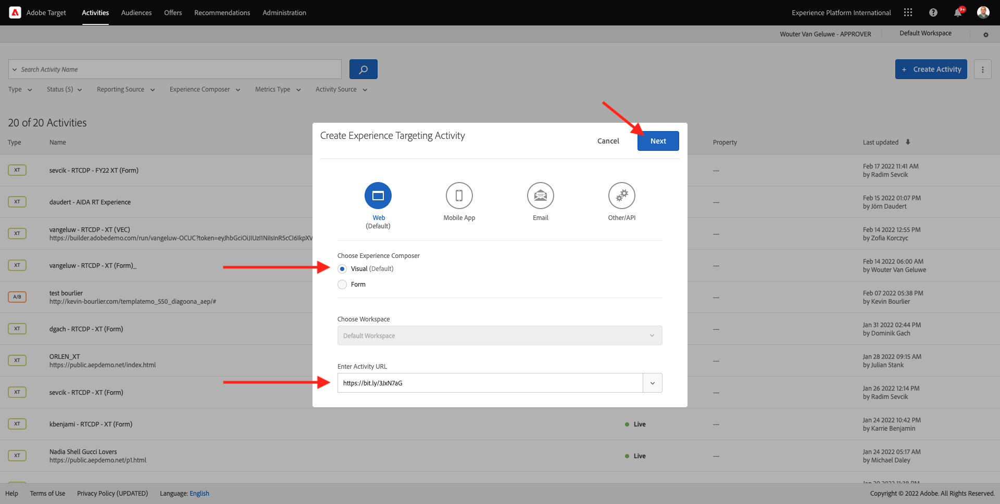

# 9.4結合Adobe Target和Offer decisioning

## 9.4.1收集您的示範專案的可分享連結

若要在Adobe Target中載入示範網站專案，您必須先收集特殊連結，讓Adobe Target能夠載入您的示範網站專案。

若要這麼做，請前往 [https://builder.adobedemo.com/projects](https://builder.adobedemo.com/projects). 使用您的Adobe ID登入後，您會看到這個。 按一下您的網站專案以開啟。

你現在會看到這個。 按一下&#x200B;**共用**。

按一下 **產生連結** 然後將連結複製到剪貼簿。

前往 [https://bitly.com](https://bitly.com)，貼上您複製的連結，然後按一下 **縮短**. 您現在會收到一個縮短連結，如下所示： `https://bit.ly/3JxN7aG`. 在下一個練習中，您需要該連結。

## 9.4.2收集

現在，請前往Adobe Experience Cloud首頁 [https://experiencecloud.adobe.com/](https://experiencecloud.adobe.com/). 按一下 **目標**.

在 **Adobe Target** 首頁，您會看到所有現有活動。

按一下 **+建立活動** 來建立新活動。

選擇 **體驗鎖定**.

現在請選取 **視覺** 並將您的縮短連結貼到欄位中 **輸入活動URL**. 按&#x200B;**「下一步」**。

接著，您會看到您的示範網站專案正在可視化體驗撰寫器中載入。

前往 **瀏覽** 按一下模式 **全部允許** 在cookie同意快顯視窗中。

按一下包含文字的區域 **精選類別**. 按一下 **插入在前** 然後選取 **優惠方案決策**.

然後你會看到這個彈出畫面。 選取您的沙箱 `--aepSandboxId--` 然後選取投放位置 **Web — 影像**.

接下來，選取您的決策 `--demoProfileLdap-- - Luma Decision`. 按一下「**儲存**」。

你會看到這個。 確認新增其他範本規則 **URL** **包含** **your-project-name**. 快速 **儲存**.

你會看到這個。 按&#x200B;**「下一步」**。

輸入選件的名稱，請使用此名稱： `--demoProfileLdap-- - XT with Offers (VEC)`. 按&#x200B;**「下一步」**。

你會看到這個。 定義 **目標量度** 如所示。 按一下&#x200B;**「儲存並關閉」**。

您的選件現在已建立且正在發佈。

發佈優惠方案後，您就可以加以啟用。

下一步： [9.5在電子郵件和簡訊中使用您的決策](./ex5.md)

[返回模組9](./offer-decisioning.md)

[返回所有模組](./../../overview.md)
