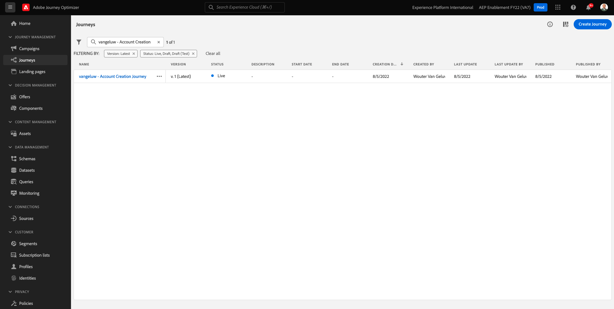
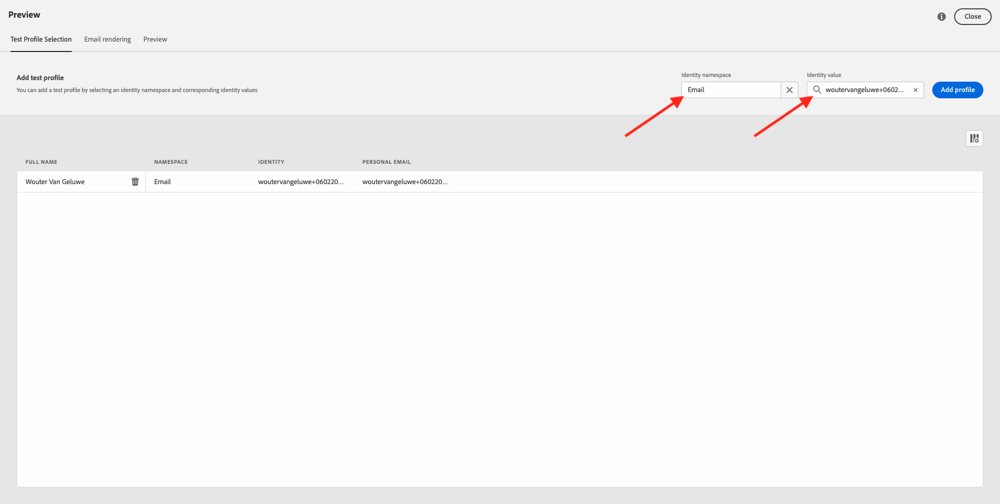
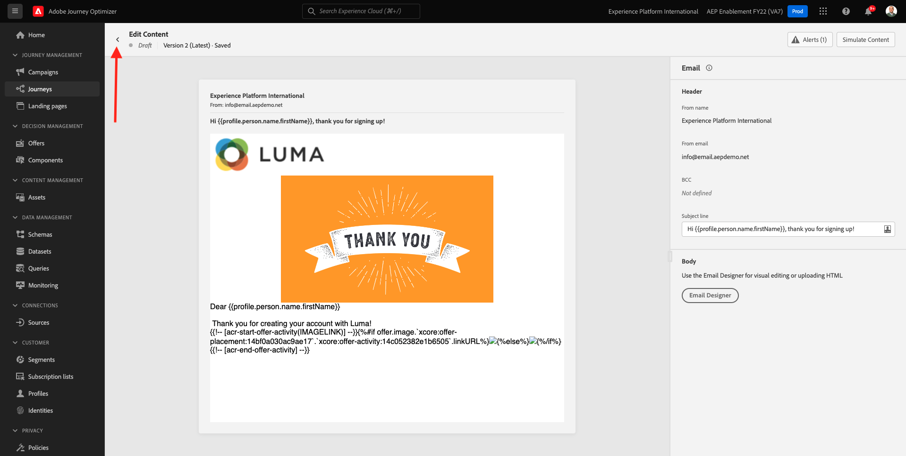

# 9.5在電子郵件中使用您的決策

在本練習中，您將使用您的決策來個人化電子郵件和簡訊的傳送。

前往 **歷程**. 尋找您在練習7.2中建立的歷程，其名稱為 `--demoProfileLdap-- - Account Creation Journey`. 按一下您的歷程以開啟。

你會看到這個。 按一下 **建立新版本**.

按一下 **建立新版本**.

按一下 **電子郵件** 動作，然後按一下 **編輯內容**.

然後您會看到訊息控制面板。 按一下 **電子郵件設計工具**.

你會看到這個。

你會看到這個。 拖曳新 **1:1欄** 結構元件。

在功能表中，前往 **內容元件**. 選取 **優惠方案決策** 元件，並將此元件拖放至電子郵件的內容選件預留位置中（如所示）。 然後，按一下 **新增**.

選取您要納入電子郵件中的版位類型。 在 **版位** 下拉式功能表選取 **電子郵件 — 影像**，然後選取您的決策 `--demoProfileLdap-- - Luma Decision`. 按一下&#x200B;**新增**。

您現在會在電子郵件設計工具中看到所有個人化優惠方案和後援優惠方案都以視覺化呈現。 按一下  **模擬內容** 使用真實的客戶設定檔預覽電子郵件訊息。

首先，找出您要用於預覽的設定檔。 選取 **電子郵件** 命名空間，然後輸入您在示範網站上建立的客戶設定檔電子郵件地址。 下一步，按一下 **預覽**.

顯示電子郵件且正確顯示選件後，按一下 **關閉** 按鈕。

最後，按一下 **儲存**.

現在，按一下箭頭返回上一個畫面。

你會看到這個。 按一下左上角的箭頭，返回您的歷程。

按一下 **確定** 關閉 **電子郵件** 動作。

按一下 **發佈** 發佈更新的歷程。

按一下以確認 **發佈** 。

您的訊息現在已發佈。

現在，當您在示範網站上建立新帳戶時，您會收到以下電子郵件：

您已完成本練習。

下一步： [9.6使用API測試您的決策](./ex6.md)

[返回模組9](./offer-decisioning.md)

[返回所有模組](./../../overview.md)
