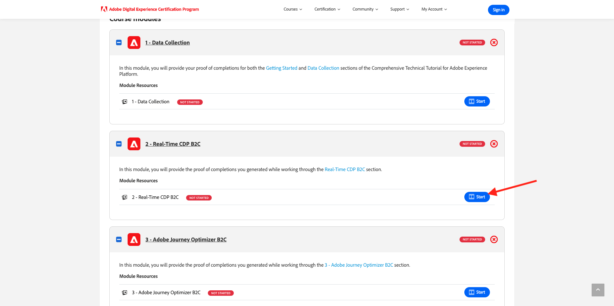
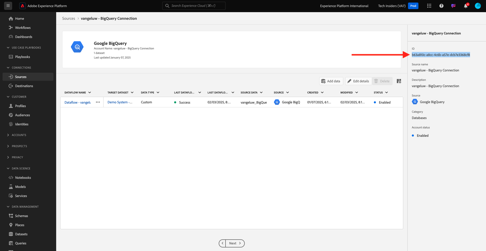

# 如何衡量完成度？

移至[https://certification.adobe.com/courses/1258](https://certification.adobe.com/courses/1258)。

{zoomable="yes"}

按一下您要提交完成的模組旁的&#x200B;**開始**。

{zoomable="yes"}

若要完成模組，您需要提供完成證明並為每個模組提交。

{zoomable="yes"}

以下是每個模組的預期完成校樣。

## 快速入門

模組&#x200B;**快速入門**&#x200B;的預期完成證明是您建立之網頁的示範系統專案識別碼。

Web格式的示範系統專案識別碼看起來像這樣： `--aepUserLdap-- - QIMU`。

{zoomable="yes"}

## 1.1 Adobe Experience Platform Data Collection與Web SDK擴充功能

模組&#x200B;**Data Collection &amp; Web SDK**&#x200B;的預期完成證明是網頁資料收集屬性的&#x200B;**環境ID**。

Web格式之資料收集屬性的環境識別碼看起來像這樣： `EN5211f7792b4442f8a45deb68f8902d3a`。

{zoomable="yes"}

## 1.2資料擷取

模組&#x200B;**資料擷取**&#x200B;的預期完成證明是資料登陸區域Source連線的資料流ID。

資料流ID如下所示： **374c2c6d-f39a-4b0b-b568-40c41e6c4e8e**。

{zoomable="yes"}

## 1.3同盟對象構成

模組&#x200B;**同盟對象構成**&#x200B;的預期完成證明是您建立的同盟資料模型識別碼。

Federated Data Model的ID看起來像這樣： **DMO5110**，可以從URL取得，如下圖所示。

{zoomable="yes"}

## 2.1即時客戶個人檔案

模組&#x200B;**即時客戶設定檔**&#x200B;的預期完成證明是您透過UI `--aepUserLdap-- - Male customers with interest in iPhone 15 Pro`建立的對象之&#x200B;**對象ID**。

對象ID如下所示： **81a9acbe-12e6-424b-b658-abba3a435c83**。

{zoomable="yes"}

## 2.2智慧型服務

模組&#x200B;**Intelligent Services**&#x200B;的預期完成證明是您透過UI `--aepUserLdap-- - Customer AI High Propensity`所建立對象的&#x200B;**對象ID**。

對象ID如下所示： **cb6db21d-8fa3-484a-93ac-25aa1ab48412**。

{zoomable="yes"}

## 2.3 Real-Time CDP：建立受眾並採取行動！

模組&#x200B;**Real-Time CDP的預期完成證明：建立對象並採取行動！**&#x200B;是您&#x200B;**目的地SDK Webhook目的地**&#x200B;的識別碼。

您webhook目的地的ID看起來像這樣： **b5b4b959-3166-40e2-8279-8223d00c3987**，並且可以從URL取得，如下圖所示。

{zoomable="yes"}

## 2.4 Real-Time CDP：Audience Activation至Microsoft Azure事件中心

模組&#x200B;**Real-Time CDP：Audience Activation到Microsoft Azure事件中心**&#x200B;的預期完成證明是Adobe Experience Platform中&#x200B;**Microsoft Azure事件中心**&#x200B;目的地的ID。

您可以在URL中找到看起來像這樣&#x200B;**43cf85bc-3d01-49fd-80c9-a2913db45e3c**&#x200B;的&#x200B;**Microsoft Azure事件中樞目的地ID**，如下所示：

{zoomable="yes"}

## 2.5 Real-Time CDP連線：事件轉送

模組&#x200B;**Real-Time CDP連線的預期完成證明：事件轉送**&#x200B;是您的&#x200B;**事件轉送屬性識別碼**。

您可以在URL中找到看起來像這樣&#x200B;**PRa18819171c1241dfb16d74a49993dd5b**&#x200B;的&#x200B;**事件轉送屬性ID**，如下圖所示：

{zoomable="yes"}

## 2.6將Apache Kafka的資料串流至Real-Time CDP

模組&#x200B;**從Apache Kafka將資料串流到Real-Time CDP**&#x200B;的預期完成證明是來源聯結器`--aepUserLdap-- - Kafka`的識別碼。

ID看起來像這樣&#x200B;**f843d50a-ee30-4ca8-a766-0e4f3d29a2f7**，您可以在這裡找到它：

{zoomable="yes"}

## 3.1 Adobe Journey Optimizer：協調流程

模組&#x200B;**Adobe Journey Optimizer：協調流程**&#x200B;的預期完成證明是您建立歷程的ID。

歷程的ID看起來像這樣，**594fa01f-1a3b-450c-ba09-b7e3ff377c0f**，並且可以從URL取得，如下圖所示。

{zoomable="yes"}

## 3.2 Adobe Journey Optimizer：外部資料來源和自訂動作

模組&#x200B;**Adobe Journey Optimizer：外部資料來源和自訂動作**&#x200B;的預期完成證明是您建立之歷程的ID。

歷程的ID看起來像這樣： **6962d3bc-4f44-4f9c-b326-83978f245f2a**，並且可以從URL取得，如下圖所示。

{zoomable="yes"}

## 3.3 Adobe Journey Optimizer：Offer decisioning

模組&#x200B;**Adobe Journey Optimizer：Offer decisioning**&#x200B;的預期完成證明是您建立的&#x200B;**決定**&#x200B;識別碼。

您可在下列位置找到&#x200B;**決定ID**，它看起來像這樣&#x200B;**dps:offer-activity:1a08ba4b529b2fb2**：

{zoomable="yes"}

## 3.4 Adobe Journey Optimizer：事件型歷程

模組&#x200B;**Adobe Journey Optimizer：事件型歷程**&#x200B;的預期完成證明是您建立的歷程識別碼。

歷程的ID看起來像這樣： **5f5efc7e-49f7-44c1-85df-b23482b38d32**，並且可以從URL取得，如下圖所示。

{zoomable="yes"}

## 3.5 Adobe Journey Optimizer：翻譯服務

模組&#x200B;**Adobe Journey Optimizer：翻譯服務**&#x200B;的預期完成證明是您CitiSignal Fiber促銷活動的&#x200B;**促銷活動版本ID**。

同盟資料模型的Campaign版本ID看起來像這樣： **b11c998b-a345-4f8e-afb1-6285547eb693**，並且可以從Campaign概述畫面複製，如下圖所示。

{zoomable="yes"}

## 4.1Customer Journey Analytics：使用Analysis Workspace建置控制面板

模組&#x200B;**Customer Journey Analytics的預期完成證明：使用Analysis Workspace**&#x200B;建置儀表板是專案`--aepUserLdap-- - Omnichannel Analysis`的識別碼。

格式看起來像這樣： **677bcb247064db3c7de2a0e4**，當您開啟專案時，可以在URL中找到它。

{zoomable="yes"}

## 4.2Customer Journey Analytics：使用BigQuery Source Connector在Adobe Experience Platform中擷取和分析Google Analytics資料

模組&#x200B;**Customer Journey Analytics的預期完成證明：使用BigQuery Source Connector**&#x200B;在Adobe Experience Platform中擷取和分析Google Analytics資料，是您&#x200B;**BigQuery**&#x200B;來源連線的識別碼。

您可在下列位置找到&#x200B;**BigQuery連線識別碼**，它看起來像這樣&#x200B;**b63a810c-a8cc-4c6b-a57e-dcb7e3368cf8**：

{zoomable="yes"}

## 5.1查詢服務

模組&#x200B;**查詢服務**&#x200B;的預期完成證明是您`--aepUserLdap--_callcenter_interaction_analysis`的資料集ID — 完成模組後所取得的資料集。

識別碼看起來像這樣： **675033c903fb3b2aefed8a0a**。

{zoomable="yes"}{width="50px" align="left"}

>[!NOTE]
>
>如果您有任何問題，想要分享對未來內容有建議的一般意見回饋，請傳送電子郵件至&#x200B;**techinsiders@adobe.com**，直接連絡技術業內人士。

[返回所有模組](./overview.md)