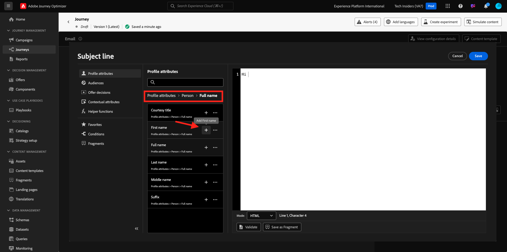
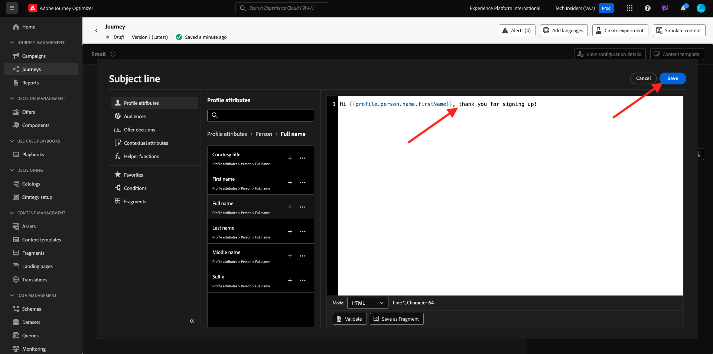
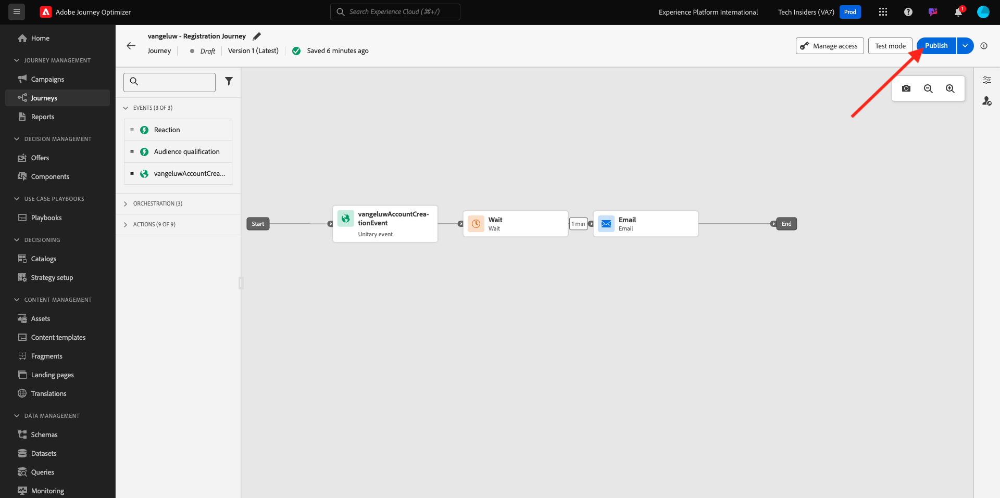

# 3.1.2建立您的歷程與電子郵件訊息

在本練習中，您將設定當有人在示範網站上建立帳戶時，需要觸發的歷程和訊息。

前往[Adobe Experience Cloud](https://experience.adobe.com)登入Adobe Journey Optimizer。 按一下&#x200B;**Journey Optimizer**。

您將被重新導向到Journey Optimizer中的&#x200B;**首頁**&#x200B;檢視。 首先，確定您使用正確的沙箱。 要使用的沙箱稱為`--aepSandboxId--`。 若要從一個沙箱變更為另一個沙箱，請按一下&#x200B;**PRODUCTION Prod (VA7)**，然後從清單中選取沙箱。 在此範例中，沙箱名為&#x200B;**AEP Enablement FY22**。 然後您就會進入沙箱`--aepSandboxId--`的&#x200B;**首頁**&#x200B;檢視。

## 3.1.2.1建立您的歷程

在左側功能表中，按一下&#x200B;**歷程**。 接著，按一下&#x200B;**建立歷程**&#x200B;以建立新歷程。

接著，您會看到空白的歷程畫面。

在上一個練習中，您已建立新的&#x200B;**事件**。 您將其命名為`ldapAccountCreationEvent`，並將`ldap`取代為您的LDAP。 這是建立事件的結果：

您現在需要將此事件當作此歷程的開端。 您可以移至畫面左側，在事件清單中搜尋您的事件，以執行此操作。

選取您的事件，將其拖放至「歷程」畫布上。 您的歷程現在看起來像這樣：

作為歷程的第二步，您需要新增一個短的&#x200B;**等待**&#x200B;步驟。 移至畫面左側的&#x200B;**協調流程**&#x200B;區段以尋找此專案。 您將使用設定檔屬性，而且需要確定這些屬性已填入即時客戶設定檔中。

您的歷程現在看起來像這樣。 在畫面右側，您需要設定等待時間。 設定為1分鐘。 這會在事件觸發後，提供充足的時間讓設定檔屬性可用。

按一下&#x200B;**確定**&#x200B;以儲存變更。

作為歷程的第三個步驟，您需要新增&#x200B;**電子郵件**&#x200B;動作。 移至畫面左側的&#x200B;**動作**，選取&#x200B;**電子郵件**&#x200B;動作，然後將其拖放到歷程的第二個節點。 您現在看到這個了。

將&#x200B;**類別**&#x200B;設定為&#x200B;**行銷**，並選取可讓您傳送電子郵件的電子郵件表面。 在此情況下，要選取的電子郵件表面為&#x200B;**電子郵件**。 請確定已同時啟用&#x200B;**電子郵件**&#x200B;點按和&#x200B;**電子郵件開啟**&#x200B;的核取方塊。

下一步是建立訊息。 若要這麼做，請按一下[編輯內容]。****

## 3.1.2.2建立您的訊息

若要建立您的訊息，請按一下[編輯內容]。****

您現在看到這個了。

按一下&#x200B;**主旨列**&#x200B;文字欄位。

在文字區域中開始寫入&#x200B;**您好**

主旨列尚未完成。 接下來，您需要為&#x200B;**名字**&#x200B;欄位（儲存在`profile.person.name.firstName`下）引入個人化權杖。 在左側功能表中，向下捲動以尋找&#x200B;**人員**&#x200B;元素，然後按一下箭頭以深入瞭解。

現在找到&#x200B;**全名**&#x200B;元素，然後按一下箭頭，即可深入瞭解。

最後，找到&#x200B;**名字**&#x200B;欄位，然後按一下它旁邊的&#x200B;**+**&#x200B;符號。 然後，您會看到個人化權杖出現在文字欄位中。

接下來，新增文字&#x200B;**，感謝您註冊！**。按一下&#x200B;**儲存**。

然後您就會回到這裡。 按一下&#x200B;**電子郵件Designer**&#x200B;以建立電子郵件的內容。

在下一個畫面中，系統會使用3種不同的方法來提示您提供電子郵件內容：

- **從草稿開始設計**：從空白畫布開始，並使用WYSIWYG編輯器拖放結構和內容元件，以視覺化方式建置電子郵件的內容。
- **為您自己的電子郵件編碼**：使用HTML編碼來建立您自己的電子郵件範本
- **匯入HTML**：匯入現有的HTML範本，您可以編輯該範本。

按一下&#x200B;**從頭開始設計**。

在左側選單中，您會找到可用來定義電子郵件結構（列和欄）的結構元件。

從功能表將&#x200B;**1:2資料行左側**&#x200B;拖放到畫布中。 這將是標誌影像的預留位置。

將&#x200B;**1:1欄**&#x200B;拖放到上一個元件下。 這將是橫幅區塊。

將&#x200B;**1:2欄向左**&#x200B;拖放到上一個元件下。 這是實際內容，左側有影像，右側有文字。

接著，將&#x200B;**1:1欄**&#x200B;拖放到上一個元件下。 這將是電子郵件的頁尾。 您的畫布現在看起來應該像這樣：

接下來，讓我們使用「內容元件」在這些區塊中新增內容。 按一下&#x200B;**內容元件**&#x200B;功能表專案

將&#x200B;**Image**&#x200B;元件拖放到第一列的第一個儲存格。 按一下&#x200B;**瀏覽**。

您將會看到此訊息。 導覽至資料夾&#x200B;**enablement-assets**，並選取檔案&#x200B;**luma-logo.png**。 按一下&#x200B;**選取**。

您現在回到這裡：

移至&#x200B;**內容元件**，並將&#x200B;**Image**&#x200B;元件拖放到第一列的第一個儲存格中。 按一下&#x200B;**瀏覽**。

在&#x200B;**Assets**&#x200B;快顯視窗中，前往&#x200B;**enablement-assets**&#x200B;資料夾。 在此資料夾中，您會找到創意團隊先前準備及上傳的所有資產。 選取&#x200B;**module23-thankyou-new.png**&#x200B;並按一下&#x200B;**選取**。

之後，您將會擁有此專案：

選取您的影像，然後在右方功能表中向下捲動，直到您看到&#x200B;**大小**&#x200B;寬度滑桿元件為止。 使用滑桿將寬度變更為&#x200B;**60%**。

接著，前往&#x200B;**內容元件**，並將&#x200B;**文字**&#x200B;元件拖放到結構元件的第四列。

選取預設文字&#x200B;**請在此輸入您的文字。**，如同處理任何文字編輯器一樣。 請改寫&#x200B;**親愛的**。 請注意文字模式中顯示的文字工具列。

在工具列中按一下&#x200B;**新增個人化**&#x200B;圖示。

接下來，您需要帶上儲存在`profile.person.name.firstName`底下的&#x200B;**名字**&#x200B;個人化權杖。 在功能表中，尋找&#x200B;**人員**&#x200B;元素，向下展開至&#x200B;**全名**&#x200B;元素，然後按一下&#x200B;**+**&#x200B;圖示，將「名字」欄位新增至運算式編輯器。

按一下&#x200B;**儲存**。

您現在會注意到個人化欄位已新增至文字的方式。

在相同的文字欄位中，按兩下&#x200B;**Enter**&#x200B;以新增兩行並寫入&#x200B;**感謝您使用Luma建立您的帳戶！**。

要執行的最終檢查以確保您的電子郵件已準備好進行預覽，請按一下&#x200B;**模擬內容**&#x200B;按鈕。

首先，識別您要用於預覽的設定檔。 按一下&#x200B;**輸入身分名稱空間**&#x200B;欄位旁的圖示，以選取&#x200B;**電子郵件**&#x200B;名稱空間。

在身分識別名稱空間清單中，選取&#x200B;**電子郵件**&#x200B;名稱空間。

在&#x200B;**身分值**&#x200B;欄位中，輸入已儲存在即時客戶設定檔中之先前示範設定檔的電子郵件地址。 例如&#x200B;**woutervangeluwe+06022022-01@gmail.com**&#x200B;並按一下&#x200B;**尋找測試設定檔**&#x200B;按鈕

您的設定檔顯示在表格中後，請按一下&#x200B;**預覽**&#x200B;標籤以存取預覽畫面。

預覽準備就緒時，請驗證主旨行中的個人化是否正確，內文和取消訂閱連結會醒目提示為超連結。

按一下&#x200B;**關閉**&#x200B;以關閉預覽。

按一下&#x200B;**儲存**&#x200B;以儲存您的訊息。

按一下左上角主旨列文字旁的&#x200B;**箭頭**，返回訊息儀表板。

您現在已經完成建立註冊電子郵件。 按一下左上角的箭頭，返回您的歷程。

按一下&#x200B;**確定**。

## 3.1.2.3 Publish您的歷程

您仍需要提供歷程名稱。 若要這麼做，請按一下熒幕右上方的&#x200B;**屬性**&#x200B;圖示。

然後，您可以在此處輸入歷程的名稱。 請使用`--demoProfileLdap-- - Account Creation Journey`。 按一下&#x200B;**確定**&#x200B;以儲存變更。

您現在可以按一下&#x200B;**Publish**&#x200B;發佈您的歷程。

再按一下&#x200B;**Publish**。

接著，您會看到綠色確認列，指出您的歷程已發佈。

您現在已經完成此練習。

下一步： [3.1.3更新您的資料收集屬性並測試您的歷程](./ex3.md)

[返回模組3.1](./journey-orchestration-create-account.md)

[返回所有模組](../../../overview.md)
