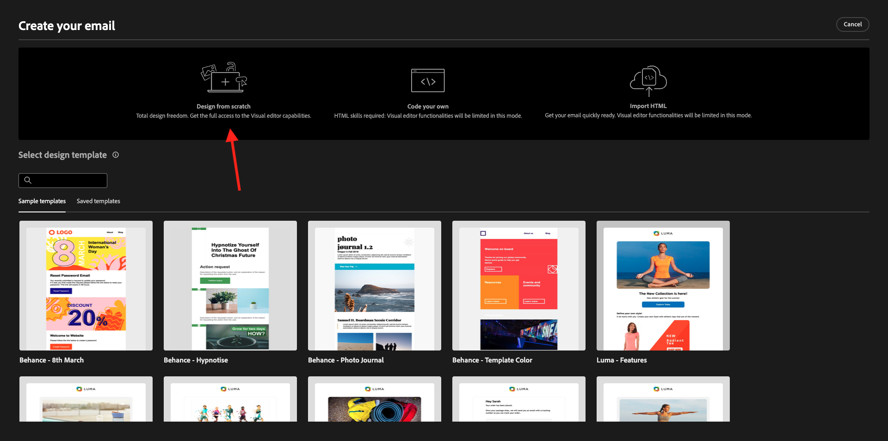

# 3.1.3建立您的歷程、片段和訊息

在本練習中，您將設定當有人在示範網站上建立帳戶時，需要觸發的歷程和訊息。

前往[Adobe Experience Cloud](https://experience.adobe.com)登入Adobe Journey Optimizer。 按一下&#x200B;**Journey Optimizer**。


您將被重新導向到Journey Optimizer中的&#x200B;**首頁**&#x200B;檢視。 首先，確定您使用正確的沙箱。 要使用的沙箱稱為`--aepSandboxName--`。


## 3.1.3.1建立您的歷程

在左側功能表中，按一下&#x200B;**歷程**。 接著，按一下&#x200B;**建立歷程**&#x200B;以建立新歷程。


接著，您會看到空白的歷程畫面。


在上一個練習中，您已建立新的&#x200B;**事件**。 您將其命名為`--aepUserLdap--AccountCreationEvent`，並將`ldap`取代為您的LDAP。 這是建立事件的結果：


您現在需要將此事件當作此歷程的開端。 您可以移至畫面左側，在事件清單中搜尋您的事件，以執行此操作。


選取您的事件，將其拖放至「歷程」畫布上。 您的歷程現在看起來像這樣：


作為歷程的第二步，您需要新增一個短的&#x200B;**等待**&#x200B;步驟。 移至畫面左側的&#x200B;**協調流程**&#x200B;區段以尋找此專案。 您將使用設定檔屬性，而且需要確定這些屬性已填入即時客戶設定檔中。


您的歷程現在看起來像這樣。 在畫面右側，您需要設定等待時間。 設定為1分鐘。 這會在事件觸發後，提供充足的時間讓設定檔屬性可用。 按一下[儲存]儲存變更。**&#x200B;**


作為歷程的第三個步驟，您需要新增&#x200B;**電子郵件**&#x200B;動作。 移至畫面左側的&#x200B;**動作**，選取&#x200B;**電子郵件**&#x200B;動作，然後將其拖放到歷程的第二個節點。 您現在看到這個了。


將&#x200B;**類別**&#x200B;設定為&#x200B;**行銷**，並選取可讓您傳送電子郵件的電子郵件設定。 在此案例中，要選取的電子郵件設定是&#x200B;**電子郵件**。 請確定已同時啟用&#x200B;**電子郵件**&#x200B;點按和&#x200B;**電子郵件開啟**&#x200B;的核取方塊。


## 3.1.3.2建立您的訊息

若要建立您的訊息，請按一下[編輯內容]。**&#x200B;**


您現在看到這個了。


按一下&#x200B;**開啟個人化對話方塊**&#x200B;圖示。


寫入文字`Hi `。 接下來，您需要為&#x200B;**名字**&#x200B;欄位（儲存在`profile.person.name.firstName`下）引入個人化權杖。 在左側功能表中，導覽以尋找&#x200B;**人員>全名>名字**&#x200B;欄位，然後按一下&#x200B;**+**&#x200B;圖示。 然後，您會看到個人化權杖出現在文字欄位中。


接下來，新增文字&#x200B;**，感謝您註冊！**。按一下&#x200B;**儲存**。


您現在可以開始設定電子郵件的內文。 按一下&#x200B;**編輯電子郵件內文**。


在開始建立實際訊息本身的內容之前，最好先考慮訊息中的內容。 訊息中的部分內容是訊息本身獨有的，但其他部分是標準元件，您傳送給客戶的每封電子郵件可能會採用相同的元件。

在上一個練習中，您已在Journey Optimizer中將這些標準元件建立為片段，您現在可在此訊息及您將建立的所有其他未來訊息中參考這些片段。

在下一個畫面中，系統會使用3種不同的方法來提示您提供電子郵件內容：

- **從草稿開始設計**：從空白畫布開始，並使用WYSIWYG編輯器拖放結構和內容元件，以視覺化方式建置電子郵件的內容。
- **為您自己的電子郵件編碼**：使用HTML編碼來建立您自己的電子郵件範本
- **匯入HTML**：匯入現有的HTML範本，您可以編輯該範本。

按一下&#x200B;**從頭開始設計**。



在左側選單中，您會找到可用來定義電子郵件結構（列和欄）的結構元件。


您也會在左側功能表中找到&#x200B;**片段**，您可在此看到您先前建立的片段。


您必須先在電子郵件中新增2個結構，才能將頁首和頁尾新增至畫布上。 按一下左側功能表中的&#x200B;**+**&#x200B;圖示，然後將2 **1:1欄**&#x200B;元件拖曳到畫布上。


在左側功能表中，返回&#x200B;**片段**。 將頁首片段拖放至第一個元件，將頁尾片段拖放至第二個元件。 您將會看到此訊息。


按一下左側功能表中的&#x200B;**+**&#x200B;圖示，並將另外2個&#x200B;**1:1欄**&#x200B;元件拖放至畫布的頁首與頁尾之間。


拖放第一個&#x200B;**1:1資料行**&#x200B;元件中的&#x200B;**Image**&#x200B;元件。 按一下&#x200B;**瀏覽**。


在&#x200B;**citi-signal-images**&#x200B;資料夾中。 選取影像&#x200B;**`welcome_email_image.png`**&#x200B;並按一下&#x200B;**選取**。


之後，您將會擁有此專案：


接著，移至&#x200B;**內容**，並將&#x200B;**文字**&#x200B;元件拖放到結構元件的第四列。


選取預設文字&#x200B;**請在此輸入您的文字。**，如同處理任何文字編輯器一樣。 請改為寫&#x200B;**歡迎使用家庭**。 在工具列中按一下&#x200B;**新增個人化**&#x200B;圖示。


接下來，您需要帶上儲存在`profile.person.name.firstName`底下的&#x200B;**名字**&#x200B;個人化權杖。 在功能表中，尋找&#x200B;**人員**&#x200B;元素，向下展開至&#x200B;**全名**&#x200B;元素，然後按一下&#x200B;**+**&#x200B;圖示，將「名字」欄位新增至運算式編輯器。

按一下&#x200B;**儲存**。


您現在會注意到個人化欄位已新增至文字的方式。


在相同的文字欄位中，按兩下&#x200B;**Enter**&#x200B;以新增兩行，並複製和貼上下列文字：

```
Welcome aboard! We're thrilled to have you join the CitiSignal family. 
As a valued member of our community, you're now poised to experience top-notch telecommunications services that cater to your every need.

At CitiSignal, we understand that staying connected is more than just a convenience - it's a necessity. Whether you're browsing the web, streaming your favourite content, or keeping in touch with loved ones, we're here to ensure you have the best tools and resources at your fingertips.
```


將&#x200B;**文字對齊方式**&#x200B;設定為置中，您可以隨意調整訊息的外觀與風格，以符合自己的需求。 完成時，按一下&#x200B;**儲存**。


要執行的最終檢查以確保您的電子郵件已準備好進行預覽，請按一下&#x200B;**模擬內容**&#x200B;按鈕。


您必須先新增測試設定檔，才能類比電子郵件訊息。 按一下&#x200B;**管理測試設定檔**。


按一下&#x200B;**輸入身分名稱空間**&#x200B;欄位旁的圖示，以選取&#x200B;**電子郵件**&#x200B;名稱空間。

在身分識別名稱空間清單中，選取&#x200B;**電子郵件**&#x200B;名稱空間。 在&#x200B;**身分值**&#x200B;欄位中，輸入您先前練習中所使用且已儲存在Adobe Experience Platform中之先前設定檔的電子郵件地址。 按一下&#x200B;**新增設定檔**。 返回上一個畫面。


您會看到電子郵件訊息，現在已針對此客戶設定檔進行模擬。 您現在可以在主旨列和內文中驗證個人化，並視需要傳送校樣電子郵件。

按一下&#x200B;**關閉**&#x200B;以關閉預覽。


按一下左上角主旨列文字旁的&#x200B;**箭頭**，按一下&#x200B;**儲存**&#x200B;儲存您的訊息並返回訊息儀表板。


按一下&#x200B;**箭頭**&#x200B;返回您的歷程。


## 3.1.3.3 Publish您的歷程

按一下&#x200B;**儲存**。


您仍需要為您的歷程命名。 若要這麼做，請按一下熒幕右上方的&#x200B;**屬性**&#x200B;圖示。


然後，您可以在此處輸入歷程的名稱。 請使用`--aepUserLdap-- - Registration Journey`。 按一下&#x200B;**儲存**。


您現在可以按一下&#x200B;**Publish**&#x200B;發佈您的歷程。


再按一下&#x200B;**Publish**。


幾分鐘後，您的歷程狀態將變更為&#x200B;**即時**，而您將看到歷程績效的即時儀表板。


您現在已經完成此練習。

下一步： [3.1.4更新您的資料收集屬性並測試您的歷程](./ex4.md)

[返回模組3.1](./journey-orchestration-create-account.md)

[返回所有模組](../../../overview.md)
