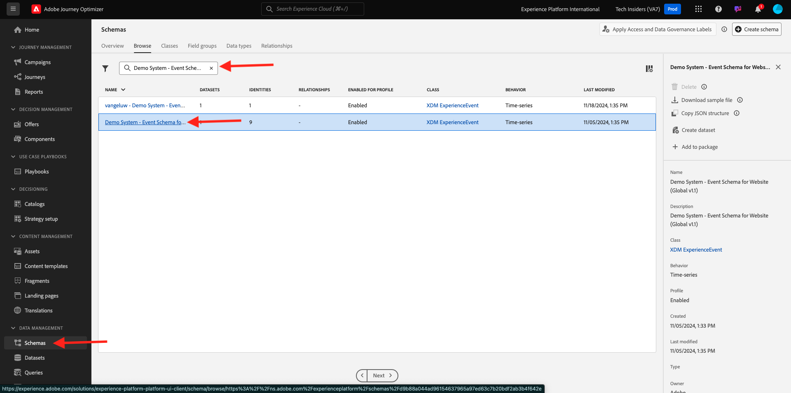
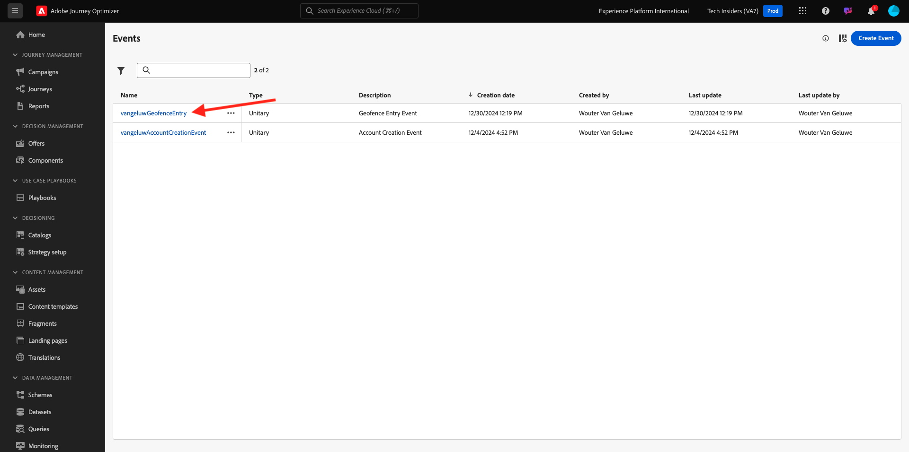

# 3.2.1定義事件

前往[Adobe Experience Cloud](https://experience.adobe.com)登入Adobe Journey Optimizer。 按一下&#x200B;**Journey Optimizer**。

您將被重新導向到Journey Optimizer中的&#x200B;**首頁**&#x200B;檢視。 首先，確定您使用正確的沙箱。 要使用的沙箱稱為`--aepSandboxName--`。 然後您就會進入沙箱`--aepSandboxName--`的&#x200B;**首頁**&#x200B;檢視。

在左側功能表中，向下捲動並按一下&#x200B;**組態**。 接著，按一下&#x200B;**事件**&#x200B;下的&#x200B;**管理**&#x200B;按鈕。

接著，您會看到所有可用事件的概觀。 按一下&#x200B;**建立事件**&#x200B;開始建立您自己的事件。

隨後即會出現新的空白事件視窗。
作為事件的名稱，請使用`--aepUserLdap--GeofenceEntry`。

設定描述為： `Geofence Entry Event`。

確定&#x200B;**型別**&#x200B;設定為&#x200B;**單一**，並且針對&#x200B;**事件識別碼型別**&#x200B;選取專案，選取&#x200B;**系統產生**

接下來，您需要選取結構描述。 此處顯示的所有結構描述都是Adobe Experience Platform結構描述。

您會發現並未顯示所有結構描述。 Adobe Experience Platform中有更多結構描述可供使用。
若要顯示在此清單中，結構描述需要有一個非常特定的欄位群組連結到該結構描述。 此處需要顯示的欄位群組稱為`Orchestration eventID`。

讓我們快速瞭解這些結構描述在Adobe Experience Platform中的定義方式。

在左側功能表中，移至&#x200B;**結構描述**，並在新的瀏覽器標籤中開啟它。 在&#x200B;**結構描述**&#x200B;中，移至&#x200B;**瀏覽**&#x200B;檢視可用的結構描述清單。
開啟結構描述`Demo System - Event Schema for Website (Global v1.1)`。

開啟結構描述後，您會看到欄位群組`Orchestration eventID`是結構描述的一部分。
此欄位群組只有兩個欄位： `_experience.campaign.orchestration.eventID`和`originJourneyID`。

一旦此欄位群組及此特定eventID欄位成為結構描述的一部分後，該結構描述將可供Adobe Journey Optimizer使用。

返回Adobe Journey Optimizer中的事件設定。

在此使用案例中，您想要接聽「地理圍欄事件」以瞭解客戶是否位於特定位置，因此現在請選取結構描述`Demo System - Event Schema for Website (Global v1.1)`作為您事件的結構描述。

Adobe Journey Optimizer會自動選取一些必填欄位，但您可以編輯可供Adobe Journey Optimizer使用的欄位。

按一下&#x200B;**鉛筆**&#x200B;圖示以編輯欄位。

然後您會看到快顯視窗，其中含有可讓您選取欄位的結構描述階層。

需要類似ECID和Orchestration eventID等欄位，而且必須預先選取。

然而，行銷人員需要靈活存取所有為歷程提供內容的資料點。 因此，讓我們也確定至少選取以下欄位（可在「置入」上下文節點中找到）：

- 城市

完成之後，按一下&#x200B;**確定**。

Adobe Journey Optimizer也需要識別碼來識別客戶。 由於Adobe Journey Optimizer已連結至Adobe Experience Platform，結構描述的主要識別碼會自動被當作歷程的識別碼。
主要識別碼也會自動考量Adobe Experience Platform的完整身分圖表，並將所有可用身分、裝置和頻道的所有行為連結至相同的設定檔，以便Adobe Journey Optimizer符合情境、相關且一致。 按一下&#x200B;**儲存**。

您的事件會成為可用事件清單的一部分。

最後，您必須復原自訂事件的`Orchestration eventID`。

按一下事件清單中的事件，再次開啟事件。
在您的事件上，按一下&#x200B;**欄位**&#x200B;旁的&#x200B;**檢視裝載**&#x200B;圖示。

按一下&#x200B;**檢視裝載**&#x200B;圖示會開啟此事件的範例XDM裝載。 在&#x200B;**承載**&#x200B;中向下捲動，直到您看到第`eventID`行為止。

寫下`eventID`，因為您最後需要它來測試您的設定。

在此範例中，`eventID`是`4df8dc10731eba7b0c37af83a9db38d4de7aa6aebcce38196d9d47929b9c598e`。

您現在已定義將觸發我們正在建置之歷程的事件。 一旦觸發歷程，地理柵欄欄位（例如城市）和您可能選擇的任何其他欄位（例如國家/地區、緯度和經度）將可供歷程使用。

如使用案例說明中所述，我們隨後需要根據天氣提供內容相關的促銷活動。 為了取得天氣資訊，我們需要定義外部資料來源，以便提供該位置的天氣資訊。 您將使用&#x200B;**OpenWeather API**&#x200B;服務來提供這項資訊。

下一步： [3.2.2定義外部資料來源](./ex2.md)

[返回模組3.2](journey-orchestration-external-weather-api-sms.md)

[返回所有模組](../../../overview.md)
