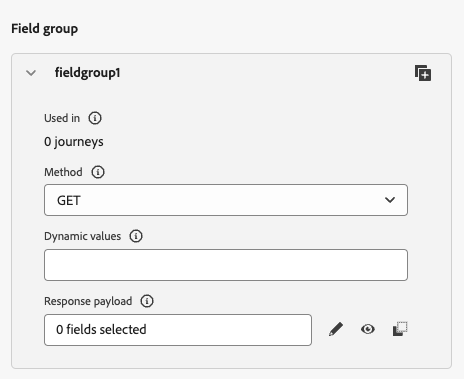

# 3.2.2定義外部資料來源

在本練習中，您將使用Adobe Journey Optimizer建立自訂外部資料來源。

前往[Adobe Experience Cloud](https://experience.adobe.com)登入Adobe Journey Optimizer。 按一下&#x200B;**Journey Optimizer**。


您將被重新導向到Journey Optimizer中的&#x200B;**首頁**&#x200B;檢視。 首先，確定您使用正確的沙箱。 要使用的沙箱稱為`--aepSandboxId--`。 若要從一個沙箱變更為另一個沙箱，請按一下&#x200B;**PRODUCTION Prod (VA7)**，然後從清單中選取沙箱。 在此範例中，沙箱名為&#x200B;**AEP Enablement FY22**。 然後您就會進入沙箱`--aepSandboxId--`的&#x200B;**首頁**&#x200B;檢視。


在左側功能表中，向下捲動並按一下&#x200B;**組態**。 接著，按一下&#x200B;**資料來源**&#x200B;下的&#x200B;**管理**&#x200B;按鈕。


然後您會看到&#x200B;**資料來源**清單。
按一下**建立資料Source**&#x200B;以開始新增您的資料來源。


您會看到空白的資料來源快顯視窗。


在開始設定之前，您需要擁有&#x200B;**開放氣象地圖**&#x200B;服務的帳戶。 請依照下列步驟建立您的帳戶並取得API金鑰。

移至[https://openweathermap.org/](https://openweathermap.org/)。 在首頁按一下&#x200B;**登入**。


按一下&#x200B;**建立帳戶**。


請填寫詳細資料。


按一下&#x200B;**建立帳戶**。


系統會將您重新導向至帳戶頁面。


在功能表中按一下&#x200B;**API金鑰**&#x200B;以擷取您的API金鑰，您將需要使用此金鑰設定自訂外部資料來源。


**API金鑰**&#x200B;看起來像這樣： `b2c4c36b6bb59c3458d6686b05311dc3`。

您可以在[這裡](https://openweathermap.org/current)找到&#x200B;**目前氣候**&#x200B;的&#x200B;**API檔案**。

在我們的使用案例中，我們將根據客戶所在的城市實施與開放氣象地圖的連線。


返回&#x200B;**Adobe Journey Optimizer**，進入您的空白&#x200B;**外部資料Source**&#x200B;快顯視窗。


作為資料來源的名稱，請使用`--demoProfileLdap--WeatherApi`。 在此範例中，資料來源名稱為`vangeluwWeatherApi `。

設定描述為： `Access to the Open Weather Map`。

開放氣象地圖API的URL是： **http://api.openweathermap.org/data/2.5/weather?units=metric**


接下來，您需要選取要使用的驗證。

請使用下列變數：

| 欄位 | 值 |
|:-----------------------:| :-----------------------|
| 類型 | **API金鑰** |
| 名稱 | **APPID** |
| 值 | **您的API金鑰** |
| 位置 | **查詢引數** |


最後，您需要定義&#x200B;**FieldGroup**，這基本上是您將傳送至Weather API的要求。 在我們的案例中，我們想使用城市名稱來要求該城市的目前天氣。



根據氣象API檔案，我們需要傳送引數`q=City`。


為了符合預期的API請求，請依照以下方式設定您的FieldGroup：

>[!IMPORTANT]
>
>欄位群組名稱必須是唯一的，請使用這個命名慣例： `--demoProfileLdap--WeatherByCity`，所以在此情況下，名稱應該是`vangeluwWeatherByCity`


針對回應裝載，您需要貼上氣象API將傳送的回應範例。

您可以在API檔案頁面[這裡](https://openweathermap.org/current)找到預期的API JSON回應。


或者，您可以從此處複製JSON回應：

```json
{"coord": { "lon": 139,"lat": 35},
  "weather": [
    {
      "id": 800,
      "main": "Clear",
      "description": "clear sky",
      "icon": "01n"
    }
  ],
  "base": "stations",
  "main": {
    "temp": 281.52,
    "feels_like": 278.99,
    "temp_min": 280.15,
    "temp_max": 283.71,
    "pressure": 1016,
    "humidity": 93
  },
  "wind": {
    "speed": 0.47,
    "deg": 107.538
  },
  "clouds": {
    "all": 2
  },
  "dt": 1560350192,
  "sys": {
    "type": 3,
    "id": 2019346,
    "message": 0.0065,
    "country": "JP",
    "sunrise": 1560281377,
    "sunset": 1560333478
  },
  "timezone": 32400,
  "id": 1851632,
  "name": "Shuzenji",
  "cod": 200
}
```

將上述JSON回應複製到剪貼簿，然後前往自訂資料來源設定畫面。

按一下&#x200B;**編輯裝載**&#x200B;圖示。


您將看到快顯視窗，此時您必須貼上上述JSON回應。


貼上您的JSON回應，之後您將看到此訊息。 按一下&#x200B;**儲存**。


您的自訂資料來源設定現已完成。 向上捲動並按一下&#x200B;**儲存**。


您的資料來源現在已成功建立，且屬於&#x200B;**資料來源**&#x200B;清單。


下一步： [3.2.3定義自訂動作](./ex3.md)

[返回模組3.2](journey-orchestration-external-weather-api-sms.md)

[返回所有模組](../../../overview.md)
