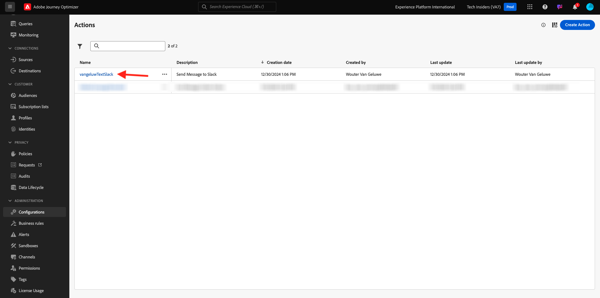

# 3.2.3定義自訂動作

在本練習中，您將透過結合使用Adobe Journey Optimizer來建立兩個自訂動作。

前往[Adobe Experience Cloud](https://experience.adobe.com)登入Adobe Journey Optimizer。 按一下&#x200B;**Journey Optimizer**。


您將被重新導向到Journey Optimizer中的&#x200B;**首頁**&#x200B;檢視。 首先，確定您使用正確的沙箱。 要使用的沙箱稱為`--aepSandboxName--`。 若要從一個沙箱變更為另一個沙箱，請按一下&#x200B;**PRODUCTION Prod (VA7)**，然後從清單中選取沙箱。 在此範例中，沙箱名為&#x200B;**AEP Enablement FY22**。 然後您就會進入沙箱`--aepSandboxName--`的&#x200B;**首頁**&#x200B;檢視。


在左側功能表中，向下捲動並按一下&#x200B;**組態**。 接著，按一下&#x200B;**動作**&#x200B;下的&#x200B;**管理**&#x200B;按鈕。


然後您會看到&#x200B;**動作**&#x200B;清單。


您將定義一個動作，該動作會將文字傳送至Slack頻道。

## 3.2.3.1動作：傳送文字至Slack頻道

您現在將使用現有的Slack頻道，並傳送訊息至該Slack頻道。 Slack有一個簡單易用的API，我們將使用Adobe Journey Optimizer來觸發其API。


按一下&#x200B;**建立動作**&#x200B;以開始新增動作。


您會看到空白的「動作」快顯視窗。


作為動作的名稱，請使用`--aepUserLdap--TextSlack`。 在此範例中，動作名稱為`vangeluwTextSlack`。

設定描述為： `Send Text to Slack`。


對於&#x200B;**URL組態**，請使用這個：

- URL： `https://2mnbfjyrre.execute-api.us-west-2.amazonaws.com/prod`
- 方法： **POST**

>[!NOTE]
>
>上述URL會參考AWS Lambda函式，該函式隨後會將您的請求轉送至上述Slack頻道。 這麼做是為了保護Adobe擁有的Slack頻道的存取權。 如果您有自己的Slack頻道，您應該透過[https://api.slack.com/](https://api.slack.com/)建立Slack應用程式，然後您必須在該Slack應用程式中建立內送Webhook，然後將上述URL取代為內送Webhook URL。

您不需要變更標題欄位。


**驗證**&#x200B;應該設定為&#x200B;**無驗證**。


對於&#x200B;**動作引數**，您需要定義哪些欄位應該傳送給Slack。 邏輯上，我們希望Adobe Journey Optimizer和Adobe Experience Platform成為個人化的大腦，所以要傳送給Slack的文字應該由Adobe Journey Optimizer定義，然後傳送給Slack執行。

所以針對&#x200B;**動作引數**，請按一下&#x200B;**編輯裝載**&#x200B;圖示。


然後您會看到一個空白的快顯視窗。


複製下列文字並貼到空白的彈出式視窗中。

```json
{
 "text": {
  "toBeMapped": true,
  "dataType": "string",
  "label": "textToSlack"
 }
}
```

僅供參考：透過指定以下欄位，這些欄位將可從您的客戶歷程存取，並且您將能夠從歷程動態填入它們：

**&quot;toBeMapped&quot;： true，**

**&quot;dataType&quot;： &quot;string&quot;，**

**&quot;label&quot;： &quot;textToSlack&quot;**

然後您會看到以下內容：


按一下&#x200B;**儲存**。


向上捲動並再按一次&#x200B;**儲存**&#x200B;以儲存您的自訂動作。


您的自訂動作現在是&#x200B;**動作**&#x200B;清單的一部分。



您已定義事件、外部資料來源和動作。 現在，讓我們將所有這些整合到一個歷程中。

下一步： [3.2.4建立您的歷程與訊息](./ex4.md)

[返回模組8](journey-orchestration-external-weather-api-sms.md)

[返回所有模組](../../../overview.md)
