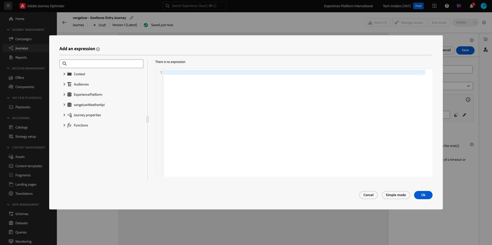
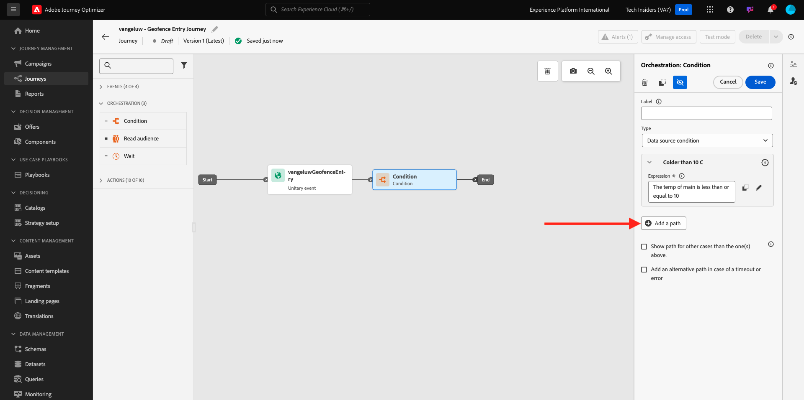
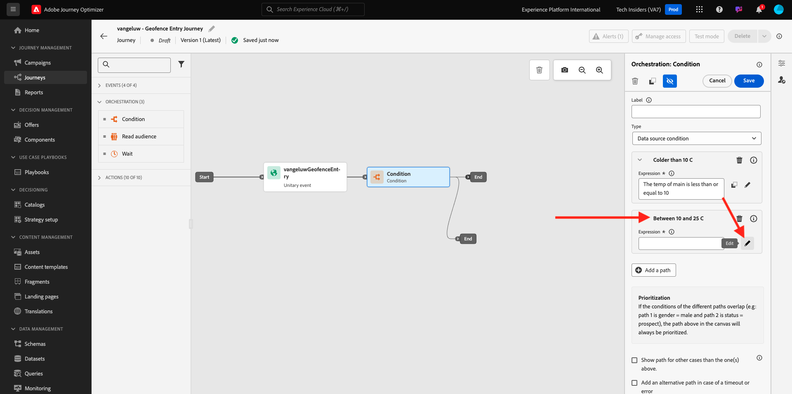
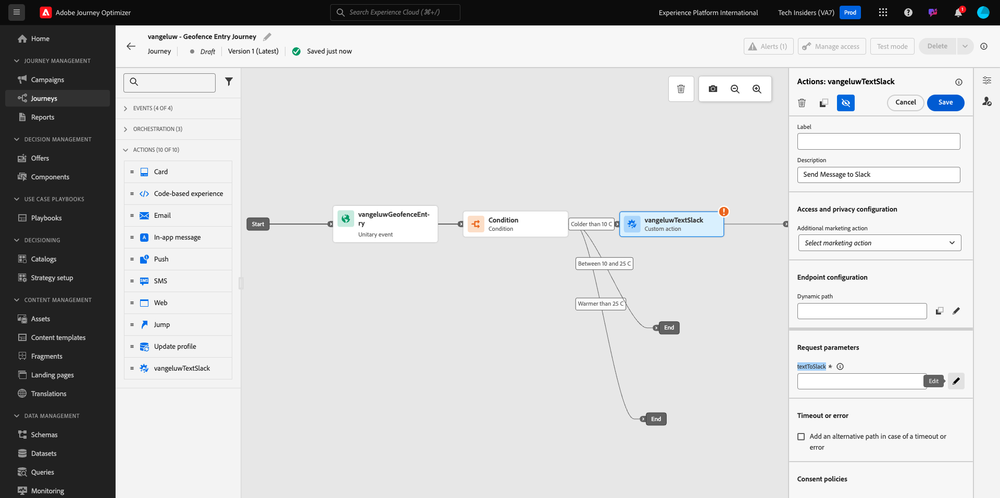
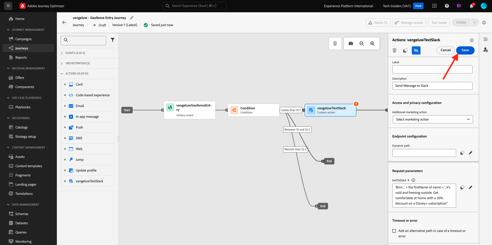

# 3.2.4建立您的歷程和訊息

在本練習中，您將使用Adobe Journey Optimizer建立歷程和數則文字訊息。

在此使用案例中，目標是根據客戶位置的天氣條件傳送不同的SMS訊息。 已定義3個案例：

- 攝氏10度以下
- 攝氏10至25度之間
- 溫度高於25攝氏度

針對這3種情況，您需要在Adobe Journey Optimizer中定義3則SMS訊息。

## 3.2.4.1建立您的歷程

前往[Adobe Experience Cloud](https://experience.adobe.com)登入Adobe Journey Optimizer。 按一下&#x200B;**Journey Optimizer**。


您將被重新導向到Journey Optimizer中的&#x200B;**首頁**&#x200B;檢視。 首先，確定您使用正確的沙箱。 要使用的沙箱稱為`--aepSandboxId--`。 若要從一個沙箱變更為另一個沙箱，請按一下&#x200B;**PRODUCTION Prod (VA7)**，然後從清單中選取沙箱。 在此範例中，沙箱名為&#x200B;**AEP Enablement FY22**。 然後您就會進入沙箱`--aepSandboxId--`的&#x200B;**首頁**&#x200B;檢視。


在左側功能表中，前往&#x200B;**歷程**&#x200B;並按一下&#x200B;**建立歷程**&#x200B;以開始建立您的歷程。


您應該先為您的歷程命名。

作為歷程的名稱，請使用`--demoProfileLdap-- - Geofence Entry Journey`。 在此範例中，歷程名稱為`vangeluw - Geofence Entry Journey`。 目前不可設定其他值。 按一下&#x200B;**「確定」**。


在熒幕左側，檢視&#x200B;**事件**。 您應該會在該清單中看到先前建立的事件。 選取它，然後將其拖放到歷程畫布上。 您的歷程隨後將如下所示。 按一下&#x200B;**確定**。


接著，按一下&#x200B;**協調流程**。 您現在看到可用的&#x200B;**協調流程**&#x200B;功能。 選取「**條件**」，然後將其拖放至「歷程畫布」。


您現在必須定義三個條件：

- 氣溫低於攝氏10度
- 攝氏10至25度之間
- 溫度高於25攝氏度

讓我們定義第一個條件。

### 條件1：攝氏10度以下

按一下&#x200B;**條件**。  按一下&#x200B;**Path1**&#x200B;並編輯&#x200B;**比10 C**&#x200B;還冷的路徑名稱。 按一下Path1運算式的&#x200B;**編輯**&#x200B;圖示。


然後您會看到空白的&#x200B;**簡單編輯器**&#x200B;畫面。 您的查詢會更進階，因此您需要&#x200B;**進階模式**。 按一下&#x200B;**進階模式**。


然後您會看到允許輸入程式碼的&#x200B;**進階編輯器**。



選取下列程式碼並將其貼到&#x200B;**進階編輯器**&#x200B;中。

`#{--demoProfileLdap--WeatherApi.--demoProfileLdap--WeatherByCity.main.temp} <= 10`

您將會看到此訊息。


為了在此情況下擷取溫度，您需要提供客戶目前所在的城市。
**City**&#x200B;需要連結至動態引數`q`，就像我們之前在「開放氣象API檔案」中看到的一樣。

如熒幕擷圖所示，按一下欄位&#x200B;**動態值： q**。


然後，您需要在一個可用資料來源中找到包含客戶目前城市的欄位。


您可以導覽至`--demoProfileLdap--GeofenceEntry.placeContext.geo.city`找到該欄位。

按一下該欄位，它就會新增為引數`q`的動態值。 此欄位將會填入，例如您在行動應用程式中實作的地理位置服務。 在我們的案例中，我們會使用示範網站的Admin Console來模擬此情形。 按一下&#x200B;**「確定」**。


### 條件2：攝氏10至25度之間

新增第一個條件後，您會看到此畫面。 按一下&#x200B;**新增路徑**。



連按兩下&#x200B;**Path1**&#x200B;並編輯路徑名稱&#x200B;**介於10到25 C**&#x200B;之間。 按一下此路徑運算式的&#x200B;**編輯**&#x200B;圖示。



然後您會看到空白的&#x200B;**簡單編輯器**&#x200B;畫面。 您的查詢會更進階，因此您需要&#x200B;**進階模式**。 按一下&#x200B;**進階模式**。


然後您會看到允許輸入程式碼的&#x200B;**進階編輯器**。


選取下列程式碼並將其貼到&#x200B;**進階編輯器**&#x200B;中。

`#{--demoProfileLdap--WeatherApi.--demoProfileLdap--WeatherByCity.main.temp} > 10 and #{--demoProfileLdap--WeatherApi.--demoProfileLdap--WeatherByCity.main.temp} <= 25`

您將會看到此訊息。


為了擷取本條件中的溫度，您必須提供客戶目前所在的城市。
**City**&#x200B;需要連結至動態引數&#x200B;**q**，就像我們之前在「開放氣象API檔案」中看到的一樣。

如熒幕擷圖所示，按一下欄位&#x200B;**動態值： q**。


然後，您需要在一個可用資料來源中找到包含客戶目前城市的欄位。


您可以導覽至`--demoProfileLdap--GeofenceEntry.placeContext.geo.city`找到該欄位。 按一下該欄位，就會將其新增為引數&#x200B;**q**&#x200B;的動態值。 此欄位將會填入，例如您在行動應用程式中實作的地理位置服務。 在我們的案例中，我們會使用示範網站的Admin Console來模擬此情形。 按一下&#x200B;**「確定」**。


接下來，您將新增第3個條件。

### 條件3：攝氏25度以上

新增第二個條件後，您會看到此畫面。 按一下&#x200B;**新增路徑**。


按兩下Path1以將名稱變更為&#x200B;**比25 C**熱。
然後按一下此路徑之運算式的**編輯**&#x200B;圖示。


然後您會看到空白的&#x200B;**簡單編輯器**&#x200B;畫面。 您的查詢會更進階，因此您需要&#x200B;**進階模式**。 按一下&#x200B;**進階模式**。


然後您會看到允許輸入程式碼的&#x200B;**進階編輯器**。


選取下列程式碼並將其貼到&#x200B;**進階編輯器**&#x200B;中。

`#{--demoProfileLdap--WeatherApi.--demoProfileLdap--WeatherByCity.main.temp} > 25`

您將會看到此訊息。


為了擷取本條件中的溫度，您必須提供客戶目前所在的城市。
**City**&#x200B;需要連結至動態引數&#x200B;**q**，就像我們之前在「開放氣象API檔案」中看到的一樣。

如熒幕擷圖所示，按一下欄位&#x200B;**動態值： q**。


然後，您需要在一個可用資料來源中找到包含客戶目前城市的欄位。


您可以導覽至```--demoProfileLdap--GeofenceEntry.placeContext.geo.city```找到該欄位。 按一下該欄位，就會將其新增為引數&#x200B;**q**&#x200B;的動態值。 此欄位將會填入，例如您在行動應用程式中實作的地理位置服務。 在我們的案例中，我們會使用示範網站的Admin Console來模擬此情形。 按一下&#x200B;**「確定」**。


您現在有三個已設定的路徑。 按一下&#x200B;**確定**。


由於此歷程僅供學習之用，因此我們現在將設定幾個動作，以展示行銷人員現在必須傳送訊息的各種選項。

## 3.2.4.2傳送下列路徑的訊息：攝氏10度以下

我們將針對每個溫度環境嘗試傳送文字訊息給客戶。 我們只能在擁有可供客戶使用的行動電話號碼時傳送簡訊，因此我們首先必須確認我們有。

讓我們專注於&#x200B;**比10 C**&#x200B;更冷。


讓我們取另一個&#x200B;**Condition**&#x200B;元素，並拖曳它，如下方熒幕擷圖所示。 我們將確認是否有此客戶的行動電話號碼。


僅供範例說明之用，我們僅會設定客戶有可用行動電話號碼的選項。 新增&#x200B;**有行動裝置？**&#x200B;的標籤。

按一下&#x200B;**路徑1**&#x200B;路徑之運算式的&#x200B;**編輯**&#x200B;圖示。


在左側顯示的資料來源中，導覽至&#x200B;**ExperiencePlatform.ProfileFieldGroup.profile.mobilePhone.number**。 您現在直接從Adobe Experience Platform的即時客戶個人檔案讀取行動電話號碼。


選取欄位&#x200B;**數字**，然後將其拖放至「條件畫布」。

選取運運算元&#x200B;**不是空的**。 按一下&#x200B;**確定**。


您將會看到此訊息。 再按一下[確定]。****


您的歷程將如下所示。 如熒幕擷圖所示，按一下&#x200B;**動作**。


選取動作&#x200B;**簡訊**，然後將其拖放到您剛新增的條件之後。


將&#x200B;**類別**&#x200B;設定為&#x200B;**行銷**，並選取可讓您傳送簡訊的簡訊介面。 在此情況下，要選取的電子郵件表面是&#x200B;**簡訊**。


下一步是建立訊息。 若要這麼做，請按一下[編輯內容]。****


您現在會看到訊息控制面板，讓您設定SMS文字。 按一下&#x200B;**撰寫訊息**&#x200B;區域以建立您的訊息。


輸入下列文字： `Brrrr... {{profile.person.name.firstName}}, it's freezing. 20% discount on jackets today!`。 按一下&#x200B;**儲存**。


您將會看到此訊息。 按一下左上角的箭頭，返回您的歷程。


然後您就會回到這裡。 按一下&#x200B;**確定**。


在左側功能表中，返回&#x200B;**動作**，選取動作`--demoProfileLdap--TextSlack`，然後將其拖放至&#x200B;**訊息**&#x200B;動作之後。


移至&#x200B;**動作引數**&#x200B;並按一下引數`TEXTTOSLACK`的&#x200B;**編輯**&#x200B;圖示。



在快顯視窗中，按一下&#x200B;**進階模式**。


選取下列程式碼，複製並貼到&#x200B;**進階模式編輯器**&#x200B;中。 按一下&#x200B;**確定**。

`"Brrrr..." + #{ExperiencePlatform.ProfileFieldGroup.profile.person.name.firstName} + " It's freezing. 20% discount on Jackets today!"`


您將會看到已完成的動作。 按一下&#x200B;**確定**。



此歷程路徑現已準備就緒。

## 3.2.4.3傳送路徑訊息：攝氏10度至25度之間

我們將針對每個溫度環境嘗試傳送文字訊息給客戶。 我們只能在擁有可供客戶使用的行動電話號碼時傳送簡訊，因此我們首先必須確認我們有。

讓我們專注於10到25個C **路徑之間的**。


讓我們取另一個&#x200B;**Condition**&#x200B;元素，並拖曳它，如下方熒幕擷圖所示。 我們將確認是否有此客戶的行動電話號碼。


僅供範例說明之用，我們僅會設定客戶有可用行動電話號碼的選項。 新增&#x200B;**有行動裝置？**&#x200B;的標籤。

按一下&#x200B;**路徑1**&#x200B;路徑之運算式的&#x200B;**編輯**&#x200B;圖示。


在左側顯示的資料來源中，導覽至&#x200B;**ExperiencePlatform.ProfileFieldGroup.profile.mobilePhone.number**。 您現在直接從Adobe Experience Platform的即時客戶個人檔案讀取行動電話號碼。


選取欄位&#x200B;**數字**，然後將其拖放至「條件畫布」。

選取運運算元&#x200B;**不是空的**。 按一下&#x200B;**確定**。


您將會看到此訊息。 按一下&#x200B;**確定**。


您的歷程將如下所示。 如熒幕擷圖所示，按一下&#x200B;**動作**。


選取動作&#x200B;**簡訊**，然後將其拖放到您剛新增的條件之後。


將&#x200B;**類別**&#x200B;設定為&#x200B;**行銷**，並選取可讓您傳送簡訊的簡訊介面。 在此情況下，要選取的電子郵件表面是&#x200B;**簡訊**。


下一步是建立訊息。 若要這麼做，請按一下[編輯內容]。****


您現在會看到訊息控制面板，讓您設定SMS文字。 按一下&#x200B;**撰寫訊息**&#x200B;區域以建立您的訊息。


輸入下列文字： `What a nice weather for the time of year, {{profile.person.name.firstName}} - 20% discount on Sweaters today!`。 按一下&#x200B;**儲存**。


您將會看到此訊息。 按一下左上角的箭頭，返回您的歷程。


您現在會看到已完成的動作。 按一下&#x200B;**確定**。


在左側功能表中，返回&#x200B;**動作**，選取動作`--demoProfileLdap--TextSlack`，然後將其拖放至&#x200B;**訊息**&#x200B;動作之後。


移至&#x200B;**動作引數**&#x200B;並按一下引數`TEXTTOSLACK`的&#x200B;**編輯**&#x200B;圖示。


在快顯視窗中，按一下&#x200B;**進階模式**。


選取下列程式碼，複製並貼到&#x200B;**進階模式編輯器**&#x200B;中。 按一下&#x200B;**確定**。

`"What nice weather for the time of year, " + #{ExperiencePlatform.ProfileFieldGroup.profile.person.name.firstName} + " 20% discount on Sweaters today!"`


您將會看到已完成的動作。 按一下&#x200B;**確定**。


此歷程路徑現已準備就緒。

## 3.2.4.4傳送下列路徑的訊息：攝氏25度以上

我們將針對每個溫度環境嘗試傳送文字訊息給客戶。 我們只能在擁有可供客戶使用的行動電話號碼時傳送簡訊，因此我們首先必須確認我們有。

讓我們專注於&#x200B;**比25 C**&#x200B;路徑還溫暖的路徑。


讓我們取另一個&#x200B;**Condition**&#x200B;元素，並拖曳它，如下方熒幕擷圖所示。 您將確認是否有此客戶的行動電話號碼。


僅供範例說明之用，我們僅會設定客戶有可用行動電話號碼的選項。 新增&#x200B;**有行動裝置？**&#x200B;的標籤。

按一下&#x200B;**路徑1**&#x200B;路徑之運算式的&#x200B;**編輯**&#x200B;圖示。


在左側顯示的資料來源中，導覽至&#x200B;**ExperiencePlatform.ProfileFieldGroup.profile.mobilePhone.number**。 您現在直接從Adobe Experience Platform的即時客戶個人檔案讀取行動電話號碼。


選取欄位&#x200B;**數字**，然後將其拖放至「條件畫布」。

選取運運算元&#x200B;**不是空的**。 按一下&#x200B;**確定**。


您將會看到此訊息。 按一下&#x200B;**「確定」**。


您的歷程將如下所示。 如熒幕擷圖所示，按一下&#x200B;**動作**。


選取動作&#x200B;**簡訊**，然後將其拖放到您剛新增的條件之後。


將&#x200B;**類別**&#x200B;設定為&#x200B;**行銷**，並選取可讓您傳送簡訊的簡訊介面。 在此情況下，要選取的電子郵件表面是&#x200B;**簡訊**。


下一步是建立訊息。 若要這麼做，請按一下[編輯內容]。****


您現在會看到訊息控制面板，讓您設定SMS文字。 按一下&#x200B;**撰寫訊息**&#x200B;區域以建立您的訊息。


輸入下列文字： `So warm, {{profile.person.name.firstName}}! 20% discount on swimwear today!`。 按一下&#x200B;**儲存**。


您將會看到此訊息。 按一下左上角的箭頭，返回您的歷程。


您現在會看到已完成的動作。 按一下&#x200B;**確定**。


在左側功能表中，返回&#x200B;**動作**，選取動作`--demoProfileLdap--TextSlack`，然後將其拖放至&#x200B;**訊息**&#x200B;動作之後。


移至&#x200B;**動作引數**&#x200B;並按一下引數`TEXTTOSLACK`的&#x200B;**編輯**&#x200B;圖示。


在快顯視窗中，按一下&#x200B;**進階模式**。


選取下列程式碼，複製並貼到&#x200B;**進階模式編輯器**&#x200B;中。 按一下&#x200B;**確定**。

`"So warm, " + #{ExperiencePlatform.ProfileFieldGroup.profile.person.name.firstName} + "! 20% discount on swimwear today!"`


您將會看到已完成的動作。 按一下&#x200B;**確定**。


此歷程路徑現已準備就緒。

## 3.2.4.5 Publish您的歷程

您的歷程現在已完整設定。 按一下&#x200B;**Publish**。


再按一下&#x200B;**Publish**。


您的歷程現已發佈。


下一步： [3.2.5觸發您的歷程](./ex5.md)

[返回模組3.2](journey-orchestration-external-weather-api-sms.md)

[返回所有模組](../../../overview.md)
