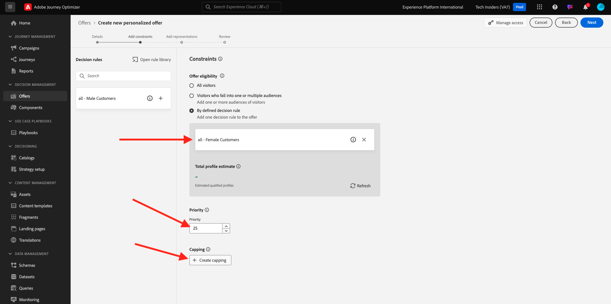
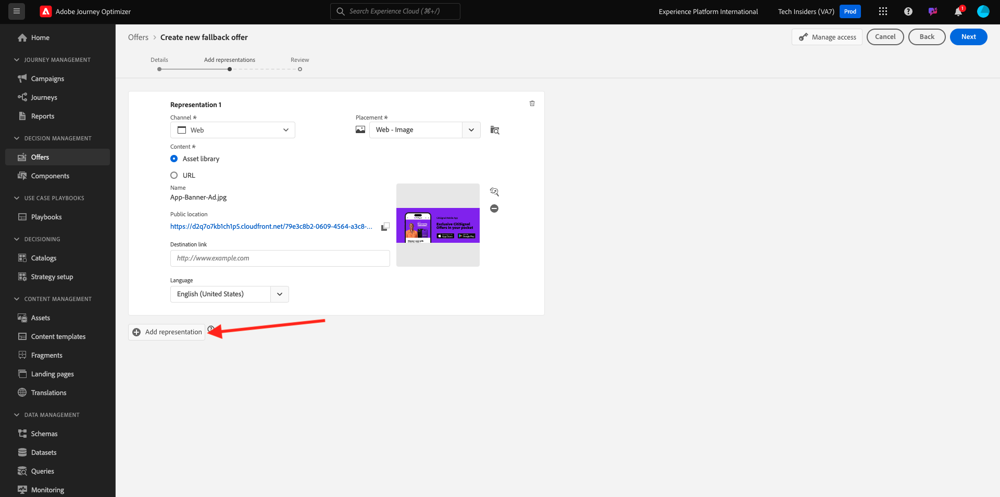
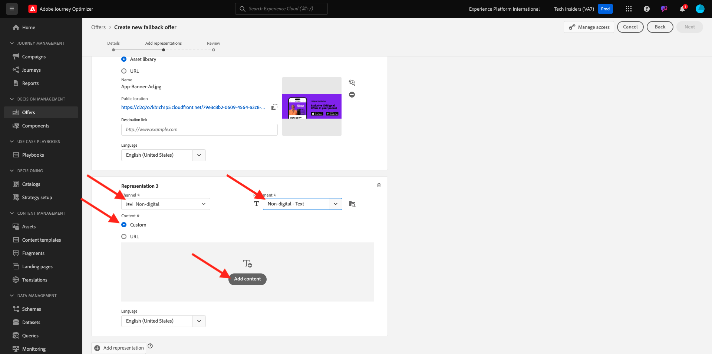
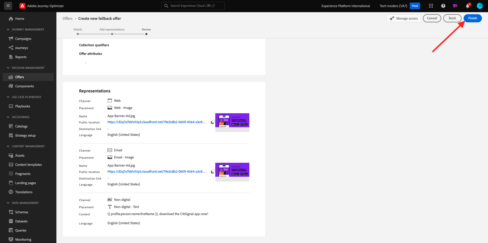

# 3.3.2設定優惠方案與決定

## 3.3.2.1建立您的個人化優惠方案

在本練習中，您將建立四個&#x200B;**個人化優惠方案**。 以下是建立這些優惠方案時要考慮的詳細資料：

| 名稱 | 日期範圍 | 電子郵件的影像連結 | 網頁的影像連結 | 文字 | 優先順序 | 適用性 | 語言 |
|-----|------------|----------------------|--------------------|------|:--------:|--------------|:-------:|
| `--demoProfileLdap-- - Nadia Elements Shell` | 今天 — 1個月後 | https://bit.ly/3nPiwdZ | https://bit.ly/2INwXjt | `{{ profile.person.name.firstName }}, 10% discount on Nadia Elements Shell` | 25 | 全部 — 女性客戶 | 英文 (美國) |
| `--demoProfileLdap-- - Radiant Tee` | 今天 — 1個月後 | https://bit.ly/2HfA17v | https://bit.ly/3pEIdzn | `{{ profile.person.name.firstName }}, 5% discount on Radiant Tee` | 15 | 全部 — 女性客戶 | 英文 (美國) |
| `--demoProfileLdap-- - Zeppelin Yoga Pant` | 今天 — 1個月後 | https://bit.ly/2IOaItW | https://bit.ly/2INZHZd | `{{ profile.person.name.firstName }}, 10% discount on Zeppelin Yoga Pant` | 25 | 全部 — 男性客戶 | 英文 (美國) |
| `--demoProfileLdap-- - Proteus Fitness Jackshirt` | 今天 — 1個月後 | https://bit.ly/330a43n | https://bit.ly/36USaQW | `{{ profile.person.name.firstName }}, 5% discount on Proteus Fitness Jackshirt` | 15 | 全部 — 男性客戶 | 英文 (美國) |

{style="table-layout:auto"}

前往[Adobe Experience Cloud](https://experience.adobe.com)登入Adobe Journey Optimizer。 按一下&#x200B;**Journey Optimizer**。

您將被重新導向到Journey Optimizer中的&#x200B;**首頁**&#x200B;檢視。 首先，確定您使用正確的沙箱。 要使用的沙箱稱為`--aepSandboxId--`。 若要從一個沙箱變更為另一個沙箱，請按一下&#x200B;**PRODUCTION Prod (VA7)**，然後從清單中選取沙箱。 在此範例中，沙箱名為&#x200B;**AEP Enablement FY22**。 然後您就會進入沙箱`--aepSandboxId--`的&#x200B;**首頁**&#x200B;檢視。

在左側功能表中，按一下&#x200B;**選件**，然後移至&#x200B;**選件**。 按一下&#x200B;**+建立選件**。

然後您會看到此快顯視窗。 選取&#x200B;**個人化優惠**，然後按一下&#x200B;**下一步**。

您現在在&#x200B;**詳細資料**&#x200B;檢視中。

在此情況下，您需要設定選件`--demoProfileLdap-- - Nadia Elements Shell`。 使用上表中的資訊填寫欄位。 在此範例中，個人化選件的名稱為&#x200B;**vangeluw - Nadia Elements Shell**。 另外，將&#x200B;**開始日期和時間**&#x200B;設定為昨天，並將&#x200B;**結束日期和時間**&#x200B;設定為從現在起一個月內的日期。

完成後，您應該擁有此專案。 按一下&#x200B;**下一步**。

您現在需要建立&#x200B;**代表**。 表示是&#x200B;**位置**&#x200B;和實際資產的組合。

針對&#x200B;**代表1**，請選取：

- 管道：網頁
- 刊登：網頁 — 影像
- 內容： URL
- 公用位置：從上表中的Web **資料行**&#x200B;影像連結複製URL

或者，您可以選取&#x200B;**資產庫**&#x200B;作為內容，然後按一下&#x200B;**瀏覽**。

接著您會看到Assets資料庫的快顯視窗，前往資料夾&#x200B;**enablement-assets**&#x200B;並選取影像檔案&#x200B;**nadia-web.png**。 然後，按一下&#x200B;**選取**。

然後您會看到以下內容：

按一下&#x200B;**+新增表現**。

針對&#x200B;**呈現2**，請選取：

- 頻道：電子郵件
- 刊登：電子郵件 — 影像
- 內容： URL
- 公用位置：從上表中電子郵件&#x200B;**的欄**&#x200B;影像連結複製URL

或者，您可以選取&#x200B;**資產庫**&#x200B;作為內容，然後按一下&#x200B;**瀏覽**。

接著您會看到Assets資料庫的快顯視窗，前往資料夾&#x200B;**enablement-assets**&#x200B;並選取影像檔案&#x200B;**nadia-email.png**。 然後，按一下&#x200B;**選取**。

然後您會看到以下內容：

接著，按一下&#x200B;**+新增表現**。

針對&#x200B;**代表3**，請選取：

- 頻道：非數位
- 刊登：非數位 — 文字

接下來，您需要新增內容。 在此情況下，這表示新增要用來作為行動號召的文字。

按一下&#x200B;**新增內容**。

然後您會看到此快顯視窗。

選取&#x200B;**自訂文字**&#x200B;並填寫這些欄位：

檢視上表中的&#x200B;**文字**&#x200B;欄位，並在此輸入該文字，在此案例中為： `{{ profile.person.name.firstName }}, 10% discount on Nadia Elements Shell`。

您也會注意到您可以選取任何設定檔屬性，並將其作為動態欄位納入優惠方案文字中。 在此範例中，欄位`{{ profile.person.name.firstName }}`將確定接收此優惠方案的客戶名字將包含在優惠方案文字中。

您將會看到此訊息。 按一下&#x200B;**儲存**。

您現在擁有此專案。 按一下&#x200B;**下一步**。

然後您會看到以下內容：

選取&#x200B;**依定義的決定規則**&#x200B;並按一下&#x200B;**+**&#x200B;圖示以新增規則&#x200B;**所有 — 女性客戶**。

您將會看到此訊息。 如上表所示，填寫&#x200B;**優先順序**。 按一下&#x200B;**下一步**。

然後，您將會看到新&#x200B;**個人化優惠方案**&#x200B;的概觀。

最後，按一下&#x200B;**儲存並核准**。

接著，您就會在優惠方案概觀中看到新建立的個人化優惠方案：

您現在應該重複上述步驟，針對Radiant Tee、Zeppelin瑜伽褲和Proteus Fitness Jackshirt產品建立其他三個個人化優惠。

完成後，您的&#x200B;**個人化優惠方案**&#x200B;的&#x200B;**優惠方案概覽**&#x200B;畫面應顯示所有優惠方案。

## 3.3.2.2建立您的遞補優惠

建立四個個人化優惠方案後，您現在應該設定&#x200B;**遞補優惠方案**。

確定您位於&#x200B;**選件**&#x200B;檢視：

按一下&#x200B;**+建立選件**。

然後您會看到此快顯視窗。 選取&#x200B;**遞補優惠**&#x200B;並按一下&#x200B;**下一步**。

然後您會看到以下內容：

為您的遞補優惠輸入此名稱： `--demoProfileLdap-- - Luma Fallback Offer`。 按一下&#x200B;**下一步**。

您現在需要建立&#x200B;**代表**。 表示是&#x200B;**位置**&#x200B;和實際資產的組合。

針對&#x200B;**代表1**，請選取：

- 管道：網頁
- 刊登：網頁 — 影像
- 內容： URL
- 公用位置： `https://bit.ly/3nBOt9h`

或者，您可以選取&#x200B;**資產庫**&#x200B;作為內容，然後按一下&#x200B;**瀏覽**。

接著您會看到Assets資料庫的快顯視窗，前往資料夾&#x200B;**enablement-assets**&#x200B;並選取影像檔案&#x200B;**spriteyogastraps-web.png**。 然後，按一下&#x200B;**選取**。

然後您會看到以下內容：

針對&#x200B;**呈現2**，請選取：

- 頻道：電子郵件
- 刊登：電子郵件 — 影像
- 內容： URL
- 公用位置： `https://bit.ly/3nF4qvE`

或者，您可以選取&#x200B;**資產庫**&#x200B;作為內容，然後按一下&#x200B;**瀏覽**。

接著您會看到Assets資料庫的快顯視窗，前往資料夾&#x200B;**enablement-assets**&#x200B;並選取影像檔案&#x200B;**spriteyogastraps-email.png**。 然後，按一下&#x200B;**選取**。

然後您會看到以下內容：

接著，按一下&#x200B;**+新增表現**。

針對&#x200B;**代表3**，請選取：

- 頻道：非數位
- 刊登：非數位 — 文字

接下來，您需要新增內容。 在此情況下，這表示新增影像連結。

按一下&#x200B;**新增內容**。

然後您會看到此快顯視窗。

選取&#x200B;**自訂文字**&#x200B;並填寫這些欄位：

輸入文字`{{ profile.person.name.firstName }}, discover our Sprite Yoga Straps!`並按一下&#x200B;**儲存**。

您將會看到此訊息。 按一下&#x200B;**下一步**。

然後，您將會看到新的&#x200B;**遞補優惠**&#x200B;的概觀。 按一下&#x200B;**完成**。

最後，按一下&#x200B;**儲存並核准**。

在您的&#x200B;**選件概覽**&#x200B;畫面中，您現在將看到以下內容：

## 3.3.2.3建立您的集合

集合是用來從個人化優惠清單中&#x200B;**篩選**&#x200B;優惠的子集，並將其用於決定中，以加快決定程式。

移至&#x200B;**集合**。 按一下&#x200B;**+建立集合**。

然後您會看到這個快顯視窗。 設定您的集合，如下所示。 按一下&#x200B;**下一步**。

- 集合名稱：使用`--demoProfileLdap-- - Luma Collection`
- 選取&#x200B;**建立靜態集合**。

在下一個畫面中，選取您在上一個練習中建立的四個&#x200B;**個人化優惠**。 按一下&#x200B;**儲存**。

您現在會看到以下內容：

## 3.3.2.4建立您的決定

決策會根據每個個人化優惠特性（例如優先順序、資格限制和總/使用者上限），將位置、個人化優惠集合和遞補優惠結合在一起，以供Offer decisioning引擎最終用於尋找特定設定檔的最佳優惠。

若要設定您的&#x200B;**決定**，請移至&#x200B;**決定**。 按一下&#x200B;**+建立活動**。

然後您會看到以下內容：

填寫如下的欄位。 按一下&#x200B;**下一步**。

- 名稱： `--demoProfileLdap-- - Luma Decision`
- 開始日期和時間：昨天
- 結束日期和時間：今天+ 1個月

在下一個畫面中，您需要將版位新增至決定範圍。 您必須為位置&#x200B;**網頁 — 影像**、**電子郵件 — 影像**&#x200B;和&#x200B;**非數位 — 文字**&#x200B;建立決定範圍。

首先，在下拉式清單中選取該位置，以建立&#x200B;**非數位 — 文字**&#x200B;的決定範圍。 然後，按一下&#x200B;**新增**&#x200B;按鈕以新增評估准則。

選取您的集合`--demoProfileLdap-- - Luma Collection`並按一下&#x200B;**新增**。

您將會看到此訊息。 按一下&#x200B;**-**&#x200B;按鈕以新增決定範圍。

選取位置&#x200B;**網頁 — 影像**，並在評估准則下新增您的集合`--demoProfileLdap-- - Luma Collection`。 然後，再按一下&#x200B;**+**&#x200B;按鈕以新增決定範圍。

選取版位&#x200B;**電子郵件 — 影像**，並在評估准則下新增您的集合`--demoProfileLdap-- - Luma Collection`。 然後，按一下&#x200B;**下一步**。

您現在需要選取名為`--demoProfileLdap-- - Luma Fallback Offer`的&#x200B;**遞補優惠**。 按一下&#x200B;**下一步**。

檢閱您的決定。 按一下&#x200B;**完成**。

在快顯視窗中，按一下&#x200B;**儲存並啟動**。

最後，您現在會在概觀中看到您的決定：

您現在已成功設定您的決定。 您的決定現在已上線，且可用於即時向客戶提供最佳化和個人化優惠。

下一步： [3.3.3準備您的資料收集使用者端屬性和Web SDK設定，以進行Offer decisioning](./ex3.md)

[返回模組3.3](./offer-decisioning.md)

[返回所有模組](./../../../overview.md)
