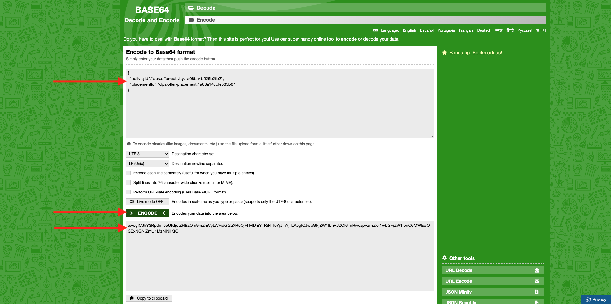
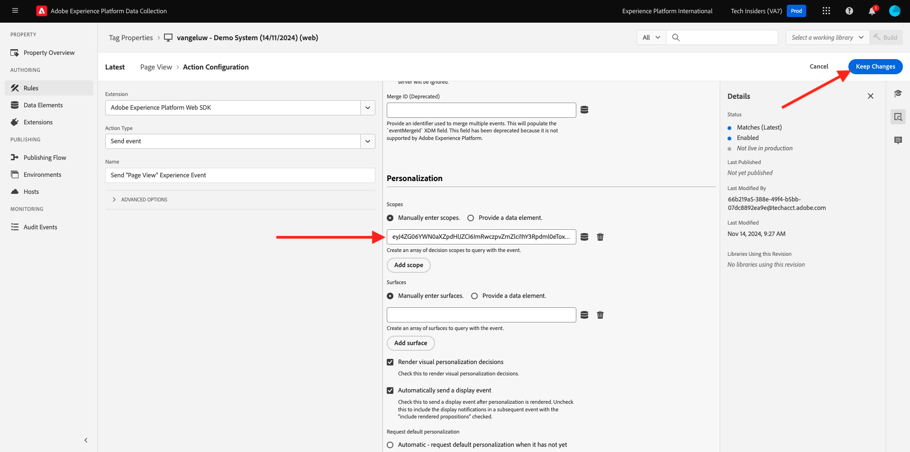
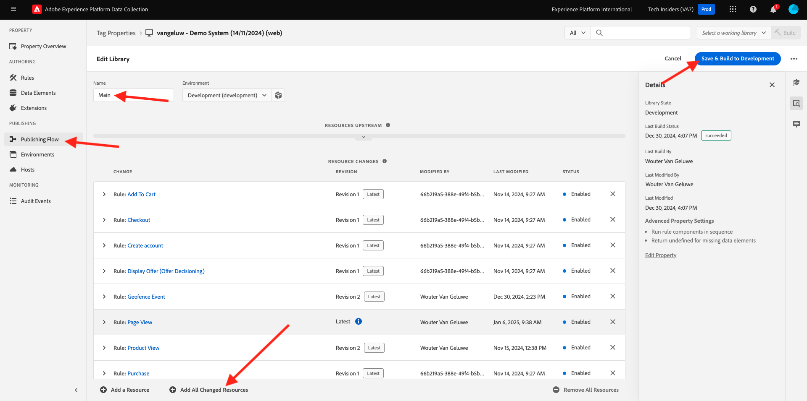

# 3.3.3準備您的Adobe Experience Platform資料收集使用者端屬性和Web SDK設定以進行Offer decisioning

## 3.3.3.1更新您的資料流

在[練習0.2](./../../../modules/gettingstarted/gettingstarted/ex2.md)中，您已建立自己的&#x200B;**[!UICONTROL 資料流]**。 您接著使用名稱`--aepUserLdap-- - Demo System Datastream`。

在本練習中，您需要設定&#x200B;**[!UICONTROL 資料串流]**&#x200B;以搭配&#x200B;**[!DNL Offer Decisioning]**&#x200B;使用。

若要這麼做，請前往[https://experience.adobe.com/#/data-collection/](https://experience.adobe.com/#/data-collection/)。 您將會看到此訊息。 按一下&#x200B;**[!UICONTROL 資料串流]**&#x200B;或&#x200B;**[!UICONTROL 資料串流(Beta)]**。

在熒幕的右上角，選取您的沙箱名稱，應為`--aepSandboxName--`。


搜尋您名為`--aepUserLdap-- - Demo System Datastream`的&#x200B;**[!UICONTROL 資料流]**。 按一下您的&#x200B;**[!UICONTROL 資料流]**&#x200B;以開啟。


您將會看到此訊息。 按一下&#x200B;**Adobe Experience Platform**&#x200B;旁的&#x200B;**...**，然後按一下&#x200B;**編輯**。


若要啟用&#x200B;**[!DNL Offer Decisioning]**，請核取&#x200B;**[!DNL Offer Decisioning]**&#x200B;的方塊。 按一下&#x200B;**儲存**。


您的&#x200B;**[!UICONTROL 資料流]**&#x200B;現在已準備好與&#x200B;**[!DNL Offer Decisioning]**&#x200B;搭配使用。


## 3.3.3.2設定您的Adobe Experience Platform資料收集使用者端屬性，以要求個人化優惠

移至[https://experience.adobe.com/#/data-collection/](https://experience.adobe.com/#/data-collection/)，**[!UICONTROL 使用者端]**。 搜尋名稱為`--aepUserLdap-- - Demo System (DD/MM/YYYY)`的資料收集屬性。 開啟Web的資料收集使用者端屬性。


在您的屬性中，移至&#x200B;**[!UICONTROL 規則]**&#x200B;並開啟規則&#x200B;**[!UICONTROL 頁面檢視]**。


按一下以開啟[!UICONTROL 動作] **[!UICONTROL AEP Web SDK — 傳送事件]**。


您將會看到此訊息。 您會注意到&#x200B;**[!UICONTROL 決定範圍]**&#x200B;的功能表選項。


對於傳送至Edge和Adobe Experience Platform的每個要求，都可以提供一個或多個&#x200B;**[!UICONTROL 決定範圍]**。 **[!UICONTROL 決定範圍]**&#x200B;是兩個元素的組合：

- [!UICONTROL 決定ID]
- [!UICONTROL 位置ID]

首先，讓我們看看您可在何處找到這兩個元素。

### 3.3.3.2.1擷取您的[!UICONTROL 位置ID]

[!UICONTROL 位置ID]會識別所需的位置和資產型別。 例如，Luma網站首頁的主圖影像與[!UICONTROL 網頁 — 影像]的[!UICONTROL 位置ID]相對應。

>[!NOTE]
>
>在模組6中，您已設定Adobe Target體驗鎖定目標活動，該活動將變更首頁上主圖位置的影像（如熒幕擷取畫面所示）。 為了練習的目的，您現在會提供選件，讓選件顯示在熒幕擷取畫面中標示的主圖影像下方。


若要尋找[!UICONTROL 網頁的[!UICONTROL 位置ID] — 影像]，請移至[Adobe Experience Cloud](https://experience.adobe.com)，以移至Adobe Journey Optimizer。 按一下&#x200B;**Journey Optimizer**。


您將被重新導向到Journey Optimizer中的&#x200B;**首頁**&#x200B;檢視。 首先，確定您使用正確的沙箱。 要使用的沙箱稱為`--aepSandboxName--`。 然後您就會進入沙箱`--aepSandboxName--`的&#x200B;**首頁**&#x200B;檢視。


接著，前往[!UICONTROL 元件]，然後前往[!UICONTROL 位置]。 按一下[!UICONTROL 網頁 — 影像]位置以檢視其詳細資料。


如上圖所示，在此範例中，[!UICONTROL 位置ID]為`xcore:offer-placement:14bf09dc4190ebba`。 記下您在[!UICONTROL 網路 — 影像]中的版位[!UICONTROL 版位ID]，因為您會在下一個練習中需要它。

### 3.3.3.2.2擷取您的[!UICONTROL 決定ID]

[!UICONTROL 決定ID]會識別您要使用的個人化優惠和遞補優惠組合。 在上一個練習中，您建立了自己的[!UICONTROL 決定]，並將其命名為`--aepUserLdap-- - Luma Decision`。

若要尋找您`--aepUserLdap-- - Luma Decision`的[!UICONTROL 決定ID]，請移至[https://platform.adobe.com](https://platform.adobe.com)。

接著，移至[!UICONTROL 優惠]，然後移至[!UICONTROL 決定]。 按一下以選取名為`--aepUserLdap-- - Luma Decision`的[!UICONTROL 決定]。


如上圖所示，在此範例中，[!UICONTROL 決定ID]為`xcore:offer-activity:14c052382e1b6505`。 記下您決定`--aepUserLdap-- - Luma Decision`的[!UICONTROL 決定ID]，因為您會在下一個練習中需要它。

現在您已擷取建立&#x200B;**[!UICONTROL 決定範圍]**&#x200B;所需的兩個元素，您可以繼續下一個步驟，包括編碼決定範圍。

### 3.3.3.2.3基底編碼

您需要輸入的&#x200B;**[!UICONTROL 決定範圍]**&#x200B;是BASE64編碼的字串。 這個BASE64編碼字串是[!UICONTROL 位置ID]和[!UICONTROL 決定ID]的組合，如下所示。

```json
{
  "activityId":"xcore:offer-activity:14c052382e1b6505",
  "placementId":"xcore:offer-placement:14bf09dc4190ebba"
}
```

可透過兩種方式產生&#x200B;**[!UICONTROL 決定範圍]**：

- 使用類似[https://www.base64encode.org/](https://www.base64encode.org/)的公共服務。 如上所述，輸入JSON程式碼，按一下&#x200B;**[!UICONTROL 編碼]**，您將在下方取得您的BASE64編碼字串。

  

- 從Adobe Experience Platform擷取BASE64編碼字串。 移至[!UICONTROL 決定]，然後按一下以開啟名為`--aepUserLdap-- - Luma Decision`的[!UICONTROL 決定]。

  

  開啟`--aepUserLdap-- - Luma Decision`後，您將會看到此專案。 找到位置[!UICONTROL 網頁 — 影像]，然後按一下&#x200B;**[!UICONTROL 複製]**&#x200B;按鈕。 接著，按一下&#x200B;**[!UICONTROL 編碼決定範圍]**。 **[!UICONTROL 決定範圍]**&#x200B;現在已複製到您的剪貼簿。

  

接下來，返回Launch，進行您的動作&#x200B;**[!UICONTROL AEP Web SDK — 傳送事件]**。


在輸入欄位中貼上編碼的決定範圍。



按一下&#x200B;**[!UICONTROL 保留變更]**，儲存動作&#x200B;**[!UICONTROL AEP Web SDK — 傳送事件]**&#x200B;中的變更。


接著，按一下&#x200B;**[!UICONTROL 儲存]**&#x200B;或&#x200B;**[!UICONTROL 儲存至資料庫]**


在Adobe Experience Platform Data Collection中，移至&#x200B;**[!UICONTROL 發佈流程]**&#x200B;並開啟名為&#x200B;**[!UICONTROL Main]**&#x200B;的&#x200B;**[!UICONTROL 開發程式庫]**。 按一下「**[!UICONTROL +新增所有變更的資源]**」，然後按一下「**[!UICONTROL 儲存並建置以供開發]**」。 您的變更現在將發佈到您的示範網站。



每次您現在載入&#x200B;**一般頁面**&#x200B;時（例如示範網站的首頁），Offer Decisioning都會評估適用的選件，並傳回包含要顯示之選件詳細資訊的回應給網站。 在網站上顯示選件需要其他設定，您將在下一個步驟中進行。

## 3.3.3.3設定您的Adobe Experience Platform資料收集使用者端屬性，以接收並套用個人化優惠

移至[https://experience.adobe.com/#/data-collection/](https://experience.adobe.com/#/data-collection/)，移至&#x200B;**[!UICONTROL 屬性]**。 搜尋名稱為`--aepUserLdap-- - Demo System (DD/MM/YYYY)`的資料收集屬性。 開啟Web的資料收集屬性。


在您的屬性中，移至&#x200B;**[!UICONTROL 規則]**。


搜尋並開啟規則&#x200B;**已接收決定**。


您將會看到此訊息。 開啟動作&#x200B;**將選件放在頁面**。


按一下&#x200B;**[!UICONTROL 開啟編輯器]**


在編輯器中貼上下列程式碼以覆寫程式碼。

```javascript
if(!Array.isArray(event.decisions)) {
  console.log('No decisions returned')
  return;
}
console.log("decision",event.decisions)

event.decisions.forEach(function(payload) {
  payload.items.forEach(function(item){
    console.log("Response from Offer Decisioning ", item.data.content);
   
    var element = document.querySelector("#root > div > div > div.app-content > div > section.feature_part.padding_top > div > div.row.align-items-center.justify-content-between > div.col-lg-7.col-sm-6.\\30  > div");
    if(!element){
      console.log("Offer Placement Area Selector not found")
      return;
    }
    if(!item.data){
      return
    }
    //check if offer already exists
    var offer = document.querySelector("#root > div > div > div.app-content > div > section.feature_part.padding_top > div > div.row.align-items-center.justify-content-between > div.col-lg-7.col-sm-6.\\30  > div");
    if(!offer){ 
      element.insertAdjacentHTML('afterbegin', item.data.content) 
    }
    else { 
      console.log("item.data.deliveryURL: " + item.data.deliveryURL)
      document.querySelector("#root > div > div > div.app-content > div > section.feature_part.padding_top > div > div.row.align-items-center.justify-content-between > div.col-lg-7.col-sm-6.\\30  > div").style.background="url('"+item.data.deliveryURL+"')";
      document.querySelector("#root > div > div > div.app-content > div > section.feature_part.padding_top > div > div.row.align-items-center.justify-content-between > div.col-lg-7.col-sm-6.\\30  > div").style.backgroundRepeat="no-repeat";
      document.querySelector("#root > div > div > div.app-content > div > section.feature_part.padding_top > div > div.row.align-items-center.justify-content-between > div.col-lg-7.col-sm-6.\\30  > div").style.backgroundPosition="center center";
      document.querySelector("#root > div > div > div.app-content > div > section.feature_part.padding_top > div > div.row.align-items-center.justify-content-between > div.col-lg-7.col-sm-6.\\30  > div").style.backgroundSize = "contain";
    }  
  })
});
```

行26-27-28-29將套用Offer decisioning傳回的影像至網站。 按一下&#x200B;**[!UICONTROL 儲存]**。


按一下&#x200B;**[!UICONTROL 保留變更]**。


接著，按一下&#x200B;**[!UICONTROL 儲存]**&#x200B;或&#x200B;**[!UICONTROL 儲存至資料庫]**


在Adobe Experience Platform Data Collection中，移至&#x200B;**[!UICONTROL 發佈流程]**&#x200B;並開啟名為&#x200B;**[!UICONTROL Main]**&#x200B;的&#x200B;**[!UICONTROL 開發程式庫]**。 按一下「**[!UICONTROL +新增所有變更的資源]**」，然後按一下「**[!UICONTROL 儲存並建置以供開發]**」。 您的變更現在將發佈到您的示範網站。


經過此變更後，Adobe Experience Platform資料收集中的此規則現在會聆聽Offer Decisioning的回應，此回應是網頁SDK回應的一部分，收到回應時，會在首頁上顯示選件的影像。

瀏覽示範網站，您會發現現在將取代此影像：

>[!NOTE]
>
>在模組6中，您已設定Adobe Target體驗鎖定目標活動，該活動將變更首頁上主圖位置的影像（如熒幕擷取畫面所示）。 為了練習的目的，您現在會提供選件，讓選件顯示在熒幕擷取畫面中標示的主圖影像下方。


現在，您將看到類似此選件的選件，而不是預設的Luma網站影像。 在此情況下，會顯示遞補優惠。


您現在已設定2種個人化型別：

- 在模組6中使用Adobe Target的1個體驗鎖定目標活動
- 使用您的資料收集屬性實施1個Offer decisioning

在下一個練習中，您將瞭解如何將在Adobe Journey Optimizer中建立的優惠和決定與Adobe Target體驗鎖定目標活動結合。

下一步： [3.3.4結合Adobe Target和Offer Decisioning](./ex4.md)

[返回模組3.3](./offer-decisioning.md)

[返回所有模組](./../../../overview.md)
