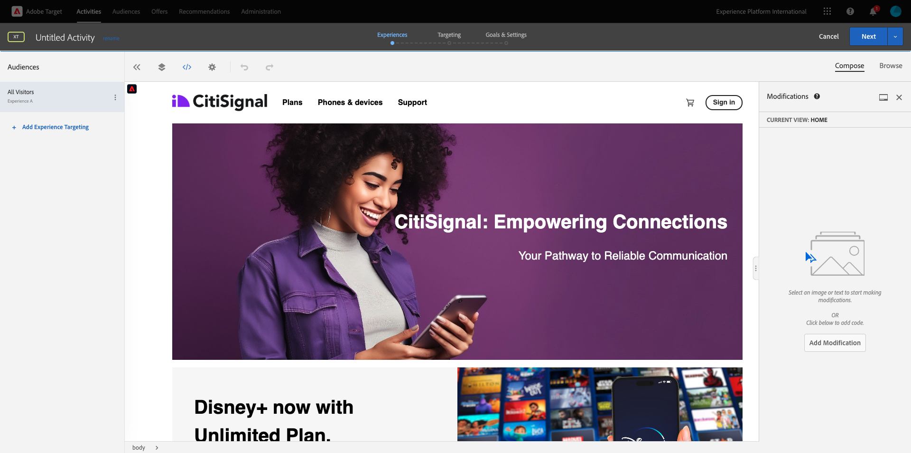

# 3.3.4將Adobe Target與Offer Decisioning結合

## 3.3.4.1收集示範專案的分享連結

若要在Adobe Target中載入示範網站專案，您首先需要收集特殊連結，讓Adobe Target可載入您的示範網站專案。

若要這麼做，請前往[https://builder.adobedemo.com/projects](https://builder.adobedemo.com/projects)。 使用Adobe ID登入後，您會看到此訊息。 按一下您的網站專案以開啟。

您現在將會看到此訊息。 按一下&#x200B;**共用**。

按一下&#x200B;**產生連結**，然後將連結複製到剪貼簿。

移至[https://bitly.com](https://bitly.com)，貼上您複製的連結，然後按一下&#x200B;**縮短**。 您現在會取得縮短的連結，如下所示： `https://bit.ly/3JxN7aG`。 在下一個練習中，您將需要該連結。

## 3.3.4.2收集

現在移至[https://experiencecloud.adobe.com/](https://experiencecloud.adobe.com/)，以移至Adobe Experience Cloud首頁。 按一下&#x200B;**目標**。

在&#x200B;**Adobe Target**&#x200B;首頁上，您會看到所有現有的活動。

按一下&#x200B;**+建立活動**&#x200B;以建立新活動。

選取&#x200B;**體驗鎖定目標**。

現在選取&#x200B;**Visual**，並將您縮短的連結貼到&#x200B;**輸入活動URL**&#x200B;欄位。 按一下&#x200B;**下一步**。

然後您會看到您的示範網站專案正載入到視覺化體驗撰寫器中。

移至&#x200B;**瀏覽**&#x200B;模式，在Cookie同意快顯視窗中按一下&#x200B;**全部允許**。

按一下包含文字&#x200B;**精選類別**&#x200B;的區域。 按一下&#x200B;**插入在**&#x200B;之前，然後選取&#x200B;**優惠決定**。

然後您會看到此快顯視窗。 選取您的沙箱`--aepSandboxName--`，然後選取位置&#x200B;**網頁 — 影像**。

接著，選取您的決定`--aepUserLdap-- - Luma Decision`。 按一下&#x200B;**儲存**。

您將會看到此訊息。 確定新增其他範本規則&#x200B;**URL** **包含** **your-project-name**。 按一下&#x200B;**儲存**。

您將會看到此訊息。 按一下&#x200B;**下一步**。

輸入優惠方案名稱，使用此名稱： `--aepUserLdap-- - XT with Offers (VEC)`。 按一下&#x200B;**下一步**。

您將會看到此訊息。 依照指示定義您的&#x200B;**目標量度**。 按一下&#x200B;**儲存並關閉**。

您的選件現已建立並正在發佈。

您的選件發佈後，您就可以啟用它。

下一步： [3.3.5在電子郵件和簡訊中使用您的決定](./ex5.md)

[返回模組3.3](./offer-decisioning.md)

[返回所有模組](./../../../overview.md)
