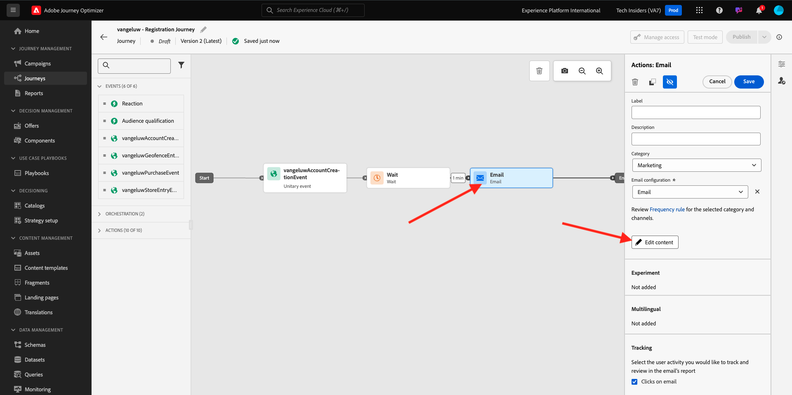

# 3.3.5在電子郵件中使用您的決定

在本練習中，您將使用自己的決定來個人化電子郵件和簡訊的傳送。

移至&#x200B;**歷程**。 尋找您在練習3.1.3中建立的名為`--aepUserLdap-- - Registration Journey`的歷程。 按一下您的歷程以開啟。

您將會看到此訊息。 按一下&#x200B;**...更多**，然後按一下&#x200B;**建立新版本**。

按一下&#x200B;**建立新版本**。

按一下&#x200B;**電子郵件**&#x200B;動作，然後按一下&#x200B;**編輯內容**。

然後您會看到訊息儀表板。 按一下&#x200B;**編輯電子郵件內文**。

您將會看到此訊息。 將新的&#x200B;**1:1欄**&#x200B;結構元件拖曳到畫布上。

在功能表中，移至&#x200B;**內容**。 選取&#x200B;**優惠決定**&#x200B;元件，並依指示將此元件拖放到電子郵件的內容優惠預留位置。 然後，按一下&#x200B;**新增**。

選取您要納入電子郵件中的版位型別。 在&#x200B;**位置**&#x200B;下拉式功能表中選取&#x200B;**電子郵件 — 影像**，然後選取您的決定`--aepUserLdap-- - CitiSignal Decision`。 按一下&#x200B;**新增**。

您現在可以循環檢視所有個人化優惠和遞補優惠，所有這些都在電子郵件設計工具中視覺化。 按一下&#x200B;**儲存**。

現在，按一下箭頭返回上一個畫面。

按一下左上角的箭頭，返回您的歷程。

按一下[儲存]以關閉您的[電子郵件]動作。**&#x200B;**&#x200B;**&#x200B;**

按一下&#x200B;**Publish**&#x200B;以發佈您更新的歷程。

再次按一下&#x200B;**Publish**&#x200B;以確認。

您的訊息現已發佈。

在示範網站上建立新帳戶時，您現在會收到這封電子郵件：

您已完成此練習。

下一步： [3.3.6使用API測試您的決定](./ex6.md)

[返回模組3.3](./offer-decisioning.md)

[返回所有模組](./../../../overview.md)
