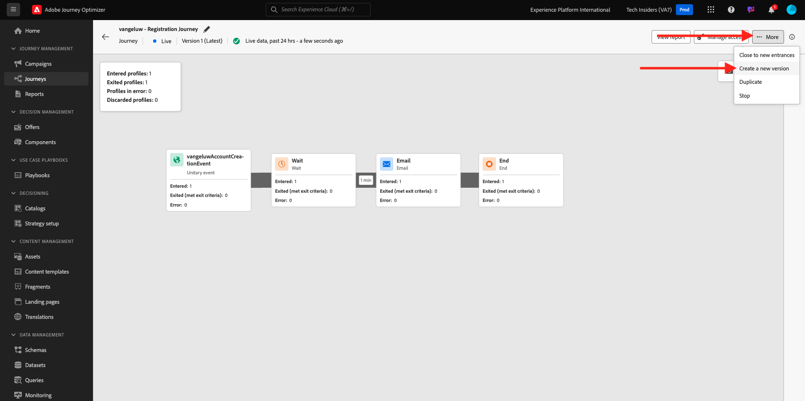
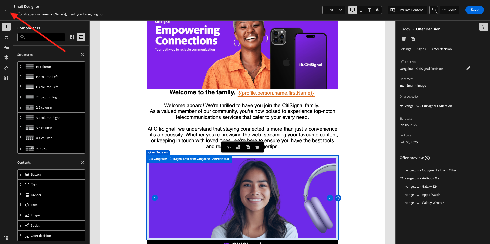
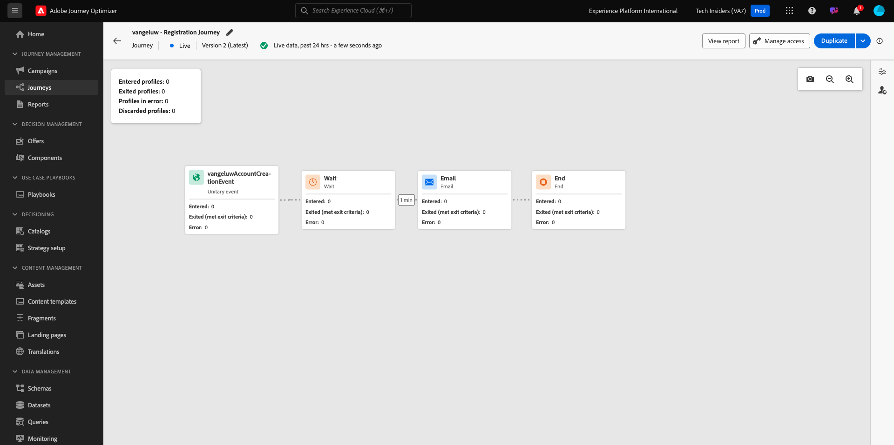

# 3.3.5在電子郵件中使用您的決定

在本練習中，您將使用自己的決定來個人化電子郵件和簡訊的傳送。

移至&#x200B;**歷程**。 尋找您在練習7.2中建立的名為`--aepUserLdap-- - Account Creation Journey`的歷程。 按一下您的歷程以開啟。

您將會看到此訊息。 按一下&#x200B;**建立新版本**。

按一下&#x200B;**建立新版本**。

按一下&#x200B;**電子郵件**&#x200B;動作，然後按一下&#x200B;**編輯內容**。

然後您會看到訊息儀表板。 按一下&#x200B;**電子郵件Designer**。

您將會看到此訊息。

您將會看到此訊息。 將新的&#x200B;**1:1欄**&#x200B;結構元件拖曳到畫布上。

在功能表中，移至&#x200B;**內容元件**。 選取&#x200B;**優惠決定**&#x200B;元件，並依指示將此元件拖放到電子郵件的內容優惠預留位置。 然後，按一下&#x200B;**新增**。

選取您要納入電子郵件中的版位型別。 在&#x200B;**位置**&#x200B;下拉式功能表中選取&#x200B;**電子郵件 — 影像**，然後選取您的決定`--aepUserLdap-- - Luma Decision`。 按一下&#x200B;**新增**。

您現在會在電子郵件設計工具中看到所有個人化優惠和遞補優惠方案。 按一下&#x200B;**模擬內容**，以實際客戶設定檔預覽電子郵件訊息。

首先，識別您要用於預覽的設定檔。 選取&#x200B;**電子郵件**&#x200B;名稱空間，並輸入您在示範網站上建立的客戶設定檔電子郵件地址。 接著，按一下&#x200B;**預覽**。

電子郵件顯示且選件正確顯示後，請按一下&#x200B;**關閉**&#x200B;按鈕。

最後，按一下&#x200B;**儲存**。

現在，按一下箭頭返回上一個畫面。

您將會看到此訊息。 按一下左上角的箭頭，返回您的歷程。

按一下&#x200B;**確定**&#x200B;以關閉您的&#x200B;**電子郵件**&#x200B;動作。

按一下&#x200B;**Publish**&#x200B;以發佈您更新的歷程。

再次按一下&#x200B;**Publish**&#x200B;以確認。

您的訊息現已發佈。

在示範網站上建立新帳戶時，您現在會收到這封電子郵件：

您已完成此練習。

下一步： [3.3.6使用API測試您的決定](./ex6.md)

[返回模組3.3](./offer-decisioning.md)

[返回所有模組](./../../../overview.md)
