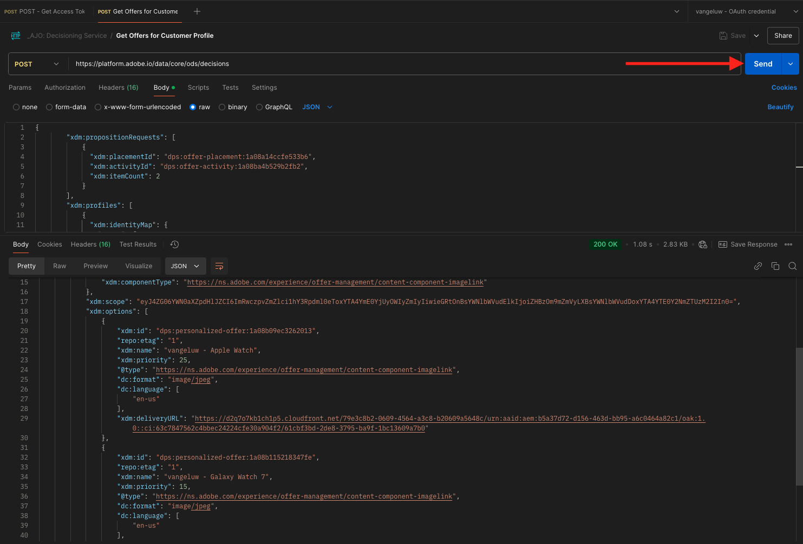

# 3.3.6使用API測試您的決定

## 3.3.6.1使用Postman處理Offer Decisioning API

>[!IMPORTANT]
>
>如果您是Adobe員工，請依照這裡的指示使用[PostBuster](./../../../postbuster.md)。

將[此Offer decisioning的Postman集合](./../../../assets/postman/postman_offer-decisioning.zip)下載到您的案頭並解壓縮。 之後，您將會擁有此專案：

您的案頭上現在有此檔案：

- `_AJO- Decisioning Service.postman_collection.json`

在[練習2.1.3中 — 您已經安裝Postman來驗證Adobe I/O](./../../../modules/rtcdp-b2c/module2.1/ex3.md) Postman。 此練習需要再次使用Postman。

開啟Postman並匯入檔案`_AJO- Decisioning Service.postman_collection.json`。 之後，您就可以在Postman中使用此集合。

您現在已擁有Postman所需的一切，可開始透過API與Adobe Experience Platform互動。

在您可以使用以下API之前，請務必使用您在練習2.1.3中設定的集合&#x200B;**AdobeIO - OAuth**&#x200B;重新驗證。

### 3.3.6.2取得客戶設定檔的優惠方案

按一下以開啟請求&#x200B;**POST — 取得客戶設定檔的優惠方案**。 第一個要更新的專案是&#x200B;**x-sandbox-name**&#x200B;的&#x200B;**Header**&#x200B;變數。 您應將其設為`--aepSandboxName--`。

對於此請求，有一些欄位需要更新。 移至&#x200B;**內文**。

- **xdm：placementId**
- **xdm：activityId**
- **xdm：id**
- **xdm：itemCount** （將其變更為選擇的值）

需要填寫欄位&#x200B;**xdm：activityId**。 您可以在Adobe Experience Platform UI中擷取該專案，如下所示。

需要填寫欄位&#x200B;**[!UICONTROL xdm：placementId]**。 您可以在Adobe Experience Platform UI中擷取該專案，如下所示。 在下列範例中，您可以看到版位&#x200B;**[!UICONTROL 網路 — 影像]**&#x200B;的placementId。

在&#x200B;**xdm：id**&#x200B;欄位中，輸入您要為其請求優惠方案的客戶設定檔電子郵件地址。 將所有值設定為所需後，按一下&#x200B;**[!UICONTROL 傳送]**。

最後，您會看到哪些個人化優惠和哪些資產需要顯示給此客戶的結果。 在此範例中，已要求2個專案，如您所見，已傳回2個個人化優惠。 Apple Watch有1個優惠，Galaxy Watch 7有1個優惠。

您現在已經完成此練習。

下一步： [摘要與優點](./summary.md)

[返回模組3.3](./offer-decisioning.md)

[返回所有模組](./../../../overview.md)
