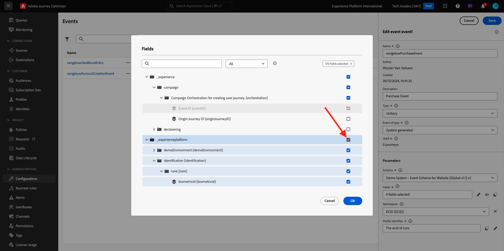
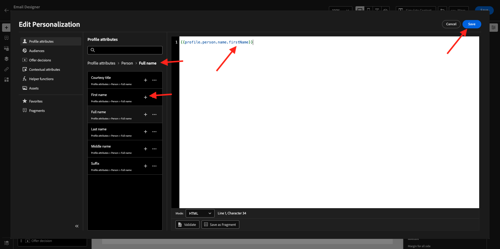
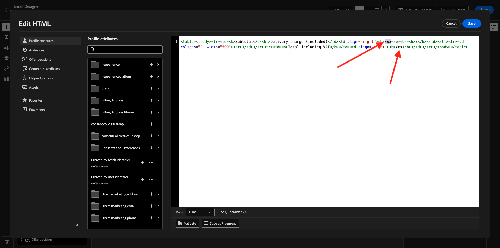
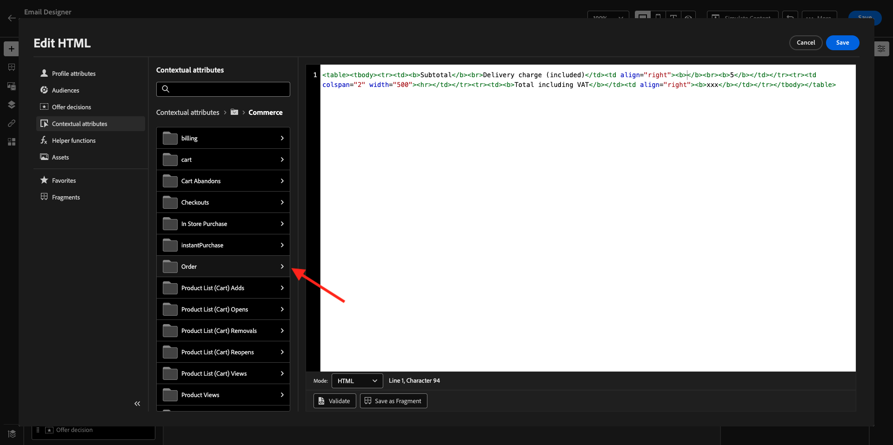
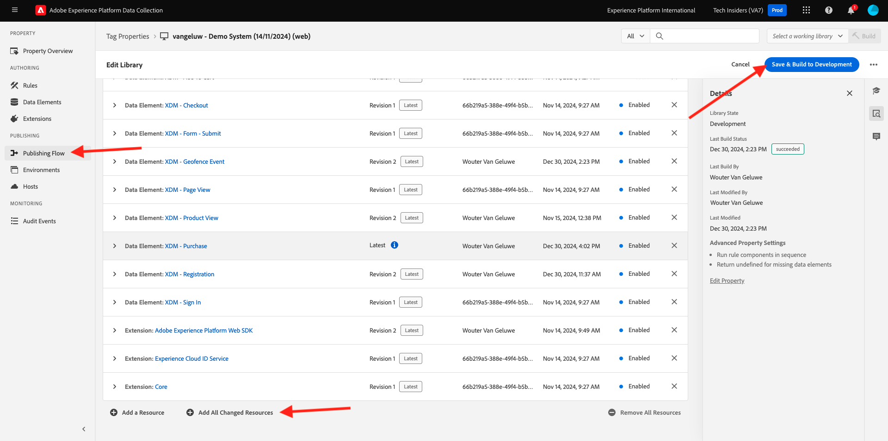

# 3.4.1設定觸發式歷程 — 訂購確認

前往[Adobe Experience Cloud](https://experience.adobe.com)登入Adobe Journey Optimizer。 按一下&#x200B;**Journey Optimizer**。


您將被重新導向到Journey Optimizer中的&#x200B;**首頁**&#x200B;檢視。 首先，確定您使用正確的沙箱。 要使用的沙箱稱為`--aepSandboxName--`。 然後您就會進入沙箱`--aepSandboxName--`的&#x200B;**首頁**&#x200B;檢視。


## 3.4.1.1建立您的活動

在功能表中，移至&#x200B;**組態**&#x200B;並按一下&#x200B;**事件**&#x200B;底下的&#x200B;**管理**。


在&#x200B;**事件**&#x200B;畫面上，您會看到類似此的檢視。 按一下&#x200B;**建立事件**。


然後您會看到空白的事件設定。

首先，請為事件命名如下： `--aepUserLdap--PurchaseEvent`，然後新增如下描述： `Purchase Event`。

針對&#x200B;**型別**，選取&#x200B;**單一**。
針對&#x200B;**事件識別碼型別**，選取&#x200B;**系統產生**。


接下來是「結構描述」選項。 已針對此練習準備結構描述。 請使用結構描述`Demo System - Event Schema for Website (Global v1.1) v.1`。

選取結構描述後，您將會在&#x200B;**裝載**&#x200B;區段中看到一些正在選取的欄位。 按一下&#x200B;**編輯/鉛筆**&#x200B;圖示以新增其他欄位至此事件。


然後您會看到此快顯視窗。 您現在需要核取其他核取方塊，才能在觸發此事件時存取其他資料。


首先，核取行`--aepTenantId--`上的核取方塊。



接下來，向下捲動並勾選`commerce`行上的核取方塊。


接下來，向下捲動並勾選`productListItems`行上的核取方塊。 按一下&#x200B;**確定**。


之後，您會看到其他欄位已新增至事件。 按一下&#x200B;**儲存**。


接著會儲存您的新事件，而您現在會在可用事件清單中看到您的事件。

再次按一下您的事件以再次開啟&#x200B;**編輯事件**&#x200B;畫面。
再次將游標暫留在&#x200B;**承載**&#x200B;欄位上，可再次看到3個圖示。 按一下&#x200B;**檢視裝載**&#x200B;圖示。


您現在將看到預期裝載的範例。 您的事件具有獨特的協調流程eventID，您可以在該承載中向下捲動直到看到`_experience.campaign.orchestration.eventID`為止。


事件ID需要傳送至Adobe Journey Optimizer，才能觸發您將在下一個步驟中建立的歷程。 記下此eventID，因為您會在後續步驟中用到它。
`"eventID": "1c8148a8ab1993537d0ba4e6ac293dd4f2a88d80b2ca7be6293c3b28d4ff5ae6"`

按一下&#x200B;**確定**，然後按一下&#x200B;**取消**。

您的事件現在已設定完畢，且可供使用。

## 3.4.1.2建立您的歷程

在功能表中，前往&#x200B;**歷程**&#x200B;並按一下&#x200B;**建立歷程**。


您將會看到此訊息。 為您的歷程命名。 使用`--aepUserLdap-- - Order Confirmation journey`。 按一下&#x200B;**儲存**。


首先，您需要新增活動作為歷程的起點。 搜尋您的活動`--aepUserLdap--PurchaseEvent`，並將其拖放到畫布上。 按一下&#x200B;**儲存**。


接下來，在&#x200B;**動作**&#x200B;底下，搜尋&#x200B;**電子郵件**&#x200B;動作，並將其新增至畫布上。


將&#x200B;**類別**&#x200B;設定為&#x200B;**行銷**，並選取可讓您傳送電子郵件的電子郵件表面。 在此情況下，要選取的電子郵件表面為&#x200B;**電子郵件**。 請確定已同時啟用&#x200B;**電子郵件**&#x200B;點按和&#x200B;**電子郵件開啟**&#x200B;的核取方塊。


下一步是建立訊息。 若要這麼做，請按一下[編輯內容]。**&#x200B;**


您現在看到這個了。 按一下&#x200B;**主旨列**&#x200B;文字欄位。


在文字區域開始寫入&#x200B;**感謝您的訂購，**&#x200B;並按一下&#x200B;**Personalization**&#x200B;圖示。


主旨列尚未完成。 接下來，您需要為&#x200B;**名字**&#x200B;欄位（儲存在`profile.person.name.firstName`下）引入個人化權杖。 在左側功能表中，向下捲動以尋找&#x200B;**人員** > **全名** > **名字**&#x200B;欄位，然後按一下&#x200B;**+**&#x200B;圖示以將個人化權杖新增至主旨列。 按一下&#x200B;**儲存**。


然後您就會回到這裡。 按一下&#x200B;**編輯電子郵件內文**&#x200B;以建立電子郵件的內容。


在下一個畫面中，按一下&#x200B;**從草稿開始設計**。


在左側選單中，您會找到可用來定義電子郵件結構（列和欄）的結構元件。

將&#x200B;**1:1欄**&#x200B;拖放八次，畫布應會提供下列內容：


在左側功能表中，移至&#x200B;**片段**。 將您先前在[練習3.1.2.1](./../module3.1/ex2.md)中建立的標頭拖曳到畫布中的第一個元件。 將您先前在[練習3.1.2.2](./../module3.1/ex2.md)中建立的頁尾拖曳至畫布中的最後一個元件。


按一下左側功能表中的&#x200B;**+**&#x200B;圖示。 移至&#x200B;**內容**，開始將內容新增至畫布。


移至&#x200B;**內容**&#x200B;並將&#x200B;**影像**&#x200B;元件拖放到第二列。 按一下&#x200B;**瀏覽**。


開啟資料夾&#x200B;**citi-signal-images**，按一下以選取影像&#x200B;**citisignal-preparing.png**，然後按一下&#x200B;**選取**。


在&#x200B;**樣式**&#x200B;下，將寬度變更為&#x200B;**40%**。


接著，移至&#x200B;**內容**&#x200B;並將&#x200B;**文字**&#x200B;元件拖放到第三列。


選取該元件中的預設文字&#x200B;**請在此輸入您的文字。**&#x200B;並以下列文字取代：

```javascript
You’re one step closer!

Hi 

We've received your order details!

We will also send you a separate email containing your VAT Invoice.

We'll be back in touch with you as soon as we've finished packing your package. Please read carefully the Order Information detailed below.
```


將游標放在文字&#x200B;**嗨**&#x200B;旁邊，然後按一下&#x200B;**新增Personalization**。


導覽至「**人員**」>「**全名**」>「**名字**」欄位，然後按一下「**+**」圖示，將個人化權杖新增至主旨列。 按一下&#x200B;**儲存**。



然後您會看到以下內容：


接著，移至&#x200B;**內容**&#x200B;並將&#x200B;**文字**&#x200B;元件拖放到第四列。


選取該元件中的預設文字&#x200B;**請在此輸入您的文字。**&#x200B;並以下列文字取代：

`Order Information`

將字型大小變更為&#x200B;**26px**，並將文字置中於此儲存格中。 之後，您將會擁有此專案：


接著，移至&#x200B;**內容**，並將&#x200B;**HTML**&#x200B;元件拖放至第五列。 按一下HTML元件，然後按一下&#x200B;**顯示原始程式碼**。


在&#x200B;**編輯HTML**&#x200B;快顯視窗中，貼上此HTML：

```<table><tbody><tr><td><b>Items purchased</b></td><td></td><td><b>Quantity</b></td><td><b>Subtotal</b></td></tr><tr><td colspan="4" width="500"><hr></td></tr></tbody></table>```

按一下&#x200B;**儲存**。


您就會擁有此專案。 按一下[儲存]儲存進度。**&#x200B;**


移至&#x200B;**內容**&#x200B;並將&#x200B;**HTML**&#x200B;元件拖放到第六列。 按一下HTML元件，然後按一下&#x200B;**顯示原始程式碼**。


在&#x200B;**編輯HTML**&#x200B;快顯視窗中，貼上此HTML：

```{{#each xxx as |item|}}<table width="500"><tbody><tr><td></td><td><table><tbody><tr><td><b>{{item.name}}</b><br>{{item.--aepTenantId--.core.subCategory}}<br><b>{{item.priceTotal}}</b><br>&nbsp;<br>Article no: {{item.SKU}}</td></tr></tbody></table></td><td>{{item.quantity}}</td><td><b>{{item.priceTotal}}</b></td></tr></tbody></table>{{/each}}```

之後，您將會擁有此專案：


您現在必須以productListItems物件的參考取代&#x200B;**xxx**，此物件是觸發歷程之事件的一部分。


首先，請先刪除HTML代碼中的&#x200B;**xxx**。


在左側功能表中，按一下&#x200B;**內容屬性**。 此內容會傳遞至歷程中的訊息。

您將會看到此訊息。 按一下&#x200B;**Journey Orchestration**&#x200B;旁的箭頭以深入鑽研。


按一下&#x200B;**事件**&#x200B;旁的箭頭，以深入探討。


按一下`--aepUserLdap--PurchaseEvent`旁的箭頭以深入鑽研。


按一下&#x200B;**productListItems**&#x200B;旁的箭頭，以深入鑽研。


按一下&#x200B;**名稱**&#x200B;旁的&#x200B;**+**&#x200B;圖示以將其新增至畫布。 您就會擁有此專案。 您現在必須選取&#x200B;**.name** （如下列熒幕擷圖所示），然後您應該移除&#x200B;**.name**。


您就會擁有此專案。 按一下&#x200B;**儲存**。


您現在會回到電子郵件Designer。 按一下[儲存]儲存進度。**&#x200B;**


接著，移至&#x200B;**內容**，並將&#x200B;**HTML**&#x200B;元件拖放至第七列。 按一下HTML元件，然後按一下&#x200B;**顯示原始程式碼**。


在&#x200B;**編輯HTML**&#x200B;快顯視窗中，貼上此HTML：

```<table><tbody><tr><td><b>Subtotal</b><br>Delivery charge (included)</td><td align="right"><b>xxx</b><br><b>5</b></td></tr><tr><td colspan="2" width="500"><hr></td></tr><tr><td><b>Total including VAT</b></td><td align="right"><b>xxx</b></td></tr></tbody></table>```

此HTML程式碼中有2個&#x200B;**xxx**&#x200B;的參考。 您現在必須藉由對productListItems物件的參考來取代每個&#x200B;**xxx**，此物件是觸發歷程的事件的一部分。



首先，刪除HTML代碼中的前&#x200B;**xxx**。


在左側功能表中，按一下&#x200B;**內容屬性**。
按一下&#x200B;**Journey Orchestration**&#x200B;旁的箭頭以深入鑽研。


按一下&#x200B;**事件**&#x200B;旁的箭頭，以深入探討。


按一下`--aepUserLdap--PurchaseEvent`旁的箭頭以深入鑽研。


按一下&#x200B;**Commerce**&#x200B;旁的箭頭以深入探討。


按一下&#x200B;**順序**&#x200B;旁的箭頭以深入鑽研。



按一下&#x200B;**總價**&#x200B;旁的&#x200B;**+**&#x200B;圖示，將其新增至畫布。


您就會擁有此專案。 現在刪除您HTML代碼中的第二個&#x200B;**xxx**。


再按一下&#x200B;**總價**&#x200B;旁的&#x200B;**+**&#x200B;圖示以將其新增至畫布。
您也可以將&#x200B;**Order**&#x200B;物件內的&#x200B;**Currency**&#x200B;欄位新增至畫布，如這裡所示。
完成時，按一下[儲存]儲存變更。**&#x200B;**


接著，您會回到電子郵件Designer。 再按一下&#x200B;**儲存**。


按一下左上角主旨列文字旁的&#x200B;**箭頭**，返回訊息儀表板。


按一下左上角的箭頭，返回您的歷程。


按一下&#x200B;**儲存**&#x200B;以關閉您的電子郵件動作。


按一下&#x200B;**Publish**&#x200B;以發佈您的歷程。


再按一下&#x200B;**Publish**。


您的歷程現已發佈。


## 3.4.1.5更新您的Adobe Experience Platform資料收集使用者端屬性

移至[Adobe Experience Platform資料彙集](https://experience.adobe.com/launch/)並選取&#x200B;**標籤**。

這是您之前看到的Adobe Experience Platform資料收集屬性頁面。


在&#x200B;**快速入門**&#x200B;中，示範系統為您建立了兩個使用者端屬性：一個用於網站，一個用於行動應用程式。 在&#x200B;**[!UICONTROL 搜尋]**&#x200B;方塊中搜尋`--aepUserLdap--`以尋找它們。 按一下以開啟&#x200B;**Web**&#x200B;屬性。


移至&#x200B;**資料元素**。 搜尋並開啟資料元素&#x200B;**XDM — 購買**。


您將會看到此訊息。 導覽至&#x200B;**_experience.campaign.orchestration.eventID**&#x200B;欄位，並在這裡填寫您的eventID。 此處要填寫的eventID是您於練習3.4.1.1中建立的eventID。1按一下「儲存」**或「儲存至程式庫」**。**&#x200B;**


將變更儲存在屬性中，然後更新開發程式庫以發佈變更。



您的變更現在已部署並可進行測試。

## 3.4.1.6使用示範網站測試您的訂單確認電子郵件

讓我們在示範網站上購買產品，以測試更新的歷程。

移至[https://dsn.adobe.com](https://dsn.adobe.com)。 使用Adobe ID登入後，您會看到此訊息。 按一下您的網站專案上的3個點&#x200B;**...**，然後按一下&#x200B;**執行**&#x200B;以開啟它。


然後您會看到示範網站已開啟。 選取URL並將其複製到剪貼簿。


開啟新的無痕瀏覽器視窗。


貼上您在上一步中複製的示範網站URL。 接著，系統會要求您使用Adobe ID登入。


選取您的帳戶型別並完成登入程式。


接著，您會在無痕瀏覽器視窗中看到您的網站已載入。 每次練習都需要使用全新的無痕瀏覽器視窗，才能載入您的示範網站URL。


請檢視「設定檔檢視器」面板和即時客戶設定檔，並將&#x200B;**Experience CloudID**&#x200B;設為此目前未知客戶的主要識別碼。


前往「註冊/登入」頁面。 按一下&#x200B;**建立帳戶**。


填寫您的詳細資料，然後按一下&#x200B;**註冊**，之後您將會被重新導向到上一頁。


新增任何產品至購物車


移至&#x200B;**購物車**&#x200B;頁面。 按一下&#x200B;**簽出**。


接下來，驗證欄位並在必要時完成。 按一下&#x200B;**繼續**。


按一下&#x200B;**確認訂單**。


您的訂單現已確認。


您將在數秒內收到訂單確認電子郵件。


您已完成此練習。

下一步： [3.4.2設定批次式Newsletter歷程](./ex2.md)

[返回模組3.4](./journeyoptimizer.md)

[返回所有模組](../../../overview.md)
