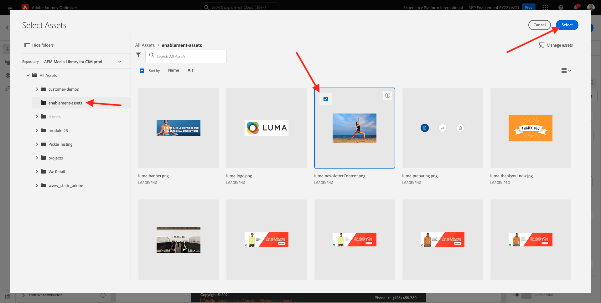

# 3.4.2設定批次式Newsletter歷程

前往[Adobe Experience Cloud](https://experience.adobe.com)登入Adobe Journey Optimizer。 按一下&#x200B;**Journey Optimizer**。

您將被重新導向到Journey Optimizer中的&#x200B;**首頁**&#x200B;檢視。 首先，確定您使用正確的沙箱。 要使用的沙箱稱為`--aepSandboxName--`。 若要從一個沙箱變更為另一個沙箱，請按一下&#x200B;**PRODUCTION Prod (VA7)**，然後從清單中選取沙箱。 在此範例中，沙箱名為&#x200B;**AEP Enablement FY22**。 然後您就會進入沙箱`--aepSandboxName--`的&#x200B;**首頁**&#x200B;檢視。

## 3.4.2.1建立電子報歷程

您現在將建立批次型歷程。 上一個練習的事件型歷程仰賴傳入體驗事件或對象進入或退出，以觸發1個特定客戶的歷程，而批次型歷程則不同，此歷程會以唯一內容（例如電子報、一次性促銷活動或一般資訊）一次鎖定整個對象，或定期傳送類似內容（例如例項生日行銷活動和提醒）。

在功能表中，前往&#x200B;**歷程**&#x200B;並按一下&#x200B;**建立歷程**。

在右側，您會看到一個表格，您必須在該表格中指定歷程名稱和說明。 輸入下列值：

- **名稱**： `--aepUserLdap-- - Newsletter Journey`。 例如： **vangeluw - Newsletter歷程**。
- **描述**：每月電子報

按一下&#x200B;**確定**。

在&#x200B;**協調流程**&#x200B;下，將&#x200B;**讀取對象**&#x200B;拖放到畫布上。 這表示，發佈歷程後，將開始擷取整個對象對象，然後成為歷程和訊息的目標對象。 按一下&#x200B;**選取對象**。

在&#x200B;**選擇對象**&#x200B;快顯視窗中，搜尋您的LDAP並選取您在[模組2.3 - Real-time CDP — 建立對象並執行名為`--aepUserLdap-- - Interest in Galaxy S24`的動作](./../../../modules/rtcdp-b2c/module2.3/real-time-cdp-build-a-segment-take-action.md)。 按一下&#x200B;**儲存**。

按一下&#x200B;**確定**。

在左側功能表中，尋找&#x200B;**動作**&#x200B;區段，並將&#x200B;**電子郵件**&#x200B;動作拖放至畫布上。

將&#x200B;**類別**&#x200B;設定為&#x200B;**行銷**，並選取可讓您傳送電子郵件的電子郵件表面。 在此情況下，要選取的電子郵件表面為&#x200B;**電子郵件**。 請確定已同時啟用&#x200B;**電子郵件**&#x200B;點按和&#x200B;**電子郵件開啟**&#x200B;的核取方塊。

下一步是建立訊息。 若要這麼做，請按一下[編輯內容]。****

您現在看到這個了。 按一下&#x200B;**主旨列**&#x200B;文字欄位。

輸入主旨行的文字： `Luma Newsletter - your monthly update has arrived.`。 按一下&#x200B;**儲存**。

然後您就會回到這裡。 按一下&#x200B;**電子郵件Designer**&#x200B;以開始建立電子郵件內容。

您將會看到此訊息。 按一下&#x200B;**匯入HTML**。

在快顯視窗畫面中，您必須拖放電子郵件的HTML檔案。 您可以在[這裡](./../../../assets/html/ajo-newsletter.html.zip)找到HTML範本。 將含有HTML範本的zip檔案下載至本機電腦，然後解壓縮至您的案頭。

拖放檔案&#x200B;**ajo-newsletter.html**&#x200B;以將其上傳至Journey Optimizer。 按一下&#x200B;**匯入**。

此電子郵件內容已準備就緒，因為其中包含所有預期的個人化、影像和文字。 只有選件預留位置會留空。

您可能會收到錯誤訊息： **嘗試擷取資產時發生錯誤**。 這會連結至電子郵件中的影像。

如果您收到此錯誤，請選取影像並按一下&#x200B;**編輯影像**&#x200B;按鈕。

按一下&#x200B;**Assets Essentials**&#x200B;以返回您的AEM Assets Essentials資料庫。

然後您會看到此快顯視窗。 導覽至資料夾&#x200B;**enablement-assets**，並選取影像&#x200B;**luma-newsletterContent.png**。 按一下&#x200B;**選取**。

您的基本電子報電子郵件現已準備就緒。 按一下&#x200B;**儲存**。

按一下左上角主旨列文字旁的&#x200B;**箭頭**，返回訊息儀表板。

按一下左上角的箭頭，返回您的歷程。

按一下&#x200B;**確定**&#x200B;以關閉您的電子郵件動作。

您的Newsletter歷程現在已準備好發佈。 在這樣做之前，請留意&#x200B;**排程**&#x200B;區段，您可在此區段將此歷程從一次性切換為循環行銷活動。 按一下&#x200B;**排程**&#x200B;按鈕。

您將會看到此訊息。 選取&#x200B;**一次**。

選取下一小時內的日期和時間，以便測試您的歷程。 按一下&#x200B;**確定**。

>[!NOTE]
>
>訊息傳送日期和時間必須在一小時以上。

按一下&#x200B;**Publish**。

再按一下&#x200B;**Publish**。

您的基本Newsletter歷程現已發佈。 您的電子報電子郵件訊息將會依照您在排程中的定義傳送，一旦傳送完最後一封電子郵件，您的歷程就會停止。

您已完成此練習。

下一步： [3.4.3在電子郵件中套用個人化](./ex3.md)

[返回模組3.4](./journeyoptimizer.md)

[返回所有模組](../../../overview.md)
