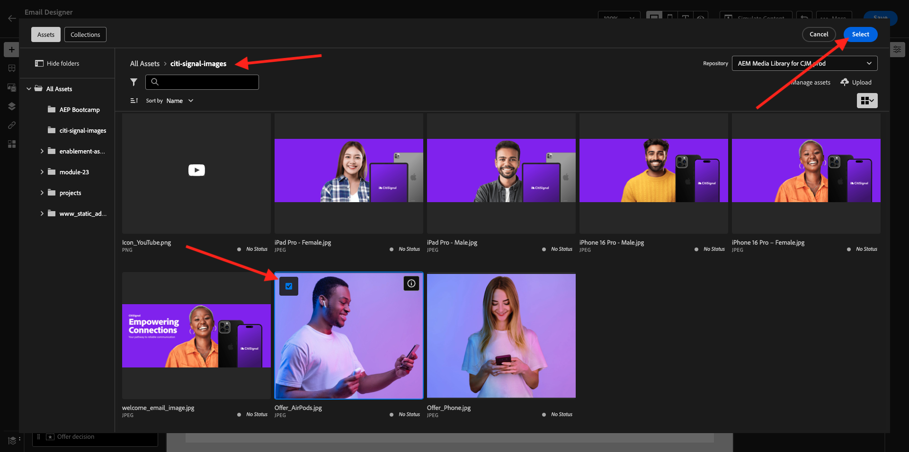

# 3.4.2設定行銷活動

前往[Adobe Experience Cloud](https://experience.adobe.com)登入Adobe Journey Optimizer。 按一下&#x200B;**Journey Optimizer**。


您將被重新導向到Journey Optimizer中的&#x200B;**首頁**&#x200B;檢視。 首先，確定您使用正確的沙箱。 要使用的沙箱稱為`--aepSandboxName--`。 然後您就會進入沙箱`--aepSandboxName--`的&#x200B;**首頁**&#x200B;檢視。


## 3.4.2.1建立對象

在建立行銷活動之前，您應該定義應該接收行銷活動的對象。 若要建立對象，請前往左側功能表中的&#x200B;**對象**。 您會在該處看到所有先前建立的對象。

按一下&#x200B;**+建立對象**。


選取&#x200B;**建置規則**&#x200B;並按一下&#x200B;**建立**。


選取&#x200B;**XDM個人設定檔>個人電子郵件>地址**&#x200B;欄位，並將其新增至畫布。 將規則條件設定為&#x200B;**存在**。

為了避免傳送電子郵件給共用訓練環境中的其他使用者，您也可以新增篩選器，例如&#x200B;**名字等於 — 您的名字 —**。

將您的對象名稱設定為`--aepUserLdap-- - All customers with email`，然後按一下&#x200B;**Publish**。


您的對象現已發佈，並可用於行銷活動。

## 3.4.2.2建立新聞稿行銷活動

您現在將建立行銷活動。 上一個練習的事件型歷程仰賴傳入體驗事件或對象進入或退出，以觸發1個特定客戶的歷程，而行銷活動則以唯一內容（例如電子報、一次性促銷活動或一般資訊）鎖定整個對象，或定期傳送類似內容（例如例項生日行銷活動和提醒）。

在功能表中，前往&#x200B;**行銷活動**&#x200B;並按一下&#x200B;**建立行銷活動**。


選取&#x200B;**排程 — 行銷**&#x200B;並按一下&#x200B;**建立**。


在行銷活動建立畫面上，設定下列專案：

- **名稱**： `--aepUserLdap-- - CitiSignal Newsletter`。
- **描述**：每月電子報
- **身分型別**：變更為電子郵件

按一下&#x200B;**選取對象**。


針對&#x200B;**對象**，選取您在上一步建立的對象`--aepUserLdap-- - All customers with email`。 按一下&#x200B;**儲存**。


針對&#x200B;**動作**，選取&#x200B;**電子郵件**，然後選取現有的&#x200B;**電子郵件組態**。 您將在幾分鐘後編輯內容。


針對&#x200B;**排程**，請選擇&#x200B;**在特定日期和時間**，並設定選擇的時間。


您現在可以開始建立電子郵件訊息本身。 向上捲動一點，然後按一下&#x200B;**編輯內容**。


您將會看到此訊息。 對於&#x200B;**主旨列**，請使用此： `Your monthly CitiSignal update has arrived.`。 接著，按一下&#x200B;**編輯電子郵件內文**。


選擇&#x200B;**從頭開始設計**。


您將會看到此訊息。 在左側選單中，您會找到可用來定義電子郵件結構（列和欄）的結構元件。

將&#x200B;**1:1欄**&#x200B;拖放至畫布上3次，左側拖放1次1:2欄，右側拖放1次2:1欄，應該會提供此結構：


在左側功能表中，移至&#x200B;**片段**。 將您先前在[練習3.1.2.1](./../module3.1/ex2.md)中建立的標頭拖曳到畫布中的第一個元件。 將您先前在[練習3.1.2.2](./../module3.1/ex2.md)中建立的頁尾拖曳至畫布中的最後一個元件。


按一下左側功能表中的&#x200B;**+**&#x200B;圖示。 移至&#x200B;**內容**，開始將內容新增至畫布。


將&#x200B;**Text**&#x200B;元件拖放到第二列。


選取該元件中的預設文字&#x200B;**請在此輸入您的文字。**&#x200B;並以下面的文字取代。 將對齊方式變更為&#x200B;**置中對齊**。

```javascript
Hi {{profile.person.name.firstName}}

As a CitiSignal member, you're part of a dynamic community that's constantly evolving to meet your needs. We're committed to delivering innovative solutions that enhance your digital lifestyle and keep you ahead of the curve.

Stay connected.
```


將&#x200B;**Image**&#x200B;元件拖放至第3和第4列。 按一下第3列的&#x200B;**瀏覽**。


開啟資料夾&#x200B;**citi-signal-images**，按一下以選取影像&#x200B;**Offer_AirPods.jpg**，然後按一下&#x200B;**選取**。



在第4列的影像預留位置上按一下&#x200B;**瀏覽**。


開啟資料夾&#x200B;**citi-signal-images**，按一下以選取影像&#x200B;**Offer_Phone.jpg**，然後按一下&#x200B;**選取**。


將&#x200B;**Text**&#x200B;元件拖放至第3和第4列。


在第3列的元件中選取預設文字&#x200B;**請在此輸入您的文字。**&#x200B;並以下面的文字取代。

```javascript
Get AirPods for free:

Experience seamless connectivity like never before with CitiSignal. Sign up for select premium plans and receive a complimentary pair of Apple AirPods. Stay connected in style with our unbeatable offer.
```

在第4列&#x200B;**的元件中選取預設文字。請在此輸入您的文字。**&#x200B;並以下面的文字取代。

```javascript
We'll pay off your phone:

Make the switch to CitiSignal and say goodbye to phone payments! Switching to CitiSignal has never been more rewarding. Say farewell to hefty phone bills as we help pay off your phone, up to 800$!
```


您的基本電子報電子郵件現已準備就緒。 按一下&#x200B;**儲存**。


按一下左上角主旨列文字旁的&#x200B;**箭頭**，返回行銷活動控制面板。


按一下&#x200B;**檢閱以啟動**。


您可能會收到此錯誤。 如果是這種情況，您可能需要等候最多24小時，直到評估對象為止，然後嘗試再次啟用您的行銷活動。 您也可能需要更新行銷活動的排程，以便稍後執行。

按一下&#x200B;**啟動**。


啟動後，您的行銷活動將排程執行。


您的行銷活動現在已啟用。 您的電子報電子郵件訊息將會依照您在排程中的定義傳送，且您的行銷活動會在傳送最後一封電子郵件後立即停止。

您也應收到您先前建立示範設定檔所用電子郵件地址的電子郵件。


您已完成此練習。

下一步： [3.4.3在電子郵件訊息中套用區段式個人化](./ex3.md)

[返回模組3.4](./journeyoptimizer.md)

[返回所有模組](../../../overview.md)
