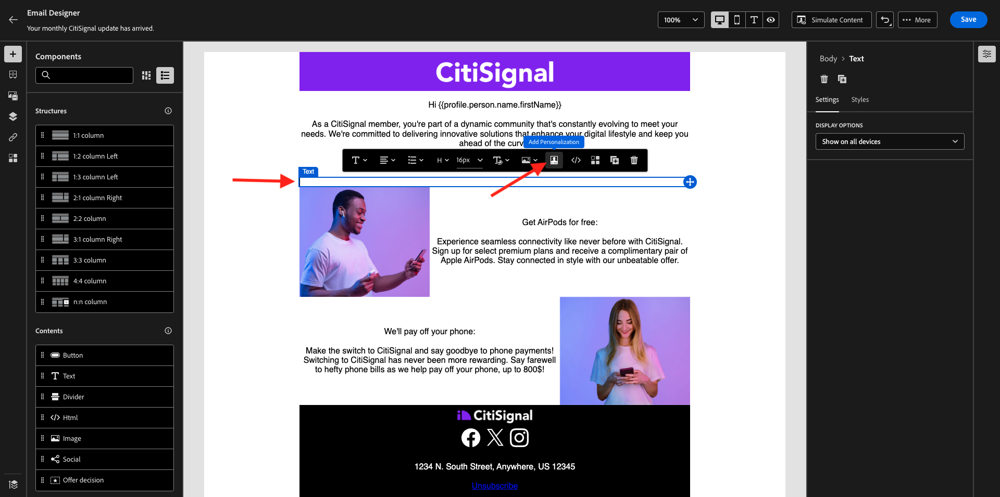

# 3.4.3在電子郵件訊息中套用個人化

前往[Adobe Experience Cloud](https://experience.adobe.com)登入Adobe Experience Cloud。 按一下&#x200B;**Adobe Journey Optimizer**。

您將被重新導向到Journey Optimizer中的&#x200B;**首頁**&#x200B;檢視。 繼續之前，您必須選取&#x200B;**沙箱**。 要選取的沙箱名為``--aepTenantId--``。

## 3.4.3.1區段型個人化

在本練習中，您將利用根據區段會籍的個人化文字，改善電子報電子郵件訊息。

移至&#x200B;**歷程**。 尋找您在上一個練習中建立的Newsletter歷程。 搜尋`--aepUserLdap-- - Newsletter`。 按一下您的歷程以開啟。

您將會看到此訊息。 按一下&#x200B;**複製**。

按一下&#x200B;**複製**。

選取您的&#x200B;**電子郵件**&#x200B;動作並按一下&#x200B;**編輯內容**。

按一下&#x200B;**電子郵件Designer**。

您將會看到此訊息。

開啟&#x200B;**內容元件**，並將&#x200B;**文字**&#x200B;元件拖曳到目前的Newsletter內容下方。

選取整個預設文字並將其刪除。 然後按一下工具列中的&#x200B;**新增個人化**&#x200B;按鈕。

然後您會看到以下內容：

在左側功能表中，按一下&#x200B;**區段會籍**。

>[!NOTE]
>
>如果您在此清單中找不到您的區段，請向下捲動一點，尋找如何手動擷取區段ID的說明。

選取區段`Luma - Women's Category Interest`並按一下&#x200B;**+**&#x200B;圖示，如下所示：

然後，您應該保留第一行原樣，並以下列程式碼取代第2行和第3行：

``
    Psssst... a private sale in the women category will launch soon, we will keep you posted

    Thanks for taking the time to read our newsletter. Here is a 10% promo code to use on the website: READER10

``

之後，您將會擁有此專案：

按一下&#x200B;**驗證**&#x200B;以確定程式碼正確。 按一下&#x200B;**儲存**。

您現在可以按一下右上角的&#x200B;**儲存**&#x200B;按鈕來儲存此訊息。 然後，按一下&#x200B;**模擬內容**。

選取您在本教學課程中建立的其中一個設定檔，然後按一下[預覽]。**** 然後您會看到設定結果。

您將會看到此訊息。 然後，按一下&#x200B;**關閉**。

按一下左上角主旨列文字旁的&#x200B;**箭頭**，返回訊息儀表板。

按一下左上角的箭頭，返回您的歷程。

按一下&#x200B;**確定**&#x200B;以關閉您的電子郵件動作。

將您的&#x200B;**排程**&#x200B;變更為&#x200B;**一次**&#x200B;並定義&#x200B;**日期/時間**。 按一下&#x200B;**確定**。

>[!NOTE]
>
>訊息傳送日期和時間必須在一小時以上。

按一下歷程中的&#x200B;**Publish**&#x200B;按鈕。

在快顯視窗中，再按一下&#x200B;**Publish**。

您的基本Newsletter歷程現已發佈。 您的電子報電子郵件訊息將根據您的排程傳送，您的歷程將在傳送最後一封電子郵件後立即停止。

您已完成此練習。

下一步： [3.4.4為iOS設定及使用推播通知](./ex4.md)

[返回模組3.4](./journeyoptimizer.md)

[返回所有模組](../../../overview.md)
