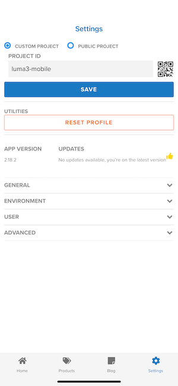
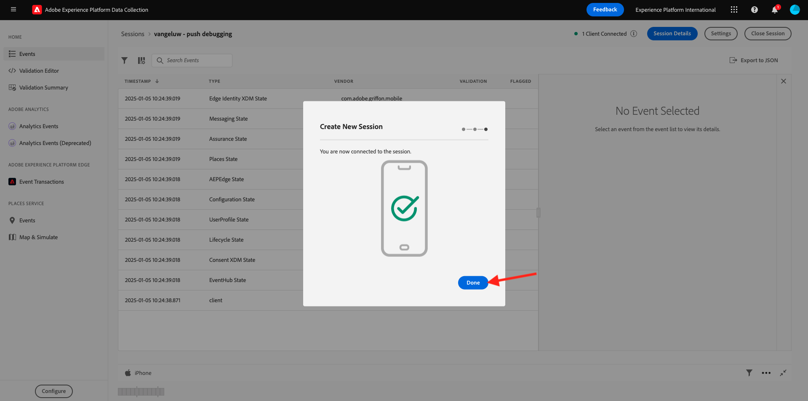
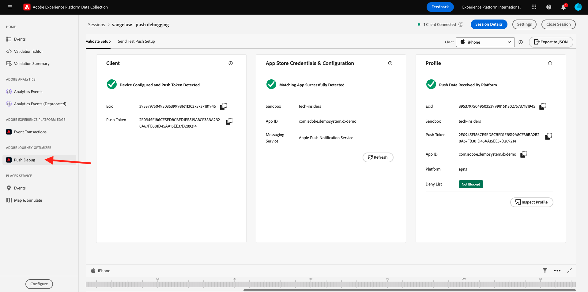
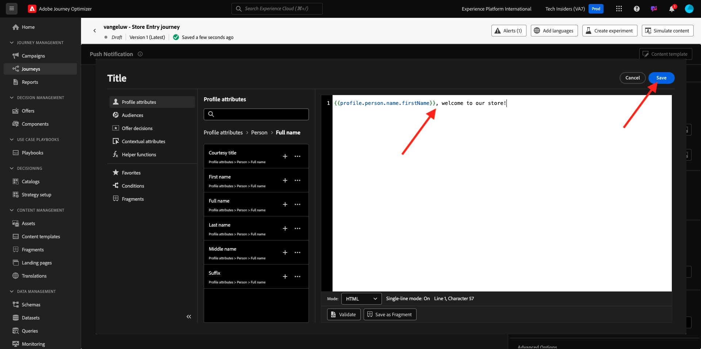

# 3.4.4 iOS的設定和使用推播通知

若要搭配Adobe Journey Optimizer使用推播通知，有許多設定需要檢查並瞭解。

以下是要驗證的所有設定：

- Adobe Experience Platform中的資料集和結構描述
- 適用於行動裝置的資料流
- 行動裝置的資料收集屬性
- 推送憑證的應用程式表面
- 使用AEP Assurance測試推播設定

讓我們逐一檢閱這些內容。

前往[Adobe Experience Cloud](https://experience.adobe.com)登入Adobe Journey Optimizer。 按一下&#x200B;**Journey Optimizer**。

您將被重新導向到Journey Optimizer中的&#x200B;**首頁**&#x200B;檢視。 首先，確定您使用正確的沙箱。 要使用的沙箱稱為`--aepSandboxName--`。 然後您就會進入沙箱`--aepSandboxName--`的&#x200B;**首頁**&#x200B;檢視。

## 3.4.4.1推送資料集

Adobe Journey Optimizer使用資料集來儲存行動裝置的推播權杖之類的專案，或是在Adobe Journey Optimizer的資料集中與推播訊息的互動（例如：已傳送訊息、已開啟訊息等）。

您可以在畫面左側的功能表中前往&#x200B;**[!UICONTROL 資料集]**&#x200B;找到這些資料集。 若要顯示系統資料集，請按一下篩選圖示。

啟用選項&#x200B;**顯示系統資料集**&#x200B;並搜尋&#x200B;**AJO**。 然後您會看到用於推播通知的資料集。

## 3.4.4.2行動裝置資料流

移至[https://experience.adobe.com/#/data-collection/](https://experience.adobe.com/#/data-collection/)。

在左側功能表中，移至&#x200B;**[!UICONTROL 資料流]**&#x200B;並搜尋您在[快速入門](./../../../modules/gettingstarted/gettingstarted/ex2.md)中建立的資料流（名為`--aepUserLdap-- - Demo System Datastream (Mobile)`）。 按一下以開啟它。

![按一下左側導覽中的[資料流]圖示](./images/edgeconfig1a.png)

在&#x200B;**Adobe Experience Platform**&#x200B;服務上按一下&#x200B;**編輯**。

![按一下左側導覽中的[資料流]圖示](./images/edgeconfig1.png)

然後您會看到已定義的資料流設定，以及將會儲存資料集事件和設定檔屬性的資料。

您也應該啟用下列選項（如果尚未啟用）：

- **Offer Decisioning**
- **個人化目的地**
- **Adobe Journey Optimizer**

按一下&#x200B;**儲存**。

## 3.4.4.3檢閱行動裝置的資料收集屬性

移至[https://experience.adobe.com/#/data-collection/](https://experience.adobe.com/#/data-collection/)。 在[快速入門](./../../../modules/gettingstarted/gettingstarted/ex1.md)中，已建立2個資料收集屬性。
您已在先前的模組中使用這些資料收集使用者端屬性。

按一下以開啟行動裝置的「資料收集」屬性。

在資料收集屬性中，移至&#x200B;**擴充功能**。 接著，您會看到行動應用程式所需的各種擴充功能。 按一下以開啟擴充功能&#x200B;**Adobe Experience PlatformEdge Network**。

接著，您會看到行動裝置資料流已連結至此處。 接著，按一下&#x200B;**取消**，返回您的擴充功能概觀。

然後您會回到這裡。 您將會看到&#x200B;**AEP Assurance**&#x200B;的擴充功能。 AEP Assurance可協助您檢查、證明、模擬及驗證如何在行動應用程式中收集資料或提供體驗。 您可以在[https://aep-sdks.gitbook.io/docs/beta/project-griffon](https://aep-sdks.gitbook.io/docs/beta/project-griffon)閱讀更多有關AEP Assurance和Project Griffon的資訊。

接著，按一下&#x200B;**設定**&#x200B;以開啟擴充功能&#x200B;**Adobe Journey Optimizer**。

接著，您會看到追蹤推送事件的資料集已連結至此處。

您不需要變更資料收集屬性。

## 3.4.4.4檢閱您的應用程式表面設定

移至[https://experience.adobe.com/#/data-collection/](https://experience.adobe.com/#/data-collection/)。 在左側功能表中，前往&#x200B;**應用程式表面**&#x200B;並開啟&#x200B;**DX示範應用程式APNS**&#x200B;的應用程式表面。

接著，您就會看到為iOS和Android設定的應用程式表面。

## 3.4.4.5使用AEP Assurance測試推播通知設定。

應用程式安裝後，您會在裝置的主畫面上找到。 按一下圖示以開啟應用程式。

第一次使用應用程式時，系統會要求您使用Adobe ID登入。 完成登入程式。

登入後，您會看到通知要求您傳送通知的許可權。 我們將在教學課程中傳送通知，因此請按一下[允許]。****

然後您會看到應用程式的首頁。 移至&#x200B;**設定**。

在設定中，您會看到應用程式目前已載入&#x200B;**公用專案**。 按一下&#x200B;**自訂專案**。

您現在可以載入自訂專案。 按一下QR碼以輕鬆載入您的專案。

完成&#x200B;**快速入門**&#x200B;區段後，您便有了此結果。 按一下以開啟為您建立的&#x200B;**行動零售專案**。

如果您不小心關閉了瀏覽器視窗，或是為了未來的示範或啟用工作階段，您也可以前往[https://dsn.adobe.com/projects](https://dsn.adobe.com/projects)存取您的網站專案。 使用Adobe ID登入後，您會看到此訊息。 按一下您的行動應用程式專案以開啟。

接著，按一下&#x200B;**執行**。

然後您會看到這個快顯視窗，其中包含QR碼。 從行動應用程式內掃描此QR碼。

然後您會在應用程式中看到您的專案ID，之後您可以按一下&#x200B;**儲存**。

現在，請回到應用程式中的&#x200B;**首頁**。 您的應用程式現在已可供使用。

您現在需要掃描QR碼，將行動裝置連線至AEP Assurance工作階段。

若要啟動AEP Assurance工作階段，請前往[https://experience.adobe.com/#/data-collection/](https://experience.adobe.com/#/data-collection/)。 按一下左側功能表中的&#x200B;**Assurance**。 然後，按一下&#x200B;**建立工作階段**。

按一下&#x200B;**開始**。

填入值：

- 工作階段名稱：使用`--aepUserLdap-- - push debugging`並以您的ldap取代ldap
- 基底URL：使用`dxdemo://default`

按一下&#x200B;**下一步**。

接著，您會在熒幕上看到QR碼，請使用iOS裝置掃描該碼。

在行動裝置上，開啟相機應用程式並掃描AEP Assurance所顯示的二維碼。

然後您會看到快顯畫面，要求您輸入PIN碼。 從AEP Assurance畫面複製PIN碼，然後按一下&#x200B;**連線**。

您將會看到此訊息。

在Assurance中，您現在會看到裝置正在前往Assurance工作階段。 按一下&#x200B;**「完成」**。

移至&#x200B;**推送偵錯**。

>[!NOTE]
>
>如果您在左側功能表中找不到&#x200B;**推播偵錯**，請按一下畫面左下角的&#x200B;**設定**，然後新增&#x200B;**推播偵錯**&#x200B;至功能表。

您將會看到類似這樣的內容。

部分說明：

- 第一欄&#x200B;**Client**&#x200B;顯示您的iOS裝置上可用的識別碼。 您會看到ECID和推播權杖。
- 第2欄顯示&#x200B;**App Store認證與設定**，此專案是在練習&#x200B;**3.4.5.4在Launch中建立應用程式設定**&#x200B;中設定的
- 第二欄顯示&#x200B;**設定檔**&#x200B;資訊，以及推播權杖所在平台（APNS或APNSSandbox）的其他資訊。 如果您按一下&#x200B;**Inspect設定檔**&#x200B;按鈕，您將會被帶到Adobe Experience Platform並看到完整的即時客戶設定檔。

若要測試推播設定設定，請移至&#x200B;**傳送測試推播設定**&#x200B;按鈕。 按一下&#x200B;**傳送測試推播通知**

您必須確定按一下&#x200B;**傳送推播通知**&#x200B;按鈕時，**DX示範**&#x200B;應用程式未開啟。 如果應用程式處於開啟狀態，系統可能會在背景收到「推播通知」，因此不會顯示。

接著，您會在行動裝置上看到類似這樣的推播通知。

如果您已收到推播通知，這表示您的設定正確且運作正常，您現在可以建立真正的歷程，進而從Journey Optimizer傳送推播訊息。

## 3.4.4.6建立新事件

移至&#x200B;**Journey Optimizer**。 在左側功能表中，移至&#x200B;**組態**&#x200B;並按一下&#x200B;**事件**&#x200B;底下的&#x200B;**管理**。

在&#x200B;**事件**&#x200B;畫面上，您會看到類似此的檢視。 按一下&#x200B;**建立事件**。

然後您會看到空白的事件設定。
首先，請為事件命名，如下所示： `--aepUserLdap--StoreEntryEvent`並將說明設定為`Store Entry Event`。
下一個是**事件型別**&#x200B;選項。 選取&#x200B;**單一**。
下一個是**事件ID型別**&#x200B;選擇。 選取&#x200B;**系統產生**。

接下來是「結構描述」選項。 已針對此練習準備結構描述。 請使用結構描述`Demo System - Event Schema for Mobile App (Global v1.1) v.1`。

選取結構描述後，您將會在&#x200B;**裝載**&#x200B;區段中看到一些正在選取的欄位。 您的事件現已完整設定。

按一下&#x200B;**儲存**。

您的事件現在已設定並儲存。 再次按一下您的事件以再次開啟&#x200B;**編輯事件**&#x200B;畫面。

將游標暫留在&#x200B;**裝載**&#x200B;欄位上，然後按一下&#x200B;**檢視裝載**&#x200B;圖示。

您現在將看到預期裝載的範例。

您的事件具有獨特的協調流程eventID，您可以在該承載中向下捲動直到看到`_experience.campaign.orchestration.eventID`為止。

事件ID需要傳送至Adobe Experience Platform，才能觸發您將在下一個步驟建立的歷程。 記下此eventID，因為您會在下一個步驟中需要它。
`"eventID": "89acd341ec2b7d1130c9a73535029debf2ac35f486bc99236b1a5091d6f4bc68"`

按一下&#x200B;**確定**，然後按一下&#x200B;**取消**。

## 3.4.4.7建立歷程

在功能表中，前往&#x200B;**歷程**&#x200B;並按一下&#x200B;**建立歷程**。

您將會看到此訊息。 為您的歷程命名。 使用`--aepUserLdap-- - Store Entry journey`。 按一下&#x200B;**儲存**。

首先，您需要新增活動作為歷程的起點。 搜尋您的活動`--aepUserLdap--StoreEntryEvent`，並將其拖放到畫布上。 按一下&#x200B;**儲存**。

接下來，在&#x200B;**動作**&#x200B;下搜尋&#x200B;**推播**&#x200B;動作。 將&#x200B;**推播**&#x200B;動作拖放到畫布上。

將&#x200B;**類別**&#x200B;設定為&#x200B;**行銷**，並選取可讓您傳送推播通知的推播表面。 在此情況下，要選取的電子郵件表面為&#x200B;**Push-iOS-Android**。

>[!NOTE]
>
>Journey Optimizer中的管道必須存在使用&#x200B;**應用程式介面**&#x200B;且先前已檢閱過的管道。

下一步是建立訊息。 若要這麼做，請按一下[編輯內容]。****

您將會看到此訊息。 按一下&#x200B;**標題**&#x200B;欄位的&#x200B;**個人化**&#x200B;圖示。

您將會看到此訊息。 您現在可以直接從即時客戶個人檔案中選取任何個人檔案屬性。

搜尋欄位&#x200B;**名字**，然後按一下欄位&#x200B;**名字**&#x200B;旁的&#x200B;**+**&#x200B;圖示。 接著您會看到新增的名字的個人化權杖： **{{profile.person.name.firstName}}**。

接下來，新增文字&#x200B;**，歡迎來到我們的商店！**&#x200B;在&#x200B;**{{profile.person.name.firstName}}**&#x200B;之後。

按一下&#x200B;**儲存**。

您現在擁有此專案。 按一下&#x200B;**內文**&#x200B;欄位的&#x200B;**個人化**&#x200B;圖示。

輸入此文字&#x200B;**按一下此處，您今天購買時可享有10%的折扣！**&#x200B;並按一下&#x200B;**儲存**。

您就會擁有此專案。 按一下左上角的箭頭，返回您的歷程。

按一下&#x200B;**儲存**&#x200B;以關閉您的推送動作。

按一下&#x200B;**Publish**。

再按一下&#x200B;**Publish**。

您的歷程現已發佈。

## 3.4.4.8測試您的歷程並推送訊息

在您的DX Demo 2.0行動應用程式中，移至&#x200B;**設定**&#x200B;畫面。 按一下&#x200B;**存放區專案**&#x200B;按鈕。

>[!NOTE]
>
>目前正在實作&#x200B;**存放區專案**&#x200B;按鈕。 您尚未在應用程式中找到。

請確定在按一下&#x200B;**市集專案**&#x200B;圖示後立即關閉應用程式，否則將不會顯示推送訊息。

幾秒後，您會看到訊息出現。

您已完成此練習。

下一步： [摘要與優點](./summary.md)

[返回模組3.4](./journeyoptimizer.md)

[返回所有模組](../../../overview.md)
