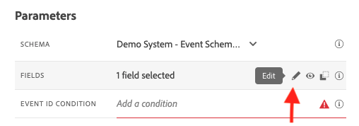

# 3.4.5建立商務活動歷程

前往[Adobe Experience Cloud](https://experience.adobe.com)登入Adobe Journey Optimizer。 按一下&#x200B;**Journey Optimizer**。


您將被重新導向到Journey Optimizer中的&#x200B;**首頁**&#x200B;檢視。 首先，確定您使用正確的沙箱。 要使用的沙箱稱為`--aepSandboxName--`。 然後您就會進入沙箱`--aepSandboxName--`的&#x200B;**首頁**&#x200B;檢視。


## 3.4.5.1建立業務活動

在左側功能表中，按一下&#x200B;**組態**。 按一下&#x200B;**事件**&#x200B;卡片內的&#x200B;**管理**&#x200B;按鈕。


業務事件是您可以在Journey Optimizer中建立的新型別事件。 不同於您在先前模組中建立的&#x200B;**單一**&#x200B;事件，業務事件不是由客戶觸發，而是由組織觸發。 您現在將建立業務活動。

按一下&#x200B;**建立事件**。


在「事件建立」表單中輸入下列值：

- **名稱**： `--aepUserLdap--ItemBackInStock`。 例如： **vangeluwItemBackInStock**
- **說明**：當產品重新補充庫存時，就會觸發此事件
- **型別**：在下拉式清單中選取&#x200B;**企業**


針對結構描述，選取&#x200B;**Demo System - JO商業事件的事件結構描述（全域v1.1） v.1**。 您現在需要在結構描述中選取使用案例所需的欄位。


請依照下列步驟操作：

按一下顯示已選取&#x200B;**1欄位**&#x200B;的欄位上的&#x200B;**鉛筆**&#x200B;圖示。



選取結構描述中所有可用的欄位，然後按一下[確定]。****


條件：您必須指定此結構描述中會觸發業務事件的記錄。

請依照下列步驟操作：

在顯示&#x200B;**新增條件**&#x200B;的欄位上按一下&#x200B;**鉛筆**&#x200B;圖示。


在左側，展開`--aepTenantId--`物件，展開物件&#x200B;**joBusinessEvents**，並將欄位&#x200B;**eventName**&#x200B;拖放到畫布上。


針對欄位&#x200B;**eventName**，輸入下列值： `--aepUserLdap--ItemBackInStock`。 例如： vangeluwItemBackInStock。
按一下**「確定」**。


按一下&#x200B;**「確定」**。


最後，您的事件建立表單應如下所示。 按一下[儲存]****&#x200B;以儲存您的商務活動。


## 3.4.5.2建立商務活動歷程

您現在可以善用此商業活動和歷程中的訊息。 移至&#x200B;**歷程**。 按一下&#x200B;**建立歷程**。


在右側，您會看到一個表格，您必須在該表格中指定歷程名稱和說明。 輸入下列值：

- **名稱**： `--aepUserLdap-- - Item back in stock journey`。 例如： vangeluw — 料號回到庫存歷程
- **說明**：當專案有庫存時，此歷程會傳送簡訊給感興趣的訪客。

按一下&#x200B;**「確定」**。


在左側功能表的&#x200B;**事件**&#x200B;下，搜尋您的LDAP。 您將會找到先前建立的商務活動`--aepUserLdap--ItemBackInStock`。 將此事件拖放至畫布上，因為這將是歷程的起點。


如您所見，**讀取對象**&#x200B;活動已自動新增至畫布。 這是因為業務事件只會傳送歷程的觸發程式來讀取特定對象，然後會擷取該歷程的設定檔清單。

按一下&#x200B;**讀取對象**活動。
**讀取對象**&#x200B;設定希望您選取要通知剛發生的業務事件的對象。 按一下&#x200B;**選取對象**&#x200B;欄位。


在&#x200B;**選擇對象**&#x200B;快顯視窗中，搜尋您的LDAP並選取您在[模組2.3 - Real-time CDP — 建立對象並執行名為`--aepUserLdap-- - Interest in Galaxy S24`的動作](./../../../modules/rtcdp-b2c/module2.3/real-time-cdp-build-a-segment-take-action.md)。 按一下&#x200B;**儲存**。


接著，按一下&#x200B;**確定**。


下一步是拖放我們要在此歷程中執行的動作。 選取動作&#x200B;**簡訊**，然後將其拖放到您剛新增的條件之後。


將&#x200B;**類別**&#x200B;設定為&#x200B;**行銷**，並選取可讓您傳送簡訊的簡訊介面。 在此情況下，要選取的電子郵件表面是&#x200B;**簡訊**。


下一步是建立訊息。 若要這麼做，請按一下[編輯內容]。****


您現在會看到訊息控制面板，讓您設定SMS文字。 按一下&#x200B;**撰寫訊息**&#x200B;區域以建立您的訊息。


輸入下列文字： `Hi {{profile.person.name.firstName}}, the Proteus Fitness Jackshirt is back in stock at Luma.`。 按一下&#x200B;**儲存**。


按一下左上角主旨列文字旁的&#x200B;**箭頭**，返回訊息儀表板。


您現在會看到已完成的SMS動作。 按一下&#x200B;**確定**。


您的歷程現在已準備好發佈。 按一下&#x200B;**Publish**。


再按一下&#x200B;**Publish**。


您的歷程現已發佈，您現在可以測試它！


## 3.4.5.3測試您的業務事件歷程

您現在會使用Postman針對&#x200B;**示範系統 — JO商業活動(Global v1.1) v.1**&#x200B;的事件結構描述擷取新事件，以模擬產品重新上架。

在左側功能表中，按一下&#x200B;**來源**，然後按一下&#x200B;**帳戶**&#x200B;索引標籤。


在&#x200B;**帳戶**&#x200B;標籤上，您會找到名為&#x200B;**Journey Optimizer商業事件**&#x200B;的帳戶。 按一下以開啟。


此帳戶只有一個資料流，請按一下資料流名稱以選取它。


按一下右側功能表中的&#x200B;**複製結構描述承載**。 此選項會將整個&#x200B;**curl**&#x200B;命令複製到剪貼簿，以便針對&#x200B;**示範系統 — JO商業事件(Global v1.1) v.1**&#x200B;的事件結構描述插入記錄。


在文字編輯器中貼上Curl指令


讓我們更仔細地瞭解一下此請求，

- POST要求會傳送至DCS入口ID
- 該請求會參考結構、資料集和組織ID。
- 最後，它包含xdmEntity節點，代表我們要在資料集內建立的資料。

您現在需要取代下列`xdmEntity`行……

```json
"xdmEntity": {
  "_experienceplatform": {
    "joBusinessEvents": {
      "eventDescription": "string",
      "eventName": "string",
      "stockEventId": "string"
    }
  },
  "_id": "/uri-reference",
  "eventType": "advertising.completes",
  "timestamp": "2018-11-12T20:20:39+00:00"
}
```

...透過此行，請務必驗證eventName欄位，如應顯示`--aepUserLdap--ItemBackInStock`，這代表您已在業務事件中指定以觸發歷程的條件。

```json
"xdmEntity": {
  "_experienceplatform": {
    "joBusinessEvents": {
      "eventDescription": "Product Proteus Fitness Jackshirt is back in stock",
      "eventName": "--aepUserLdap--ItemBackInStock",
      "stockEventId": "1"
    }
  },
  "_id": "/uri-reference",
  "eventType": "productBackInStock",
  "timestamp": "2021-04-19T15:25:39+00:00"
}
```

更新的&#x200B;**curl**&#x200B;命令應該如下所示：


選取所有內容，並將其複製到剪貼簿。

開啟Postman。 在Postman的左側，按一下&#x200B;**匯入**。


選取&#x200B;**原始文字**&#x200B;索引標籤，並貼上先前複製到這裡的命令。 按一下&#x200B;**繼續**。


按一下&#x200B;**匯入**。


Postman已自動將&#x200B;**curl**&#x200B;命令轉換為REST命令，可立即觸發，只需按下&#x200B;**傳送**&#x200B;按鈕，即可請求在資料集中建立該記錄。


確認已成功收到您的要求。 在郵遞員中尋找&#x200B;**200 OK**&#x200B;狀態。


簡訊可能需要幾分鐘才會送達您的行動電話。 如果不適用，您的&#x200B;**Proteus Fitness Jackshirt興趣**&#x200B;區段可能無法包含具有正確行動電話的設定檔。 若是如此，請前往Luma網站，造訪&#x200B;**Proteus Fitness Jackshirt**&#x200B;產品並註冊，同時確認您提供正確的行動電話號碼。


您現在已經完成此練習。

下一步： [摘要與優點](./summary.md)

[返回模組3.4](./journeyoptimizer.md)

[返回所有模組](../../../overview.md)
