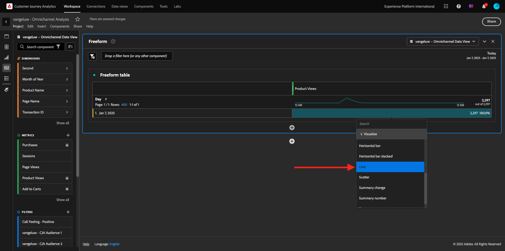
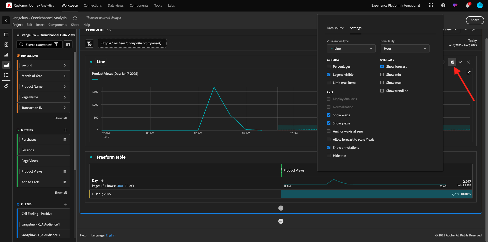
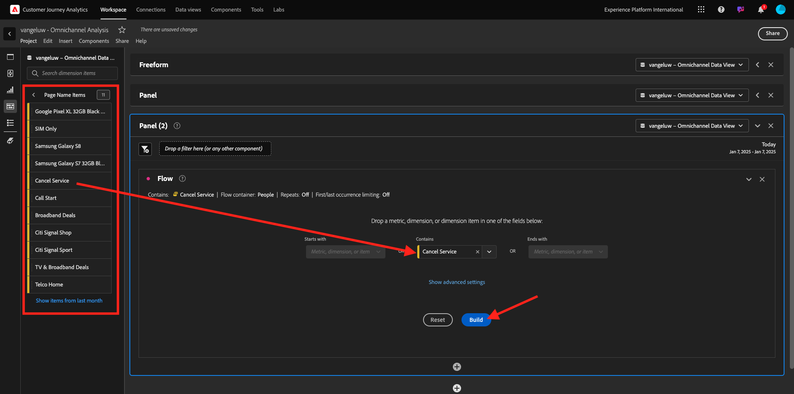

# 4.1.5使用Customer Journey Analytics的視覺效果

## 目標

- 瞭解Analysis Workspace UI
- 瞭解讓Analysis Workspace如此與眾不同的部分功能。
- 瞭解如何使用Analysis Workspace在CJA中分析

## 內容

在本練習中，您將使用CJA中的Analysis Workspace來分析產品檢視、產品漏斗、流失率等。

我們將說明在「模組7 — 查詢服務」中完成的一些查詢，讓您瞭解執行相同查詢及其他操作有多容易，但您不會使用SQL，並且僅依賴Analysis Workspace的拖放原則。

讓我們使用您在Analysis Workspace](./ex4.md)的[11.4資料準備中建立的專案，請移至[https://analytics.adobe.com](https://analytics.adobe.com)。

開啟您的專案`--aepUserLdap-- - Omnichannel Analysis`。

開啟專案並選取資料檢視`--aepUserLdap-- - Omnichannel Analysis`後，您就可以開始建立第一個視覺效果了。

## 我們每天檢視多少項產品

首先，我們需要選擇正確的日期來分析資料。 前往畫布右側的行事曆下拉式清單。 按一下日期範圍並選取適用的日期範圍。

在左側功能表（元件區域）中，尋找計算量度&#x200B;**產品檢視**。 將其選取並拖放至畫布中（位於自由表格右上方）。

會自動新增維度&#x200B;**Day**，以建立您的第一個資料表。 現在您可以立即看到問題已獲得解答。

接著，以滑鼠右鍵按一下量度摘要。

按一下「**視覺化**」，然後選取「**線條**」作為視覺化。

您將會看到每天的產品檢視次數。

您可以按一下視覺效果中的&#x200B;**設定**，逐日變更時間範圍。

按一下&#x200B;**行**&#x200B;旁的點以&#x200B;**管理資料Source**。

接著，按一下&#x200B;**鎖定選取專案**&#x200B;並選取&#x200B;**選取的專案**，以鎖定此視覺效果，使其一律顯示產品檢視的時間表。

## 已檢視的前5大產品

檢視的前5項產品為何？

別忘了偶爾儲存專案。

| 作業系統 | 捷徑 |
| ----------------- |-------------| 
| Windows | Control + S |
| Mac | Command + S |

讓我們開始找出檢視的前5大產品。 在左側功能表中，尋找&#x200B;**產品名稱** -Dimension。

現在拖放&#x200B;**產品名稱**&#x200B;以取代&#x200B;**Day**&#x200B;維度：

結果如下

接下來，嘗試依品牌名稱劃分其中一項產品。 搜尋&#x200B;**brandName**，並將其拖曳到第一個產品名稱下。

接下來，使用使用者代理程式進行劃分。 搜尋&#x200B;**使用者代理程式**，並將其拖曳至品牌名稱下。

然後您會看到以下內容：

最後，您可以新增更多視覺效果。 在左側的視覺效果下方，搜尋`Donut`。 拿著`Donut`，將其拖放到畫布上的&#x200B;**線條**&#x200B;視覺效果下。

接下來，在表格中，從我們在&#x200B;**Google Pixel XL 32GB黑色智慧型手機** > **花旗訊號**&#x200B;下進行的劃分中，選取前5個&#x200B;**使用者代理程式**&#x200B;列。 選取3列時，按住&#x200B;**CTRL**&#x200B;按鈕（在Windows上）或&#x200B;**Command**&#x200B;按鈕(在Mac上)。

您會看到環形圖已變更：

您甚至可以調整設計，讓&#x200B;**線條**&#x200B;圖形和&#x200B;**環圈圖**&#x200B;圖形稍微變小一點，使它們可以彼此相鄰，以便於閱讀：

按一下&#x200B;**環形圖**&#x200B;旁的點以&#x200B;**管理資料Source**。
接著，按一下**鎖定選取專案**&#x200B;以鎖定此視覺效果，使其一律顯示產品檢視的時間軸。

若要進一步瞭解使用Analysis Workspace的視覺效果，請前往這裡：

- [https://experienceleague.adobe.com/docs/analytics/analyze/analysis-workspace/visualizations/freeform-analysis-visualizations.html](https://experienceleague.adobe.com/docs/analytics/analyze/analysis-workspace/visualizations/freeform-analysis-visualizations.html)
- [https://experienceleague.adobe.com/docs/analytics/analyze/analysis-workspace/visualizations/t-sync-visualization.html](https://experienceleague.adobe.com/docs/analytics/analyze/analysis-workspace/visualizations/t-sync-visualization.html)

## 產品互動漏斗，從檢視到購買

有許多方法可解決此問題。 其中之一是使用「產品互動型別」，並在自由表格上使用。 另一種方式是使用&#x200B;**流失視覺效果**。 讓我們使用最後一個專案，因為我們要同時進行視覺化和分析。

按一下此處，關閉目前的面板：

現在按一下&#x200B;**+新增空白面板**，以新增空白面板。

按一下視覺效果&#x200B;**流失**。

選取與上一個練習相同的日期範圍。

您將會看到此訊息。

在左側的元件下尋找維度&#x200B;**事件型別**：

按一下箭頭以開啟維度：

您會看到所有可用的事件型別。

選取專案&#x200B;**commerce.productViews**，並將其拖放至&#x200B;**流失視覺效果**&#x200B;內的&#x200B;**新增接觸點**&#x200B;欄位。

對&#x200B;**commerce.productListAdds**&#x200B;和&#x200B;**commerce.purchases**&#x200B;執行相同的動作，並將它們拖放至&#x200B;**流失視覺效果**&#x200B;內的&#x200B;**新增接觸點**&#x200B;欄位。 您的視覺效果現在看起來會像這樣：

您可以在這裡進行許多工作。 部分範例：比較一段期間、依裝置比較每個步驟，或依忠誠度比較。 但是，如果我們想要分析有趣的事情，例如為什麼客戶在將專案新增到購物車之後不購買，我們可以使用CJA中的最佳工具：按一下右鍵。

在接觸點&#x200B;**commerce.productListAdds**&#x200B;上按一下滑鼠右鍵。 然後按一下此接觸點的&#x200B;**劃分流失**。

將會建立新的自由表格，以分析使用者未購買時的行為。

在新的自由表格中，依&#x200B;**頁面名稱**&#x200B;變更&#x200B;**事件型別**，以檢視其前往的頁面，而非「購買確認頁面」。

## 訪客在到達「取消服務」頁面前會在網站上做什麼？

同樣地，有許多方法可以執行此分析。 讓我們使用流量分析來啟動探索部分。

按一下此處關閉目前的面板：

現在按一下&#x200B;**+新增空白面板**，以新增空白面板。

按一下視覺效果&#x200B;**流量**。

然後您會看到以下內容：

選取與上一個練習相同的日期範圍。

在左側的元件下找出維度&#x200B;**頁面名稱**：

按一下箭頭以開啟維度：

您會找到所有已檢視的頁面。 尋找頁面名稱： **取消服務**。
將**取消服務**&#x200B;拖放到中間欄位的「流量視覺效果」中：

然後您會看到以下內容：

現在，讓我們分析瀏覽網站上&#x200B;**取消服務**&#x200B;頁面的客戶是否也呼叫了呼叫中心，以及結果如何。

在維度底下，返回，然後尋找&#x200B;**呼叫互動型別**。
拖放**呼叫互動型別**&#x200B;以取代&#x200B;**流量視覺效果**&#x200B;中右側的第一個互動。

您現在看到造訪&#x200B;**取消服務**&#x200B;頁面後致電客服中心的客戶的支援票證。

接著，在維度下方，搜尋&#x200B;**通話感覺**。  拖放以取代&#x200B;**流量視覺效果**&#x200B;中右側的第一個互動。

然後您會看到以下內容：

如您所見，我們已使用「流量視覺效果」執行了全通道分析。 多虧如此，我們發現似乎有些客戶在考慮取消其服務後，在致電呼叫中心後有了積極的感覺。 我們是否可能透過促銷活動改變他們的想法？

## 擁有正面呼叫中心聯絡人的客戶在針對主要KPI的表現如何？

讓我們先將資料分段，以僅取得有&#x200B;**正面**&#x200B;呼叫的使用者。 在CJA中，區段稱為篩選器。 前往元件區域（左側）中的篩選器，然後按一下&#x200B;**+**。

在篩選器產生器中，為篩選器命名

| 名稱 | 說明 |
| ----------------- |-------------| 
| 通話感覺 — 正面 | 通話感覺 — 正面 |

在元件（在篩選產生器內）下，尋找&#x200B;**呼叫感覺**&#x200B;並將其拖放到篩選產生器定義中。

現在選取&#x200B;**正值**&#x200B;作為篩選的值。

將範圍變更為&#x200B;**人員**&#x200B;層級。

若要完成，只要按一下[儲存]。****

然後您就會回到這裡。 如果尚未完成，請關閉上一個面板。

現在按一下&#x200B;**+新增空白面板**，以新增空白面板。

選取與上一個練習相同的日期範圍。

按一下&#x200B;**自由表格**。

現在請拖放您剛建立的篩選器。

新增部分量度的時間。 從&#x200B;**產品檢視**&#x200B;開始。 拖放至自由表格中。 您也可以刪除&#x200B;**事件**&#x200B;量度。

對&#x200B;**人員**、**加入購物車**&#x200B;和&#x200B;**購買**&#x200B;執行相同的動作。 您最後會得到一個這樣的表格。

有了第一個流量分析，我想到了一個新問題。 因此，我們決定建立此表格，並針對區段檢查某些KPI，以回答此問題。 如您所見，深入分析的時間比使用SQL或其他BI解決方案快得多。

## Customer Journey Analytics和Analysis Workspace回顧

如您在本實驗中瞭解的，Analysis Workspace會將來自所有頻道的資料拼接在一起，以分析完整的客戶歷程。 此外，請記住，您可以將資料帶入未連結至歷程的相同工作區。
將中斷連線的資料帶入您的分析，為歷程提供內容可能真的很實用。 某些範例包括NPS資料、調查、Facebook Ads事件或離線互動（未識別）。

下一步： [摘要與優點](./summary.md)

[返回模組4.1](./customer-journey-analytics-build-a-dashboard.md)

[返回所有模組](./../../../overview.md)
