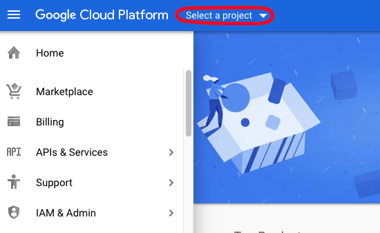
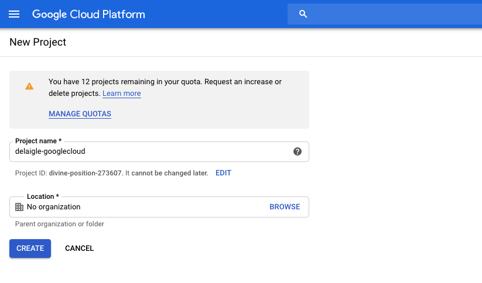
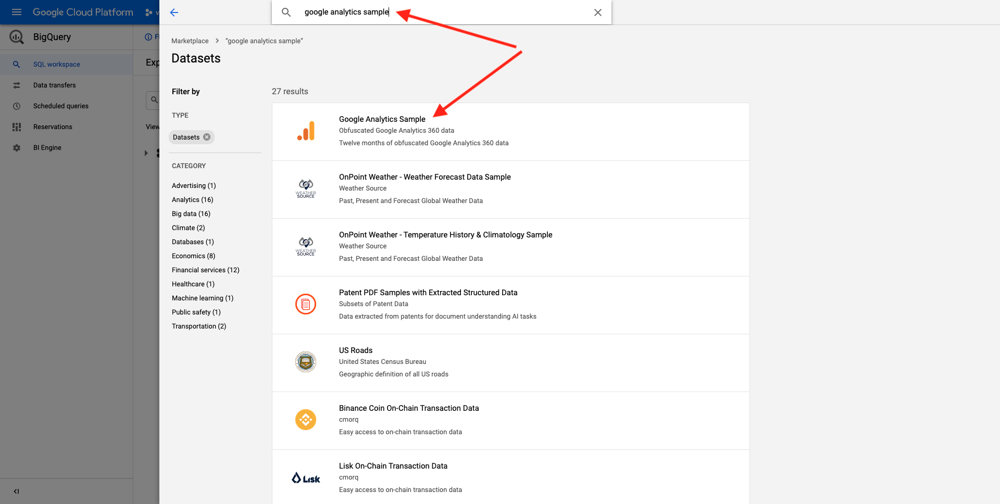

# 4.2.1建立您的Google Cloud Platform帳戶

## 目標

- 建立您的Google Cloud Platform帳戶
- 熟悉Google Cloud平台主控台
- 建立和準備您的BigQuery專案

## 4.2.1.1為何將Google BigQuery連線至Adobe Experience Platform以取得Google Analytics資料

Google雲端平台(GCP)是Google提供的一套公用雲端運算服務。 Google Cloud Platform包含在Google硬體上執行的一系列託管服務，用於運算、儲存和應用程式開發。

BigQuery是這些服務之一，並且一律包含在Google Analytics360中。 當我們嘗試直接從Google Analytics資料中取得資料時（例如API），系統便會經常對收集到的資料進行取樣。 這就是為什麼Google包含BigQuery來取得未取樣資料，讓品牌可以使用SQL進行進階分析，並從GCP的強大功能中獲益。

Google Analytics資料會每天使用批次機制載入BigQuery中。 因此，將此GCP/BigQuery整合用於即時個人化和啟動使用案例沒有任何意義。

如果品牌想要根據Google Analytics資料提供即時個人化使用案例，它可以使用Google Tag Manager在網站上收集該資料，然後將其即時串流到Adobe Experience Platform。

GCP/BigQuery Source Connector應該用於……

- 追蹤網站上的所有客戶行為，並在Adobe Experience Platform中載入這些資料，以利分析、資料科學和個人化使用案例，不需要即時啟用。
- 將Google Analytics歷史資料載入Adobe Experience Platform，再次用於分析和資料科學使用案例

## 4.2.1.2建立您的Google帳戶

若要取得Google Cloud Platform帳戶，您需要Google帳戶。

## 4.2.1.3啟動您的Google Cloud Platform帳戶

現在您已擁有Google帳戶，您可以建立Google Cloud平台環境。 若要這麼做，請前往[https://console.cloud.google.com/](https://console.cloud.google.com/)。

在下一頁，接受條款與條件。

接著，按一下&#x200B;**選取專案**。

按一下&#x200B;**新增專案**。

依照此命名慣例為專案命名：

| 慣例 | 範例 |
| ----------------- |-------------| 
| `--demoProfileLdap---googlecloud` | delaigle-googlecloud |

按一下&#x200B;**建立**。

等到熒幕右上方的通知告訴您建立已完成。 然後，按一下&#x200B;**檢視專案**。

接著，移至熒幕上方的搜尋列，並輸入&#x200B;**BigQuery**。 選取第一個結果。

接著，系統會將您重新導向至BigQuery主控台，而您會看到快顯訊息。

**按一下[完成]**。

此模組的目標是將Google Analytics資料匯入Adobe Experience Platform。 為此，我們首先需要Google Analytics資料集中的虛擬資料。

按一下左側功能表上的&#x200B;**新增資料**，然後按一下&#x200B;**探索公用資料集**。

然後您會看到此視窗：

在搜尋列中輸入搜尋字詞&#x200B;**Google Analytics範例**，然後選取第一個結果。

您會看到下列畫面，其中包含資料集的說明。 按一下&#x200B;**檢視資料集**。

接著，系統會將您重新導向至BigQuery，您會在&#x200B;**總管**&#x200B;下看到此&#x200B;**bigquery-public-data**&#x200B;資料集。

在&#x200B;**Explorer**&#x200B;中，您現在應該會看到一些表格。 歡迎探索這些內容。 移至`google_analytics_sample`。

按一下以開啟資料表`ga_sessions`。

在繼續進行下一個練習之前，請在您電腦上的個別文字檔中寫下下列內容：

| 認證 | 命名 | 範例 |
| ----------------- |-------------| -------------|
| 專案名稱 | `--demoProfileLdap---googlecloud` | vangeluw-googlecloud |
| 專案ID | random | composed-task-306413 |

按一下頂端功能表列中的您的&#x200B;**專案名稱**，即可找到您的專案名稱和專案識別碼：

您將在右側看到您的專案ID：

您現在可以移至練習12.2 ，查詢Google Analytics資料以弄髒自己的雙手。

下一步： [4.2.2在BigQuery](./ex2.md)中建立第一個查詢

[返回模組4.2](./customer-journey-analytics-bigquery-gcp.md)

[返回所有模組](./../../../overview.md)
