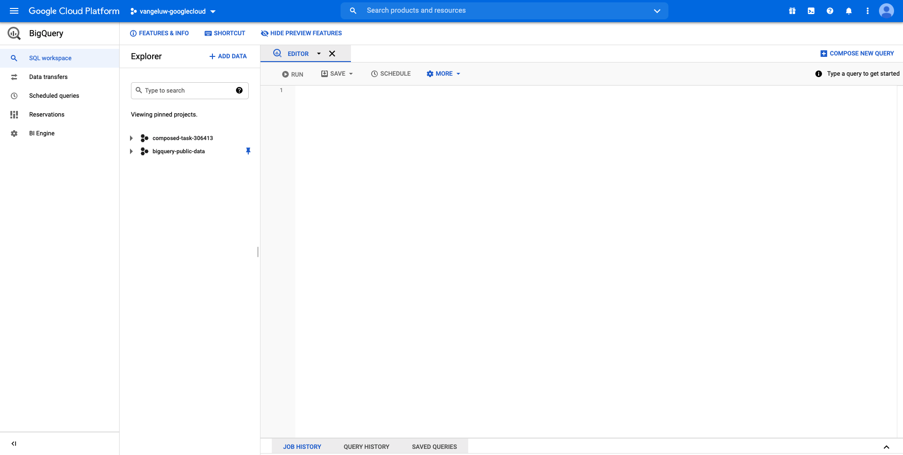
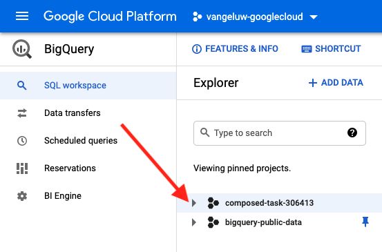
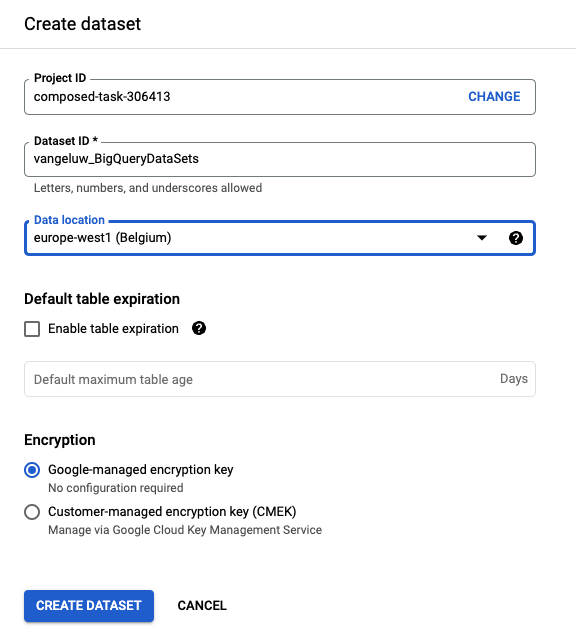
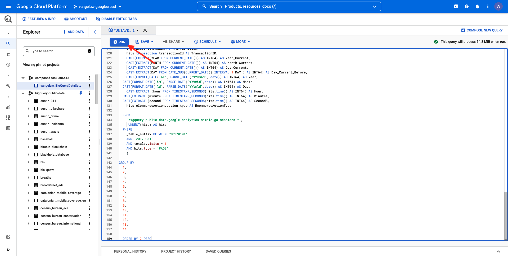

# 4.2.2在BigQuery中建立第一個查詢

## 目標

- 探索BigQuery UI
- 在BigQuery中建立SQL查詢
- 將SQL查詢的結果儲存在BigQuery內的資料集中

## 內容

當Google Analytics資料位於BigQuery時，維度、量度和其他變數全都是巢狀結構。 此外，Google Analytics資料每天都會載入到不同的表格中。 這表示嘗試在BigQuery內將Google Analytics表格直接連線到Adobe Experience Platform非常困難，而且不是好主意。

此問題的解決方案是將Google Analytics資料轉換為可讀取的格式，以便更輕鬆地將資料擷取到Adobe Experience Platform。

## 4.2.2.1建立資料集以儲存新的BigQuery表格

移至[BigQuery主控台](https://console.cloud.google.com/bigquery)。



在&#x200B;**Explorer**&#x200B;中，您會看到專案識別碼。 按一下您的專案識別碼（請勿按一下&#x200B;**bigquery-public-data**&#x200B;資料集）。



您可以看到還沒有資料集，所以現在就建立一個資料集吧。
按一下**建立資料集**。


在熒幕的右側，您會看到&#x200B;**建立資料集**&#x200B;功能表。


對於&#x200B;**資料集識別碼**，請使用下列命名慣例。 對於其他欄位，請保留預設設定。

| 命名 | 範例 |
| ----------------- | ------------- | 
| `--aepUserLdap--_BigQueryDataSets` | vangeluw_BigQueryDataSets |



接著，按一下&#x200B;**建立資料集**。


然後，您會回到建立資料集的BigQuery主控台。


## 4.2.2.2建立您的第一個SQL BigQuery

接下來，您將在BigQuery中建立第一個查詢。 此查詢的目標是取得Google Analytics範例資料並將其轉換，以便將其擷取至Adobe Experience Platform。 移至&#x200B;**編輯器**&#x200B;標籤。


請複製以下SQL查詢並將其貼到該查詢編輯器中。 歡迎閱讀查詢並瞭解Google AnalyticsBigQuery語法。


```sql
SELECT
  CONCAT(fullVisitorId, CAST(hitTime AS String), '-', hitNumber) AS _id,
  TIMESTAMP(DATETIME(Year_Current, Month_Current, Day_Current, Hour, Minutes, Seconds)) AS timeStamp,
  fullVisitorId as GA_ID,
  -- Fake CUSTOMER ID
  CONCAT('3E-D4-',fullVisitorId, '-1W-93F' ) as customerID,
  Page,
  Landing_Page,
  Exit_Page,
  Device,
  Browser,
  MarketingChannel,
  TrafficSource,
  TrafficMedium,
  -- Enhanced Ecommerce
  TransactionID,
  CASE
      WHEN EcommerceActionType = '2' THEN 'Product_Detail_Views'
      WHEN EcommerceActionType = '3' THEN 'Adds_To_Cart'
      WHEN EcommerceActionType = '4' THEN 'Product_Removes_From_Cart'
      WHEN EcommerceActionType = '5' THEN 'Product_Checkouts'
      WHEN EcommerceActionType = '6' THEN 'Product_Refunds'
    ELSE
    NULL
  END
     AS Ecommerce_Action_Type,
  -- Entrances (metric)
  SUM(CASE
      WHEN isEntrance = TRUE THEN 1
    ELSE
    0
  END
    ) AS Entries,
    
--Pageviews (metric)
    COUNT(*) AS Pageviews,
    
 -- Exits 
    SUM(
    IF
      (isExit IS NOT NULL,
        1,
        0)) AS Exits,
        
 --Bounces
   SUM(CASE
      WHEN isExit = TRUE AND isEntrance = TRUE THEN 1
    ELSE
    0
  END
    ) AS Bounces,
        
  -- Unique Purchases (metric)
  COUNT(DISTINCT TransactionID) AS Unique_Purchases,
  -- Product Detail Views (metric)
  COUNT(CASE
      WHEN EcommerceActionType = '2' THEN fullVisitorId
    ELSE
    NULL
  END
    ) AS Product_Detail_Views,
  -- Product Adds To Cart (metric)
  COUNT(CASE
      WHEN EcommerceActionType = '3' THEN fullVisitorId
    ELSE
    NULL
  END
    ) AS Adds_To_Cart,
  -- Product Removes From Cart (metric)
  COUNT(CASE
      WHEN EcommerceActionType = '4' THEN fullVisitorId
    ELSE
    NULL
  END
    ) AS Product_Removes_From_Cart,
  -- Product Checkouts (metric)
  COUNT(CASE
      WHEN EcommerceActionType = '5' THEN fullVisitorId
    ELSE
    NULL
  END
    ) AS Product_Checkouts,
  -- Product Refunds (metric)
  COUNT(CASE
      WHEN EcommerceActionType = '7' THEN fullVisitorId
    ELSE
    NULL
  END
    ) AS Product_Refunds
  FROM (
  SELECT
    -- Landing Page (dimension)
    CASE
      WHEN hits.isEntrance = TRUE THEN hits.page.pageTitle
    ELSE NULL
  END
    AS Landing_page,
    
        -- Exit Page (dimension)
    CASE
      WHEN hits.isExit = TRUE THEN hits.page.pageTitle
    ELSE
    NULL
  END
    AS Exit_page,
    
    hits.page.pageTitle AS Page,
    hits.isEntrance,
    hits.isExit,
    hits.hitNumber as hitNumber,
    hits.time as hitTime,
    date as Fecha,
    fullVisitorId,
    visitStartTime,
    device.deviceCategory AS Device,
    device.browser AS Browser,
    channelGrouping AS MarketingChannel,
    trafficSource.source AS TrafficSource,
    trafficSource.medium AS TrafficMedium,
    hits.transaction.transactionId AS TransactionID,
    CAST(EXTRACT(YEAR FROM CURRENT_DATE()) AS INT64) AS Year_Current,
    CAST(EXTRACT(MONTH FROM CURRENT_DATE()) AS INT64) AS Month_Current,
     CAST(EXTRACT(DAY FROM CURRENT_DATE()) AS INT64) AS Day_Current,
    CAST(EXTRACT(DAY FROM DATE_SUB(CURRENT_DATE(),INTERVAL 1 DAY)) AS INT64) AS Day_Current_Before,
    CAST(FORMAT_DATE('%Y', PARSE_DATE("%Y%m%d", date)) AS INT64) AS Year,
  CAST(FORMAT_DATE('%m', PARSE_DATE("%Y%m%d",date)) AS INT64) AS Month,
  CAST(FORMAT_DATE('%d', PARSE_DATE("%Y%m%d",date)) AS INT64) AS Day,
    CAST(EXTRACT (hour FROM TIMESTAMP_SECONDS(hits.time)) AS INT64) AS Hour,
  CAST(EXTRACT (minute FROM TIMESTAMP_SECONDS(hits.time)) AS INT64) AS Minutes,
  CAST(EXTRACT (second FROM TIMESTAMP_SECONDS(hits.time)) AS INT64) AS SecondS,
    hits.eCommerceAction.action_type AS EcommerceActionType
  
  FROM
    `bigquery-public-data.google_analytics_sample.ga_sessions_*`,
     UNNEST(hits) AS hits
  WHERE
    _table_suffix BETWEEN '20170101'
    AND '20170331'
    AND totals.visits = 1
    AND hits.type = 'PAGE'
    )
    
GROUP BY
  1,
  2,
  3,
  4,
  5,
  6,
  7,
  8,
  9,
  10,
  11,
  12,
  13,
  14
    
  ORDER BY 2 DESC
```

準備就緒後，按一下&#x200B;**執行**&#x200B;以執行查詢：



執行查詢可能需要幾分鐘的時間。

查詢執行完成後，您會在&#x200B;**查詢結果**&#x200B;中看到以下輸出。


## 4.2.2.3儲存BigQuery SQL查詢的結果

下一步是按一下&#x200B;**儲存結果**&#x200B;按鈕，以儲存查詢的輸出。


作為輸出的位置，請選取&#x200B;**BigQuery資料表**。


然後您會看到新的快顯視窗，其中已預先填入您的&#x200B;**專案名稱**&#x200B;和&#x200B;**資料集名稱**。 資料集名稱應該是您在本練習開始時建立的資料集，並採用以下命名慣例：

| 命名 | 範例 |
| ----------------- | ------------- | 
| `--aepUserLdap--_BigQueryDataSets` | `vangeluw_BigQueryDataSets` |

您現在需要輸入表格名稱。 請使用此命名慣例：

| 命名 | 範例 |
| ----------------- |------------- | 
| `--aepUserLdap--_GAdataTableBigQuery` | `vangeluw_GAdataTableBigQuery` |


按一下&#x200B;**儲存**。

在您建立的表格中，資料準備就緒可能需要一些時間。 幾分鐘後，請重新整理瀏覽器。 然後，您應該會在資料集中看到BigQuery專案內&#x200B;**總管**&#x200B;下的`--aepUserLdap--_GAdataTableBigquery`表格。


您現在可以繼續進行下一個練習，您將此表連線到Adobe Experience Platform。

下一步： [4.2.3將GCP &amp; BigQuery連線至Adobe Experience Platform](./ex3.md)

[返回模組4.2](./customer-journey-analytics-bigquery-gcp.md)

[返回所有模組](./../../../overview.md)
