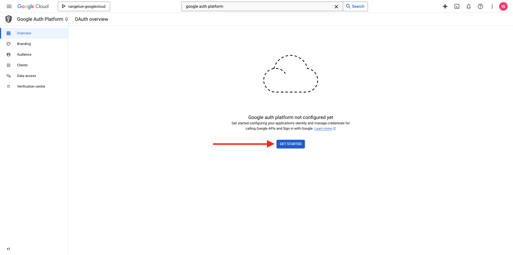
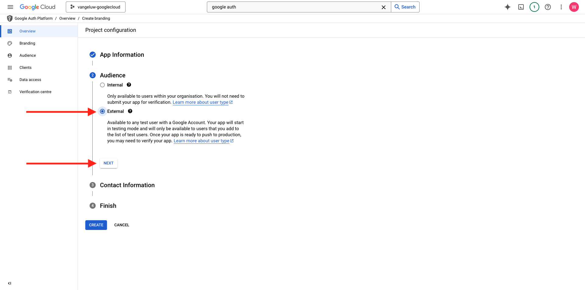
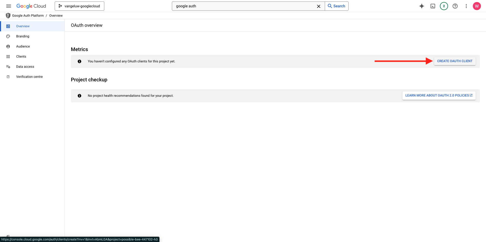
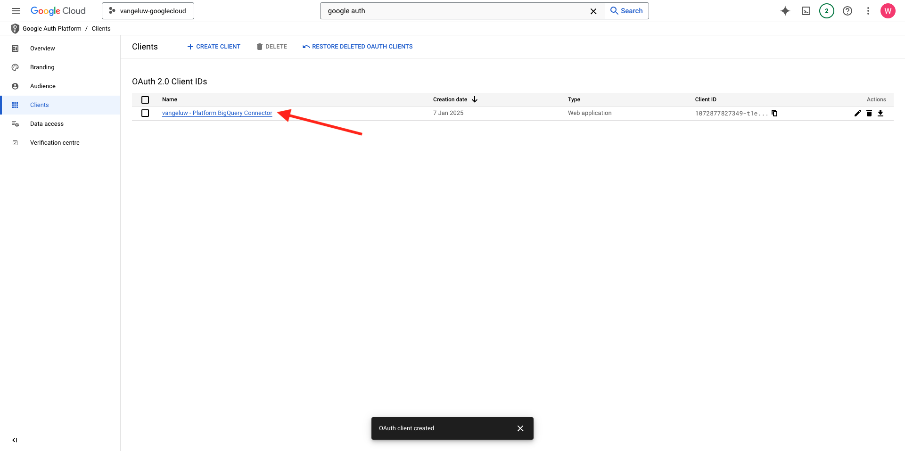
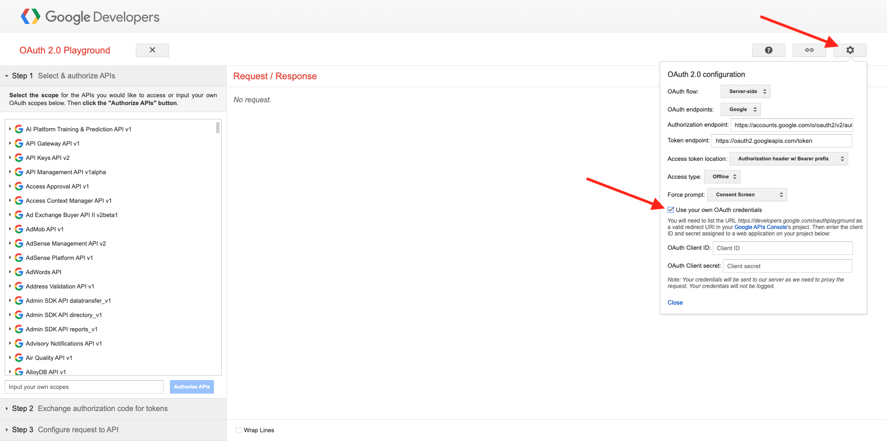
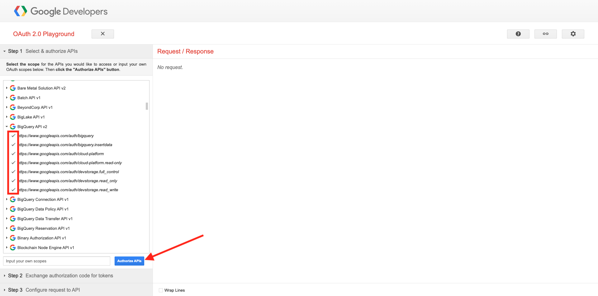
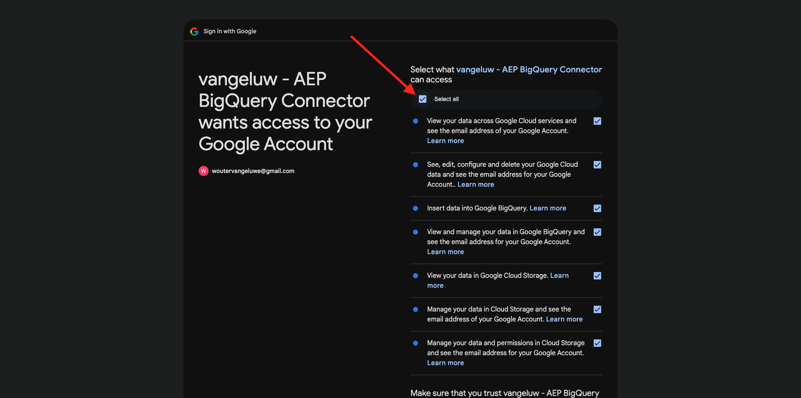

# 4.2.3將GCP和BigQuery連線至Adobe Experience Platform

## 目標

- 探索Google Cloud平台中的API與服務
- 熟悉OAuth Playground以測試Google API
- 在Adobe Experience Platform中建立您的第一個BigQuery連線

## 內容

Adobe Experience Platform在&#x200B;**來源**&#x200B;中提供聯結器，可協助您將BigQuery資料集匯入Adobe Experience Platform。 此資料聯結器以Google BigQuery API為基礎。 因此，請務必正確準備Google雲端平台和BigQuery環境，以接收來自Adobe Experience Platform的API呼叫。

若要在Adobe Experience Platform中設定BigQuery Source Connector，您需要下列4個值：

- 專案
- clientId
- 使用者端密碼
- refreshToken

到目前為止，您只有第一個，**專案識別碼**。 此&#x200B;**專案ID**&#x200B;值是Google在您於練習12.1中建立BigQuery專案時產生的隨機ID。

請以分隔的文字檔複製專案ID。

| 認證 | 命名 | 範例 |
| ----------------- |-------------| -------------|
| 專案ID | random | possible-bee-447102-h3 |

您可以隨時按一下頂端功能表列中的您的&#x200B;**專案名稱**，以檢查您的專案識別碼：

您會在右側看到專案ID：

在本練習中，您將瞭解如何取得其他3個必填欄位：

- clientId
- 使用者端密碼
- refreshToken

## 4.2.3.1 Google驗證平台

若要開始使用，請返回Google Cloud Platform首頁。 若要這麼做，只要按一下熒幕左上角的標誌即可。

進入首頁後，在搜尋列中搜尋&#x200B;**Google驗證平台**。 按一下第一個結果以開啟它。

您現在會看到&#x200B;**Google驗證平台**&#x200B;首頁。 按一下&#x200B;**已啟動GET**。

對於&#x200B;**應用程式名稱**，請使用這個名稱：

| 命名 | 範例 |
| ----------------- |-------------| 
| `--aepUserLdap-- - AEP BigQuery Connector` | vangeluw - AEP BigQuery聯結器 |

選取欄位&#x200B;**使用者支援電子郵件**&#x200B;的電子郵件地址。

按一下&#x200B;**下一步**。

選取&#x200B;**外部**&#x200B;並按一下&#x200B;**下一步**。

輸入您的電子郵件地址，然後按一下&#x200B;**下一步**。

核取核取方塊，然後按一下&#x200B;**繼續**。 然後，按一下&#x200B;**建立**。

## 4.2.3.2建立OAuth使用者端

按一下&#x200B;**建立OAUTH使用者端**。

您將會看到此訊息。

選取&#x200B;**網頁應用程式**。

將會顯示數個新欄位。 您現在需要輸入OAuth使用者端ID的&#x200B;**名稱**，並輸入&#x200B;**授權的重新導向URI**。

若要查詢欄位&#x200B;**名稱**，請使用此專案：

| 欄位 | 值 | 範例 |
| ----------------- |-------------| -------------| 
| 名稱 | ldap - AEP BigQuery聯結器 | vangeluw - Platform BigQuery Connector |

按一下&#x200B;**授權的重新導向URI**&#x200B;下的&#x200B;**+新增URI**。 新增以下新URI。

| 欄位 | 值 |
| ----------------- |-------------| 
| 授權的重新導向URI | https://developers.google.com/oauthplayground |

**已授權重新導向URI**&#x200B;欄位是非常重要的欄位，因為您稍後需要它來取得完成Adobe Experience Platform中BigQuery Source聯結器設定所需的RefreshToken。

按一下&#x200B;**建立**。

現在已建立您的OAuth使用者端ID。 按一下以立即檢視您的使用者端ID和使用者端密碼。

然後您會看到使用者端ID和使用者端密碼的值。

請複製這兩個欄位，然後貼到您案頭上的文字檔中。 您之後一律可以存取這些認證，但如果您將它們儲存在BigQuery專案ID旁邊的文字檔案中，會更輕鬆。

回顧Adobe Experience Platform中的BigQuery Source Connector設定，您現在已有這些可用值：

| BigQuery聯結器認證 | 值 |
| ----------------- |-------------| 
| 專案ID | 您自己的專案ID (例如： possible-bee-447102-h3) |
| clientid | yourclientid |
| cilentsecret | yourclientsecret |

接下來，您需要發佈您的OAuth應用程式。 移至&#x200B;**對象**&#x200B;並按一下&#x200B;**PUBLISH應用程式**。

按一下&#x200B;**確認**。

您仍然遺失&#x200B;**refreshToken**。 基於安全性理由，需要refreshToken。 在API領域，代號通常每24小時過期一次。 因此，每隔24小時需要重新整理安全性權杖一次&#x200B;**refreshToken**，您的Source聯結器安裝程式才能繼續連線至Google Cloud Platform和BigQuery。

## 4.2.3.3 BigQuery API和refreshToken

要取得refreshToken以存取Google Cloud平台API，有許多方式。 例如，其中一個選項是使用Postman。
不過，Google已建置一些更容易測試和使用API的工具，稱為&#x200B;**OAuth 2.0 Playground**。

若要存取&#x200B;**OAuth 2.0遊樂場**，請前往[https://developers.google.com/oauthplayground](https://developers.google.com/oauthplayground)。

然後您會看到&#x200B;**OAuth 2.0遊樂場**&#x200B;首頁。

按一下熒幕右上角的&#x200B;**齒輪**&#x200B;圖示。 請確定您的設定與上圖中顯示的設定相同。

核取核取方塊： **使用您自己的OAuth認證**

將顯示兩個欄位。

請填寫此表格之後的欄位：

| 遊樂場API設定 | 您的Google API認證 |
| ----------------- |-------------| 
| OAuth使用者端ID | 您自己的使用者端ID （在案頭上的文字檔案中） |
| OAuth使用者端密碼 | 您自己的使用者端密碼（在案頭上的文字檔案中） |

填寫認證之後，請按一下&#x200B;**關閉**。

在左側功能表中，您可以看到所有可用的Google API。 搜尋&#x200B;**BigQuery API v2**&#x200B;並按一下以開啟它。

接著，選取下圖所示的範圍。 您需要按一下每個可用的API，並且將為每個選定的API顯示核取標籤。

接著，按一下&#x200B;**授權API**。

按一下您用來設定GCP和BigQuery的電子郵件地址。

之後您會看到嚴重警告： **此應用程式未驗證**。 這是因為您的Platform BigQuery聯結器尚未經過正式稽核，因此Google不知道它是否為真實的應用程式。

按一下&#x200B;**進階**。

接著，按一下&#x200B;**移至 — aepUserLdap— AEP BigQuery聯結器（不安全）**。

之後，您將會看到存取許可權的安全性提示。 按一下&#x200B;**全選**。

向下捲動並按一下&#x200B;**繼續**。

您現在會回到OAuth 2.0遊樂場，就會看到這個畫面。 按一下&#x200B;**Exchange權杖**&#x200B;的授權碼。

幾秒後，**步驟2 - Exchange權杖**&#x200B;的授權代碼檢視會自動關閉，您將會看到&#x200B;**步驟3 — 設定對API的請求**。

您必須回到&#x200B;**步驟2 Exchange權杖授權碼**，再次按一下&#x200B;**步驟2 Exchange權杖授權碼**&#x200B;以視覺化&#x200B;**重新整理權杖**。

您現在會看到&#x200B;**重新整理Token**。

複製&#x200B;**重新整理Token**&#x200B;並將其貼到您案頭上的文字檔中，連同其他BigQuery Source聯結器認證：

| BigQuery Source聯結器憑證 | 值 |
| ----------------- |-------------| 
| 專案ID | 您自己的隨機專案ID (例如： apt-summer-273608) |
| clientid | yourclientid |
| cilentsecret | yourclientsecret |
| refreshtoken | yourrefreshtoken |

接下來，在Adobe Experience Platform中設定您的Source聯結器。

## 4.2.3.5 — 使用您自己的BigQuery表格連線Platform

前往此URL登入Adobe Experience Platform： [https://experience.adobe.com/platform](https://experience.adobe.com/platform)。

登入後，您會登入Adobe Experience Platform的首頁。

繼續之前，您必須選取&#x200B;**沙箱**。 要選取的沙箱名為``--aepSandboxName--``。 選取適當的沙箱後，您會看到畫面變更，現在您已進入專屬沙箱。

在左側選單中，前往來源。 然後您會看到&#x200B;**來源**&#x200B;首頁。 在&#x200B;**來源**&#x200B;功能表中，按一下&#x200B;**資料庫**。 按一下&#x200B;**Google BigQuery**&#x200B;卡片。 接著，按一下&#x200B;**設定**。

您現在應該建立新連線。

按一下&#x200B;**新增帳戶**。 您現在需要根據您在GCP和BigQuery中進行的設定，填寫以下所有欄位。

讓我們從命名連線開始：

請使用此命名慣例：

| BigQuery聯結器認證 | 值 | 範例 |
| ----------------- |-------------| -------------| 
| 帳戶名稱 | `--aepUserLdap-- - BigQuery Connection` | vangeluw - BigQuery Connection |
| 說明 | `--aepUserLdap-- - BigQuery Connection` | vangeluw - BigQuery Connection |

之後，您將會擁有此專案：

接下來，請填寫GCP和BigQuery API **帳戶驗證** — 您儲存在案頭文字檔中的詳細資料：

| BigQuery聯結器認證 | 值 |
| ----------------- |-------------| 
| 專案ID | 您自己的隨機專案ID (例如： possible-bee-447102-h3) |
| clientId | ... |
| 使用者端密碼 | ... |
| refreshToken | ... |

您的&#x200B;**帳戶驗證** — 詳細資訊現在看起來應該像這樣。 按一下&#x200B;**連線到來源**。

如果您的&#x200B;**帳戶驗證**&#x200B;詳細資料已正確填寫，您現在應該會看到&#x200B;**已連線**&#x200B;確認，以視覺方式確認連線是否正常運作。 按一下&#x200B;**下一步**。

您現在會看到在上一個練習建立的BigQuery資料集。

做得好！ 在下一個練習中，您將從該表格載入資料，並將其對應至Adobe Experience Platform中的結構描述和資料集。

下一步： [4.2.4從BigQuery載入資料到Adobe Experience Platform](./ex4.md)

[返回模組4.2](./customer-journey-analytics-bigquery-gcp.md)

[返回所有模組](./../../../overview.md)
