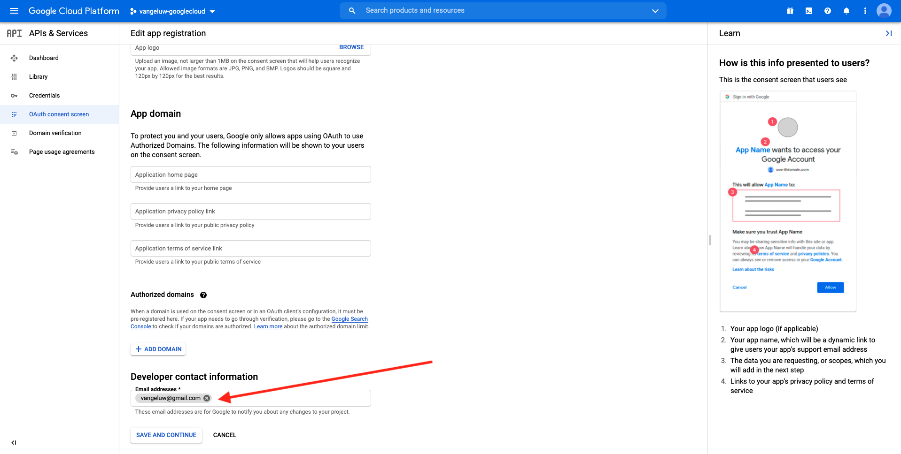
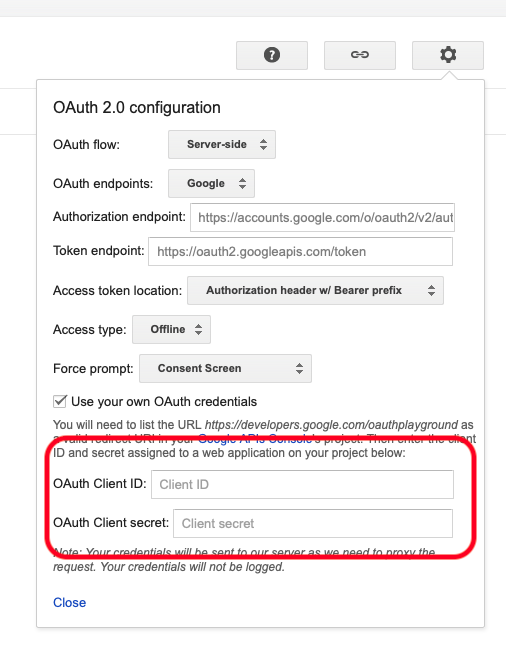
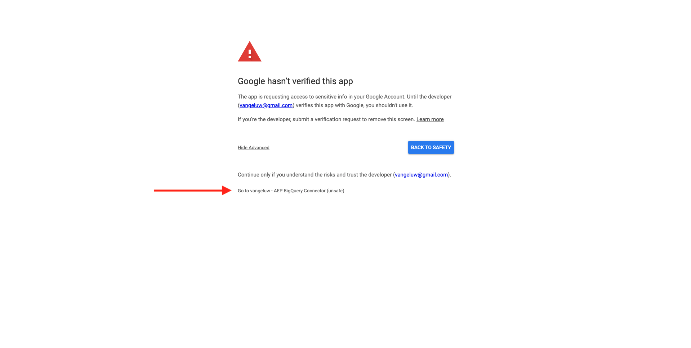
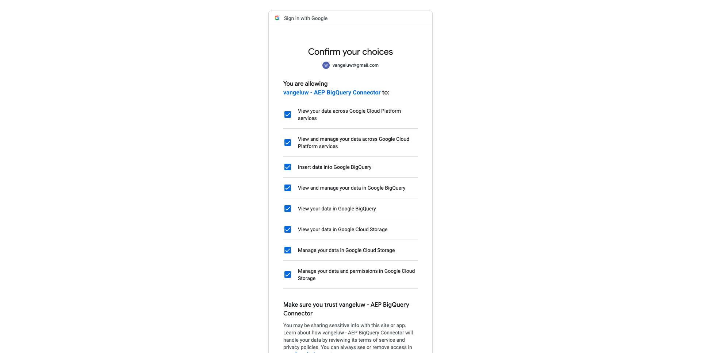
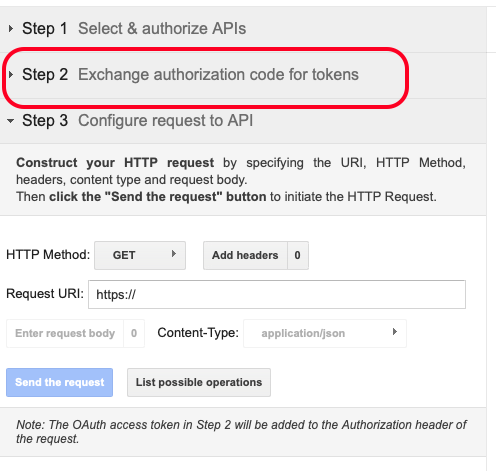

# 4.2.3將GCP和BigQuery連線至Adobe Experience Platform

## 目標

- 探索Google Cloud平台中的API與服務
- 熟悉OAuth Playground以測試Google API
- 在Adobe Experience Platform中建立您的第一個BigQuery連線

## 內容

Adobe Experience Platform在&#x200B;**來源**&#x200B;中提供聯結器，可協助您將BigQuery資料集匯入Adobe Experience Platform。 此資料聯結器以Google BigQuery API為基礎。 因此，請務必正確準備Google雲端平台和BigQuery環境，以接收來自Adobe Experience Platform的API呼叫。

若要在Adobe Experience Platform中設定BigQuery Source Connector，您需要下列4個值：

- 專案
- clientId
- 使用者端密碼
- refreshToken

到目前為止，您只有第一個，**專案識別碼**。 此&#x200B;**專案ID**&#x200B;值是Google在您於練習12.1中建立BigQuery專案時產生的隨機ID。

請以分隔的文字檔複製專案ID。

| 認證 | 命名 | 範例 |
| ----------------- |-------------| -------------|
| 專案ID | random | composed-task-306413 |

您可以隨時按一下頂端功能表列中的您的&#x200B;**專案名稱**，以檢查您的專案識別碼：

您會在右側看到專案ID：

在本練習中，您將瞭解如何取得其他3個必填欄位：

- clientId
- 使用者端密碼
- refreshToken

## 4.2.3.1 Google Cloud API與服務

若要開始使用，請返回Google Cloud Platform首頁。 若要這麼做，只要按一下熒幕左上角的標誌即可。

進入首頁後，請前往左側功能表並按一下&#x200B;**API與服務**，然後按一下&#x200B;**儀表板**。

您現在會看到&#x200B;**API與服務**&#x200B;首頁。

在此頁面中，您可以看到各種Google API連線的使用情形。 若要設定API連線，讓Adobe Experience Platform可以讀取BigQuery，您必須依照下列步驟進行：

- 首先，您需要建立OAuth同意畫面以啟用未來的驗證。 Google的安全性原因也要求人在允許程式化存取之前，進行首次驗證。
- 第二，您需要用於API驗證及存取您的BigQuery Connector的API認證（clientId和clientSecret）。

## 4.2.3.2 OAuth同意畫面

讓我們從建立OAuth同意畫面開始。 在&#x200B;**API與服務**&#x200B;首頁的左側功能表中，按一下&#x200B;**OAuth同意畫面**。

然後您會看到以下內容：

選取使用者型別： **外部**。 接著，按一下&#x200B;**建立**。

您之後會進入&#x200B;**OAuth同意畫面設定**&#x200B;視窗。

這裡唯一要做的就是在&#x200B;**應用程式名稱**&#x200B;欄位中輸入同意畫面名稱，並選取&#x200B;**使用者支援電子郵件**。 對於應用程式名稱，請使用此命名慣例：

| 命名 | 範例 |
| ----------------- |-------------| 
| `--aepUserLdap-- - AEP BigQuery Connector` | vangeluw - AEP BigQuery聯結器 |

接著，向下捲動直到您看到&#x200B;**開發人員聯絡資訊**&#x200B;並填寫電子郵件地址為止。

按一下&#x200B;**儲存並繼續**。

您將會看到此訊息。 按一下&#x200B;**儲存並繼續**。

您將會看到此訊息。 按一下&#x200B;**儲存並繼續**。

您將會看到此訊息。 按一下&#x200B;**返回儀表板**。

您將會看到此訊息。 按一下&#x200B;**PUBLISH應用程式**。

按一下&#x200B;**確認**。

您將會看到此訊息。

在下一步中，您將完成API設定並取得API認證。

## 4.2.3.3 Google API認證：使用者端密碼和使用者端ID

在左側功能表中，按一下&#x200B;**認證**。 然後您會看到以下內容：

按一下&#x200B;**+建立認證**&#x200B;按鈕。

您會看到3個選項。 按一下&#x200B;**OAuth使用者端識別碼**：

在下一個畫面中，選取&#x200B;**網頁應用程式**。

將會顯示數個新欄位。 您現在需要輸入OAuth使用者端ID的&#x200B;**名稱**，並輸入&#x200B;**授權的重新導向URI**。

請遵循此命名慣例：

| 欄位 | 值 | 範例 |
| ----------------- |-------------| -------------| 
| 名稱 | ldap - AEP BigQuery聯結器 | vangeluw - Platform BigQuery Connector |
| 授權的重新導向URI | https://developers.google.com/oauthplayground | https://developers.google.com/oauthplayground |

**已授權重新導向URI**&#x200B;欄位是非常重要的欄位，因為您稍後需要它來取得完成Adobe Experience Platform中BigQuery Source聯結器設定所需的RefreshToken。

在繼續之前，您必須先在輸入URL以儲存值到&#x200B;**授權的重新導向URI**&#x200B;欄位後，實際按下&#x200B;**Enter**&#x200B;按鈕。 如果您不按一下&#x200B;**Enter**&#x200B;按鈕，您稍後會在&#x200B;**OAuth 2.0遊樂場**&#x200B;中遇到問題。

接著，按一下&#x200B;**建立**：

您現在可以看到您的使用者端ID和使用者端密碼。

請複製這兩個欄位，然後貼到您案頭上的文字檔中。 您之後一律可以存取這些認證，但如果您將它們儲存在BigQuery專案ID旁邊的文字檔案中，會更輕鬆。

回顧Adobe Experience Platform中的BigQuery Source Connector設定，您現在已有這些可用值：

| BigQuery聯結器認證 | 值 |
| ----------------- |-------------| 
| 專案ID | 您自己的專案ID (例如：composed-task-306413) |
| clientid | yourclientid |
| cilentsecret | yourclientsecret |

您仍然遺失&#x200B;**refreshToken**。 基於安全性理由，需要refreshToken。 在API領域，代號通常每24小時過期一次。 因此，每隔24小時需要重新整理安全性權杖一次&#x200B;**refreshToken**，您的Source聯結器安裝程式才能繼續連線至Google Cloud Platform和BigQuery。

## 4.2.3.4 BigQuery API和refreshToken

要取得refreshToken以存取Google Cloud平台API，有許多方式。 例如，其中一個選項是使用Postman。
不過，Google已建置一些更容易測試和使用API的工具，稱為**OAuth 2.0 Playground**。

若要存取&#x200B;**OAuth 2.0遊樂場**，請前往[https://developers.google.com/oauthplayground](https://developers.google.com/oauthplayground)。

然後您會看到&#x200B;**OAuth 2.0遊樂場**&#x200B;首頁。

按一下熒幕右上角的&#x200B;**齒輪**&#x200B;圖示：

請確定您的設定與上圖中顯示的設定相同。

仔細檢查設定以確定100%確定。

完成後，請勾選&#x200B;**使用您自己的OAuth認證**&#x200B;方塊

應該會出現兩個欄位，而您已擁有它們的值。

請填寫此表格之後的欄位：

| 遊樂場API設定 | 您的Google API認證 |
| ----------------- |-------------| 
| OAuth使用者端ID | 您自己的使用者端ID （在案頭上的文字檔案中） |
| OAuth使用者端密碼 | 您自己的使用者端密碼（在案頭上的文字檔案中） |

從您在案頭上建立的文字檔複製&#x200B;**使用者端識別碼**&#x200B;和&#x200B;**使用者端密碼**。

填寫認證之後，請按一下&#x200B;**關閉**

在左側功能表中，您可以看到所有可用的Google API。 搜尋&#x200B;**BigQuery API v2**。

接著，選取下列影像所示的範圍：

選取它們後，您應該會看到顯示&#x200B;**授權API**&#x200B;的藍色按鈕。 按一下它。

選取您用來設定GCP和BigQuery的Google帳戶。

您可能會看到嚴重警告： **此應用程式未驗證**。 這是因為您的Platform BigQuery聯結器尚未經過正式稽核，因此Google不知道它是否為真實的應用程式。 您應該忽略此通知。

按一下&#x200B;**進階**。

接著，按一下&#x200B;**移至ldap - AEP BigQuery聯結器（不安全）**。

系統會將您重新導向至您建立的OAuth同意畫面。

如果您使用雙因素驗證(2FA)，請輸入傳送給您的驗證代碼。

Google現在會顯示八個不同的&#x200B;**許可權**&#x200B;提示。 針對所有八個許可權要求，按一下&#x200B;**允許**。 （這是一個必須由真人遵循並確認一次的程式，然後API才允許程式設計請求）

同樣，將不會顯示&#x200B;**八個不同的快顯視窗**，您必須針對所有快顯視窗按一下&#x200B;**允許**。

在八項許可權要求之後，您將會看到此概述。 按一下[允許&#x200B;****]完成程式。

在最後&#x200B;**允許**&#x200B;點按後，您將會被送回OAuth 2.0遊樂場，您將會看到以下內容：

按一下&#x200B;**Exchange權杖**&#x200B;的授權碼。

幾秒後，**步驟2 - Exchange權杖**&#x200B;的授權代碼檢視會自動關閉，您將會看到&#x200B;**步驟3 — 設定對API的請求**。

您必須回到&#x200B;**步驟2 Exchange權杖授權碼**，再次按一下&#x200B;**步驟2 Exchange權杖授權碼**&#x200B;以視覺化&#x200B;**重新整理權杖**。

您現在會看到&#x200B;**重新整理Token**。

複製&#x200B;**重新整理Token**&#x200B;並將其貼到您案頭上的文字檔中，連同其他BigQuery Source聯結器認證：

| BigQuery Source聯結器憑證 | 值 |
| ----------------- |-------------| 
| 專案ID | 您自己的隨機專案ID (例如： apt-summer-273608) |
| clientid | yourclientid |
| cilentsecret | yourclientsecret |
| refreshtoken | yourrefreshtoken |

接下來，在Adobe Experience Platform中設定您的Source聯結器。

## 4.2.3.5 — 使用您自己的BigQuery表格連線Platform

前往此URL登入Adobe Experience Platform： [https://experience.adobe.com/platform](https://experience.adobe.com/platform)。

登入後，您會登入Adobe Experience Platform的首頁。

繼續之前，您必須選取&#x200B;**沙箱**。 要選取的沙箱名為``--aepSandboxName--``。 選取適當的沙箱後，您會看到畫面變更，現在您已進入專屬沙箱。

在左側選單中，前往來源。 然後您會看到&#x200B;**來源**&#x200B;首頁。 在&#x200B;**來源**&#x200B;功能表中，按一下&#x200B;**資料庫**。 按一下&#x200B;**Google BigQuery**&#x200B;卡片。 接著，按一下&#x200B;**設定**&#x200B;或&#x200B;**+設定**。

您現在應該建立新連線。

按一下&#x200B;**新帳戶**。 您現在需要根據您在GCP和BigQuery中進行的設定，填寫以下所有欄位。

讓我們從命名連線開始：

請使用此命名慣例：

| BigQuery聯結器認證 | 值 | 範例 |
| ----------------- |-------------| -------------| 
| 帳戶名稱 | `--aepUserLdap-- - BigQuery Connection` | vangeluw - BigQuery Connection |
| 說明 | `--aepUserLdap-- - BigQuery Connection` | vangeluw - BigQuery Connection |

這應該會提供如下的內容：

接下來，請填寫GCP和BigQuery API **帳戶驗證** — 您儲存在案頭文字檔中的詳細資料：

| BigQuery聯結器認證 | 值 |
| ----------------- |-------------| 
| 專案ID | 您自己的隨機專案ID (例如： apt-summer-273608) |
| clientId | ... |
| 使用者端密碼 | ... |
| refreshToken | ... |

您的&#x200B;**帳戶驗證** — 詳細資訊現在看起來應該像這樣：

填寫完所有這些欄位後，按一下&#x200B;**連線到來源**。

如果您的&#x200B;**帳戶驗證**&#x200B;詳細資料已正確填寫，您現在應該會看到&#x200B;**已連線**&#x200B;確認，以視覺方式確認連線是否正常運作。

現在您的連線已建立，請按一下[下一步] ****：

您現在會看到在練習12.2中建立的BigQuery資料集。

做得好！ 在下一個練習中，您將從該表格載入資料，並將其對應至Adobe Experience Platform中的結構描述和資料集。

下一步： [4.2.4從BigQuery載入資料到Adobe Experience Platform](./ex4.md)

[返回模組4.2](./customer-journey-analytics-bigquery-gcp.md)

[返回所有模組](./../../../overview.md)
