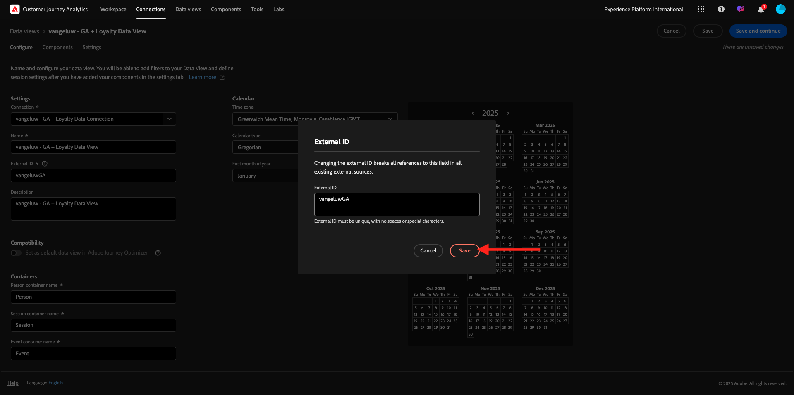
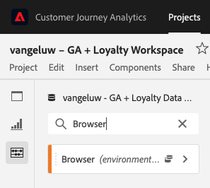
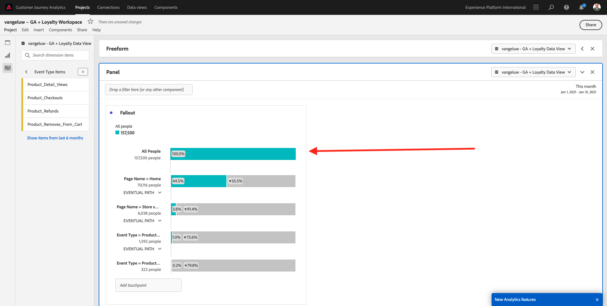
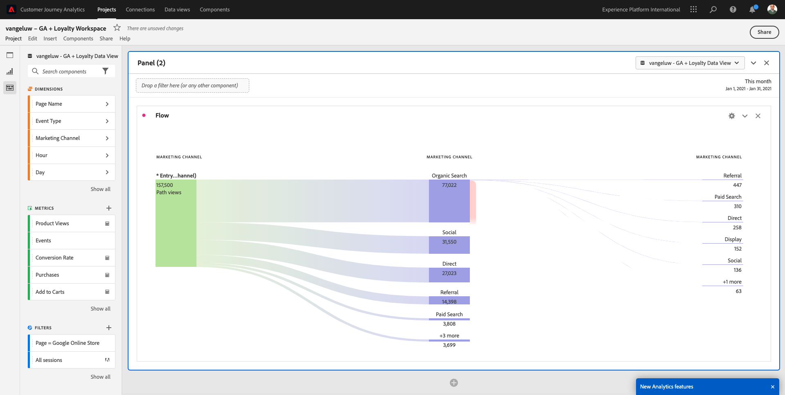

# 4.2.5使用Customer Journey Analytics分析Google Analytics資料

## 目標

- 將我們的BigQuery資料集連線至Customer Journey Analytics(CJA)
- 使用忠誠度資料連線並加入Google Analytics。
- 熟悉CJA UI

## 4.2.5.1建立連線

前往[analytics.adobe.com](https://analytics.adobe.com)存取Customer Journey Analytics。

在Customer Journey Analytics首頁上，移至&#x200B;**連線**。

在這裡，您可以看到CJA與Platform之間建立的所有不同連線。 這些連線與Adobe Analytics中的報表套裝有相同的目標。 不過，資料的收集是完全不同的。 所有資料都來自Adobe Experience Platform資料集。

按一下&#x200B;**建立新連線**。

然後您會看到&#x200B;**建立連線** UI。

對於名稱，請使用此： `--aepUserLdap-- - GA + Loyalty Data Connection`。

您需要選取要使用的正確沙箱。 在沙箱功能表中，選取您的沙箱，應為`--aepSandboxName--`。 在此範例中，要使用的沙箱是&#x200B;**技術內部人員**。

將&#x200B;**每日事件平均數量**&#x200B;設定為&#x200B;**小於100萬**。

在資料集功能表中，您現在可以開始新增資料集。 按一下&#x200B;**新增資料集**。

要新增的資料集包括：
- `Demo System - Profile Dataset for CRM (Global v1.1)`
- `Demo System - Event Dataset for BigQuery (Global v1.1)`

搜尋這兩個資料集，核取其核取方塊，然後按一下&#x200B;**下一步**。

然後您會看到以下內容：

針對資料集`Demo System - Event Dataset for BigQuery (Global v1.1)`，將&#x200B;**人員ID**&#x200B;變更為&#x200B;**忠誠度ID**，並將&#x200B;**資料來源型別**&#x200B;設定為&#x200B;**網頁資料**。 啟用&#x200B;**匯入所有新資料**&#x200B;和&#x200B;**回填所有現有資料**&#x200B;的兩個選項。

針對資料集`Demo System - Event Dataset for BigQuery (Global v1.1)`，確認&#x200B;**人員ID**&#x200B;已設定為&#x200B;**crmId**，並將&#x200B;**資料來源型別**&#x200B;設定為&#x200B;**網頁資料**。 啟用&#x200B;**匯入所有新資料**&#x200B;和&#x200B;**回填所有現有資料**&#x200B;的兩個選項。 按一下&#x200B;**新增資料集**。

到時您就會在這裡。 按一下&#x200B;**儲存**。

建立您的&#x200B;**連線**&#x200B;後，可能需要幾個小時才能在CJA中使用您的資料。

之後，您會在可用連線清單中看到您的連線。

## 4.2.5.2建立資料檢視

連線完成後，您現在可以逐漸影響視覺效果。 Adobe Analytics和CJA的區別在於CJA需要資料檢視，以便在視覺化之前清理和準備資料。

資料檢視類似於Adobe Analytics中虛擬報表套裝的概念，您可以在其中定義內容感知造訪定義、篩選以及元件的呼叫方式。

每個連線至少需要一個資料檢視。 不過，對於某些使用案例，針對相同的連線擁有多個資料檢視是很好的選擇，其目的是為不同的團隊提供不同的深入分析。

如果您希望公司成為資料導向型公司，您應該調整每個團隊中檢視資料的方式。 部分範例：

- 僅限UX設計團隊的UX量度
- 對Google Analytics的KPI和量度使用與Customer Journey Analytics相同的名稱，好讓數位分析團隊只能說1種語言。
- 資料檢視經過篩選，僅顯示1個市場、1個品牌或行動裝置的例項資料。

在&#x200B;**連線**&#x200B;畫面上，勾選您剛建立的連線前面的核取方塊。 按一下&#x200B;**建立資料檢視**。

您將會被重新導向至&#x200B;**建立資料檢視**&#x200B;工作流程。

您現在可以設定資料檢視的基本定義。 時區、工作階段逾時或資料檢視篩選等(區段部分類似於Adobe Analytics中的虛擬報表套裝)。

您在上一個練習中建立的&#x200B;**連線**&#x200B;已經選取。 您的連線名為`--aepUserLdap-- - GA + Loyalty Data Connection`。

接下來，依照此命名慣例為資料檢視命名： `--aepUserLdap-- - GA + Loyalty Data View`。

為描述輸入相同的值： `--aepUserLdap-- - GA + Loyalty Data View`。

在執行任何分析或視覺效果之前，我們需要建立資料檢視，其中包含所有欄位、維度和量度及其歸因設定。

| 欄位 | 命名慣例 |
| ----------------- |-------------|  
| 連線名稱 | `--aepUserLdap-- - GA + Loyalty Data View` | vangeluw - GA +忠誠度資料檢視 |
| 說明 | `--aepUserLdap-- - GA + Loyalty Data View` |
| 外部 ID | `--aepUserLdap--GA` |

按一下&#x200B;**儲存並繼續**。

按一下&#x200B;**儲存**。

您現在可以將元件新增至資料檢視。 如您所見，有些量度和維度會自動新增。

將下列元件新增至資料檢視。 也請務必將欄位名稱更新為好記名稱。 若要這麼做，請選取量度或維度，並更新右側功能表中的&#x200B;**元件名稱**&#x200B;欄位。

| 元件型別 | 元件原始名稱 | 顯示名稱 | 元件路徑 |
| -----------------| -----------------|-----------------|-----------------|
| 量度 | commerce.checkouts.value | 結帳次數 | `commerce.checkouts.value` |
| 量度 | commerce.productListRemovals.value | 購物車移除 | `commerce.productListRemovals.value` |
| 量度 | commerce.productListAdds | 購物車新增次數 | `commerce.productListAdds` |
| 量度 | commerce.productViews.value | 產品檢視 | `commerce.productViews.value` |
| 量度 | commerce.purchases.value | 購買次數 | `commerce.purchases.value` |
| 量度 | web.webPageDetails.pageViews | 頁面檢視 | `web.webPageDetails.pageViews` |
| 量度 | 點 | 熟客點數 | `_experienceplatform.loyaltyDetails.points` |
| 維度 | level | 熟客級別 | `_experienceplatform.loyaltyDetails.level` |
| 維度 | channel.mediaType | 流量Medium | `channel.mediaType` |
| 維度 | channel.typeAtSource | 流量來源 | `channel.typeAtSource` |
| 維度 | 追蹤程式碼 | 行銷管道 | `marketing.trackingCode` |
| 維度 | gaid | GOOGLE ANALYTICSID | `_experienceplatform.identification.core.gaid` |
| 維度 | web.webPageDetails.name | 頁面標題 | `web.webPageDetails.name` |
| 維度 | 供應商 | 瀏覽器 | `environment.browserDetails.vendor` |
| 維度 | 類型 | 裝置類型 | `device.type` |
| 維度 | loyaltyId | 熟客方案 ID | `_experienceplatform.identification.core.loyaltyId` |
| 維度 | commerce.order.payments.transactionID | 交易 ID | `commerce.order.payments.transactionID` |
| 維度 | eventType | 事件類型 | `eventType` |
| 維度 | 時間戳記 | 時間戳記 | `timestamp` |
| 維度 | `_id` | 識別碼 | `_id` |

之後，您將會看到類似以下的內容：

接下來，您必須變更&#x200B;**歸因或持續性設定**，以變更其中部分元件的人員和工作階段內容。

請變更下列元件的&#x200B;**歸因設定**：

| 元件 |
| -----------------|
| 流量來源 |
| 行銷管道 |
| 瀏覽器 |
| 流量Medium |
| 裝置類型 |
| GOOGLE ANALYTICSID |

若要這麼做，請選取元件，按一下&#x200B;**使用自訂歸因模型**，並將&#x200B;**模型**&#x200B;設定為&#x200B;**最近**，並將&#x200B;**有效期**&#x200B;設定為&#x200B;**人員報告期間**。 對上述所有元件重複此步驟。

在變更上述所有元件的歸因設定後，您應該就會擁有此檢視。 按一下&#x200B;**儲存並繼續**。

在&#x200B;**設定**&#x200B;畫面上，不需要變更。 按一下&#x200B;**儲存並完成**。

您現在已準備好在Adobe Analytics Analysis Workspace中分析Google Analytics資料。 讓我們移至下一個練習。

## 4.2.5.3建立專案

在Customer Journey Analytics中，移至&#x200B;**Workspace**。 按一下&#x200B;**建立專案**

選取&#x200B;**空白Workspace專案**&#x200B;並按一下&#x200B;**建立**。

您現在有一個空白專案：

首先，儲存專案並命名它。 您可以使用下列指令來儲存：

| 作業系統 | 捷徑 |
| ----------------- |-------------| 
| Windows | Control + S |
| Mac | Command + S |

您將會看到此快顯視窗。 請使用此命名慣例：

| 名稱 | 說明 |
| ----------------- |-------------| 
| `--aepUserLdap-- – GA + Loyalty Workspace` | `--aepUserLdap-- – GA + Loyalty Workspace` |

接著，按一下&#x200B;**儲存**。

接下來，請務必在熒幕右上角選取正確的資料檢視。 這是您在上一個練習中建立的資料檢視，其命名慣例為`--aepUserLdap-- - GA + Loyalty Data View`。

### 4.2.5.3.1自由格式表格

自由表格或多或少都可作為Excel中的樞紐分析表。 您從左側列選取某專案，然後將其拖放至自由格式，即可取得表格報表。

自由表格幾乎是無限的。 您可以執行任何操作（幾乎）且這與Google Analytics相比有太多價值（因為此工具有一些分析限制）。 這是將Google Analytics資料載入另一個分析工具的原因之一。

請看兩個您需要使用SQL、BigQuery和一段時間來回答無法在Google Analytics UI或Google Data Studio中進行的簡單問題的範例：

- 有多少人從依行銷管道分割的Safari瀏覽器到達結帳處？ 請參閱Safari瀏覽器正在篩選結帳量度。 我們剛才將Browser = Safari變數拖放至結帳欄上方。

- 身為分析師，我可以看到社交行銷管道的轉換率很低。 我使用「上次接觸」歸因作為預設值，但「首次接觸」呢？ 將滑鼠游標暫留在任何量度上，會顯示量度設定。 在那裡，我可以選取我想要的歸因模型。 您可以在GA中將「歸因」 （不在Data Studio中）當作獨立活動來執行，但同一表格中不能有其他與歸因分析無關的量度或維度。

讓我們在CJA中透過Analysis Workspace回答這些問題及更多問題。

首先，在面板右側選取正確的日期範圍(**Today**)。 CLick **套用**。

>[!NOTE]
>
>如果您剛才已建立&#x200B;**資料連線**&#x200B;和&#x200B;**資料檢視**，您可能需要等候幾個小時。 當有大量的資料記錄時，CJA需要一些時間來回填歷史資料。

拖放一些維度和量度以分析行銷管道。 首先使用維度&#x200B;**行銷管道**，並將其拖放至&#x200B;**自由格式表格**&#x200B;的畫布。 （按一下「**全部顯示**」，以防您在「量度」功能表中未立即看到量度）

然後您會看到以下內容：

接下來，您需要將量度新增至自由表格。 您應該新增這些量度： **人員**、**工作階段**、**產品檢視**、**結帳**、**購買**、**轉換率** （計算量度）。

您必須先建立計算量度&#x200B;**轉換率**，才能執行此作業。 若要這麼做，請按一下量度旁的&#x200B;**+**&#x200B;圖示：

作為計算量度的名稱，請使用&#x200B;**轉換率**&#x200B;並針對&#x200B;**外部識別碼**&#x200B;使用&#x200B;**轉換率**。 然後將量度&#x200B;**購買**&#x200B;和&#x200B;**工作階段**&#x200B;拖曳到畫布上。 將&#x200B;**Format**&#x200B;設為&#x200B;**Percent**&#x200B;並將&#x200B;**小數位數**&#x200B;設為&#x200B;**2**。 最後，按一下&#x200B;**儲存**。

按一下&#x200B;**儲存**。

接下來，若要在&#x200B;**自由格式表格**&#x200B;中使用所有這些量度，請逐一拖放至&#x200B;**自由格式表格**&#x200B;上。 請參閱下列範例。

您最後會得到一個這樣的表格：

如上所述，**自由表格**&#x200B;提供您執行深入分析所需的自由。 例如，您可以挑選任何其他Dimension來劃分表格內的特定「量度」。

例如，前往維度並搜尋，然後選取&#x200B;**瀏覽器**&#x200B;變數。

之後，您會看到此Dimension可用值的概觀。

選取Dimension **Safari**，並將其拖放到量度上，例如&#x200B;**結帳**。 然後您會看到以下內容：

這樣做時，您剛才回答了一個可能的問題：有多少人使用Safari （依行銷管道分割）進入結帳頁面？

現在來回答歸因問題。

在資料表中尋找&#x200B;**Purchase**&#x200B;量度。

將滑鼠停留在量度上，就會顯示&#x200B;**設定**&#x200B;圖示。 按一下它。

隨即顯示內容功能表。 勾選&#x200B;**非預設歸因模型**&#x200B;的核取方塊。

在顯示的快顯視窗中，您可以輕鬆變更歸因模型和回顧視窗（使用SQL要達到這一點相當複雜）。

選取&#x200B;**首次接觸**&#x200B;作為歸因模型。

選擇回顧期間的&#x200B;**人員**。

現在按一下&#x200B;**套用**。

您現在可以看到該特定量度的歸因模型現在是「首次接觸」。

您可以視需要進行任意多的劃分，沒有變數、區段、維度或日期範圍型別的限制。

更特殊的功能是從Adobe Experience Platform加入任何資料集，以豐富Google Analytics的數位行為資料。 例如離線、客服中心、忠誠度或CRM資料。

為了展示該功能，讓我們設定您結合離線資料與線上資料的第一次劃分。 挑選維度&#x200B;**忠誠度等級**，並將其拖放到任何&#x200B;**行銷管道**，例如&#x200B;**有機搜尋**：

接下來，讓我們分析使用具有&#x200B;**忠誠度等級** （即&#x200B;**銅級**）的&#x200B;**有機搜尋**&#x200B;來到網站的客戶，使用的是哪種&#x200B;**裝置型別**。 將Dimension **裝置型別**&#x200B;拖放至&#x200B;**Bronze**。 然後您會看到以下內容：

您可以看到在第一次劃分時會使用「忠誠度等級」。 此維度來自與您用於BigQuery聯結器不同的資料集和結構描述。 人員ID **loyaltyID** (示範系統 — BigQuery的事件結構描述（全域v1.1）)與&#x200B;**loyaltyID** (示範系統 — 忠誠度的設定檔結構描述（全域v1.1）)彼此相符。 因此，您可以結合Google Analytics的體驗事件與忠誠度綱要的設定檔資料。

我們可以不斷分割具有區段或特定日期範圍的列（也許是為了反映特定電視促銷活動），以詢問問題並Customer Journey Analytics並隨時獲得答案。

使用SQL取得相同的最終結果，然後使用協力廠商的視覺化工具是很困難的挑戰。 尤其是當您提出問題並嘗試即時取得答案時。 Customer Journey Analytics沒有這項挑戰，可讓資料分析人員靈活且即時查詢資料。

## 4.2.5.3.2漏斗或流失分析

漏斗是瞭解客戶歷程中主要步驟的絕佳機制。 這些步驟也可以來自離線互動（例如，來自客服中心），然後您可以將其與相同漏斗中的數位接觸點結合。

Customer Journey Analytics可讓您完成更多工作。 如果您還記得單元13，我們可以用滑鼠右鍵按一下，並執行下列動作：

- 分析使用者在流失步驟後前往何處
- 從漏斗的任何點建立區段
- 在折線圖視覺效果中檢視任何階段的趨勢

讓我們看看您可以做的另一件事：本月的Customer Journey Funnel和上個月比較如何？ 行動與桌上型電腦呢？

在下方，您將建立兩個面板：

- 漏斗分析（1月）
- 漏斗分析（2月）

您將看到我們正在比較依裝置型別分割的不同時段（一月和二月）的漏斗。

無法在Analysis UI中使用這類Google Analytics，或分析非常有限。 因此CJA會再次為Google Analytics所擷取的資料增加大量值。

建立您的第一個流失視覺效果。 請關閉目前的面板，以從新面板開始。

檢視面板的右側，然後按一下箭頭以將其關閉。

接著，按一下&#x200B;**+**&#x200B;以建立新面板。

現在選取&#x200B;**流失**&#x200B;視覺效果。

身為分析師，假設您想瞭解主要電子商務漏斗的狀況：首頁>內部搜尋>產品詳細資料>結帳>購買。

我們先來新增一些步驟至漏斗。 若要這麼做，請開啟&#x200B;**頁面名稱**&#x200B;維度。

接著，您就會看到所有已瀏覽過的可用頁面。

將&#x200B;**Home**&#x200B;拖放至第一個步驟。

作為第二個步驟，使用&#x200B;**存放區搜尋結果**

現在您需要新增一些電子商務動作。 在Dimension中，搜尋Dimension **事件型別**&#x200B;維度。 按一下以開啟尺寸。

選取&#x200B;**Product_Detail_Views**，然後將其拖放到下一個步驟。

選取&#x200B;**Product_Checkouts**，然後將其拖放到下一個步驟。

調整流失視覺效果大小。

您的流失視覺效果現已準備就緒。

若要開始分析和記錄深入分析，**文字**&#x200B;視覺效果永遠是好主意。 若要新增&#x200B;**文字**&#x200B;視覺效果，請按一下左側功能表中的&#x200B;**圖表**&#x200B;圖示，檢視所有可用的視覺效果。 然後將&#x200B;**文字**&#x200B;視覺效果拖放到畫布上。 調整大小並移動，使其看起來像下面的影像。

再次調整其大小以符合儀表板：

流失視覺效果也允許劃分。 使用&#x200B;**裝置型別**&#x200B;維度，方法是開啟該維度，並將部分值依序拖放到視覺效果上：

最後會產生更進階的視覺效果：

Customer Journey Analytics可讓您完成更多工作。 在流失中的任何位置按一下滑鼠右鍵，您可以……

- 分析使用者從流失步驟前往的位置
- 從漏斗的任何點建立區段
- 分析線條視覺效果中任何步驟的趨勢
- 以視覺方式比較任何漏斗與不同時段。

例如，在流失的任何步驟中按一下滑鼠右鍵，即可檢視其中的部分分析選項。

## 4.2.5.3.3流量分析和視覺化

如果您想要使用Google Analytics進行進階流量分析，則需要使用SQL來擷取資料，然後使用協力廠商解決方案來處理視覺效果部分。 Customer Journey Analytics會有所幫助。

在此步驟中，您將設定流量分析以回答以下問題：在特定登陸頁面之前，主要貢獻管道為何。  只要拖放兩下和按一下滑鼠，分析人員就能瞭解使用者最後兩次接觸行銷管道時，朝向登陸頁面的流程。

Customer Journey Analytics可協助您回答的其他問題：

- 特定登陸頁面之前的管道主要組合為何？
- 是什麼導致使用者在到達產品_Checkout時退出工作階段？ 前面的步驟為何？

讓我們從空白面板開始再次回答這些問題。 關閉目前的面板，然後按一下&#x200B;**+**。

現在選取&#x200B;**流量**&#x200B;視覺效果。

現在來設定多路徑行銷管道流量分析。 將&#x200B;**行銷管道**&#x200B;維度拖放至&#x200B;**登入Dimension**&#x200B;區域。

您現在可以看到第一個進入路徑：

按一下第一個路徑，向下展開該路徑。

您現在可以看到下一個路徑（行銷管道）。

讓我們進行第三次深入研究。 按一下新路徑中的第一個選項&#x200B;**轉介**。

現在您應該會看到如下的視覺效果：

讓事情更複雜一些。 想像您要分析兩個行銷路徑後的登陸頁面是什麼嗎？ 若要這麼做，您可以使用次要維度來變更最後一個路徑。 找到&#x200B;**頁面名稱**&#x200B;維度，並像這樣拖放：

您現在會看到以下內容：

讓我們再來一次流量分析。 這次您將分析特定退出點後所發生的情況。 其他Analytics解決方案需要使用SQL/ETL以及第三方視覺化工具來達成相同目標。

將新的&#x200B;**流量視覺效果**&#x200B;帶入面板。

之後，您將會擁有此專案：

尋找Dimension **事件型別**，並將其拖放至&#x200B;**退出維度**&#x200B;區域。

現在您可以檢視哪些&#x200B;**事件型別** — 路徑將客戶帶往退出。

讓我們調查退出結帳動作前所發生的情況。 按一下&#x200B;**Product_Checkout**&#x200B;路徑：

會出現新的動作路徑，其中包含部分見解不佳的資料。

讓我們進一步分析！ 搜尋Dimension **頁面名稱**，並將其拖放到新產生的路徑。

您現在可在數分鐘內完成進階流量分析。 您可以按一下不同的路徑，以檢視它們如何從退出點連線到前面的步驟。

您現在擁有功能強大的套件，可分析漏斗並探索數位及離線接觸點之間的客戶行為路徑。

別忘了儲存您的變更！

## 4.2.5.4共用專案

>[!IMPORTANT]
>
>以下內容僅供參考 — 您&#x200B;**不需要**&#x200B;與任何人共用您的專案。

僅供參考 — 您可以與同事共用此專案，以進行共同作業或一起分析業務問題。

下一步： [摘要與優點](./summary.md)

[返回模組4.2](./customer-journey-analytics-bigquery-gcp.md)

[返回所有模組](./../../../overview.md)
