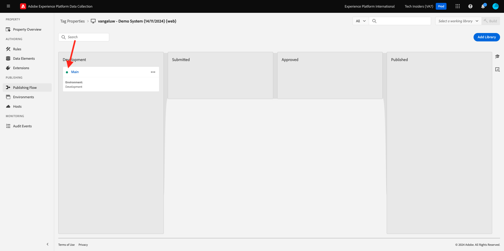

# 1.1.3 Adobe Experience Platform資料彙集簡介

## 內容

現在，讓我們更深入瞭解Adobe Experience Platform資料收集的建置區塊，以瞭解示範網站上所安裝的專案。 您將會更進一步瞭解Adobe Experience Platform Web SDK擴充功能、設定資料元素和規則，以及瞭解如何發佈程式庫。

## Adobe Experience Platform Web SDK標籤擴充功能

標籤擴充功能是一組封裝程式碼，可擴充Adobe Experience Platform資料收集介面和程式庫功能。 Adobe Experience Platform Data Collection是平台，而標籤擴充功能就像在平台上執行的應用程式。 教學課程中使用的所有擴充功能皆由Adobe建立和管理，但第三方可以建立自己的擴充功能，以限制Adobe Experience Platform資料收集使用者必須管理的自訂程式碼數量。

移至[Adobe Experience Platform資料彙集](https://experience.adobe.com/launch/)並選取&#x200B;**標籤**。

這是您之前看到的Adobe Experience Platform資料收集屬性頁面。

在&#x200B;**快速入門**&#x200B;中，示範系統為您建立了兩個使用者端屬性：一個用於網站，一個用於行動應用程式。 在&#x200B;**[!UICONTROL 搜尋]**&#x200B;方塊中搜尋`--aepUserLdap--`以尋找它們。
按一下以開啟**Web**&#x200B;屬性。

然後您會看到「屬性概述」頁面。 按一下左側邊欄中的&#x200B;**[!UICONTROL 擴充功能]**，然後按一下&#x200B;**Adobe Experience Platform Web SDK**，再按一下&#x200B;**[!UICONTROL 設定]**。

歡迎使用Adobe Experience Platform Web SDK！ 您可以在此處使用您在[快速入門](./../../../modules/gettingstarted/gettingstarted/ex2.md)中建立的資料串流以及某些更進階的設定來設定擴充功能。

預設的邊緣網域一律為&#x200B;**edge.adobedc.net**。 如果您已在Adobe Experience Cloud或Adobe Experience Platform環境中實作CNAME設定，則需更新&#x200B;**[!UICONTROL Edge網域]**。

如果您的執行個體的邊緣網域與預設網域不同，請在此處更新邊緣網域。 如果您不確定，請使用預設網域。 邊緣網域可讓您設定第一方追蹤伺服器，然後在後端使用CNAME設定以確保將資料收集到Adobe中。

在&#x200B;**[!UICONTROL 資料串流]**&#x200B;底下，您已在&#x200B;**快速入門**&#x200B;區段中選取您的資料串流。 您已從每個環境的&#x200B;**[!UICONTROL 資料流]**&#x200B;方塊的清單中選取此資料流： `--aepUserLdap-- - Demo System Datastream`。

按一下&#x200B;**[!UICONTROL 儲存]**&#x200B;以返回「擴充功能」檢視。

## 資料元素

資料元素是資料字典 (或資料地圖) 的建置組塊。使用資料元素，在行銷和廣告技術之間收集、組織和傳遞資料。

單一資料元素是變數，其值可對應至查詢字串、URL、Cookie 值、JavaScript 變數等資料。您可以在整個Adobe Experience Platform資料收集中利用變數名稱參考此值。 此資料元素集合會成為定義資料的字典，您可用來建立規則 (事件、條件和動作)。此資料字典會在所有Adobe Experience Platform資料收集中共用，以搭配您新增至屬性的任何擴充功能使用。

您現在即將以Web SDK易記格式編輯現有資料元素。

按一下左側邊欄中的資料元素，前往資料元素頁面。

>[!NOTE]
>
>您在此練習中僅編輯資料元素，但您可以在此頁面上看到&#x200B;**[!UICONTROL 新增資料元素]**&#x200B;按鈕，此按鈕會用來將新變數新增至資料字典。 之後，即可在整個Adobe Experience Platform資料收集流程中使用此功能。 您可以隨意檢視其他現有的資料元素，大部分使用本機儲存作為資料來源。

在搜尋列中輸入&#x200B;**XDM — 產品檢視**，然後按一下它傳回的資料元素。

此畫面會顯示您將編輯的XDM物件。 Experience Data Model (XDM)是將在本技術教學課程中深入探討的概念，但目前足以將其理解為Adobe Experience Platform Web SDK所需的格式。 您將新增一些詳細資訊至示範網站文章頁面上收集的資料。

按一下樹狀結構底部&#x200B;**網頁**&#x200B;旁的加號按鈕。

按一下&#x200B;**webPageDetails**&#x200B;旁的加號按鈕。

按一下&#x200B;**網站區段**。 您現在看到&#x200B;**siteSection**&#x200B;尚未連結至任何資料元素。 讓我們來改變它。

向上捲動，並輸入文字`%Product Category%`。 按一下&#x200B;**[!UICONTROL 儲存]**。

此時，已安裝Adobe Experience Platform Web SDK擴充功能，且您已更新資料元素，以根據XDM結構收集資料。 接下來，讓我們檢查將在正確時間傳送資料的規則。

## 規則

Adobe Experience Platform Data Collection是以規則為基礎的系統。 它會尋找使用者互動與相關資料。當符合列於您規則中的準則時，規則會觸發您識別的擴充功能、指令黨指令檔或用戶端代碼。

建置規則來整合行銷和廣告技術的資料和功能，將不同的產品整合為單一解決方案。

現在來劃分在「文章」頁面上傳送資料的規則。

按一下左側邊欄中的&#x200B;**[!UICONTROL 規則]**。

**[!UICONTROL 搜尋`Product View`的]**。

按一下傳回的規則。

讓我們來看看組成此規則的個別元素。

針對所有規則：如果發生指定的&#x200B;**[!UICONTROL 事件]**，則會評估&#x200B;**[!UICONTROL 條件]**，然後視需要發生指定的&#x200B;**[!UICONTROL 動作]**。

按一下事件&#x200B;**核心 — 自訂事件**。 這是載入的檢視。

按一下&#x200B;**事件型別**&#x200B;下拉式清單。

這會列出一些標準互動，在條件為真時，您可以用來指示Adobe Experience Platform資料收集執行動作。

按一下&#x200B;**[!UICONTROL 取消]**&#x200B;以返回規則。

按一下動作&#x200B;**傳送「產品檢視」體驗事件**。

您可以在此處檢視Adobe Experience Platform Web SDK傳送至邊緣的資料。 更具體來說，這是使用Web SDK的&#x200B;**alloy** **[!UICONTROL Instance]**。 事件&#x200B;**[!UICONTROL 型別]**&#x200B;已設為&#x200B;**Commerce產品（購物車）檢視**，而您傳送的XDM資料是您先前變更的&#x200B;**XDM — 產品檢視**&#x200B;資料元素。

現在您已檢視規則，可以在Adobe Experience Platform Data Collection中發佈所有變更。

## 程式庫中的Publish

最後，為了驗證您剛才更新的規則和資料元素，您需要發佈包含屬性中已編輯專案的程式庫。 在Adobe Experience Platform資料收集的&#x200B;**[!UICONTROL 發佈]**&#x200B;區段中，您需要執行一些快速步驟。

按一下左側導覽中的&#x200B;**[!UICONTROL 發佈流程]**

按一下現有的資料庫，稱為&#x200B;**Main**。

按一下&#x200B;**新增所有變更的資源**按鈕。 下一個，
按一下**儲存並建置以供開發**&#x200B;按鈕。

程式庫可能需要幾分鐘的時間才能建置，建置完成後，程式庫名稱左側會顯示一個綠色點。

如您在發佈流程畫面中所見，Adobe Experience Platform Data Collection中的發佈程式還有許多其他內容不在本教學課程的討論範圍內。 我們即將在開發環境中使用單一程式庫。

下一步： [1.1.4使用者端Web資料集合](./ex4.md)

[返回模組1.1](./data-ingestion-launch-web-sdk.md)

[返回所有模組](./../../../overview.md)
