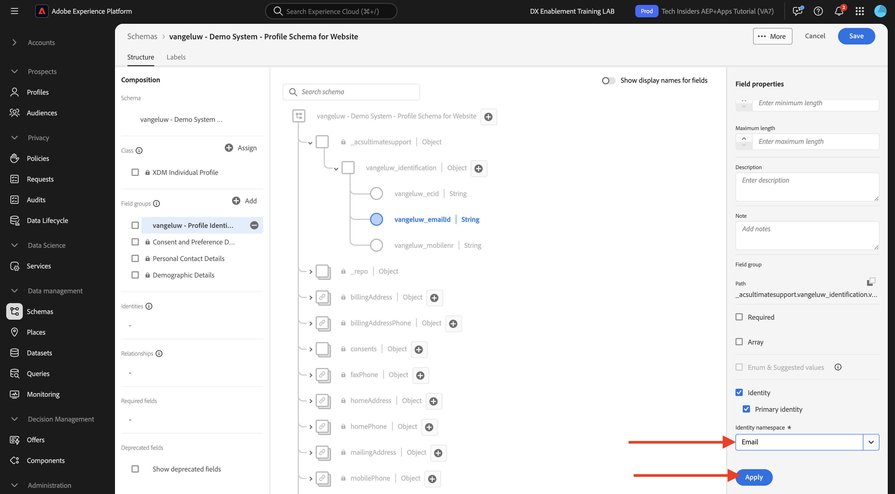

# 1.2.2設定結構描述並設定識別碼

在本練習中，您將設定必要的XDM結構描述，以分類設定檔資訊和客戶行為。 在每個XDM綱要中，您也必須設定要連結所有資訊的主要識別碼。

## Story

開始設定XDM結構描述和設定主要識別碼之前，我們需要先思考我們嘗試去做的事情的商業內容：

- 想要取得資料
- 您想要將資料連結至客戶
- 想要建立漸進式的即時客戶個人檔案

我們想要擷取兩種型別的資料：

- 此客戶是誰？
- 此客戶會怎麼做？

但是，問題&#x200B;**此客戶是誰？**&#x200B;是一個非常開放的問題，有許多答案。 當貴公司想要瞭解此問題的答案時，您需要尋找人口統計資訊，例如名字、姓氏和地址。 但也適用於電子郵件地址或行動電話號碼等聯絡資訊。 此外也提供連結至語言、OptIn/OptOut甚至個人資料圖片的資訊。 最後，您真正需要瞭解的是，我們如何在貴公司使用的各種系統中識別此客戶。

問題&#x200B;**此客戶有何行為？**。這是個很有答案的開放性問題。 當貴公司想要此問題獲得回答時，您會尋找客戶與您任何線上和離線屬性的任何互動。 造訪過哪些頁面或產品？ 此客戶是否已新增產品至購物車，或甚至購買商品？ 使用哪些裝置和瀏覽器來瀏覽網站？ 這位客戶想要的是什麼資訊，以及我們如何運用這些資訊，為這位客戶設定並提供愉快的體驗？ 最後，我們真正需要瞭解的是，我們如何在貴公司使用的各種系統中識別此客戶。

## 1.2.1.1 — 此客戶是誰

擷取&#x200B;**此客戶是誰？您公司的**&#x200B;已透過登入/註冊頁面完成。

從結構描述的角度來看，我們將其視為&#x200B;**類別**。 問題：**此客戶是誰？**&#x200B;是我們在&#x200B;**[!UICONTROL XDM個別設定檔]**&#x200B;類別中定義的專案。

因此，當您建立XDM結構描述以擷取&#x200B;**此客戶是誰？**，首先，您需要建立和定義1個參照類別&#x200B;**[!UICONTROL XDM個別設定檔]**&#x200B;的結構描述。

若要指定該問題可有何種答案，您必須定義[!UICONTROL 欄位群組]。 [!UICONTROL 欄位群組]是Profile類別的延伸模組，而且有非常明確的設定。 例如，名字、姓氏、性別和生日等人口統計資訊是[!UICONTROL 欄位群組]的一部分： **[!UICONTROL 人口統計詳細資料]**。

其次，貴公司需要決定如何識別此客戶。 以貴公司為例，已知客戶的主要識別碼可能是特定客戶ID，例如電子郵件地址。 但技術上來說，還有其他方法可以識別您公司的客戶，例如使用行動電話號碼。
在本實驗中，我們將電子郵件地址定義為主要識別碼，而電話號碼定義為次要識別碼。

最後，區分資料擷取的管道很重要。 在此案例中，我們將討論「網站註冊」，以及需要定義的結構描述必須反映&#x200B;**其中**&#x200B;已擷取註冊資料。 管道在影響所擷取的資料方面也將發揮重要作用。 因此，最佳實務是為每個管道、主要識別碼和收集之資料型別的組合定義結構描述。

根據上文，您需在Adobe Experience Platform中設定結構。

前往此URL登入Adobe Experience Platform： [https://experience.adobe.com/platform](https://experience.adobe.com/platform)。

登入後，您會登入Adobe Experience Platform的首頁。

繼續之前，您必須選取&#x200B;**沙箱**。 要選取的沙箱名為``--module2sandbox--``。 您可以按一下熒幕上方藍線中的文字&#x200B;**[!UICONTROL Production Prod]**&#x200B;來執行此操作。 選取適當的沙箱後，您會看到畫面變更，現在您已進入專屬沙箱。

在Adobe Experience Platform中，按一下熒幕左邊功能表中的&#x200B;**[!UICONTROL 結構描述]**。 您會看到可用的[!UICONTROL 結構描述]清單。

您應該建立新的結構描述。 若要建立新的結構描述，請按一下[建立結構描述]按鈕&#x200B;**[!UICONTROL +並選取**[!UICONTROL  XDM個別設定檔&#x200B;]**。]**

按一下「**[!UICONTROL +建立結構描述]**」按鈕後，會建立新的結構描述，並提示您選取或建立&#x200B;**欄位群組**。

現在您需要定義問題&#x200B;**此客戶是誰？的答案**看起來應該像這樣。
在本實驗的簡介中，我們注意到需要下列屬性來定義客戶：

- 名字、姓氏和地址等人口統計資訊
- 連絡資訊，例如住家地址、電子郵件地址或行動電話號碼
- 連結到語言、選擇加入/選擇退出甚至個人資料圖片的其他資訊。
- 客戶的主要識別碼

若要將該資訊加入結構描述的一部分，您必須將下列[!UICONTROL 欄位群組]新增到結構描述：

- 人口統計細節（人口統計資訊）
- 個人聯絡詳細資訊（聯絡資訊）
- 偏好設定詳細資料（其他資訊）
- 您公司的自訂設定檔識別欄位群組（主要和次要識別碼）

在&#x200B;**[!UICONTROL 新增欄位群組]**&#x200B;畫面中，選取[!UICONTROL 欄位群組] **[!UICONTROL 人口統計詳細資料]**、**[!UICONTROL 個人聯絡詳細資料]**&#x200B;和&#x200B;**[!UICONTROL 偏好設定詳細資料]**。

按一下&#x200B;**[!UICONTROL 新增欄位群組]**&#x200B;按鈕，將[!UICONTROL 欄位群組]新增到您的結構描述。

您現在擁有此功能：

接下來，您需要新的[!UICONTROL 欄位群組]來擷取用於資料收集的&#x200B;**[!UICONTROL 識別碼]**。 如同在上一個練習中所見，有一個主要和次要識別碼的概念。 主要識別碼是最重要的識別碼，因為所有收集的資料都會連結至此識別碼。

您現在將建立自己的自訂[!UICONTROL 欄位群組]，因此，您將擴充[!UICONTROL XDM結構描述]以符合您公司的需求。

按一下「**[!UICONTROL +新增]**」按鈕，開始新增[!UICONTROL 欄位群組]。

您現在將建立自己的[!UICONTROL 欄位群組]，而不是重複使用現有的[!UICONTROL 欄位群組]。 您可以選取&#x200B;**[!UICONTROL 建立新欄位群組]**&#x200B;來執行此操作。

您現在必須為新的[!UICONTROL 欄位群組]提供&#x200B;**[!UICONTROL 顯示名稱]**&#x200B;和&#x200B;**[!UICONTROL 描述]**。

當作結構描述的名稱，我們將使用這個名稱：
`--demoProfileLdap-- - Profile Identification Field Group`

例如，對於ldap **[!UICONTROL vangeluw]**，這應該是結構描述的名稱：

**[!UICONTROL vangeluw — 設定檔識別欄位群組]**

這應該會提供如下的內容：

按一下&#x200B;**[!UICONTROL 新增欄位群組]**&#x200B;按鈕，將新建立的[!UICONTROL 欄位群組]新增到您的結構描述。

您現在應該已具備此結構描述結構。

您的新[!UICONTROL 欄位群組]仍然是空的，所以現在您必須將欄位新增到該[!UICONTROL 欄位群組]。
在[!UICONTROL 欄位群組] — 清單中，按一下您的自訂[!UICONTROL 欄位群組]。

您現在會看到許多新按鈕。

在結構描述的頂層，按一下&#x200B;**[!UICONTROL +新增欄位]**&#x200B;按鈕。

按一下&#x200B;**[!UICONTROL +新增欄位]**&#x200B;按鈕後，您現在會在結構描述中看到新的&#x200B;**[!UICONTROL 物件]**。 此物件代表您結構描述中的自訂&#x200B;**[!UICONTROL 物件]**，且以您的Adobe Experience Platform租使用者ID命名。 您的Adobe Experience Platform租使用者ID為`--aepTenantId--`。

您現在將在該租使用者下新增物件。 若要這麼做，請按一下租使用者 — 物件下的欄位&#x200B;**[!UICONTROL 新增欄位]**。

使用這些物件定義：

- 欄位名稱： **[!UICONTROL 識別]**
- 顯示名稱： **[!UICONTROL 識別]**
- 類型：**[!UICONTROL 物件]**

按一下&#x200B;**[!UICONTROL 套用]**&#x200B;以儲存變更。

按一下&#x200B;**[!UICONTROL 套用]**&#x200B;後，您現在會在結構描述中看到您的&#x200B;**[!UICONTROL 識別]**&#x200B;物件。

您現在會在&#x200B;**[!UICONTROL 識別]**&#x200B;物件下新增3個欄位：

- ecid：
   - 欄位名稱： **[!UICONTROL ecid]**
   - 顯示名稱： **[!UICONTROL ecid]**
   - 型別： **[!UICONTROL 字串]**

- emailId
   - 欄位名稱： **[!UICONTROL 電子郵件ID]**
   - 顯示名稱： **[!UICONTROL 電子郵件ID]**
   - 型別： **[!UICONTROL 字串]**

- mobilenr
   - 欄位名稱： **[!UICONTROL mobilenr]**
   - 顯示名稱： **[!UICONTROL mobilenr]**
   - 型別： **[!UICONTROL 字串]**

每個欄位都會定義為型別&#x200B;**[!UICONTROL 字串]**，我們會將這些欄位設定為&#x200B;**[!UICONTROL 身分]**。 針對結構描述&#x200B;**[!UICONTROL 網站註冊結構描述]**，我們假設客戶將一律以其電子郵件地址識別，這表示您必須將欄位&#x200B;**[!UICONTROL emailId]**&#x200B;設定為&#x200B;**[!UICONTROL 主要]**&#x200B;識別碼，並將其他欄位設定為&#x200B;**[!UICONTROL 次要]**&#x200B;識別碼。

若要新增欄位，請按一下&#x200B;**[!UICONTROL 識別]**&#x200B;物件旁的&#x200B;**[!UICONTROL +]**&#x200B;按鈕。

您現在有空白欄位。 您需要依指示設定以上3個欄位。

這是每個欄位在初始欄位設定之後的顯示方式。

按一下&#x200B;**[!UICONTROL 識別]**&#x200B;物件旁的&#x200B;**[!UICONTROL +]**&#x200B;按鈕，以建立新欄位並依指示填寫欄位。

- ecid

若要儲存欄位，請向下捲動&#x200B;**[!UICONTROL 欄位屬性]**，直到看到&#x200B;**[!UICONTROL 套用]**&#x200B;按鈕為止。 按一下&#x200B;**[!UICONTROL 套用]**&#x200B;按鈕。

按一下&#x200B;**[!UICONTROL 識別]**&#x200B;物件旁的&#x200B;**[!UICONTROL +]**&#x200B;按鈕，以建立新欄位並依指示填寫欄位。

- emailId

若要儲存欄位，請向下捲動&#x200B;**[!UICONTROL 欄位屬性]**，直到看到&#x200B;**[!UICONTROL 套用]**&#x200B;按鈕為止。 按一下&#x200B;**[!UICONTROL 套用]**&#x200B;按鈕。

按一下&#x200B;**[!UICONTROL 識別]**&#x200B;物件旁的&#x200B;**[!UICONTROL +]**&#x200B;按鈕，以建立新欄位並依指示填寫欄位。

- mobilenr

若要儲存欄位，請向下捲動&#x200B;**[!UICONTROL 欄位屬性]**，直到看到&#x200B;**[!UICONTROL 套用]**&#x200B;按鈕為止。 按一下&#x200B;**[!UICONTROL 套用]**&#x200B;按鈕。

您現在有3個欄位，但這些欄位尚未定義為&#x200B;**[!UICONTROL 身分]**&#x200B;欄位。

若要開始將這些欄位定義為&#x200B;**[!UICONTROL 身分]** — 欄位，請遵循下列步驟：

- 選取欄位&#x200B;**[!UICONTROL emailId]**。
- 在右側的欄位屬性中，向下捲動直到您看到&#x200B;**[!UICONTROL 身分]**&#x200B;為止。 核取&#x200B;**[!UICONTROL 身分]**&#x200B;的核取方塊。

  

- 現在核取&#x200B;**[!UICONTROL 主要身分]**&#x200B;的核取方塊。

  

- 最後，從&#x200B;**[!UICONTROL 名稱空間]**&#x200B;清單中選取名稱空間&#x200B;**[!UICONTROL 電子郵件]**。 Adobe Experience Platform中的身分圖表會使用名稱空間來分類名稱空間中的識別碼，並定義這些名稱空間之間的關係。

  

- 最後，按一下&#x200B;**[!UICONTROL 套用]**&#x200B;以儲存變更。

  

接下來，您必須將&#x200B;**[!UICONTROL ecid]**&#x200B;和&#x200B;**[!UICONTROL mobilenr]**&#x200B;的其他欄位定義為次要識別碼。

- 選取欄位&#x200B;**[!UICONTROL ecid]**。
- 在右側的欄位屬性中，向下捲動直到您看到&#x200B;**[!UICONTROL 身分]**&#x200B;為止。 核取&#x200B;**[!UICONTROL 身分]**&#x200B;的核取方塊。

  

- 接著，從&#x200B;**[!UICONTROL 名稱空間]**&#x200B;清單中選取名稱空間&#x200B;**[!UICONTROL ECID]**。 Adobe Experience Platform中的身分圖表使用[!UICONTROL 名稱空間]來分類名稱空間中的識別碼，並定義這些名稱空間之間的關係。

  

- 按一下&#x200B;**[!UICONTROL 套用]**&#x200B;以儲存變更。

  

- 選取欄位&#x200B;**[!UICONTROL mobilenr]**。
- 在右側的欄位屬性中，向下捲動直到您看到&#x200B;**[!UICONTROL 身分]**&#x200B;為止。 核取&#x200B;**[!UICONTROL 身分]**&#x200B;的核取方塊。

  

- 請務必從&#x200B;**[!UICONTROL 名稱空間]**&#x200B;清單中選取名稱空間&#x200B;**[!UICONTROL 電話]**。 Adobe Experience Platform中的身分圖表會使用名稱空間來分類名稱空間中的識別碼，並定義這些名稱空間之間的關係。

  

- 按一下&#x200B;**[!UICONTROL 套用]**&#x200B;以儲存變更。

  

**[!UICONTROL 識別碼]**&#x200B;物件現在看起來應該像這樣，3個ID欄位現在也顯示&#x200B;**[!UICONTROL 指紋]**&#x200B;圖示，以顯示它們已定義為識別碼。

現在來為您的結構描述命名。 選取欄位&#x200B;**未命名結構描述**。

當作結構描述的名稱，您將使用此：

`--demoProfileLdap-- - Demo System - Profile Schema for Website`

以您特定的ldap取代&#x200B;**[!UICONTROL ldap]**。 例如，對於ldap **[!UICONTROL vangeluw]**，這應該是結構描述的名稱：

**[!UICONTROL vangeluw — 示範系統 — 網站的設定檔結構描述]**

這應該會提供如下的內容：

您現在已定義結構描述、連結現有和新建立的[!UICONTROL 欄位群組]，並已定義識別碼。

按一下[儲存]儲存變更。****

這裡要做的最後一件事，是啟動要連結至&#x200B;**[!UICONTROL 設定檔]**的結構描述。
為設定檔啟用結構描述後，您將確保針對此結構描述傳送至Adobe Experience Platform的所有資料都會成為即時客戶設定檔環境的一部分，以確保所有資料都可用於即時查詢、細分和啟用。

若要這麼做，讓我們選取您的結構描述名稱。

在結構描述的右側標籤中，您會看到&#x200B;**[!UICONTROL 設定檔切換]**，目前該切換已停用。

按一下[!UICONTROL 設定檔] — 切換器以啟動。

您會看到此訊息：

按一下&#x200B;**[!UICONTROL 啟用]**&#x200B;為設定檔啟用此結構描述。

您的結構描述現在已設定為[!UICONTROL 即時客戶設定檔]的一部分。

最後，按一下[儲存] ****&#x200B;以儲存結構描述。

### 1.2.1.2 — 此客戶會做什麼

擷取問題&#x200B;**此客戶有何行為？您公司的**&#x200B;已透過在產品頁面上執行個體產品檢視完成。

從結構描述的角度來看，我們將其視為&#x200B;**[!UICONTROL 類別]**。 問題：**此客戶做什麼？**&#x200B;是我們已在類別&#x200B;**[!UICONTROL ExperienceEvent]**&#x200B;中定義的專案。

因此，當您建立[!UICONTROL XDM結構描述]以擷取&#x200B;**的答案時，此客戶會怎麼做？**，首先，您需要建立和定義1個參照類別&#x200B;**[!UICONTROL ExperienceEvent]**&#x200B;的結構描述。

若要指定該問題可有何種答案，您必須定義[!UICONTROL 欄位群組]。 [!UICONTROL 欄位群組]是[!UICONTROL ExperienceEvent]類別的延伸模組，而且有非常明確的設定。 例如，有關客戶檢視或新增至購物車的產品型別屬於[!UICONTROL 欄位群組] **Commerce詳細資料**&#x200B;的資訊。

其次，您的公司需要決定您如何識別此客戶的行為。 由於我們討論的是網站上的互動，因此您的公司可能瞭解客戶，但也可能有未知的匿名訪客活躍在網站上。 因此，我們無法使用像電子郵件地址之類的識別碼。 在這種情況下，貴公司可能會決定使用[!UICONTROL Experience Cloud識別碼(ECID)]作為主要識別碼。

最後，區分資料擷取的管道很重要。 在此案例中，我們將討論網站互動以及需要定義的結構描述，以反映&#x200B;**其中**&#x200B;擷取的互動資料。 管道在影響所擷取的資料方面也將發揮重要作用。 因此，最佳實務是為每個管道、主要識別碼和收集之資料型別的組合定義結構描述。

根據上文，您需在Adobe Experience Platform中設定結構。

登入後，您會登入Adobe Experience Platform的首頁。

繼續之前，您必須選取&#x200B;**[!UICONTROL 沙箱]**。 要選取的[!UICONTROL 沙箱]名稱為``--module2sandbox--``。 您可以按一下熒幕上方藍線中的文字&#x200B;**[!UICONTROL Production Prod]**&#x200B;來執行此操作。 選取適當的沙箱後，您會看到畫面變更，現在您已進入專屬沙箱。

在Adobe Experience Platform中，按一下熒幕左邊功能表中的&#x200B;**[!UICONTROL 結構描述]**。

在[!UICONTROL 結構描述]中，您會看到所有現有的結構描述。

您應該建立新的結構描述。 若要建立新的結構描述，請按一下[建立結構描述]按鈕&#x200B;**[!UICONTROL +並選取**[!UICONTROL  XDM ExperienceEvent ]**。]**

按一下「**[!UICONTROL +建立結構描述]**」按鈕後，會建立新的結構描述，並提示您選取或建立&#x200B;**欄位群組**。

現在您必須定義問題&#x200B;**此客戶有何行為？**看起來應該像這樣。
在本實驗的簡介中，我們注意到需要下列屬性來定義客戶的行為：

- 造訪過哪些頁面或產品？
- 此客戶是否已新增產品至購物車，或甚至購買商品？
- 使用哪些裝置和瀏覽器來瀏覽網站？
- 這位客戶想要的是什麼資訊，以及我們如何運用這些資訊，為這位客戶設定並提供愉快的體驗？
- 客戶的主要識別碼

若要將該資訊加入結構描述的一部分，您必須將下列[!UICONTROL 欄位群組]新增到結構描述：

- 網頁詳細資訊
- 商業細節
- 環境細節
- 您公司的自訂設定檔識別碼[!UICONTROL 欄位群組] （主要和次要識別碼）

在&#x200B;**[!UICONTROL 新增欄位群組]**&#x200B;畫面中，選取[!UICONTROL 欄位群組] **[!UICONTROL 網頁詳細資料]**、**[!UICONTROL Commerce詳細資料]**&#x200B;和&#x200B;**[!UICONTROL 環境詳細資料]**。

按一下&#x200B;**[!UICONTROL 新增欄位群組]**&#x200B;按鈕，將欄位群組新增至您的結構描述。

之後，您將會擁有此專案：

接下來，您必須建立新的[!UICONTROL 欄位群組]，以擷取用於資料收集的&#x200B;**[!UICONTROL 識別碼]**。 如同在上一個練習中所見，有一個主要和次要識別碼的概念。 主要識別碼是最重要的識別碼，因為所有收集的資料都會連結至此識別碼。

您現在將建立自己的自訂[!UICONTROL 欄位群組]，因此，您將擴充[!UICONTROL XDM結構描述]以符合您公司的需求。

[!UICONTROL 欄位群組]已連結至[!UICONTROL 類別]，這表示您不能簡單地重複使用先前建立的[!UICONTROL 欄位群組]。

按一下「**[!UICONTROL +新增]**」按鈕，開始新增[!UICONTROL 欄位群組]。

您現在將建立自己的[!UICONTROL 欄位群組]，而不是重複使用現有的[!UICONTROL 欄位群組]。 您可以選取&#x200B;**[!UICONTROL 建立新欄位群組]**&#x200B;來執行此操作。

您現在需要為您的新欄位群組提供&#x200B;**[!UICONTROL 顯示名稱]**&#x200B;和&#x200B;**[!UICONTROL 描述]**。

當您的「欄位群組」名稱時，請使用以下代碼：

`--demoProfileLdap-- - ExperienceEvent Identification Field Group`

例如，對於ldap **[!UICONTROL vangeluw]**，這應該是結構描述的名稱：

**[!UICONTROL vangeluw - ExperienceEvent識別欄位群組]**

這應該會提供如下的內容：

按一下&#x200B;**[!UICONTROL 新增欄位群組]**&#x200B;按鈕，將新建立的[!UICONTROL 欄位群組]新增到您的結構描述。

您現在應該已具備此[!UICONTROL 結構描述]結構。

您的新[!UICONTROL 欄位群組]仍為空白，因此現在您必須將欄位新增至該欄位群組。
在[!UICONTROL 欄位群組] — 清單中，按一下您的自訂[!UICONTROL 欄位群組]。

您現在會看到許多新按鈕。

在結構描述的頂層，按一下結構描述 — 名稱旁的&#x200B;**[!UICONTROL +]**&#x200B;按鈕。

按一下&#x200B;**[!UICONTROL +]**&#x200B;按鈕後，您現在會在結構描述中看到新的&#x200B;**[!UICONTROL 物件]**。 此物件代表您[!UICONTROL 結構描述]中的自訂&#x200B;**[!UICONTROL 物件]**，且以您的Adobe Experience Platform租使用者ID命名。 您的Adobe Experience Platform租使用者ID為`--aepTenantId--`。

您現在將在該租使用者下新增物件。 若要這麼做，請按一下租使用者 — 物件下的欄位&#x200B;**[!UICONTROL 新增欄位]**。

使用這些物件定義：

- 欄位名稱： **[!UICONTROL 識別]**
- 顯示名稱： **[!UICONTROL 識別]**
- 類型：**[!UICONTROL 物件]**

向下捲動並按一下&#x200B;**[!UICONTROL 套用]**&#x200B;以儲存變更。

按一下&#x200B;**[!UICONTROL 套用]**&#x200B;後，您現在會在結構描述中看到您的&#x200B;**[!UICONTROL 識別]**&#x200B;物件。

您現在會在&#x200B;**[!UICONTROL 識別]**&#x200B;物件下新增1個欄位。

按一下&#x200B;**[!UICONTROL 識別]**&#x200B;物件旁的&#x200B;**[!UICONTROL +]**&#x200B;按鈕以建立新欄位。

ECID — 欄位將定義為型別&#x200B;**[!UICONTROL 字串]**，而您將設定此欄位為&#x200B;**[!UICONTROL 身分]**。 針對結構描述&#x200B;**[!UICONTROL 示範系統 — 網站]**&#x200B;的事件結構描述，我們假設客戶將一律以其[!UICONTROL ECID]識別，這表示您必須將欄位&#x200B;**[!UICONTROL ECID]**&#x200B;設定為&#x200B;**主要**&#x200B;識別碼

您現在有空白欄位。 您必須依指示設定上述欄位。

- ecid：

   - 欄位名稱： **[!UICONTROL ecid]**
   - 顯示名稱： **[!UICONTROL ecid]**
   - 型別： **[!UICONTROL 字串]**

這是[!UICONTROL ecid] — 欄位在初始欄位設定之後的處理方式：

向下捲動並按一下&#x200B;**[!UICONTROL 套用]**。

您現在有新欄位，但此欄位尚未定義為&#x200B;**[!UICONTROL 身分]**&#x200B;欄位。

若要開始將這些欄位定義為&#x200B;**[!UICONTROL 身分]** — 欄位，請遵循下列步驟：

- 選取欄位&#x200B;**[!UICONTROL ecid]**。
- 在右側的欄位屬性中，向下捲動直到您看到&#x200B;**[!UICONTROL 身分]**&#x200B;為止。 核取&#x200B;**[!UICONTROL 身分]**&#x200B;的核取方塊。

- 現在核取&#x200B;**[!UICONTROL 主要身分]**&#x200B;的核取方塊。

- 最後，從&#x200B;**[!UICONTROL 名稱空間]**&#x200B;清單中選取名稱空間&#x200B;**[!UICONTROL ECID]**。 Adobe Experience Platform中的[!UICONTROL 身分圖表]使用[!UICONTROL 名稱空間]來分類名稱空間中的識別碼，並定義這些名稱空間之間的關係。

  

- 最後，按一下&#x200B;**[!UICONTROL 套用]**&#x200B;以儲存變更。

  

**[!UICONTROL 識別碼]**&#x200B;物件現在看起來應該像這樣，ecid-field現在也會顯示&#x200B;**指紋**&#x200B;圖示，以顯示它們已定義為識別碼。

現在來為您的結構描述命名。 選取欄位&#x200B;**未命名結構描述**。

當作結構描述的名稱，我們將使用這個名稱：
`--demoProfileLdap-- - Demo System - Event Schema for Website`

例如，對於ldap **[!UICONTROL vangeluw]**，這應該是結構描述的名稱：

**[!UICONTROL vangeluw — 示範系統 — 網站的事件結構描述]**

這應該會提供如下的內容：

按一下[儲存]儲存變更。****

請務必注意，最終針對此結構擷取資料時，需要一些欄位。
例如，欄位**[!UICONTROL _id]**&#x200B;和&#x200B;**[!UICONTROL timestamp]**&#x200B;為必要欄位。

- _id必須包含用於特定資料擷取的唯一id
- 時間戳記必須為此點選的時間戳記，格式為&#x200B;**[!UICONTROL &quot;YYYY-MM-DDTHH:MM:SSSZ&quot;]**，例如： **[!UICONTROL &quot;2019-04-08T07:20:000Z&quot;]**

您現在已定義結構描述、連結現有和新建立的[!UICONTROL 欄位群組]且已定義識別碼。

這裡要做的最後一件事，是啟動要連結至&#x200B;**[!UICONTROL 設定檔]**的結構描述。
為[!UICONTROL 設定檔]啟用結構描述後，您即可確保針對此結構描述傳送至Adobe Experience Platform的所有資料都會成為即時客戶設定檔的一部分，以確保所有資料都可即時用於查詢、細分和啟用。

若要這麼做，讓我們選取您的結構描述名稱。

在結構描述的右側標籤中，您會看到&#x200B;**[!UICONTROL 設定檔]切換**，目前該切換已停用。

按一下[!UICONTROL 設定檔] — 切換器以啟動。

您會看到此訊息：

按一下&#x200B;**[!UICONTROL 啟用]**&#x200B;為設定檔啟用此結構描述。

您的結構描述現在已設定為即時客戶設定檔的一部分。

最後，按一下[儲存] ****&#x200B;以儲存結構描述。

您現在已完成建立要在即時客戶個人檔案中使用的結構描述。

讓我們在下個練習中檢視資料集。

下一步： [1.2.3設定資料集](./ex3.md)

[返回模組1.2](./data-ingestion.md)

[返回所有模組](../../../overview.md)
