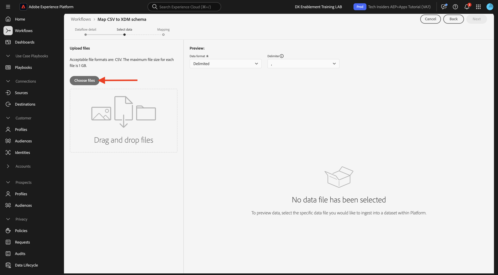

# 1.2.4從離線來源擷取資料

在本練習中，目標是將外部資料（例如Platform中的CRM資料）上線。

## 學習目標

- 瞭解如何產生測試資料
- 瞭解如何擷取CSV
- 瞭解如何使用Web UI透過工作流程擷取資料
- 瞭解Experience Platform的資料控管功能

## 資源

- 莫卡洛文： [https://www.mockaroo.com/](https://www.mockaroo.com/)
- Adobe Experience Platform： [https://experience.adobe.com/platform/](https://experience.adobe.com/platform/)

## 任務

- 建立包含示範資料的CSV檔案。 使用可用的工作流程將CSV檔案擷取至Adobe Experience Platform。
- 瞭解Adobe Experience Platform中的資料控管選項

## 使用資料產生器工具建立CRM資料集

此練習需要1000個CRM資料範例行。

前往[https://www.mockaroo.com/12674210](https://www.mockaroo.com/12674210)開啟Mockaroo範本。

在範本上，您會注意到下列欄位：

- ID
- 名字
- last_name
- 電子郵件
- 性別
- birthDate
- home_latitude
- home_longitude
- country_code
- 城市
- 國家/地區

所有這些欄位都定義用於產生與Platform相容的資料。

若要產生CSV檔案，請按一下&#x200B;**[!UICONTROL 產生資料]**&#x200B;按鈕，這會建立和下載包含1000行示範資料的CSV檔案。

開啟CSV檔案以視覺化其內容。

您的CSV檔案準備就緒後，您就可以在AEP中繼續內嵌。

### 驗證資料集

開啟[Adobe Experience Platform](https://experience.adobe.com/platform)並移至&#x200B;**[!UICONTROL 資料集]**。

繼續之前，您必須選取&#x200B;**[!UICONTROL 沙箱]**。 要選取的沙箱名為``--aepSandboxName--``。

在Adobe Experience Platform中，按一下畫面左側功能表中的&#x200B;**[!UICONTROL 資料集]**。

您會使用共用資料集。 已建立共用資料集，稱為&#x200B;**[!UICONTROL Demo System - CRM的設定檔資料集（全域v1.1）]**。 按一下以開啟。

在概觀畫面上，您可以看到3個主要資訊。

>[!NOTE]
>
>如果過去7天內未發生任何活動，您的資料集檢視可能為空白。

首先，[!UICONTROL 資料集活動]儀表板會顯示資料集中的CRM記錄總數、擷取的批次及其狀態

第二，透過向下捲動頁面，您可以檢查何時擷取資料批次、已上線記錄數，以及批次是否已成功上線。 **[!UICONTROL 批次ID]**&#x200B;是特定批次工作的識別碼，而&#x200B;**[!UICONTROL 批次ID]**&#x200B;很重要，因為它可用於疑難排解特定批次未成功上線的原因。

最後，「[!UICONTROL 資料集]」資訊標籤會顯示重要資訊，例如[!UICONTROL 資料集識別碼] （從疑難排解角度來看，同樣重要）、資料集的名稱，以及資料集是否已針對設定檔啟用。

這裡最重要的設定是資料集和結構描述之間的連結。 結構描述會定義可以擷取的資料以及該資料的外觀。

在此案例中，我們使用CRM (Global v1.1)]**的**[!UICONTROL  Demo System - Profile Schema，它對應至&#x200B;**[!UICONTROL Profile]**&#x200B;的類別，並且已實作擴充功能，也稱為欄位群組。

按一下結構描述的名稱，您就會進入[!UICONTROL 結構描述]總覽，您可以看到已針對此結構描述啟用的所有欄位。

每個結構描述都需要定義自訂的主要描述項。 以我們的CRM資料集為例，結構描述已定義欄位&#x200B;**[!UICONTROL crmId]**&#x200B;應為主要識別碼。 如果您想要建立結構描述並將其連結至[!UICONTROL 即時客戶設定檔]，您必須定義參考您主要描述項的自訂[!UICONTROL 欄位群組]。

您也可以看到我們的主要身分位於`--aepTenantId--.identification.core.crmId`，連結至&#x200B;**[!UICONTROL 示範系統 — CRMID]**&#x200B;的[!UICONTROL 名稱空間]。

每個結構描述以及應在[!UICONTROL 即時客戶設定檔]中使用的每個資料集都應該有一個[!UICONTROL 主要識別碼]。 此[!UICONTROL 主要識別碼]是該資料集中該客戶的品牌識別碼使用者。 在CRM資料集的情況下，它可能是電子郵件地址或CRM ID；在呼叫中心資料集的情況下，它可能是客戶的行動電話號碼。

最佳實務是為每個資料集建立個別的特定結構描述，並為每個資料集設定描述項，以特別符合品牌目前使用的解決方案運作方式。

### 使用工作流程將CSV檔案對應至XDM結構描述

本練習的目標是將CRM資料加入AEP中。 Platform擷取的所有資料都應對應至特定的XDM結構描述。 您目前擁有的一側為1000行的CSV資料集，以及連結至另一側結構描述的資料集。 若要在該資料集中載入該CSV檔案，需進行對應。 為了協助此對應練習，我們在Adobe Experience Platform中提供了&#x200B;**[!UICONTROL 工作流程]**。

按一下&#x200B;**[!UICONTROL 將CSV對應至XDM結構描述]**，然後按一下&#x200B;**[!UICONTROL 啟動]**&#x200B;以開始程式。

在下一個畫面中，您需要選取要內嵌檔案的資料集。 您可以選擇選取現有的資料集或建立新的資料集。 針對此練習，我們將重複使用現有的設定：請選取&#x200B;**[!UICONTROL 示範系統 — CRM （全域v1.1）]**&#x200B;的設定檔資料集（如下所示），並將其他設定保留為預設值。

按一下&#x200B;**下一步**。

拖放您的CSV檔案或按一下&#x200B;**[!UICONTROL 選擇檔案]**，然後在您的電腦上瀏覽到您的案頭，然後選取您的CSV檔案。

選取CSV檔案後，檔案會立即上傳，並在數秒內預覽檔案。

按一下&#x200B;**下一步**。

您現在需要在&#x200B;**[!UICONTROL 示範系統 — CRM]**&#x200B;的設定檔資料集中，以XDM屬性對應CSV檔案的欄標題。

Adobe Experience Platform已嘗試將[!UICONTROL Source屬性]與[!UICONTROL 目標結構描述欄位]連結，為您提出一些建議。

>[!NOTE]
>
>如果您在對應畫面上看到任何錯誤，請不要擔心。 依照下列指示操作後，這些錯誤即會解決。

對於[!UICONTROL 結構描述對應]，Adobe Experience Platform已嘗試將欄位連結在一起。 不過，並非所有對應建議都是正確的。 您現在需要逐一更新&#x200B;**目標欄位**。

#### birthDate

Source結構描述欄位&#x200B;**birthDate**&#x200B;應連結至目標欄位&#x200B;**person.birthDate**。

#### 城市

Source結構描述欄位&#x200B;**city**&#x200B;應連結至目標欄位&#x200B;**homeAddress.city**。

#### 國家/地區

Source結構描述欄位&#x200B;**country**&#x200B;應連結至目標欄位&#x200B;**homeAddress.country**。

#### country_code

Source結構描述欄位&#x200B;**country_code**&#x200B;應連結至目標欄位&#x200B;**homeAddress.countryCode**。

#### 電子郵件

Source結構描述欄位&#x200B;**電子郵件**&#x200B;應連結至目標欄位&#x200B;**personalEmail.address**。

#### crmid

Source結構描述欄位&#x200B;**crmid**&#x200B;應連結至目標欄位&#x200B;**`--aepTenantId--`.identification.core.crmId**。

#### 名字

Source結構描述欄位&#x200B;**first_name**&#x200B;應連結至目標欄位&#x200B;**person.name.firstName**。

#### 性別

Source結構描述欄位&#x200B;**性別**&#x200B;應連結至目標欄位&#x200B;**person.gender**。

#### home_latitude

Source結構描述欄位&#x200B;**home_latitude**&#x200B;應連結至目標欄位&#x200B;**homeAddress。_schema.latitude**。

#### home_longitude

Source結構描述欄位&#x200B;**home_longitude**&#x200B;應連結至目標欄位&#x200B;**homeAddress。_schema.longitude**。

#### ID

Source結構描述欄位&#x200B;**id**&#x200B;應連結至目標欄位&#x200B;**_id**。

#### last_name

Source結構描述欄位&#x200B;**last_name**&#x200B;應連結至目標欄位&#x200B;**person.name.lastName**。

您現在應該擁有此專案。 按一下&#x200B;**完成**。

按一下&#x200B;**[!UICONTROL 完成]**&#x200B;後，您就會看到&#x200B;**資料流**&#x200B;總覽，幾分鐘後，您可以重新整理熒幕，以檢視工作流程是否成功完成。 按一下您的&#x200B;**目標資料集名稱**。

您會看到已處理內嵌的資料集，且會看到剛才已內嵌的[!UICONTROL 批次ID]，其中已內嵌1000筆記錄，且狀態為&#x200B;**[!UICONTROL 成功]**。 按一下&#x200B;**[!UICONTROL 預覽資料集]**。

您現在會看到資料集的小樣本，以確保載入的資料正確無誤。

載入資料後，您就可以為資料集定義正確的資料控管方法。

### 將資料控管新增至您的資料集

現在您的客戶資料已內嵌，您必須確定此資料集已針對使用情況和匯出控制進行適當管理。 按一下&#x200B;**[!UICONTROL 資料控管]**&#x200B;標籤，並觀察您是否可以設定多種型別的限制：合約、身分和敏感、合作夥伴生態系統和自訂。

讓我們限制整個資料集的身分資料。 將游標暫留在您的資料集名稱上，然後按一下「鉛筆」圖示以編輯設定。

移至&#x200B;**[!UICONTROL 身分標籤]**，您會看到已核取&#x200B;**[!UICONTROL I2]**&#x200B;選項 — 這將會假設此資料集中的所有資訊片段至少可間接識別給人員。

按一下&#x200B;**[!UICONTROL 儲存變更]**。

在另一個模組中，我們將深入探討資料控管和標籤的使用者架構。

這樣，您現在就能成功在Adobe Experience Platform中擷取並分類CRM資料。

下一步： [1.2.5資料登陸區域](./ex5.md)

[返回模組1.2](./data-ingestion.md)

[返回所有模組](../../../overview.md)
