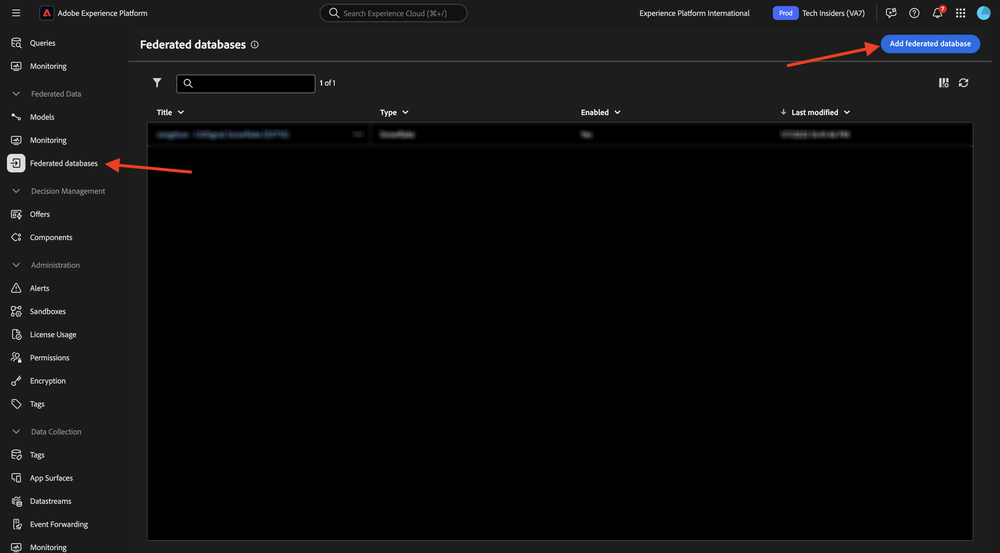
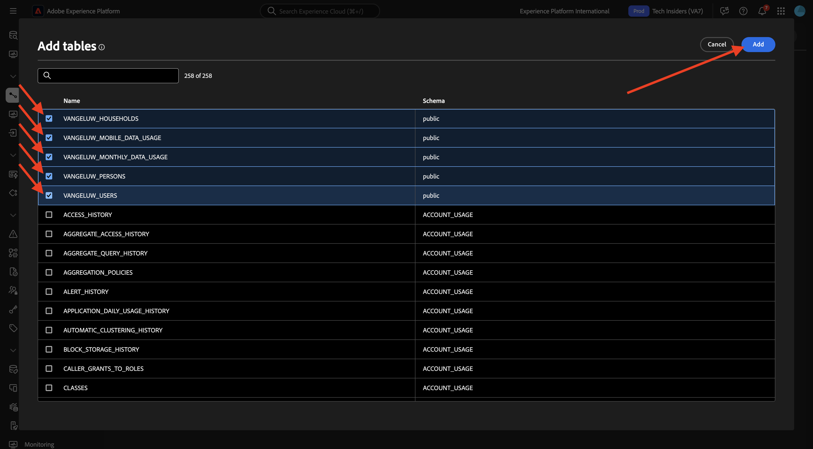
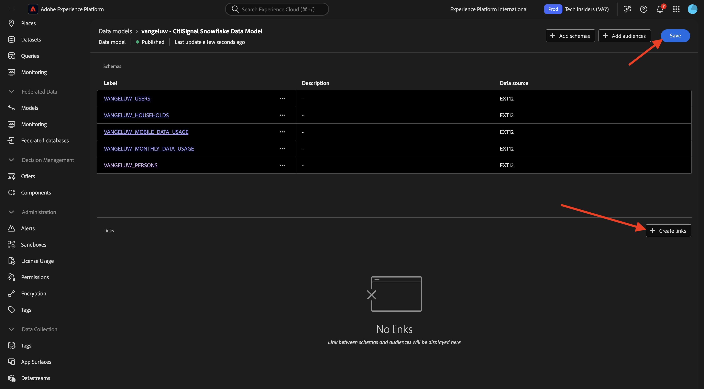
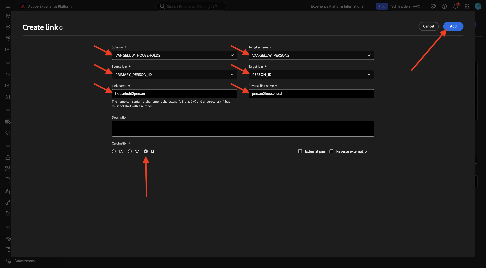

# 1.3.2建立結構描述、資料模型和連結

您現在可以在AEP中設定同盟資料庫。

前往此URL登入Adobe Experience Platform： [https://experience.adobe.com/platform](https://experience.adobe.com/platform)。

登入後，您會登入Adobe Experience Platform的首頁。

繼續之前，您必須選取&#x200B;**沙箱**。 要選取的沙箱名為``--aepSandboxName--``。 選取適當的沙箱後，您會看到畫面變更，現在您已進入專屬沙箱。

## 1.3.2.1在AEP中設定同盟資料庫

按一下左側功能表中的&#x200B;**同盟資料庫**。 然後，按一下&#x200B;**新增同盟資料庫**。

作為&#x200B;**標籤**，使用`--aepUserLdap-- - CitiSignal Snowflake`，並且針對型別，選擇&#x200B;**Snowflake**。

在「詳細資料」底下，您需要填寫憑證，看起來像這樣：

**伺服器**：

在Snowflake中，移至&#x200B;**管理員>帳戶**。 按一下您帳戶旁的3 **...**，然後按一下&#x200B;**管理URL**。

您將會看到此訊息。 複製&#x200B;**目前的URL**，並將其貼到AEP的&#x200B;**伺服器**&#x200B;欄位中。

**使用者**：您先前在練習1.3.1.1中建立的使用者名稱
**密碼**：您先前在練習1.3.1.1中建立的密碼
**資料庫**：使用&#x200B;**CITISIGNAL**

最後，您應該擁有這個。 按一下&#x200B;**測試連線**。 如果測試成功，請按一下&#x200B;**部署函式**，這樣將在Snowflake端建立工作流程引擎所需的函式。

在成功測試連線並部署功能後，將會儲存您的設定。

當您回到&#x200B;**同盟資料庫**&#x200B;功能表時，就會看到您的連線。

## 1.3.2.2在AEP中建立方案

在左側功能表中，按一下&#x200B;**模型**，然後移至&#x200B;**結構描述**。 按一下&#x200B;**建立結構描述**。

選取您的同盟資料庫，然後按一下&#x200B;**+新增資料表**。

您將會看到此訊息。 選取您之前在Snowflake中建立的5個表格：

- `CK_HOUSEHOLDS`
- `CK_MOBILE_DATA_USAGE`
- `CK_MONTHLY_DATA_USAGE`
- `CK_PERSONS`
- `CK_USERS`

按一下&#x200B;**新增**。

然後，AEP會載入每個表格的資訊，並顯示在UI中。

對於每個表格，您可以：

- 變更結構描述的標籤
- 新增說明
- 重新命名所有欄位，並設定其可見度
- 選取結構描述的主索引鍵

此練習不需要任何變更。

按一下&#x200B;**建立**。

您將會看到此訊息。 您可以按一下任何結構描述並檢閱資訊。 例如，按一下&#x200B;**CK_PERSON**。

然後，您會看到此設定，並有能力編輯設定。 按一下&#x200B;**資料**&#x200B;檢視Snowflake資料庫中的資料範例。

然後您會看到資料範例。

## 1.3.2.3在AEP中建立模型

在左側功能表中，前往&#x200B;**模型**，然後前往&#x200B;**資料模型**。 按一下&#x200B;**建立資料模型**。

標籤請使用`--aepUserLdap-- - CitiSignal Snowflake Data Model`。 按一下&#x200B;**建立**。

按一下&#x200B;**新增結構描述**。

選取您的結構描述，然後按一下&#x200B;**新增**。

您將會看到此訊息。 按一下&#x200B;**儲存**。

您現在可以開始定義綱要之間的連結。 若要開始定義連結，您必須按一下[建立連結]。****

首先，讓我們定義表格`CK_USERS`與`CK_PERSONS`之間的連結。

按一下&#x200B;**新增**。

然後您就會回到這裡。 按一下&#x200B;**建立連結**&#x200B;以建立其他連結。

接下來，讓我們定義表格`CK_HOUSEHOLDS`與`CK_PERSONS`之間的連結。

然後您就會回到這裡。 按一下&#x200B;**建立連結**&#x200B;以建立其他連結。

接下來，讓我們定義表格`CK_USERS`與`CK_MONTHLY_DATA_USAGE`之間的連結。

然後您就會回到這裡。 按一下&#x200B;**建立連結**&#x200B;以建立其他連結。

接下來，讓我們定義表格`CK_USERS`與`CK_HOUSEHOLDS`之間的連結。

然後您就會回到這裡。 按一下&#x200B;**建立連結**&#x200B;以建立其他連結。

接下來，讓我們定義表格`CK_USERS`與`CK_MOBILE_DATA_USAGE`之間的連結。

您應該會看到此訊息。 按一下&#x200B;**儲存**。

AEP中的設定現已完成。 您現在可以在同盟對象構成中開始使用同盟資料。

下一步： [1.3.3建立同盟組合](./ex3.md)

[返回模組1.3](./fac.md)

[返回所有模組](../../../overview.md)
