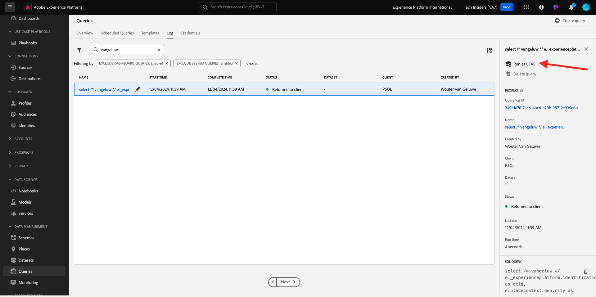

# 5.1.5從查詢產生資料集

## 目標

瞭解如何從查詢結果產生資料集
將MicrosoftPower BI案頭/Tableau直接連線至查詢服務
在MicrosoftPower BI案頭版/Tableau案頭版中建立報表

## 內容

用於查詢資料的命令列介面令人興奮，但並不妥善呈現。 在本課程中，我們將引導您瞭解如何使用MicrosoftPower BIDesktop/Tableau直接查詢服務為您的利害關係人建立視覺報表的建議工作流程。

## 從SQL查詢建立資料集

查詢的複雜度將影響查詢服務傳回結果所需的時間。 而直接從命令列或其他解決方案(例如MicrosoftPower BI/Tableau)進行查詢時，查詢服務會設定5分鐘逾時（600秒）。 在某些情況下，這些解決方案將設定為較短的逾時。 為了執行大型查詢並預先載入傳回結果所需的時間，我們提供一項功能，用於從查詢結果產生資料集。 此功能使用標準SQL功能，稱為「以選取方式建立表格(CTAS)」。 它可在Platform UI中的查詢清單中使用，也可以直接從命令列和PSQL執行。

在上一個範例中，您已經在PSQL中執行&#x200B;**之前，用您自己的LDAP取代您的名稱**。

```sql
select /* enter your name */
       e.--aepTenantId--.identification.core.ecid as ecid,
       e.placeContext.geo.city as city,
       e.placeContext.geo._schema.latitude latitude,
       e.placeContext.geo._schema.longitude longitude,
       e.placeContext.geo.countryCode as countrycode,
       c.--aepTenantId--.interactionDetails.core.callCenterAgent.callFeeling as callFeeling,
       c.--aepTenantId--.interactionDetails.core.callCenterAgent.callTopic as callTopic,
       c.--aepTenantId--.interactionDetails.core.callCenterAgent.callContractCancelled as contractCancelled,
       l.--aepTenantId--.loyaltyDetails.level as loyaltystatus,
       l.--aepTenantId--.loyaltyDetails.points as loyaltypoints,
       l.--aepTenantId--.identification.core.crmId as crmid
from   demo_system_event_dataset_for_website_global_v1_1 e
      ,demo_system_event_dataset_for_call_center_global_v1_1 c
      ,demo_system_profile_dataset_for_crm_global_v1_1 l
where  e.--aepTenantId--.demoEnvironment.brandName IN ('Citi Signal')
and    e.web.webPageDetails.name in ('Cancel Service', 'Call Start')
and    e.--aepTenantId--.identification.core.ecid = c.--aepTenantId--.identification.core.ecid
and    l.--aepTenantId--.identification.core.ecid = e.--aepTenantId--.identification.core.ecid;
```

導覽至Adobe Experience Platform UI - [https://experience.adobe.com/platform](https://experience.adobe.com/platform)

您將在搜尋欄位中輸入ldap ，以在Adobe Experience Platform查詢UI中搜尋已執行的陳述式：

選取&#x200B;**查詢**，移至&#x200B;**記錄檔**，並在搜尋欄位中輸入您的ldap。


選取您的查詢，然後按一下&#x200B;**以CTAS執行**。



輸入`--aepUserLdap-- Callcenter Interaction Analysis`作為資料集的名稱和描述，然後按一下&#x200B;**以CTAS執行**。


因此，您將會看到狀態為&#x200B;**已提交**&#x200B;的新查詢。


完成後，您將會看到&#x200B;**已建立資料集**&#x200B;的新專案（您可能需要重新整理頁面）。


建立資料集後（可能需要5-10分鐘），您就可以繼續進行練習。

下一步 — 選項A： [5.1.6查詢服務和Power BI](./ex6.md)

下一步 — 選項B： [5.1.7查詢服務與Tableau](./ex7.md)

[返回模組5.1](./query-service.md)

[返回所有模組](../../../overview.md)
