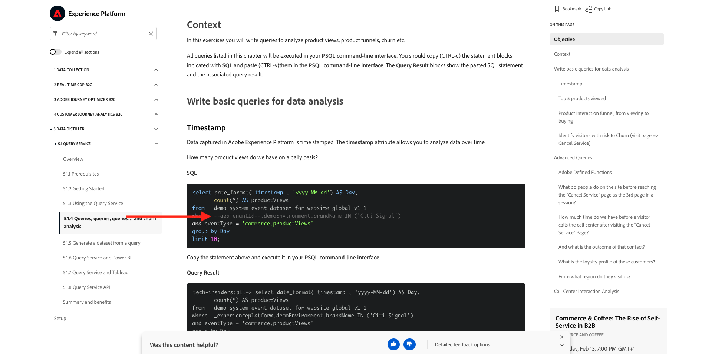
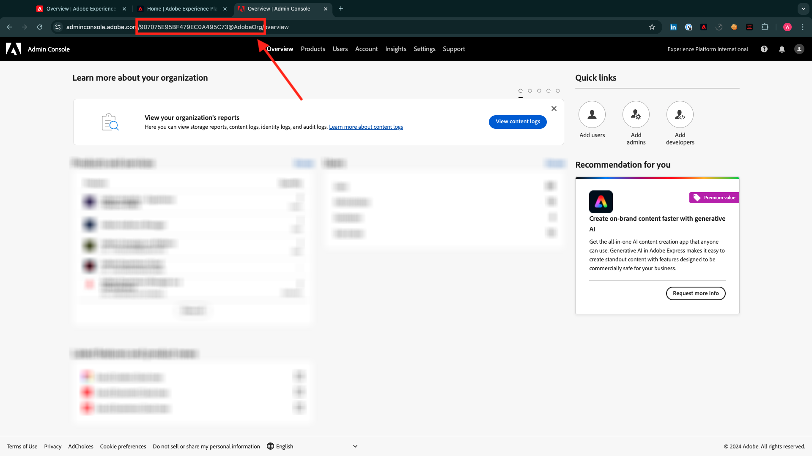

# 安裝適用於Experience League檔案的Chrome擴充功能

## 關於Chrome擴充功能

此檔案已改成通用檔案，任何人都能使用任何Adobe Experience Platform例項輕鬆重複使用。
為了讓檔案可重複使用，檔案中引入了&#x200B;**環境變數**，這表示您將在檔案中找到以下&#x200B;**預留位置**。 每個預留位置都是特定環境的特定變數，Chrome擴充功能會變更該變數，方便您從教學課程頁面復製程式碼和文字，並將其貼到您將當作教學課程一部分使用的各種使用者介面中。

您可在下方找到這類值的範例。 目前，這些值尚無法使用，但當您安裝並啟動Chrome擴充功能時，就會看到這些變數變數變更為您可複製並重複使用的正常文字。

| 名稱 | 索引鍵 | 範例 |
|:-------------:| :---------------:| :---------------:|
| AEP IMS組織ID | `--aepImsOrgId--` | `907075E95BF479EC0A495C73@AdobeOrg` |
| AEP IMS組織名稱 | `--aepImsOrgName--` | `Experience Platform International` |
| AEP租使用者ID | `--aepTenantId--` | `_experienceplatform` |
| AEP沙箱名稱 | `--aepSandboxName--` | `tech-insiders` |
| 學習者設定檔LDAP | `--aepUserLdap--` | `vangeluw` |

例如，在下方熒幕擷圖中，您可以看到`aepTenantId`的參考。

安裝擴充功能後，相同的文字會自動變更，以反映執行個體特定的值。

## 安裝Chrome擴充功能

若要安裝該Chrome擴充功能，請開啟Chrome瀏覽器，並移至： [https://chromewebstore.google.com/detail/tech-insiders-learning-fo/hhnbkfgioecmhimdhooigajdajplinfi](https://chromewebstore.google.com/detail/tech-insiders-learning-fo/hhnbkfgioecmhimdhooigajdajplinfi)。 您將會看到此訊息。

按一下&#x200B;**新增至Chrome**。

您將會看到此訊息。 按一下&#x200B;**新增擴充功能**。

隨後將安裝擴充功能，而您會看到類似通知。

在&#x200B;**擴充功能**&#x200B;功能表中，按一下&#x200B;**拼圖片段**&#x200B;圖示，並將&#x200B;**Platform Learn - Configuration**&#x200B;擴充功能釘選至擴充功能表。

## 設定Chrome擴充功能

前往[https://experienceleague.adobe.com/en/docs/platform-learn/tutorial-comprehensive-technical/overview](https://experienceleague.adobe.com/en/docs/platform-learn/tutorial-comprehensive-technical/overview)，然後按一下擴充功能圖示以開啟。

然後您會看到此快顯視窗。 按一下&#x200B;**+**&#x200B;圖示。

如以下指示，輸入與您的Adobe Experience Platform執行個體相關的值。

如果您不確定要為這些欄位輸入哪些值，請遵循以下指引。

**Adobe Experience Platform IMS組織名稱**

當您在[https://platform.adobe.com/](https://platform.adobe.com/)登入Adobe Experience Platform執行個體時，您會在畫面的右上角找到執行個體的名稱。

**Adobe Experience Platform IMS組織ID**

IMS組織ID是您Adobe Experience Cloud執行個體的唯一識別碼，本教學課程中的多個位置會參照此ID。

尋找您的IMS組織ID可以多種方式完成。 如果您不確定，請洽詢執行個體的系統管理員以尋找ID。

您可以前往[Admin Console](https://adminconsole.adobe.com/)找到它，您可以在此找到它作為URL的一部分。

您也可以前往Adobe Experience Platform功能表中的&#x200B;**資料管理>查詢**，在&#x200B;**使用者名稱**&#x200B;下找到它。

請確定複製並貼上&#x200B;**@AdobeOrg**&#x200B;部分及ID。

**Adobe Experience Platform租使用者ID**

您的租使用者ID是您組織Adobe Experience Platform執行個體的唯一識別碼。 當您在[https://platform.adobe.com/](https://platform.adobe.com/)登入您的Adobe Experience Platform執行個體時，您會在URL中找到租使用者ID。

當您在Chrome擴充功能中輸入時，應確保加上底線作為前置詞，因此在此範例中，**experienceplatform**&#x200B;會變成&#x200B;**_experienceplatform**。 此外，從URL複製時，請務必移除&#x200B;**@**&#x200B;符號。

**Adobe Experience Platform沙箱名稱**

您的沙箱名稱是您將在Adobe Experience Platform執行個體中使用的環境名稱。 當您在[https://platform.adobe.com/](https://platform.adobe.com/)登入您的Adobe Experience Platform執行個體時，您會在URL中找到租使用者ID。

在從URL取得沙箱名稱之前，您應該確保您處於您應用於本教學課程的沙箱中。 您可以按一下熒幕右上角的沙箱切換器選單，切換至右沙箱。

在此範例中，Adobe Experience Platform沙箱名稱為&#x200B;**技術內部人士**。

**您的LDAP**

這是將用於教學課程的使用者名稱。 在此範例中，LDAP是以此使用者的電子郵件地址為基礎。 電子郵件地址為&#x200B;**vangeluw@adobe.com**，因此LDAP會變成&#x200B;**vangeluw**。

LDAP可用來確保您即將進行的設定會連結至您，而不會與可能使用您所使用的相同例項和沙箱的其他使用者衝突。

您的值應該看起來類似這些。
最後，按一下&#x200B;**新建**。

在擴充功能的左側功能表中，您現在會看到環境縮寫的新圖示。 按一下它。 然後您會看到&#x200B;**環境變數**&#x200B;和您的特定Adobe Experience Platform執行個體值之間的對應。 按一下&#x200B;**啟動設定**。

啟用設定後，您的環境縮寫旁會出現一個綠色圓點。 這表示您的環境現在處於作用中狀態。

## 驗證教學課程內容

作為測試，請移至[此頁面](https://experienceleague.adobe.com/en/docs/platform-learn/tutorial-comprehensive-technical/datadistiller/module51/ex4)。

您現在應該會看到根據Chrome擴充功能中啟用的環境，所有&#x200B;**環境變數**&#x200B;都已取代為其True值。

您現在應該有類似下列的檢視，其中環境變數`aepTenantId`已由您的實際Adobe Experience Platform租使用者ID取代，在此案例中為&#x200B;**_experienceplatform**。

下一步： [使用下一個示範系統來設定您的Adobe Experience Platform資料收集使用者端屬性](./ex2.md)

[返回快速入門](./getting-started.md)

[返回所有模組](./../../../overview.md)
