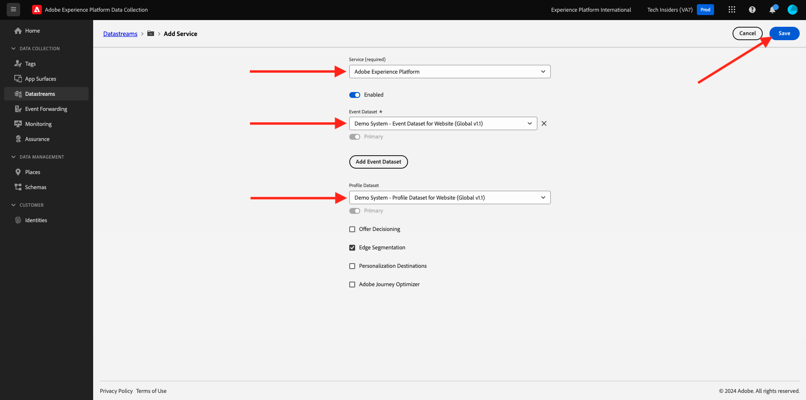

# 0.3建立您的資料串流

移至[https://experience.adobe.com/#/data-collection/](https://experience.adobe.com/#/data-collection/)。 在上一個練習後，您現在有兩個資料收集屬性：一個用於網頁，一個用於行動裝置。

這些屬性幾乎已準備好使用，但在您開始使用這些屬性收集資料之前，您需要設定資料流。 您將獲得更多有關什麼是資料流的概念及其在練習1.2中的意義的資訊。

目前，請依照下列步驟操作。

## 0.3.1建立網頁的資料流

按一下&#x200B;**[!UICONTROL 資料串流]**&#x200B;或&#x200B;**[!UICONTROL 資料串流(Beta)]**。

在熒幕的右上角，選取您的沙箱名稱，應為`--aepSandboxId--`。

按一下&#x200B;**[!UICONTROL 新增資料流]**。

針對&#x200B;**[!UICONTROL 易記名稱]**，以及選用的說明，請輸入`--demoProfileLdap-- - Demo System Datastream`。 若為事件結構描述，請選取&#x200B;**Demo System — 網站的事件結構描述（全域v1.1）**。 按一下&#x200B;**儲存**。

您將會看到此訊息。 按一下&#x200B;**新增服務**。

選取將公開其他欄位的服務&#x200B;**[!UICONTROL Adobe Experience Platform]**。 您將會看到此訊息。

對於事件資料集，請選取&#x200B;**Demo System - Website (Global v1.1)**&#x200B;的事件資料集，而對於設定檔資料集，請選取&#x200B;**Demo System - Profile Dataset for Website (Global v1.1)**。 按一下&#x200B;**儲存**。

您現在將會看到此訊息。

就目前而言，答案是肯定的。 在[模組1.1](./../../../modules/datacollection/module1.1/data-ingestion-launch-web-sdk.md)中，您將會進一步瞭解Web SDK以及如何設定其所有功能。

在左側功能表中，按一下&#x200B;**[!UICONTROL 標籤]**。

篩選搜尋結果以檢視您的兩個資料收集屬性。 按一下&#x200B;**Web**&#x200B;的屬性以將其開啟。

您將會看到此訊息。 按一下&#x200B;**擴充功能**。

在Adobe Experience Platform Web SDK擴充功能上，按一下&#x200B;**設定**。

您將會看到此訊息。 對於&#x200B;**資料串流**，您目前會看到虛擬值設為1。 您現在需要按一下&#x200B;**從清單選擇**&#x200B;選項按鈕。 在下拉式清單中，選取您先前建立的資料流。

確定已選取您的&#x200B;**資料流**。 秘訣：您可以輸入`--demoProfileLdap--`，輕鬆篩選下拉式清單中的結果。

向下捲動，直到您看到&#x200B;**資料集合**&#x200B;為止。 請確定&#x200B;**啟用點選資料彙集**&#x200B;的核取方塊未啟用。 按一下[儲存]儲存變更。****

移至&#x200B;**發佈流程**。

按一下&#x200B;**主要**&#x200B;的&#x200B;**...**，然後按一下&#x200B;**編輯**。

按一下[新增所有變更的資源]**，然後按一下[儲存並建置以供開發]****。**

您的變更正在發佈中，將於幾分鐘後準備就緒。

## 0.3.2為行動裝置建立資料流

移至[https://experience.adobe.com/#/data-collection/](https://experience.adobe.com/#/data-collection/)。

按一下&#x200B;**[!UICONTROL 資料串流]**&#x200B;或&#x200B;**[!UICONTROL 資料串流(Beta)]**。

![按一下左側導覽中的[資料流]圖示](./images/edgeconfig1a.png)

在熒幕的右上角，選取您的沙箱名稱，應為`--aepSandboxId--`。

按一下&#x200B;**[!UICONTROL 新增資料流]**。

![按一下左側導覽中的[資料流]圖示](./images/edgeconfig1.png)

針對&#x200B;**[!UICONTROL 易記名稱]**，以及選用的說明，請輸入`--demoProfileLdap-- - Demo System Datastream (Mobile)`。 針對事件結構描述，選取&#x200B;**示範系統 — 行動應用程式的事件結構描述（全域v1.1）**。 按一下&#x200B;**儲存**。

按一下&#x200B;**[!UICONTROL 儲存]**。

您將會看到此訊息。 按一下&#x200B;**新增服務**。

選取將公開其他欄位的服務&#x200B;**[!UICONTROL Adobe Experience Platform]**。 您將會看到此訊息。

若為事件資料集，請選取&#x200B;**行動應用程式（全域1.1版）的示範系統 — 事件資料集**，而若為設定檔資料集，請選取&#x200B;**行動應用程式（全域1.1版）的示範系統 — 設定檔資料集**。 按一下&#x200B;**儲存**。

您將會看到此訊息。

您的資料流現在已準備好用於行動裝置的Adobe Experience Platform Data Collection使用者端屬性。

移至&#x200B;**標籤**&#x200B;並篩選搜尋結果，以檢視您的兩個資料收集屬性。 按一下&#x200B;**Mobile**&#x200B;以開啟屬性。

您將會看到此訊息。 按一下&#x200B;**擴充功能**。

在&#x200B;**Adobe Experience PlatformEdge Network**&#x200B;擴充功能上，按一下&#x200B;**設定**。

您將會看到此訊息。 您現在需要選取您剛才設定的正確沙箱和資料流。 要使用的沙箱是`--aepSandboxId--`，而資料流稱為`--demoProfileLdap-- - Demo System Datastream (Mobile)`。

對於&#x200B;**Edge Network網域**，請使用預設網域&#x200B;**edge.adobedc.net**。

按一下[儲存]儲存變更。****

移至&#x200B;**發佈流程**。

按一下&#x200B;**主要**&#x200B;旁的&#x200B;**...**，然後按一下&#x200B;**編輯**。

按一下[新增所有變更的資源]**，然後按一下[儲存並建置以供開發]****。**

您的變更正在發佈中，將於幾分鐘後準備就緒。

下一步： [0.4使用網站](./ex4.md)

[返回模組0](./getting-started.md)

[返回所有模組](./../../../overview.md)