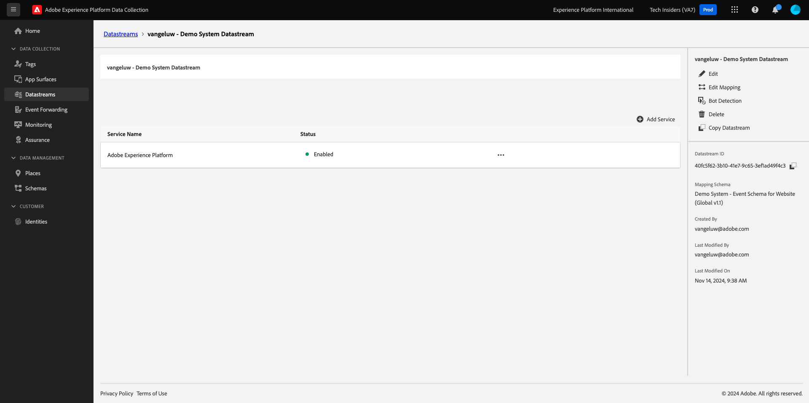
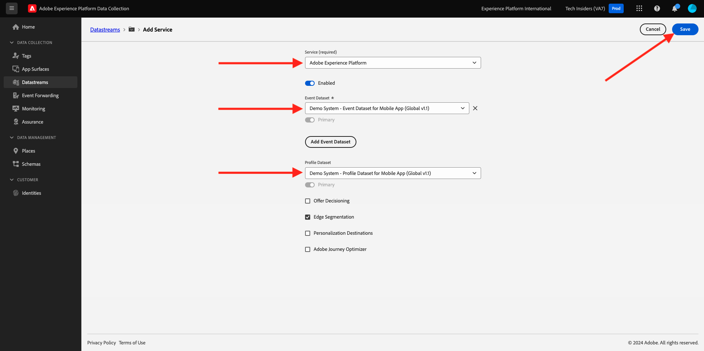

# 建立您的資料串流

移至[https://experience.adobe.com/#/data-collection/](https://experience.adobe.com/#/data-collection/)。

在左側功能表中，按一下&#x200B;**[!UICONTROL 標籤]**。 在上一個練習後，您現在有3個資料收集屬性：一個適用於Web、一個適用於行動裝置，一個適用於CX應用程式。

這些屬性幾乎已準備好使用，但在您開始使用這些屬性收集資料之前，您需要設定資料流。 在稍後的「資料收集」模組中的練習中，您將取得有關資料串流概念及其意義的更多資訊。

目前，請依照下列步驟操作。

## 建立網頁的資料流

按一下&#x200B;**[!UICONTROL 資料串流]**。

在熒幕的右上角，選取您的沙箱名稱，應為`--aepSandboxName--`。

按一下&#x200B;**[!UICONTROL 新增資料流]**。

對於&#x200B;**[!UICONTROL Name]**，以及選用的說明，請輸入`--aepUserLdap-- - Demo System Datastream`。 針對&#x200B;**對應結構描述**，請選取&#x200B;**示範系統 — 網站的事件結構描述（全域v1.1）**。 按一下&#x200B;**儲存**。

您將會看到此訊息。 按一下&#x200B;**新增服務**。

選取將公開其他欄位的服務&#x200B;**[!UICONTROL Adobe Experience Platform]**。 您將會看到此訊息。

對於事件資料集，請選取&#x200B;**Demo System - Website (Global v1.1)**&#x200B;的事件資料集，而對於設定檔資料集，請選取&#x200B;**Demo System - Profile Dataset for Website (Global v1.1)**。 按一下&#x200B;**儲存**。

您現在將會看到此訊息。

就目前而言，答案是肯定的。 在[模組1.1](./../../../modules/datacollection/module1.1/data-ingestion-launch-web-sdk.md)中，您將深入瞭解Web SDK以及如何設定其所有功能。

在左側功能表中，按一下&#x200B;**[!UICONTROL 標籤]**。

篩選搜尋結果以檢視您的資料收集屬性。 按一下&#x200B;**Web**&#x200B;的屬性以將其開啟。

您將會看到此訊息。 按一下&#x200B;**擴充功能**。

首先，按一下Adobe Experience Platform Web SDK擴充功能，然後按一下&#x200B;**設定**。

您將會看到此訊息。 在&#x200B;**Datastreams**&#x200B;功能表取得kook，並確定已選取正確的沙箱，此情況下應為`--aepSandboxName--`。

開啟&#x200B;**資料串流**&#x200B;下拉式清單，然後選取您先前建立的資料串流。

確定已在所有三個不同的環境中選取您的&#x200B;**資料串流**。 然後，按一下&#x200B;**儲存**。

移至&#x200B;**發佈流程**。

按一下&#x200B;**主要**&#x200B;的&#x200B;**...**，然後按一下&#x200B;**編輯**。

按一下[新增所有變更的資源]**，然後按一下[儲存並建置以供開發]****。**

您的變更正在發佈，並將在幾分鐘後準備就緒，之後您將會看到&#x200B;**主要**&#x200B;旁的綠色點。

## 為行動裝置建立資料流

移至[https://experience.adobe.com/#/data-collection/](https://experience.adobe.com/#/data-collection/)。

按一下&#x200B;**[!UICONTROL 資料串流]**。

![按一下左側導覽中的[資料流]圖示](./images/edgeconfig1a.png)

在熒幕的右上角，選取您的沙箱名稱，應為`--aepSandboxName--`。

按一下&#x200B;**[!UICONTROL 新增資料流]**。

![按一下左側導覽中的[資料流]圖示](./images/edgeconfig1.png)

針對&#x200B;**[!UICONTROL 易記名稱]**，以及選用的說明，請輸入`--aepUserLdap-- - Demo System Datastream (Mobile)`。 針對&#x200B;**對應結構描述**，請選取&#x200B;**示範系統 — 行動應用程式的事件結構描述（全域v1.1）**。 按一下&#x200B;**儲存**。

按一下&#x200B;**[!UICONTROL 儲存]**。

您將會看到此訊息。 按一下&#x200B;**新增服務**。

選取將公開其他欄位的服務&#x200B;**[!UICONTROL Adobe Experience Platform]**。 您將會看到此訊息。

若為事件資料集，請選取&#x200B;**行動應用程式（全域1.1版）的示範系統 — 事件資料集**，而若為設定檔資料集，請選取&#x200B;**行動應用程式（全域1.1版）的示範系統 — 設定檔資料集**。 按一下&#x200B;**儲存**。

您將會看到此訊息。

您的資料流現在已準備好用於行動裝置的Adobe Experience Platform Data Collection使用者端屬性。

移至&#x200B;**標籤**&#x200B;並篩選搜尋結果，以檢視您的資料收集屬性。 按一下&#x200B;**Mobile**&#x200B;以開啟屬性。

您將會看到此訊息。 按一下&#x200B;**擴充功能**。

按一下&#x200B;**Adobe Experience PlatformEdge Network**&#x200B;擴充功能，然後按一下&#x200B;**設定**。

您將會看到此訊息。 您現在需要選取您剛才設定的正確沙箱和資料流。 要使用的沙箱是`--aepSandboxName--`，而資料流稱為`--aepUserLdap-- - Demo System Datastream (Mobile)`。

對於&#x200B;**Edge Network網域**，請使用預設網域。

按一下[儲存]儲存變更。****

移至&#x200B;**發佈流程**。

按一下&#x200B;**主要**&#x200B;旁的&#x200B;**...**，然後按一下&#x200B;**編輯**。

按一下[新增所有變更的資源]**，然後按一下[儲存並建置以供開發]****。**

您的變更正在發佈，並將在幾分鐘後準備就緒，之後您將會看到&#x200B;**主要**&#x200B;旁的綠色點。

下一步： [使用網站](./ex4.md)

[返回快速入門](./getting-started.md)

[返回所有模組](./../../../overview.md)
