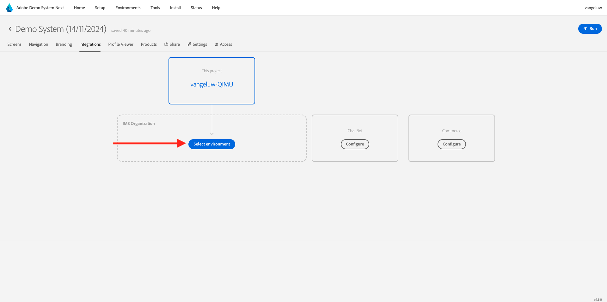
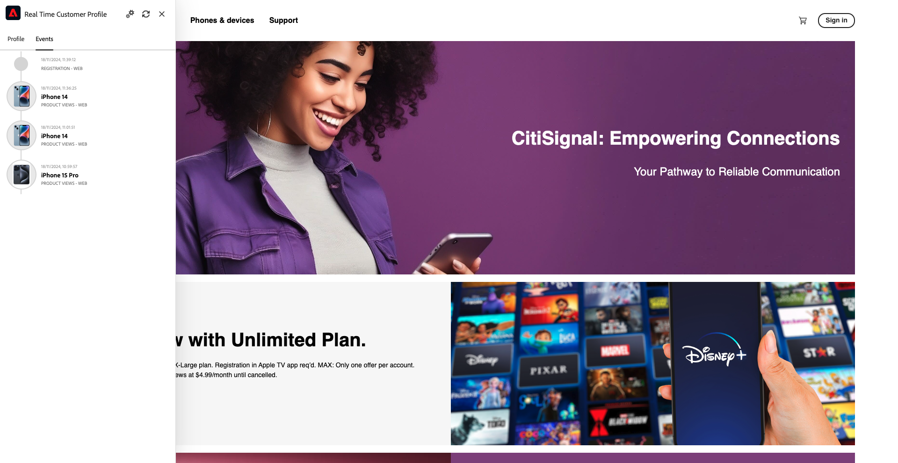
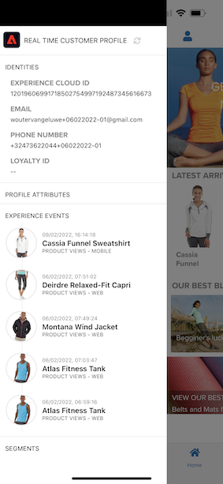

# 2.1.1從未知到網站上已知

## 內容

從未知到已知的歷程是這些天品牌中最重要的主題之一，就像客戶從贏取到保留的歷程。

Adobe Experience Platform在此歷程中擔當著重要角色。 Platform是溝通的大腦，「體驗記錄系統」。

Platform是一種環境，其中客戶一詞的含義比已知客戶更為廣泛。 在網站上的未知訪客也是Platform視角下的客戶，因此，作為未知訪客的所有行為也會傳送到Platform。 由於這種方法，當此訪客最終成為已知客戶時，品牌也可以將當下所發生的事情視覺化。 從歸因和體驗最佳化的角度來看，這很有幫助。

## 客戶歷程流程

移至[https://builder.adobedemo.com/projects](https://builder.adobedemo.com/projects)。 使用Adobe ID登入後，您會看到此訊息。 按一下您的網站專案以開啟。

在&#x200B;**Screens**&#x200B;頁面上按一下&#x200B;**執行**。

然後您會看到示範網站已開啟。 選取URL並將其複製到剪貼簿。

開啟新的無痕瀏覽器視窗。

貼上您在上一步中複製的示範網站URL。 接著，系統會要求您使用Adobe ID登入。

選取您的帳戶型別並完成登入程式。

接著，您會在無痕瀏覽器視窗中看到您的網站已載入。 對於每個示範，您都需要使用全新的無痕瀏覽器視窗來載入您的示範網站URL。

按一下畫面左上角的Adobe標誌圖示，開啟設定檔檢視器。

請檢視「設定檔檢視器」面板和即時客戶設定檔，並將&#x200B;**Experience CloudID**&#x200B;設為此目前未知客戶的主要識別碼。

您也可以檢視根據客戶行為收集的所有體驗事件。 清單目前是空的，但很快就會變更。

移至&#x200B;**Men**&#x200B;產品類別。 接著，按一下產品&#x200B;**Montana防風夾克**。

然後您會看到產品詳細資料頁面。 型別&#x200B;**產品檢視**&#x200B;的體驗事件現在已使用您在模組1中檢閱的Web SDK實作傳送至Adobe Experience Platform。

開啟「設定檔檢視器」面板，並檢視您的&#x200B;**體驗事件**。

返回&#x200B;**女性**&#x200B;類別頁面，然後按一下其他產品。 另一個體驗事件已傳送至Adobe Experience Platform。

開啟設定檔檢視器面板。 您現在會看到2個型別為&#x200B;**產品檢視**&#x200B;的體驗事件。 雖然行為是匿名的，但我們能夠追蹤每次點按，並將其儲存在Adobe Experience Platform中。 一旦知道匿名客戶，我們就可以自動將所有匿名行為合併到知道的設定檔。

前往「註冊/登入」頁面。 按一下&#x200B;**建立帳戶**。

填寫您的詳細資料，然後按一下&#x200B;**註冊**，之後您將會被重新導向到上一頁。

開啟設定檔檢視器面板，然後前往即時客戶設定檔。 在「設定檔檢視器」面板上，您應該會看到所有顯示的個人資料，例如新新增的電子郵件和電話識別碼。

在「設定檔檢視器」面板上，前往「體驗事件」。 您將會在「設定檔檢視器」面板上看到先前檢視過的2項產品。 這兩個事件現在也都連線到您的「已知」設定檔。

您現在已將資料內嵌至Adobe Experience Platform，且已將該資料連結至ECID和電子郵件地址等識別碼。 此課程的目標是瞭解您打算進行的業務內容。 在下一個練習中，您將開始設定所需的一切，以讓所有資料擷取成為可能。

### 瀏覽行動應用程式

成為已知客戶後，您就可以開始使用行動應用程式。 在iPhone上開啟行動應用程式，然後登入應用程式。

如果您尚未安裝應用程式，或忘記如何安裝，請在這裡檢視： [0.5使用行動應用程式](../../gettingstarted/gettingstarted/ex5.md)

依照指示安裝應用程式後，您會看到已載入Luma品牌的應用程式登陸頁面。 按一下畫面左上方的帳戶圖示。

在「登入」畫面上，使用您在案頭網站上使用的電子郵件地址登入。 按一下&#x200B;**登入**。

前往應用程式的主畫面，然後按一下以開啟任何產品。

然後您會看到產品詳細資料頁面。

前往應用程式的主畫面，然後在畫面上的左側撥動，以檢視「設定檔檢視器」面板。 然後您將會在&#x200B;**體驗事件**&#x200B;區段中看到您剛才檢視的產品，以及之前網站工作階段中的所有產品檢視。

現在返回您的桌上型電腦並重新整理首頁，之後您也會看到產品出現在那裡。

您現在已將資料內嵌至Adobe Experience Platform，且已將該資料連結至ECID和電子郵件地址等識別碼。 此練習的目標是瞭解您打算做什麼的業務環境。 您現在已有效建立即時、跨裝置客戶設定檔。 在下一個練習中，您將會繼續並在Adobe Experience Platform中視覺化您的設定檔。

下一步： [2.1.2將您自己的即時客戶設定檔視覺化 — UI](./ex2.md)

[返回模組2.1](./real-time-customer-profile.md)

[返回所有模組](../../../overview.md)
