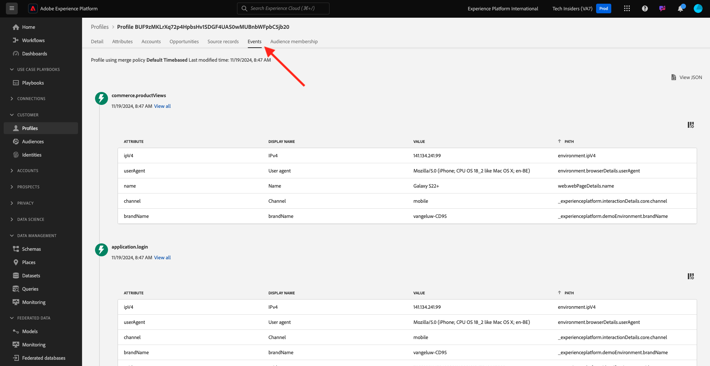
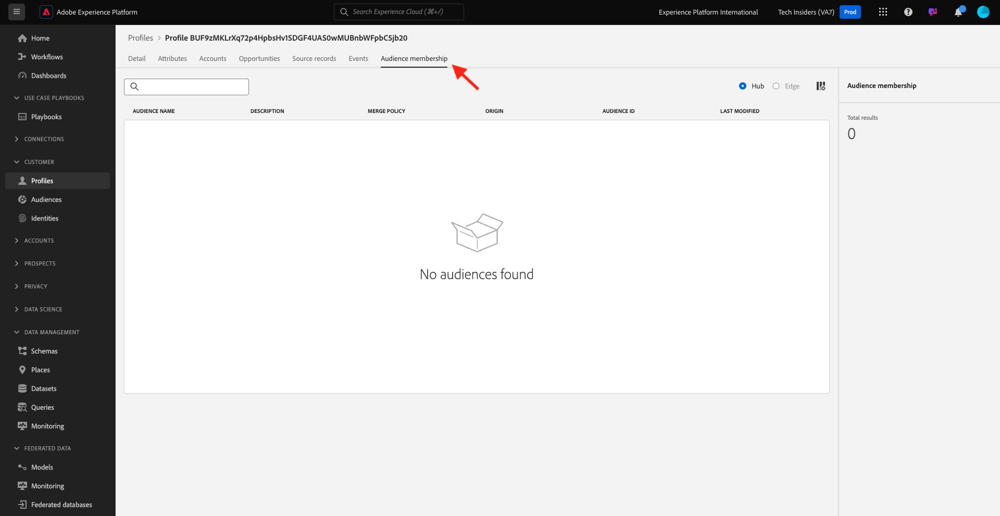

# 2.1.2將您自己的即時客戶個人檔案視覺化 — UI

在本練習中，您將登入Adobe Experience Platform並在UI中檢視您自己的即時客戶個人檔案。

## Story

在即時客戶個人檔案中，所有個人檔案資料都會與事件資料一起顯示，以及顯示現有的區段會籍。 顯示的資料可來自任何地方，包括Adobe應用程式和外部解決方案。 這是Adobe Experience Platform中最強大的檢視畫面，真正的體驗記錄系統。

## 2.1.2.1使用Adobe Experience Platform中的客戶設定檔檢視

移至[Adobe Experience Platform](https://experience.adobe.com/platform)。 登入後，您會登入Adobe Experience Platform的首頁。

繼續之前，您必須選取&#x200B;**沙箱**。 要選取的沙箱名為``--aepSandboxName--``。 您可以按一下熒幕上方藍線中的文字&#x200B;**[!UICONTROL Production Prod]**&#x200B;來執行此操作。 選取適當的[!UICONTROL 沙箱]後，您將會看到畫面變更，現在您已在專屬的[!UICONTROL 沙箱]中。

在左側功能表中，移至&#x200B;**設定檔**&#x200B;和&#x200B;**瀏覽**。

在您網站上的「設定檔檢視器」面板上，您可以找到多個身分。 每個身分都會連結至名稱空間。

在「設定檔檢視器」面板上，您可以看到ID和名稱空間的下列組合：

| 身分 | 命名空間 |
|:-------------:| :---------------:|
| Experience CloudID (ECID) | 12507560687324495704459439363261812234 |
| 電子郵件ID | woutervangeluwe+06022022-01@gmail.com |
| 行動電話號碼ID | +32473622044+06022022-01 |

有了Adobe Experience Platform，所有ID都同等重要。 之前，ECID是Adobe內容中最重要的訪客ID，其他所有ID都是以階層式關係連結至ECID。 使用Adobe Experience Platform後，情況已完全不同，每個ID都可視為主要識別碼。

通常，主要識別碼取決於內容。 如果您詢問客服中心，**最重要的識別碼是什麼？**&#x200B;他們可能會接聽，**電話號碼！**，但如果您詢問您的CRM團隊，他們會回答，**電子郵件地址！** Adobe Experience Platform瞭解這項複雜性，並為您管理它。 每個應用程式(不論是Adobe應用程式或非Adobe應用程式)都會參照其視為主要的ID與Adobe Experience Platform交談。 而且它就是這麼運作的。

對於&#x200B;**身分識別名稱空間**&#x200B;欄位，請選取&#x200B;**電子郵件**，對於&#x200B;**身分識別值**&#x200B;欄位，請輸入您在上一個練習中用來註冊的電子郵件地址。 按一下&#x200B;**檢視**。 然後，您將在清單中看到您的設定檔。 按一下&#x200B;**設定檔識別碼**&#x200B;以開啟您的設定檔。

您現在可以看到客戶設定檔的一些重要&#x200B;**設定檔屬性**&#x200B;的概觀。

如果您想要檢視設定檔的所有可用設定檔屬性，請移至&#x200B;**屬性**。

移至&#x200B;**事件**，您可在其中檢視連結至設定檔之每個體驗事件的專案。

最後，移至功能表選項&#x200B;**區塊會籍**。 您現在會看到所有符合此設定檔資格的區段。

現在您已瞭解如何使用Adobe Experience Platform的使用者介面來檢視任何客戶的即時設定檔，讓我們使用Postman和Adobe I/O來針對Adobe Experience Platform的API進行查詢，透過API做同樣的事情。

下一步： [2.1.3將您自己的即時客戶設定檔視覺化 — API](./ex3.md)

[返回模組2.1](./real-time-customer-profile.md)

[返回所有模組](../../../overview.md)
