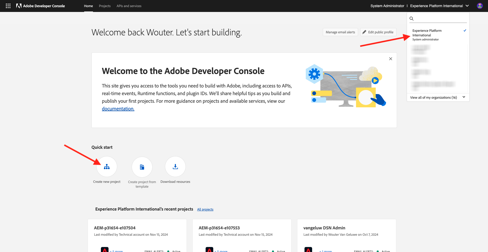
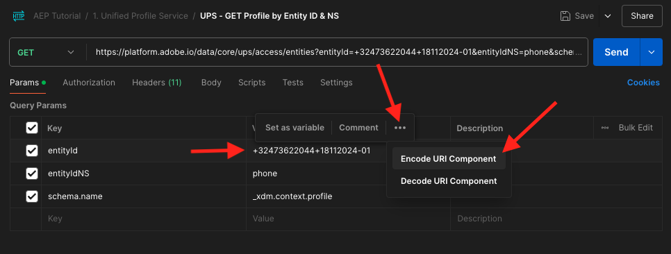
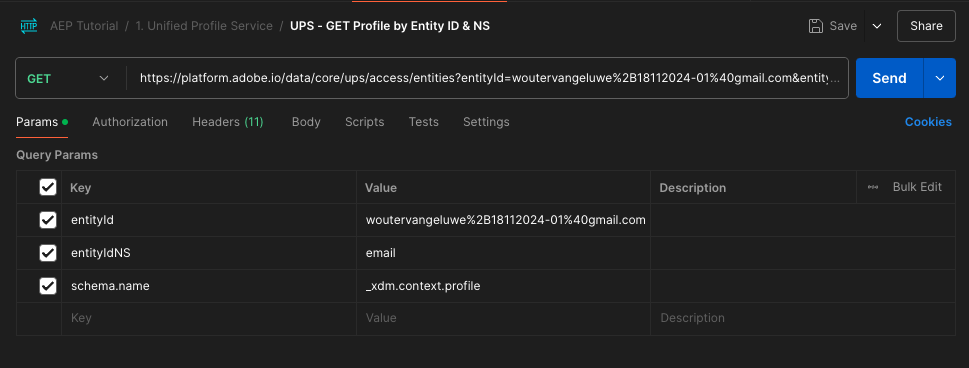

# 2.1.3將您自己的即時客戶設定檔視覺化 — API

在本練習中，您將使用Postman和Adobe I/O來查詢Adobe Experience Platform的API，以檢視您自己的即時客戶設定檔。

## Story

在即時客戶個人檔案中，所有個人檔案資料都會與事件資料一起顯示，以及顯示現有的區段會籍。 顯示的資料可來自任何地方，包括Adobe應用程式和外部解決方案。 這是Adobe Experience Platform中功能最強大的檢視方式，也是體驗記錄系統。

即時客戶個人檔案可供所有Adobe應用程式使用，也可以供呼叫中心或店內客戶服務應用程式等外部解決方案使用。 方法是將這些外部解決方案連線至Adobe Experience Platform的API。

## 2.1.3.1您的識別碼

在網站上的「設定檔檢視器」面板上，您可以找到多個身分。 每個身分都會連結至名稱空間。


在X-ray面板上，我們可以看到4種不同的ID和名稱空間組合：

| 身分 | 命名空間 |
|:-------------:| :---------------:|
| Experience CloudID (ECID) | 12507560687324495704459439363261812234 |
| 電子郵件ID | woutervangeluwe+06022022-01@gmail.com |
| 行動電話號碼ID | +32473622044+06022022-01 |

請記住這些識別碼以利後續步驟。

有了這些ID，請前往Postman。

## 2.1.3.2設定您的Adobe I/O專案

在本練習中，您將密集使用Adobe I/O來查詢平台的API。 請依照下列步驟設定Adobe I/O。

移至[https://developer.adobe.com/console/home](https://developer.adobe.com/console/home)


請務必在熒幕右上角選取正確的Adobe Experience Platform執行個體。 您的執行個體是`--envName--`。



按一下&#x200B;**建立新專案**。

或


選取&#x200B;**+新增至專案**&#x200B;並選取&#x200B;**API**。


然後您會看到以下內容：


按一下&#x200B;**Adobe Experience Platform**圖示。
/images/api2.png)

按一下&#x200B;**Experience PlatformAPI**。


按一下&#x200B;**下一步**。


您現在可以選擇讓Adobe I/O產生您的安全性金鑰組，或上傳現有的金鑰組。

選擇&#x200B;**選項1 — 產生金鑰組**。


按一下&#x200B;**產生金鑰組**。


您將看到旋轉圖示約30秒。


您會看到此訊息，而您產生的金鑰組將下載為zip檔案： **config.zip**。

在案頭上解壓縮檔案&#x200B;**config.zip**，您會看到其中包含2個檔案：


- **certificate_pub.crt**&#x200B;是您的公開金鑰憑證。 從安全性角度來看，這是可自由用來設定與線上應用程式整合的憑證。
- **private.key**&#x200B;是您的私密金鑰。 永遠不應與任何人共用此內容。 私密金鑰是您用來驗證API實作的金鑰，且應該是機密。 如果您與任何人共用私密金鑰，他們可能會存取您的實作，並濫用API將惡意資料擷取至Platform，並擷取Platform中的所有資料。


請務必將&#x200B;**config.zip**&#x200B;檔案儲存在安全位置，因為您後續步驟以及日後存取Adobe I/O和Adobe Experience Platform API時都需要此檔案。

按一下&#x200B;**下一步**。


您現在必須選取整合的&#x200B;**產品設定檔**。

選取所需的產品設定檔。

**參考資訊**：在您的Adobe Experience Platform執行個體中，產品設定檔將具有不同的命名。 您至少需要選取一個具有適當存取許可權的產品設定檔，這些設定檔是在Adobe Admin Console中設定的。


按一下&#x200B;**儲存設定的API**。


您將會看到旋轉圖示幾秒鐘。


接下來，您將會看到您的整合。


按一下「下載Postman **」按鈕，然後按一下「服務帳戶(JWT)」**&#x200B;來下載Postman環境（等候下載環境，這可能需要幾秒鐘的時間）。****


向下捲動，直到您看到&#x200B;**服務帳戶(JWT)**&#x200B;為止，您可在這裡找到所有用於設定與Adobe Experience Platform整合的整合詳細資訊。


您的IO專案目前有一個通用名稱。 您需要為整合提供易記名稱。 按一下所示的&#x200B;**專案1** （或類似名稱）


按一下&#x200B;**編輯專案**。


輸入整合的「名稱」和「說明」。 作為命名慣例，我們將使用`AEP API --aepUserLdap--`。 將ldap取代為您的ldap。
例如，如果您的ldap是vangeluw，則整合的名稱和說明會變成AEP API vangeluw。

輸入`AEP API --aepUserLdap--`作為&#x200B;**專案標題**。 按一下&#x200B;**儲存**。


您的Adobe I/O整合現已完成。


## 2.1.3.3 Postman驗證至Adobe I/O

移至[https://www.getpostman.com/](https://www.getpostman.com/)。

按一下&#x200B;**開始使用**。


接下來，下載並安裝Postman。


安裝Postman後，請啟動應用程式。

Postman中有2個概念：「環境」和「集合」。

- 「環境」包含您所有或多或少一致的環境變數。 在環境中，您可以找到類似平台環境的IMSOrg，以及您的私密金鑰等安全性憑證。 環境檔案是您在上一個練習中的Adobe I/O設定期間下載的檔案，其名稱如下： **service.postman_environment.json**。

- 集合包含您可以使用的許多API請求。 我們將使用2個集合
   - 1個AdobeI/0驗證的集合
   - 1此單元練習的集合
   - 1個用於Real-Time CDP模組中練習的集合，用於目的地製作

請將檔案[postman.zip](./../../../assets/postman/postman_profile.zip)下載到您的本機案頭。

在此&#x200B;**postman.zip**&#x200B;檔案中，您會找到下列檔案：

- `_Adobe I-O - Token.postman_collection.json`
- `_Adobe Experience Platform Enablement.postman_collection.json`
- `Destination_Authoring_API.json`

解壓縮&#x200B;**postman.zip**&#x200B;檔案，並將這3個檔案連同從Adobe I/O下載的Postman環境儲存在案頭上的資料夾中。您需要在該資料夾中有這4個檔案：


返回Postman。 按一下&#x200B;**匯入**。


按一下&#x200B;**上傳檔案**。


導覽至您案頭上解壓縮4個下載檔案的資料夾。 同時選取這4個檔案，然後按一下[開啟]。****


按一下&#x200B;**開啟**&#x200B;後，Postman會顯示您即將匯入的環境與集合的概觀。 按一下&#x200B;**匯入**。


您現在已擁有Postman所需的一切，可開始透過API與Adobe Experience Platform互動。

首先要做的就是確保您已正確驗證。 若要進行驗證，您需要請求存取權杖。

在執行任何要求之前，請確定您已選取正確的環境。 您可以驗證右上角的環境下拉式清單，以檢查目前選取的環境。

所選環境的名稱應類似於以下名稱：


按一下&#x200B;**eye**&#x200B;圖示，然後按一下&#x200B;**編輯**&#x200B;以更新環境檔案中的私密金鑰。


您將會看到此訊息。 除了欄位&#x200B;**PRIVATE_KEY**&#x200B;外，所有欄位都已預先填入。


私密金鑰是在您建立Adobe I/O專案時產生的。 已下載為名為&#x200B;**config.zip**&#x200B;的ZIP檔案。 將該zip檔案解壓縮至您的案頭。


開啟資料夾&#x200B;**config**，然後使用您選擇的文字編輯器開啟檔案&#x200B;**private.key**。


然後您會看到類似此內容，將所有文字複製到剪貼簿。


返回Postman，針對欄&#x200B;**INITIAL VALUE**&#x200B;和&#x200B;**CURRENT VALUE**，在變數&#x200B;**PRIVATE_KEY**&#x200B;旁的欄位中貼上私密金鑰。 按一下&#x200B;**儲存**。


您的Postman環境和集合現已設定完畢，可正常運作。 您現在可以從Postman驗證Adobe I/O。

為此，您需要載入外部程式庫，以負責通訊的加密和解密。 若要載入此程式庫，您必須執行名稱為&#x200B;**INIT：載入RS256**&#x200B;的密碼編譯程式庫的要求。 在&#x200B;**_Adobe I/O - Token集合**&#x200B;中選取此要求，您會看到它顯示在畫面中央。


按一下藍色的&#x200B;**傳送**&#x200B;按鈕。 幾秒後，您應該會在Postman的&#x200B;**內文**&#x200B;區段中看到回應：


現在載入加密編譯程式庫後，我們就能向Adobe I/O進行驗證。

在&#x200B;**\_Token集合**&#x200B;中，選取名稱為&#x200B;**IMS： JWT Generate + Auth**&#x200B;的Adobe I/O。 同樣地，您會在畫面中央看到請求詳細資訊。


按一下藍色的&#x200B;**傳送**&#x200B;按鈕。 幾秒後，您應該會在Postman的&#x200B;**內文**&#x200B;區段中看到回應：


如果設定成功，您應該會看到包含下列資訊的類似回應：

| 索引鍵 | 值 |
|:-------------:| :---------------:| 
| token_type | **持有人** |
| access_token | **eyJ4NXUiOiJpbXNfbmEx...QT7mqZkumN1tdsPEioOEl4087Dg** |
| expires_in | **86399973** |

Adobe I/O已為您提供&#x200B;**bearer**-token，具有特定值（這個很長的存取權杖）和到期視窗。

我們收到的Token現在有24小時有效。 這表示24小時後，如果您要使用Postman驗證Adobe I/O，必須再次執行此請求以產生新Token。

## 2.1.3.4即時客戶設定檔API，結構：設定檔

現在，您可以傳送您的第一個要求至Platform的即時客戶設定檔API。

在Postman中，找到集合&#x200B;**_Adobe Experience Platform Enablement**。


在&#x200B;**1中。 整合設定檔服務**，請選取名稱為&#x200B;**UPS的第一個要求 — 依實體ID與NS** GET設定檔。


對於此請求，有三個必要的變數：

| 索引鍵 | 值 | 定義 |
|:-------------:| :---------------:| :---------------:| 
| entityId | **id** | 特定客戶ID |
| entityIdNS | **名稱空間** | 適用於ID的特定名稱空間 |
| schema.name | **_xdm.context.profile** | 您要接收其資訊的特定結構描述 |

因此，如果您想要要求Adobe Experience Platform的API傳回您自己ECID的所有設定檔資訊，您必須依下列方式設定請求：

| 索引鍵 | 值 |
|:-------------:| :---------------:| 
| entityId | **您的ECID** |
| entityIdNS | **ecid** |
| schema.name | **_xdm.context.profile** |


您也應該驗證請求的&#x200B;**標頭** — 欄位。 移至&#x200B;**標頭**。 然後您會看到以下內容：


| 索引鍵 | 值 |
| ----------- | ----------- |
| x-sandbox-name | `--aepSandboxName--` |

>[!NOTE]
>
>您必須指定正在使用的Adobe Experience Platform沙箱名稱。 您的x-sandbox-name應為`--aepSandboxName--`。

按一下&#x200B;**傳送**，將您的要求傳送至Platform。

您應該會立即收到Platform的回應，顯示如下內容：


這是來自Platform的完整回應：

```javascript
{
    "A28iM3aJBJRbEQpOnUh5HOM9": {
        "entityId": "A28iM3aJBJRbEQpOnUh5HOM9",
        "mergePolicy": {
            "id": "e632ccb8-882a-4b5e-8375-96a1ba3df1aa"
        },
        "sources": [
            "61fe23c5be4b5f19485dc379",
            "profile-streaming-segment",
            "61fe23cfa07c1219489b3ba4"
        ],
        "tags": [
            "1644130566774:1542:232:va7",
            "0a1e9dd4-940a-46ec-9114-7e371cf5c4d0",
            "aep_ups_partitioned_profile_cdc_low_lag_sla_0:106:1090888313",
            "a6fed09e-2c56-403e-8692-4e99e4779dfa:IRL1",
            "1644419616318:2989:31:va7",
            "aep_ups_profile_change_event_prod_va7:71:7946633524-8361f22c-c09e-4364-b24b-b57435c4d14f"
        ],
        "identityGraph": [
            "BUF9zMKLrXq72p4HpbsHv1SSBnr0LTAxQGdtYWlsLmNvbQ",
            "GkicrkFjgmCjUg",
            "GtCbrkFjgkSOFg",
            "A2-AP9zOsakzNTe9Rqwf7Wse",
            "BkFuK4QcJpSPByuSBnr0LTAx",
            "A28jSB484ziuECF3fEoXmFlF",
            "A28iM3aJBJRbEQpOnUh5HOM9"
        ],
        "entity": {
            "_experienceplatform": {
                "individualCharacteristics": {},
                "loyaltyDetails": {
                    "level": "Basic",
                    "points": 0
                },
                "identification": {
                    "core": {
                        "phoneNumber": "+32473622044+06022022-01",
                        "email": "woutervangeluwe+06022022-01@gmail.com",
                        "loyaltyId": "5415776",
                        "ecid": "12019606991718502754997192487345616673",
                        "crmId": "1478212"
                    }
                }
            },
            "personalEmail": {
                "address": "woutervangeluwe+06022022-01@gmail.com"
            },
            "_repo": {
                "createDate": "2022-02-06T06:56:06.424Z"
            },
            "testProfile": true,
            "homeAddress": {
                "postalCode": "1831",
                "city": "Diegem",
                "street1": "Culliganlaan 2F"
            },
            "mobilePhone": {
                "number": "+32473622044+06022022-01"
            },
            "segmentMembership": {
                "ups": {
                    "bc999ded-b6d7-40d4-87a7-d3a280b950e3": {
                        "lastQualificationTime": "2022-02-09T20:38:33Z",
                        "status": "exited"
                    },
                    "23b1cd4e-d62f-44bd-8392-3095a33109c4": {
                        "lastQualificationTime": "2022-02-09T20:38:33Z",
                        "status": "exited"
                    },
                    "f0807704-a1c8-4ac4-85dd-60db2fbf18f1": {
                        "lastQualificationTime": "2022-02-09T20:38:33Z",
                        "status": "existing"
                    }
                }
            },
            "person": {
                "name": {
                    "lastName": "Van Geluwe",
                    "firstName": "Wouter"
                },
                "gender": "female",
                "birthDate": "1982-07-08"
            },
            "userActivityRegions": {
                "IRL1": {
                    "captureTimestamp": "2022-02-09T15:21:11Z"
                }
            },
            "identityMap": {
                "email": [
                    {
                        "id": "woutervangeluwe+06022022-01@gmail.com"
                    }
                ],
                "crmid": [
                    {
                        "id": "1478212"
                    }
                ],
                "ecid": [
                    {
                        "id": "12507560687324495704459439363261812234"
                    },
                    {
                        "id": "12019606991718502754997192487345616673"
                    },
                    {
                        "id": "38335942889672702722192106363935964471"
                    }
                ],
                "phone": [
                    {
                        "id": "+32473622044+06022022-01"
                    }
                ],
                "loyaltyid": [
                    {
                        "id": "5415776"
                    }
                ]
            }
        },
        "lastModifiedAt": "2022-02-09T20:38:36Z"
    }
}
```

這是此ECID目前在Platform中的所有可用設定檔資料。

您不需要使用ECID來向Platform的即時客戶設定檔請求設定檔資料，您可以使用任何名稱空間中的任何ID來請求此資料。

讓我們回到Postman假裝我們是客服中心，並傳送要求給Platform，指定&#x200B;**電話**&#x200B;的名稱空間和您的行動電話號碼。

因此，如果您想要要求Platform的API傳回特定電話的所有設定檔資訊，您必須依下列方式設定請求：

| 索引鍵 | 值 |
|:-------------:| :---------------:| 
| entityId | **您的電話號碼** |
| entityIdNS | **phone** （以電話取代ecid） |
| schema.name | **_xdm.context.profile** |

如果您的電話號碼包含&#x200B;**+**&#x200B;等特殊符號，則必須選取完整的電話號碼、按一下滑鼠右鍵並按一下&#x200B;**EncodeURIComponent**。



之後，您將會擁有此專案：


您也應該驗證請求的&#x200B;**標頭** — 欄位。 移至&#x200B;**標頭**。 然後您會看到以下內容：


| 索引鍵 | 值 |
| ----------- | ----------- |
| x-sandbox-name | `--aepSandboxName--` |

>[!NOTE]
>
>您必須指定正在使用的Adobe Experience Platform沙箱名稱。 您的x-sandbox-name應為`--aepSandboxName--`。

按一下藍色&#x200B;**傳送**&#x200B;按鈕，然後驗證回應。


讓我們針對您的電子郵件地址執行相同的動作，指定&#x200B;**電子郵件**&#x200B;的名稱空間和您的電子郵件地址。

因此，如果您想要要求Platform的API傳回特定電子郵件地址的所有設定檔資訊，您必須依下列方式設定請求：

| 索引鍵 | 值 |
|:-------------:| :---------------:| 
| entityId | **您的電子郵件** |
| entityIdNS | **電子郵件** （以電子郵件取代電話） |
| schema.name | **_xdm.context.profile** |

如果您的電子郵件地址包含&#x200B;**+**&#x200B;等特殊符號，則必須選取完整的電子郵件地址、按一下滑鼠右鍵並按一下&#x200B;**EncodeURIComponent**。


之後，您將會擁有此專案：



您也應該驗證請求的&#x200B;**標頭** — 欄位。 移至&#x200B;**標頭**。 然後您會看到以下內容：


| 索引鍵 | 值 |
| ----------- | ----------- |
| x-sandbox-name | `--aepSandboxName--` |

>[!NOTE]
>
>您必須指定正在使用的Adobe Experience Platform沙箱名稱。 您的x-sandbox-name應為`--aepSandboxName--`。

按一下藍色&#x200B;**傳送**&#x200B;按鈕，然後驗證回應。


這是提供給品牌的一種非常重要的彈性。 這表示任何環境都可以使用自己的ID和名稱空間，將請求傳送至Platform，不必瞭解多個名稱空間和ID的複雜性。

例如：

- 客服中心將使用名稱空間&#x200B;**電話**&#x200B;向Platform要求資料
- 熟客系統將使用名稱空間&#x200B;**電子郵件**&#x200B;向平台要求資料
- 線上應用程式可能會使用名稱空間&#x200B;**ecid**

客服中心不一定會知道忠誠度系統中使用了哪種識別碼，而忠誠度系統也不一定會知道線上應用程式使用了哪種識別碼。 每個系統都可以使用自己所擁有和瞭解的資訊，在需要時取得所需的資訊。

## 2.1.3.5即時客戶設定檔API、結構：設定檔和ExperienceEvent

在成功查詢了設定檔資料的Platform API後，現在讓我們對ExperienceEvent資料執行相同的操作。

在Postman中，找到集合&#x200B;**_Adobe Experience Platform Enablement**。


在&#x200B;**1中。 整合設定檔服務**，請選取名稱為&#x200B;**UPS — 依實體ID和NS** GET設定檔和EE的第二個要求。


對於此請求，有四個必要的變數：

| 索引鍵 | 值 | 定義 |
|:-------------:| :---------------:|  :---------------:| 
| schema.name | **_xdm.context.experienceevent** | 您要接收其資訊的特定結構描述。 在此案例中，我們要尋找對應至ExperienceEvent結構描述的資料。 |
| relatedSchema.name | **_xdm.context.profile** | 在尋找對應至ExperienceEvent結構描述的資料時，我們需要指定想要接收該資料的身分。 有權存取身分的結構描述是Profile-schema，所以這裡的relatedSchema是Profile-schema。 |
| relatedEntityId | **id** | 特定客戶ID |
| relatedentityidNS | **名稱空間** | 適用於ID的特定名稱空間 |

因此，如果您想要要求Platform的API傳回您自己ecid的所有設定檔資訊，您必須依下列方式設定請求：

| 索引鍵 | 值 |
|:-------------:| :---------------:| 
| schema.name | **_xdm.context.experienceevent** |
| relatedSchema.name | **_xdm.context.profile** |
| relatedEntityId | **您的ECID** |
| relatedentityidNS | **ecid** |


您也應該驗證請求的&#x200B;**標頭** — 欄位。 移至&#x200B;**標頭**。 然後您會看到以下內容：


| 索引鍵 | 值 |
| ----------- | ----------- |
| x-sandbox-name | `--aepSandboxName--` |

>[!NOTE]
>
>您必須指定正在使用的Adobe Experience Platform沙箱名稱。 您的x-sandbox-name應為`--aepSandboxName--`。

按一下&#x200B;**傳送**，將您的要求傳送至Platform。

您應該會立即收到Platform的回應，顯示如下內容：


以下是來自Platform的完整回應。 在此範例中，有八個ExperienceEvents連結至此客戶的ECID。 請檢視下方，以檢視請求上的不同變數，因為您在下方看到的內容，是先前練習中您在Launch中設定的直接結果。

此外，當X-ray面板顯示ExperienceEvent資訊時，它會使用以下裝載來剖析和擷取資訊，例如產品名稱（搜尋以下裝載中的productName）和產品影像URL （搜尋以下裝載中的productImageUrl）。

```javascript
{
    "_page": {
        "orderby": "timestamp",
        "start": "d686ab8a-2d0c-4722-9ff5-bfc1020b0b55-0",
        "count": 31,
        "next": ""
    },
    "children": [
        {
            "relatedEntityId": "A28iM3aJBJRbEQpOnUh5HOM9",
            "entityId": "d686ab8a-2d0c-4722-9ff5-bfc1020b0b55-0",
            "timestamp": 1644127126596,
            "entity": {
                "environment": {
                    "ipV4": "213.118.129.117",
                    "type": "browser",
                    "browserDetails": {
                        "viewportHeight": 969,
                        "viewportWidth": 1920,
                        "userAgent": "Mozilla/5.0 (Macintosh; Intel Mac OS X 10_15_7) AppleWebKit/537.36 (KHTML, like Gecko) Chrome/98.0.4758.80 Safari/537.36"
                    }
                },
                "web": {
                    "webPageDetails": {
                        "pageViews": {
                            "value": 1
                        },
                        "name": "vangeluw-OCUC",
                        "URL": "https://builder.adobedemo.com/run/vangeluw-OCUC"
                    },
                    "webReferrer": {
                        "URL": "https://adobe.okta.com/"
                    }
                },
                "_experienceplatform": {
                    "interactionDetails": {
                        "core": {
                            "channel": "web"
                        }
                    },
                    "demoEnvironment": {
                        "brandName": "vangeluw-OCUC"
                    },
                    "identification": {
                        "core": {
                            "ecid": "12507560687324495704459439363261812234"
                        }
                    }
                },
                "implementationDetails": {
                    "name": "https://ns.adobe.com/experience/alloy/reactor",
                    "version": "2.8.0+2.9.0",
                    "environment": "browser"
                },
                "identityMap": {
                    "ECID": [
                        {
                            "id": "12507560687324495704459439363261812234",
                            "authenticatedState": "ambiguous",
                            "primary": true
                        }
                    ]
                },
                "eventType": "web.webpagedetails.pageViews",
                "_id": "d686ab8a-2d0c-4722-9ff5-bfc1020b0b55-0",
                "placeContext": {
                    "localTime": "2022-02-06T06:58:46.596+01:00",
                    "localTimezoneOffset": -60
                },
                "device": {
                    "screenOrientation": "landscape",
                    "screenWidth": 1920,
                    "screenHeight": 1080
                },
                "timestamp": "2022-02-06T05:58:46.596Z"
            },
            "lastModifiedAt": "2022-02-06T05:59:48Z"
        },
        {
            "relatedEntityId": "A28iM3aJBJRbEQpOnUh5HOM9",
            "entityId": "919a46bf-a591-4c32-9201-b72250d5f5d9-0",
            "timestamp": 1644127129876,
            "entity": {
                "environment": {
                    "ipV4": "213.118.129.117",
                    "type": "browser",
                    "browserDetails": {
                        "viewportHeight": 969,
                        "viewportWidth": 1920,
                        "userAgent": "Mozilla/5.0 (Macintosh; Intel Mac OS X 10_15_7) AppleWebKit/537.36 (KHTML, like Gecko) Chrome/98.0.4758.80 Safari/537.36"
                    }
                },
                "web": {
                    "webPageDetails": {
                        "pageViews": {
                            "value": 1
                        },
                        "name": "vangeluw-OCUC#",
                        "URL": "https://builder.adobedemo.com/run/vangeluw-OCUC#"
                    },
                    "webReferrer": {
                        "URL": "https://adobe.okta.com/"
                    }
                },
                "_experienceplatform": {
                    "interactionDetails": {
                        "core": {
                            "channel": "web"
                        }
                    },
                    "demoEnvironment": {
                        "brandName": "vangeluw-OCUC"
                    },
                    "identification": {
                        "core": {
                            "ecid": "12507560687324495704459439363261812234"
                        }
                    }
                },
                "implementationDetails": {
                    "name": "https://ns.adobe.com/experience/alloy/reactor",
                    "version": "2.8.0+2.9.0",
                    "environment": "browser"
                },
                "identityMap": {
                    "ECID": [
                        {
                            "id": "12507560687324495704459439363261812234",
                            "authenticatedState": "ambiguous",
                            "primary": true
                        }
                    ]
                },
                "eventType": "web.webpagedetails.pageViews",
                "_id": "919a46bf-a591-4c32-9201-b72250d5f5d9-0",
                "placeContext": {
                    "localTime": "2022-02-06T06:58:49.876+01:00",
                    "localTimezoneOffset": -60
                },
                "device": {
                    "screenOrientation": "landscape",
                    "screenWidth": 1920,
                    "screenHeight": 1080
                },
                "timestamp": "2022-02-06T05:58:49.876Z"
            },
            "lastModifiedAt": "2022-02-06T05:59:48Z"
        },
        {
            "relatedEntityId": "A28iM3aJBJRbEQpOnUh5HOM9",
            "entityId": "41a80489-00d4-446c-b456-8cb19c3f309a-0",
            "timestamp": 1644130597134,
            "entity": {
                "environment": {
                    "ipV4": "213.118.129.117",
                    "type": "browser",
                    "browserDetails": {
                        "viewportHeight": 1001,
                        "viewportWidth": 1920,
                        "userAgent": "Mozilla/5.0 (Macintosh; Intel Mac OS X 10_15_7) AppleWebKit/537.36 (KHTML, like Gecko) Chrome/98.0.4758.80 Safari/537.36"
                    }
                },
                "web": {
                    "webPageDetails": {
                        "pageViews": {
                            "value": 1
                        },
                        "name": "login",
                        "URL": "https://builder.adobedemo.com/run/vangeluw-OCUC/login"
                    },
                    "webReferrer": {
                        "URL": "https://builder.adobedemo.com/run/vangeluw-OCUC/login"
                    }
                },
                "_experienceplatform": {
                    "interactionDetails": {
                        "core": {
                            "channel": "web"
                        }
                    },
                    "demoEnvironment": {
                        "brandName": "vangeluw-OCUC"
                    },
                    "identification": {
                        "core": {
                            "ecid": "12507560687324495704459439363261812234"
                        }
                    }
                },
                "implementationDetails": {
                    "name": "https://ns.adobe.com/experience/alloy/reactor",
                    "version": "2.8.0+2.9.0",
                    "environment": "browser"
                },
                "identityMap": {
                    "ECID": [
                        {
                            "id": "12507560687324495704459439363261812234",
                            "authenticatedState": "ambiguous",
                            "primary": true
                        }
                    ]
                },
                "eventType": "web.webpagedetails.pageViews",
                "_id": "41a80489-00d4-446c-b456-8cb19c3f309a-0",
                "placeContext": {
                    "localTime": "2022-02-06T07:56:37.134+01:00",
                    "localTimezoneOffset": -60
                },
                "device": {
                    "screenOrientation": "landscape",
                    "screenWidth": 1920,
                    "screenHeight": 1080
                },
                "timestamp": "2022-02-06T06:56:37.134Z"
            },
            "lastModifiedAt": "2022-02-06T06:56:38Z"
        },
        {
            "relatedEntityId": "A28jSB484ziuECF3fEoXmFlF",
            "entityId": "8ACC7B6C-2320-4865-B414-3B0CFA01F628",
            "timestamp": 1644419615000,
            "entity": {
                "environment": {
                    "ipV4": "213.118.129.117",
                    "browserDetails": {
                        "userAgent": "Mozilla/5.0 (iPhone; CPU OS 15_3 like Mac OS X; en_BE)"
                    }
                },
                "eventType": "application.login",
                "_id": "8ACC7B6C-2320-4865-B414-3B0CFA01F628",
                "_experienceplatform": {
                    "interactionDetails": {
                        "core": {
                            "channel": "mobile"
                        }
                    },
                    "demoEnvironment": {
                        "brandName": "vangeluw-2L6V"
                    },
                    "identification": {
                        "core": {
                            "ecid": "12019606991718502754997192487345616673",
                            "email": "woutervangeluwe+06022022-01@gmail.com"
                        }
                    }
                },
                "timestamp": "2022-02-09T15:13:35Z",
                "identityMap": {
                    "ECID": [
                        {
                            "id": "12019606991718502754997192487345616673",
                            "authenticatedState": "ambiguous",
                            "primary": true
                        }
                    ]
                }
            },
            "lastModifiedAt": "2022-02-09T15:13:38Z"
        },
        {
            "relatedEntityId": "A28jSB484ziuECF3fEoXmFlF",
            "entityId": "54F68CE5-E9E1-4AD0-91B1-7B607A9285C4",
            "timestamp": 1644419658000,
            "entity": {
                "environment": {
                    "ipV4": "213.118.129.117",
                    "browserDetails": {
                        "userAgent": "Mozilla/5.0 (iPhone; CPU OS 15_3 like Mac OS X; en_BE)"
                    }
                },
                "_experienceplatform": {
                    "interactionDetails": {
                        "core": {
                            "channel": "mobile"
                        }
                    },
                    "demoEnvironment": {
                        "brandName": "vangeluw-2L6V"
                    },
                    "identification": {
                        "core": {
                            "ecid": "12019606991718502754997192487345616673"
                        }
                    }
                },
                "identityMap": {
                    "ECID": [
                        {
                            "id": "12019606991718502754997192487345616673",
                            "authenticatedState": "ambiguous",
                            "primary": true
                        }
                    ]
                },
                "eventType": "commerce.productViews",
                "_id": "54F68CE5-E9E1-4AD0-91B1-7B607A9285C4",
                "commerce": {
                    "productViews": {
                        "value": 1
                    }
                },
                "productListItems": [
                    {
                        "quantity": 1,
                        "productAddMethod": "Mobile",
                        "_experienceplatform": {
                            "core": {
                                "mainCategory": "Women",
                                "productURL": "product1",
                                "imageURL": "https://contentviewer.s3.amazonaws.com/helium/wh08-white_main.jpg"
                            }
                        },
                        "priceTotal": 42,
                        "name": "Cassia Funnel Sweatshirt",
                        "SKU": "product1",
                        "currencyCode": "USD"
                    }
                ],
                "timestamp": "2022-02-09T15:14:18Z"
            },
            "lastModifiedAt": "2022-02-09T15:14:21Z"
        },
        {
            "relatedEntityId": "A2-AP9zOsakzNTe9Rqwf7Wse",
            "entityId": "bfe26684-bc3b-40c5-9fe5-5aba854c3227-0",
            "timestamp": 1644420036035,
            "entity": {
                "environment": {
                    "ipV4": "193.105.139.131",
                    "type": "browser",
                    "browserDetails": {
                        "viewportHeight": 969,
                        "viewportWidth": 1920,
                        "userAgent": "Mozilla/5.0 (Macintosh; Intel Mac OS X 10_15_7) AppleWebKit/537.36 (KHTML, like Gecko) Chrome/98.0.4758.80 Safari/537.36"
                    }
                },
                "web": {
                    "webPageDetails": {
                        "pageViews": {
                            "value": 1
                        },
                        "name": "vangeluw-OCUC",
                        "URL": "https://builder.adobedemo.com/run/vangeluw-OCUC"
                    },
                    "webReferrer": {
                        "URL": "https://adobe.okta.com/"
                    }
                },
                "_experienceplatform": {
                    "interactionDetails": {
                        "core": {
                            "channel": "web"
                        }
                    },
                    "demoEnvironment": {
                        "brandName": "vangeluw-OCUC"
                    },
                    "identification": {
                        "core": {
                            "ecid": "38335942889672702722192106363935964471"
                        }
                    }
                },
                "implementationDetails": {
                    "name": "https://ns.adobe.com/experience/alloy/reactor",
                    "version": "2.8.0+2.9.0",
                    "environment": "browser"
                },
                "identityMap": {
                    "ECID": [
                        {
                            "id": "38335942889672702722192106363935964471",
                            "authenticatedState": "ambiguous",
                            "primary": true
                        }
                    ]
                },
                "eventType": "web.webpagedetails.pageViews",
                "_id": "bfe26684-bc3b-40c5-9fe5-5aba854c3227-0",
                "placeContext": {
                    "localTime": "2022-02-09T16:20:36.035+01:00",
                    "localTimezoneOffset": -60
                },
                "device": {
                    "screenOrientation": "landscape",
                    "screenWidth": 1920,
                    "screenHeight": 1080
                },
                "timestamp": "2022-02-09T15:20:36.035Z"
            },
            "lastModifiedAt": "2022-02-09T15:20:39Z"
        },
        {
            "relatedEntityId": "A2-AP9zOsakzNTe9Rqwf7Wse",
            "entityId": "0480c434-8fcd-4a80-b298-c561276ac989-0",
            "timestamp": 1644420037078,
            "entity": {
                "environment": {
                    "ipV4": "193.105.139.131",
                    "type": "browser",
                    "browserDetails": {
                        "viewportHeight": 969,
                        "viewportWidth": 1920,
                        "userAgent": "Mozilla/5.0 (Macintosh; Intel Mac OS X 10_15_7) AppleWebKit/537.36 (KHTML, like Gecko) Chrome/98.0.4758.80 Safari/537.36"
                    }
                },
                "web": {
                    "webPageDetails": {
                        "pageViews": {
                            "value": 1
                        },
                        "name": "vangeluw-OCUC#",
                        "URL": "https://builder.adobedemo.com/run/vangeluw-OCUC#"
                    },
                    "webReferrer": {
                        "URL": "https://adobe.okta.com/"
                    }
                },
                "_experienceplatform": {
                    "interactionDetails": {
                        "core": {
                            "channel": "web"
                        }
                    },
                    "demoEnvironment": {
                        "brandName": "vangeluw-OCUC"
                    },
                    "identification": {
                        "core": {
                            "ecid": "38335942889672702722192106363935964471"
                        }
                    }
                },
                "implementationDetails": {
                    "name": "https://ns.adobe.com/experience/alloy/reactor",
                    "version": "2.8.0+2.9.0",
                    "environment": "browser"
                },
                "identityMap": {
                    "ECID": [
                        {
                            "id": "38335942889672702722192106363935964471",
                            "authenticatedState": "ambiguous",
                            "primary": true
                        }
                    ]
                },
                "eventType": "web.webpagedetails.pageViews",
                "_id": "0480c434-8fcd-4a80-b298-c561276ac989-0",
                "placeContext": {
                    "localTime": "2022-02-09T16:20:37.078+01:00",
                    "localTimezoneOffset": -60
                },
                "device": {
                    "screenOrientation": "landscape",
                    "screenWidth": 1920,
                    "screenHeight": 1080
                },
                "timestamp": "2022-02-09T15:20:37.078Z"
            },
            "lastModifiedAt": "2022-02-09T15:20:39Z"
        },
        {
            "relatedEntityId": "A2-AP9zOsakzNTe9Rqwf7Wse",
            "entityId": "6b1b3983-6966-4551-a711-6b6e410fd819-0",
            "timestamp": 1644420045993,
            "entity": {
                "environment": {
                    "ipV4": "193.105.139.131",
                    "type": "browser",
                    "browserDetails": {
                        "viewportHeight": 969,
                        "viewportWidth": 1920,
                        "userAgent": "Mozilla/5.0 (Macintosh; Intel Mac OS X 10_15_7) AppleWebKit/537.36 (KHTML, like Gecko) Chrome/98.0.4758.80 Safari/537.36"
                    }
                },
                "web": {
                    "webPageDetails": {
                        "pageViews": {
                            "value": 1
                        },
                        "name": "login",
                        "URL": "https://builder.adobedemo.com/run/vangeluw-OCUC/login"
                    },
                    "webReferrer": {
                        "URL": "https://adobe.okta.com/"
                    }
                },
                "_experienceplatform": {
                    "interactionDetails": {
                        "core": {
                            "channel": "web"
                        }
                    },
                    "demoEnvironment": {
                        "brandName": "vangeluw-OCUC"
                    },
                    "identification": {
                        "core": {
                            "ecid": "38335942889672702722192106363935964471"
                        }
                    }
                },
                "implementationDetails": {
                    "name": "https://ns.adobe.com/experience/alloy/reactor",
                    "version": "2.8.0+2.9.0",
                    "environment": "browser"
                },
                "identityMap": {
                    "ECID": [
                        {
                            "id": "38335942889672702722192106363935964471",
                            "authenticatedState": "ambiguous",
                            "primary": true
                        }
                    ]
                },
                "eventType": "web.webpagedetails.pageViews",
                "_id": "6b1b3983-6966-4551-a711-6b6e410fd819-0",
                "placeContext": {
                    "localTime": "2022-02-09T16:20:45.993+01:00",
                    "localTimezoneOffset": -60
                },
                "device": {
                    "screenOrientation": "landscape",
                    "screenWidth": 1920,
                    "screenHeight": 1080
                },
                "timestamp": "2022-02-09T15:20:45.993Z"
            },
            "lastModifiedAt": "2022-02-09T15:20:47Z"
        },
        {
            "relatedEntityId": "A2-AP9zOsakzNTe9Rqwf7Wse",
            "entityId": "ae0f3551-7753-4467-8547-8fdbb66c2214-0",
            "timestamp": 1644420058565,
            "entity": {
                "environment": {
                    "ipV4": "193.105.139.131",
                    "type": "browser",
                    "browserDetails": {
                        "viewportHeight": 969,
                        "viewportWidth": 1920,
                        "userAgent": "Mozilla/5.0 (Macintosh; Intel Mac OS X 10_15_7) AppleWebKit/537.36 (KHTML, like Gecko) Chrome/98.0.4758.80 Safari/537.36"
                    }
                },
                "web": {
                    "webPageDetails": {
                        "URL": "https://builder.adobedemo.com/run/vangeluw-OCUC/home"
                    },
                    "webReferrer": {
                        "URL": "https://adobe.okta.com/"
                    }
                },
                "_experienceplatform": {
                    "interactionDetails": {
                        "core": {
                            "channel": "web"
                        }
                    },
                    "demoEnvironment": {
                        "brandName": "vangeluw-OCUC"
                    },
                    "identification": {
                        "core": {
                            "ecid": "38335942889672702722192106363935964471",
                            "email": "woutervangeluwe+06022022-01@gmail.com"
                        }
                    }
                },
                "implementationDetails": {
                    "name": "https://ns.adobe.com/experience/alloy/reactor",
                    "version": "2.8.0+2.9.0",
                    "environment": "browser"
                },
                "identityMap": {
                    "ECID": [
                        {
                            "id": "38335942889672702722192106363935964471",
                            "authenticatedState": "ambiguous",
                            "primary": true
                        }
                    ]
                },
                "eventType": "web.login",
                "_id": "ae0f3551-7753-4467-8547-8fdbb66c2214-0",
                "placeContext": {
                    "localTime": "2022-02-09T16:20:58.565+01:00",
                    "localTimezoneOffset": -60
                },
                "device": {
                    "screenOrientation": "landscape",
                    "screenWidth": 1920,
                    "screenHeight": 1080
                },
                "timestamp": "2022-02-09T15:20:58.565Z"
            },
            "lastModifiedAt": "2022-02-09T15:20:59Z"
        },
        {
            "relatedEntityId": "A2-AP9zOsakzNTe9Rqwf7Wse",
            "entityId": "5e67a9c9-b201-4e21-bd3a-4d10475f6156-0",
            "timestamp": 1644420058653,
            "entity": {
                "environment": {
                    "ipV4": "193.105.139.131",
                    "type": "browser",
                    "browserDetails": {
                        "viewportHeight": 969,
                        "viewportWidth": 1920,
                        "userAgent": "Mozilla/5.0 (Macintosh; Intel Mac OS X 10_15_7) AppleWebKit/537.36 (KHTML, like Gecko) Chrome/98.0.4758.80 Safari/537.36"
                    }
                },
                "web": {
                    "webPageDetails": {
                        "pageViews": {
                            "value": 1
                        },
                        "name": "home",
                        "URL": "https://builder.adobedemo.com/run/vangeluw-OCUC/home"
                    },
                    "webReferrer": {
                        "URL": "https://adobe.okta.com/"
                    }
                },
                "_experienceplatform": {
                    "interactionDetails": {
                        "core": {
                            "channel": "web"
                        }
                    },
                    "demoEnvironment": {
                        "brandName": "vangeluw-OCUC"
                    },
                    "identification": {
                        "core": {
                            "ecid": "38335942889672702722192106363935964471"
                        }
                    }
                },
                "implementationDetails": {
                    "name": "https://ns.adobe.com/experience/alloy/reactor",
                    "version": "2.8.0+2.9.0",
                    "environment": "browser"
                },
                "identityMap": {
                    "ECID": [
                        {
                            "id": "38335942889672702722192106363935964471",
                            "authenticatedState": "ambiguous",
                            "primary": true
                        }
                    ]
                },
                "eventType": "web.webpagedetails.pageViews",
                "_id": "5e67a9c9-b201-4e21-bd3a-4d10475f6156-0",
                "placeContext": {
                    "localTime": "2022-02-09T16:20:58.653+01:00",
                    "localTimezoneOffset": -60
                },
                "device": {
                    "screenOrientation": "landscape",
                    "screenWidth": 1920,
                    "screenHeight": 1080
                },
                "timestamp": "2022-02-09T15:20:58.653Z"
            },
            "lastModifiedAt": "2022-02-09T15:21:00Z"
        },
        {
            "relatedEntityId": "A2-AP9zOsakzNTe9Rqwf7Wse",
            "entityId": "33253c5a-6a7e-4858-a7d2-4e6d4a1c7901-0",
            "timestamp": 1644420061804,
            "entity": {
                "environment": {
                    "ipV4": "193.105.139.131",
                    "type": "browser",
                    "browserDetails": {
                        "viewportHeight": 969,
                        "viewportWidth": 1920,
                        "userAgent": "Mozilla/5.0 (Macintosh; Intel Mac OS X 10_15_7) AppleWebKit/537.36 (KHTML, like Gecko) Chrome/98.0.4758.80 Safari/537.36"
                    }
                },
                "web": {
                    "webPageDetails": {
                        "pageViews": {
                            "value": 1
                        },
                        "name": "vangeluw-OCUC",
                        "URL": "https://builder.adobedemo.com/run/vangeluw-OCUC"
                    },
                    "webReferrer": {
                        "URL": "https://builder.adobedemo.com/run/vangeluw-OCUC/home"
                    }
                },
                "_experienceplatform": {
                    "interactionDetails": {
                        "core": {
                            "channel": "web"
                        }
                    },
                    "demoEnvironment": {
                        "brandName": "vangeluw-OCUC"
                    },
                    "identification": {
                        "core": {
                            "ecid": "38335942889672702722192106363935964471"
                        }
                    }
                },
                "implementationDetails": {
                    "name": "https://ns.adobe.com/experience/alloy/reactor",
                    "version": "2.8.0+2.9.0",
                    "environment": "browser"
                },
                "identityMap": {
                    "ECID": [
                        {
                            "id": "38335942889672702722192106363935964471",
                            "authenticatedState": "ambiguous",
                            "primary": true
                        }
                    ]
                },
                "eventType": "web.webpagedetails.pageViews",
                "_id": "33253c5a-6a7e-4858-a7d2-4e6d4a1c7901-0",
                "placeContext": {
                    "localTime": "2022-02-09T16:21:01.804+01:00",
                    "localTimezoneOffset": -60
                },
                "device": {
                    "screenOrientation": "landscape",
                    "screenWidth": 1920,
                    "screenHeight": 1080
                },
                "timestamp": "2022-02-09T15:21:01.804Z"
            },
            "lastModifiedAt": "2022-02-09T15:21:03Z"
        },
        {
            "relatedEntityId": "A2-AP9zOsakzNTe9Rqwf7Wse",
            "entityId": "d8e81fb7-6de9-44c1-b9c6-60d93b520209-0",
            "timestamp": 1644420071737,
            "entity": {
                "environment": {
                    "ipV4": "193.105.139.131",
                    "type": "browser",
                    "browserDetails": {
                        "viewportHeight": 969,
                        "viewportWidth": 1920,
                        "userAgent": "Mozilla/5.0 (Macintosh; Intel Mac OS X 10_15_7) AppleWebKit/537.36 (KHTML, like Gecko) Chrome/98.0.4758.80 Safari/537.36"
                    }
                },
                "web": {
                    "webPageDetails": {
                        "pageViews": {
                            "value": 1
                        },
                        "name": "vangeluw-OCUC",
                        "URL": "https://builder.adobedemo.com/run/vangeluw-OCUC"
                    },
                    "webReferrer": {
                        "URL": "https://builder.adobedemo.com/run/vangeluw-OCUC/home"
                    }
                },
                "_experienceplatform": {
                    "interactionDetails": {
                        "core": {
                            "channel": "web"
                        }
                    },
                    "demoEnvironment": {
                        "brandName": "vangeluw-OCUC"
                    },
                    "identification": {
                        "core": {
                            "ecid": "38335942889672702722192106363935964471"
                        }
                    }
                },
                "implementationDetails": {
                    "name": "https://ns.adobe.com/experience/alloy/reactor",
                    "version": "2.8.0+2.9.0",
                    "environment": "browser"
                },
                "identityMap": {
                    "ECID": [
                        {
                            "id": "38335942889672702722192106363935964471",
                            "authenticatedState": "ambiguous",
                            "primary": true
                        }
                    ]
                },
                "eventType": "web.webpagedetails.pageViews",
                "_id": "d8e81fb7-6de9-44c1-b9c6-60d93b520209-0",
                "placeContext": {
                    "localTime": "2022-02-09T16:21:11.737+01:00",
                    "localTimezoneOffset": -60
                },
                "device": {
                    "screenOrientation": "landscape",
                    "screenWidth": 1920,
                    "screenHeight": 1080
                },
                "timestamp": "2022-02-09T15:21:11.737Z"
            },
            "lastModifiedAt": "2022-02-09T15:21:14Z"
        }
    ],
    "_links": {
        "next": {
            "href": ""
        }
    }
}
```

這是此ECID目前在Platform中的所有可用ExperienceEvent資料。

您不需要使用ECID向Adobe Experience Platform的即時設定檔請求ExperienceEvent資料，您可以使用任何名稱空間中的任何ID來請求此資料。

下一步： [2.1.4建立區段 — UI](./ex4.md)

[返回模組2.1](./real-time-customer-profile.md)

[返回所有模組](../../../overview.md)
