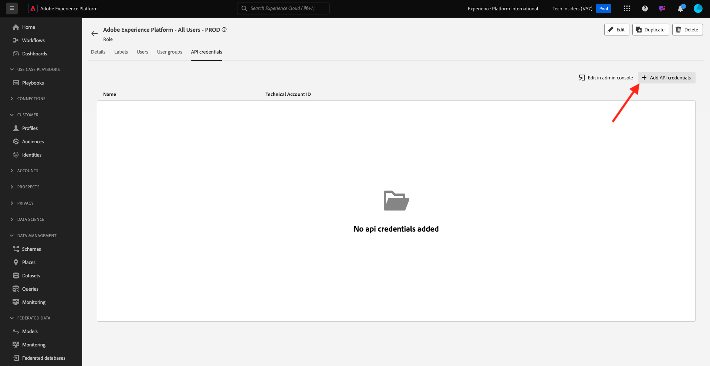

# 2.1.3將您自己的即時客戶設定檔視覺化 — API

在本練習中，您將使用Postman和Adobe I/O來查詢Adobe Experience Platform的API，以檢視您自己的即時客戶設定檔。

## 內容

在即時客戶個人檔案中，所有個人檔案資料都會與事件資料一起顯示，以及顯示現有的區段會籍。 顯示的資料可來自任何地方，包括Adobe應用程式和外部解決方案。 這是Adobe Experience Platform中功能最強大的檢視方式，也是體驗記錄系統。

即時客戶個人檔案可供所有Adobe應用程式使用，也可以供呼叫中心或店內客戶服務應用程式等外部解決方案使用。 方法是將這些外部解決方案連線至Adobe Experience Platform的API。

## 您的識別碼

在網站上的「設定檔檢視器」面板上，您可以找到多個身分。 每個身分都會連結至名稱空間。


在X-ray面板上，我們可以看到4種不同的ID和名稱空間組合：

| 身分 | 命名空間 |
|:-------------:| :---------------:|
| Experience CloudID (ECID) | 79943948563923140522865572770524243489 |
| Experience CloudID (ECID) | 70559351147248820114888181867542007989 |
| 電子郵件ID | woutervangeluwe+18112024-01@gmail.com |
| 行動電話號碼ID | +32473622044+18112024-01 |

請記住這些識別碼以利後續步驟。

## 設定您的Adobe I/O專案

在本練習中，您將密集使用Adobe I/O來查詢平台的API。 請依照下列步驟設定Adobe I/O。

移至[https://developer.adobe.com/console/home](https://developer.adobe.com/console/home)


請務必在熒幕右上角選取正確的Adobe Experience Platform執行個體。 您的執行個體是`--aepImsOrgName--`。 按一下&#x200B;**建立新專案**。


選取&#x200B;**+新增至專案**&#x200B;並選取&#x200B;**API**。


然後您會看到以下內容：


按一下&#x200B;**Adobe Experience Platform**圖示。
/images/api2.png)

選取&#x200B;**Experience PlatformAPI**&#x200B;並按一下&#x200B;**下一步**。


您現在將會看到此訊息。 提供認證的名稱： `--aepUserLdap-- - OAuth credential`。 按一下&#x200B;**下一步**。


接下來，您需要選取產品設定檔，以定義此整合可用的許可權。

選取所需的產品設定檔。

>[!NOTE]
>
> 產品設定檔名稱在您的Adobe Experience Platform執行個體中會有所不同，因為這些名稱是執行個體專用名稱。 您需要至少選取一個具有適當存取許可權的產品設定檔，這些設定檔可在Adobe Admin Console和AEP許可權UI中設定。

按一下&#x200B;**儲存設定的API**。


您的Adobe I/O整合現已準備就緒。


按一下「下載Postman **」按鈕，然後按一下「** OAuth伺服器對伺服器&#x200B;**」來下載Postman環境（請等候環境下載完畢，這可能需要幾秒鐘的時間）。**


您的IO專案目前有一個通用名稱。 您需要為整合提供易記名稱。 按一下所示的&#x200B;**專案X** （或類似名稱）


按一下&#x200B;**編輯專案**。


輸入整合的名稱和描述： `--aepUserLdap-- AEP Tutorial`。

按一下&#x200B;**儲存**。


您的Adobe I/O整合現已完成。


>[!NOTE]
>
>此外還有另一個步驟，可確保此Adobe I/O專案可存取Adobe Experience Platform的許可權設定。 專案的API認證需要新增到Adobe Experience Platform的許可權UI，而這需要系統管理員存取許可權。 這些步驟記錄如下，但如果您沒有所需的存取許可權，您可能需要聯絡系統管理員以便為您處理。

## API認證的AEP許可權

移至[Adobe Experience Platform](https://experience.adobe.com/platform)。 登入後，您會登入Adobe Experience Platform的首頁。

移至&#x200B;**許可權**、**角色**，然後按一下相關的產品設定檔。

>[!NOTE]
>
> 產品設定檔名稱在您的Adobe Experience Platform執行個體中會有所不同，因為這些名稱是執行個體專用名稱。 您需要至少選取一個具有適當存取許可權的產品設定檔，這些設定檔可在Adobe Admin Console和AEP許可權UI中設定。


按一下&#x200B;**API認證**。


按一下&#x200B;**+新增API認證**。



選取新建立的Adobe I/O專案，然後按一下[儲存]。****


## Adobe I/O的Postman驗證

移至[https://www.postman.com/downloads/](https://www.postman.com/downloads/)。

下載並安裝作業系統的相關Postman版本。


安裝Postman後，請啟動應用程式。

Postman中有2個概念：「環境」和「集合」。

- 「環境」包含您所有或多或少一致的環境變數。 在環境中，您可以找到類似平台環境的IMSOrg，以及您的私密金鑰等安全性憑證。 環境檔案是您在上一個練習中的Adobe I/O設定期間下載的檔案，其名稱如下： **`oauth_server_to_server.postman_environment.json`**。

- 集合包含您可以使用的許多API請求。 我們將使用2個集合
   - 1個AdobeI/0驗證的集合
   - 1此單元練習的集合
   - 1個用於Real-Time CDP模組中練習的集合，用於目的地製作

請將檔案[postman.zip](./../../../assets/postman/postman_profile.zip)下載到您的本機案頭。

在此&#x200B;**postman.zip**&#x200B;檔案中，您會找到下列檔案：

- `Adobe IO - OAuth.postman_collection.json`
- `AEP Tutorial.postman_collection.json`
- `Destination_Authoring_API.json`

解壓縮&#x200B;**postman.zip**&#x200B;檔案，並將這3個檔案連同從Adobe I/O下載的Postman環境儲存在案頭上的資料夾中。您需要在該資料夾中有這4個檔案：


返回Postman。 按一下&#x200B;**匯入**。


按一下&#x200B;**檔案**。


導覽至您案頭上解壓縮4個下載檔案的資料夾。 同時選取這4個檔案，然後按一下[開啟]。****


按一下&#x200B;**開啟**&#x200B;後，Postman會顯示您即將匯入的環境與集合的概觀。 按一下&#x200B;**匯入**。


您現在已擁有Postman所需的一切，可開始透過API與Adobe Experience Platform互動。

首先要做的就是確保您已正確驗證。 若要進行驗證，您需要請求存取權杖。

在執行任何要求之前，請確定您已選取正確的環境。 您可以驗證右上角的環境下拉式清單，以檢查目前選取的環境。

所選環境的名稱應該與此環境類似，`--aepUserLdap-- OAuth Credential`。


您的Postman環境和集合現已設定完畢，可正常運作。 您現在可以從Postman驗證Adobe I/O。

在&#x200B;**AdobeIO - OAuth**&#x200B;集合中，選取名稱為&#x200B;**POST — 取得存取權杖**&#x200B;的要求。 按一下&#x200B;**傳送**。


幾秒後，您應該會在Postman的&#x200B;**內文**&#x200B;區段中看到回應：


如果設定成功，您應該會看到包含下列資訊的類似回應：

| 索引鍵 | 值 |
|:-------------:| :---------------:| 
| token_type | **持有人** |
| access_token | **eyJhbGciOiJSU...jrNZ6mdaQ** |
| expires_in | **86399** |

Adobe I/O已為您提供&#x200B;**bearer**-token，具有特定值（極長的access_token）和到期視窗。

我們收到的Token現在有24小時有效。 這表示24小時後，如果您要使用Postman驗證Adobe I/O，必須再次執行此請求以產生新Token。

## 即時客戶設定檔API，結構：設定檔

現在，您可以傳送您的第一個要求至Platform的即時客戶設定檔API。

在Postman中，找到集合&#x200B;**AEP教學課程**。


在&#x200B;**1中。 整合設定檔服務**，按一下名稱為&#x200B;**UPS的第一個要求 — 依實體ID和NS** GET設定檔。


對於此請求，有三個必要的變數：

| 索引鍵 | 值 | 定義 |
|:-------------:| :---------------:| :---------------:| 
| entityId | **id** | 特定客戶ID |
| entityIdNS | **名稱空間** | 適用於ID的特定名稱空間 |
| schema.name | **_xdm.context.profile** | 您要接收其資訊的特定結構描述 |

因此，如果您想要要求Adobe Experience Platform的API傳回您自己ECID的所有設定檔資訊，您必須依下列方式設定請求：

| 索引鍵 | 值 |
|:-------------:| :---------------:| 
| entityId | **您的ECID** |
| entityIdNS | **ecid** |
| schema.name | **_xdm.context.profile** |


您也應該驗證請求的&#x200B;**標頭** — 欄位。 移至&#x200B;**標頭**。 然後您會看到以下內容：


>[!NOTE]
>
>您必須指定正在使用的Adobe Experience Platform沙箱名稱。 您的x-sandbox-name應為`--aepSandboxName--`。

| 索引鍵 | 值 |
| ----------- | ----------- |
| x-sandbox-name | `--aepSandboxName--` |


檢查沙箱名稱后，按一下&#x200B;**傳送**&#x200B;以將您的要求傳送到Platform。

您應該會立即收到Platform的回應，顯示如下內容：


這是來自Platform的完整回應：

```javascript
{
    "A2_ETHkJxMvxbiEmIZlAj8Qn": {
        "entityId": "A2_ETHkJxMvxbiEmIZlAj8Qn",
        "mergePolicy": {
            "id": "64e4b0ed-dfc3-4084-8e67-643e977168d7"
        },
        "sources": [
            "672a10cdb015162aefedfc0f",
            "672a10b1a05e282aee19737c"
        ],
        "tags": [
            "0938B898-469A-4513-8E86-87464307120F:va7",
            "3ba34930-405e-4b31-aafa-bac22d35203e:va7"
        ],
        "identityGraph": [
            "G7z3JAFBY4I6Rzg",
            "A2_ETHkJxMvxbiEmIZlAj8Qn",
            "BkFvK4QcJpSPByuDGF4UAS0wMQ",
            "BUF9zMKLrXq72p4HpbsHv1SDGF4UAS0wMUBnbWFpbC5jb20",
            "A29btmFXmrfrYbXQWISCT9ZD"
        ],
        "entity": {
            "_experienceplatform": {
                "identification": {
                    "core": {
                        "ecid": "79943948563923140522865572770524243489",
                        "phoneNumber": "+32473622044+18112024-01",
                        "email": "woutervangeluwe+18112024-01@gmail.com"
                    }
                }
            },
            "userAccount": {
                "ID": "3688250"
            },
            "pushNotificationDetails": [
                {
                    "denylisted": false,
                    "token": "2E0945F186CE5ED8CBFD1EB519A8CF38BA2B28A67FB381D45AA15EE37D289214",
                    "identity": {
                        "namespace": {
                            "code": "ECID"
                        },
                        "id": "70559351147248820114888181867542007989"
                    },
                    "platform": "apns",
                    "appID": "com.adobe.demosystem.dxdemo"
                }
            ],
            "personalEmail": {
                "address": "woutervangeluwe+18112024-01@gmail.com"
            },
            "_repo": {
                "createDate": "2024-11-18T10:39:12.296Z"
            },
            "extSourceSystemAudit": {
                "lastUpdatedDate": "2024-11-19T07:46:52.001Z"
            },
            "testProfile": true,
            "mobilePhone": {
                "number": "+32473622044"
            },
            "consents": {
                "metadata": {
                    "time": "2024-11-19T07:46:52.001Z"
                },
                "idSpecific": {
                    "ECID": {
                        "70559351147248820114888181867542007989": {
                            "collect": {
                                "val": "y"
                            }
                        }
                    }
                }
            },
            "person": {
                "name": {
                    "lastName": "Van Geluwe",
                    "firstName": "Wouter"
                }
            },
            "userActivityRegions": {
                "IRL1": {
                    "captureTimestamp": "2024-11-19T07:46:51.239Z"
                }
            },
            "identityMap": {
                "ecid": [
                    {
                        "id": "70559351147248820114888181867542007989"
                    },
                    {
                        "id": "79943948563923140522865572770524243489"
                    }
                ],
                "email": [
                    {
                        "id": "woutervangeluwe+18112024-01@gmail.com"
                    }
                ],
                "phone": [
                    {
                        "id": "+32473622044+18112024-01"
                    }
                ],
                "userid": [
                    {
                        "id": "3688250"
                    }
                ]
            }
        },
        "lastModifiedAt": "2024-11-19T07:47:23Z"
    }
}
```

這是此ECID目前在Platform中的所有可用設定檔資料。

您不需要使用ECID來向Platform的即時客戶設定檔請求設定檔資料，您可以使用任何名稱空間中的任何ID來請求此資料。

讓我們回到Postman假裝我們是客服中心，並傳送要求給Platform，指定&#x200B;**電話**&#x200B;的名稱空間和您的行動電話號碼。

因此，如果您想要要求Platform的API傳回特定電話的所有設定檔資訊，您必須依下列方式設定請求：

| 索引鍵 | 值 |
|:-------------:| :---------------:| 
| entityId | **您的電話號碼** |
| entityIdNS | **phone** （以電話取代ecid） |
| schema.name | **_xdm.context.profile** |

如果您的電話號碼包含&#x200B;**+**&#x200B;等特殊符號，則必須選取完整的電話號碼、按一下滑鼠右鍵並按一下&#x200B;**EncodeURIComponent**。


之後，您將會擁有此專案：


您也應該驗證請求的&#x200B;**標頭** — 欄位。 移至&#x200B;**標頭**。 然後您會看到以下內容：


>[!NOTE]
>
>您必須指定正在使用的Adobe Experience Platform沙箱名稱。 您的x-sandbox-name應為`--aepSandboxName--`。

| 索引鍵 | 值 |
| ----------- | ----------- |
| x-sandbox-name | `--aepSandboxName--` |


按一下&#x200B;**傳送**&#x200B;並驗證回應，您會看到與使用ECID做為身分識別時相同。


讓我們針對您的電子郵件地址執行相同的動作，指定&#x200B;**電子郵件**&#x200B;的名稱空間和您的電子郵件地址。

因此，如果您想要要求Platform的API傳回特定電子郵件地址的所有設定檔資訊，您必須依下列方式設定請求：

| 索引鍵 | 值 |
|:-------------:| :---------------:| 
| entityId | **您的電子郵件** |
| entityIdNS | **電子郵件** （以電子郵件取代電話） |
| schema.name | **_xdm.context.profile** |

如果您的電子郵件地址包含&#x200B;**+**&#x200B;等特殊符號，則必須選取完整的電子郵件地址、按一下滑鼠右鍵並按一下&#x200B;**EncodeURIComponent**。


之後，您將會擁有此專案：


您也應該驗證請求的&#x200B;**標頭** — 欄位。 移至&#x200B;**標頭**。 然後您會看到以下內容：

>[!NOTE]
>
>您必須指定正在使用的Adobe Experience Platform沙箱名稱。 您的x-sandbox-name應為`--aepSandboxName--`。


| 索引鍵 | 值 |
| ----------- | ----------- |
| x-sandbox-name | `--aepSandboxName--` |

按一下&#x200B;**傳送**&#x200B;並驗證回應，您會再次看到它和之前一樣，帶有ECID和電話號碼。


這是提供給品牌的一種非常重要的彈性。 這表示任何環境都可以使用自己的ID和名稱空間，將請求傳送至Platform，不必瞭解多個名稱空間和ID的複雜性。

例如：

- 客服中心可使用名稱空間&#x200B;**電話**&#x200B;向Platform要求資料
- 熟客制度可使用名稱空間&#x200B;**電子郵件**&#x200B;向平台要求資料
- 線上應用程式可以使用名稱空間&#x200B;**ecid**

客服中心不一定會知道忠誠度系統中使用了哪種識別碼，而忠誠度系統也不一定會知道線上應用程式使用了哪種識別碼。 每個系統都可以使用自己所擁有和瞭解的資訊，在需要時取得所需的資訊。

## 即時客戶設定檔API、結構：設定檔和ExperienceEvent

在成功查詢了設定檔資料的Platform API後，現在讓我們對ExperienceEvent資料執行相同的操作。

在Postman中，找到集合&#x200B;**AEP教學課程**。


在&#x200B;**1中。 整合設定檔服務**，請選取名稱為&#x200B;**UPS — 依實體ID和NS** GET設定檔和EE的第二個要求。


對於此請求，有四個必要的變數：

| 索引鍵 | 值 | 定義 |
|:-------------:| :---------------:|  :---------------:| 
| schema.name | **_xdm.context.experienceevent** | 您要接收其資訊的特定結構描述。 在此案例中，我們要尋找對應至ExperienceEvent結構描述的資料。 |
| relatedSchema.name | **_xdm.context.profile** | 在尋找對應至ExperienceEvent結構描述的資料時，我們需要指定想要接收該資料的身分。 有權存取身分的結構描述是Profile-schema，所以這裡的relatedSchema是Profile-schema。 |
| relatedEntityId | **id** | 特定客戶ID |
| relatedentityidNS | **名稱空間** | 適用於ID的特定名稱空間 |

因此，如果您想要要求Platform的API傳回您自己ecid的所有設定檔資訊，您必須依下列方式設定請求：

| 索引鍵 | 值 |
|:-------------:| :---------------:| 
| schema.name | **_xdm.context.experienceevent** |
| relatedSchema.name | **_xdm.context.profile** |
| relatedEntityId | **您的ECID** |
| relatedentityidNS | **ecid** |


您也應該驗證請求的&#x200B;**標頭** — 欄位。 移至&#x200B;**標頭**。 然後您會看到以下內容：


>[!NOTE]
>
>您必須指定正在使用的Adobe Experience Platform沙箱名稱。 您的x-sandbox-name應為`--aepSandboxName--`。

| 索引鍵 | 值 |
| ----------- | ----------- |
| x-sandbox-name | `--aepSandboxName--` |

按一下&#x200B;**傳送**，將您的要求傳送至Platform。

您應該會立即收到Platform的回應，顯示如下內容：


以下是來自Platform的完整回應。 在此範例中，有八個ExperienceEvents連結至此客戶的ECID。 請檢視下方，以檢視請求上的不同變數，因為您在下方看到的內容，是先前練習中您在Launch中設定的直接結果。

此外，當X-ray面板顯示ExperienceEvent資訊時，它會使用以下裝載來剖析和擷取資訊，例如產品名稱（搜尋以下裝載中的productName）和產品影像URL （搜尋以下裝載中的productImageUrl）。

```javascript
{
    "_page": {
        "orderby": "timestamp",
        "start": "b1325606-9b96-4e51-b7dd-73aacf527c72-0",
        "count": 14,
        "next": ""
    },
    "children": [
        {
            "relatedEntityId": "A2_ETHkJxMvxbiEmIZlAj8Qn",
            "entityId": "b1325606-9b96-4e51-b7dd-73aacf527c72-0",
            "sourceId": "672a10b1074ceb2af0aa7034",
            "timestamp": 1731923802848,
            "entity": {
                "environment": {
                    "ipV4": "141.134.241.99",
                    "type": "browser",
                    "browserDetails": {
                        "userAgentClientHints": {
                            "mobile": false,
                            "platform": "macOS",
                            "brands": [
                                {
                                    "brand": "Chromium",
                                    "version": "130"
                                },
                                {
                                    "brand": "Google Chrome",
                                    "version": "130"
                                },
                                {
                                    "brand": "Not?A_Brand",
                                    "version": "99"
                                }
                            ]
                        },
                        "userAgent": "Mozilla/5.0 (Macintosh; Intel Mac OS X 10_15_7) AppleWebKit/537.36 (KHTML, like Gecko) Chrome/130.0.0.0 Safari/537.36",
                        "viewportHeight": 992,
                        "viewportWidth": 1920
                    }
                },
                "web": {
                    "webPageDetails": {
                        "name": "Home",
                        "viewName": "Home",
                        "pageViews": {
                            "value": 1
                        },
                        "URL": "https://dsn.adobe.com/web/vangeluw-QIMU"
                    },
                    "webReferrer": {
                        "URL": "https://auth.services.adobe.com/"
                    }
                },
                "_experienceplatform": {
                    "interactionDetails": {
                        "core": {
                            "channel": "web"
                        }
                    },
                    "demoEnvironment": {
                        "brandName": "vangeluw-QIMU"
                    },
                    "identification": {
                        "core": {
                            "ecid": "79943948563923140522865572770524243489"
                        }
                    }
                },
                "implementationDetails": {
                    "name": "https://ns.adobe.com/experience/alloy/reactor",
                    "version": "2.24.0+2.27.0",
                    "environment": "browser"
                },
                "identityMap": {
                    "ECID": [
                        {
                            "id": "79943948563923140522865572770524243489",
                            "authenticatedState": "ambiguous",
                            "primary": true
                        }
                    ]
                },
                "eventType": "web.webpagedetails.pageViews",
                "_id": "b1325606-9b96-4e51-b7dd-73aacf527c72-0",
                "placeContext": {
                    "localTime": "2024-11-18T10:56:42.848+01:00",
                    "localTimezoneOffset": -60
                },
                "device": {
                    "screenOrientation": "landscape",
                    "screenWidth": 1920,
                    "screenHeight": 1080
                },
                "timestamp": "2024-11-18T09:56:42.848Z"
            },
            "lastModifiedAt": "2024-11-18T09:56:45Z"
        },
    "_links": {
        "next": {
            "href": ""
        }
    }
}
```

這是此ECID目前在Platform中的所有可用ExperienceEvent資料。

您不需要使用ECID向Adobe Experience Platform的即時設定檔請求ExperienceEvent資料，您可以使用任何名稱空間中的任何ID來請求此資料。

下一步： [2.1.4建立區段 — UI](./ex4.md)

[返回模組2.1](./real-time-customer-profile.md)

[返回所有模組](../../../overview.md)
