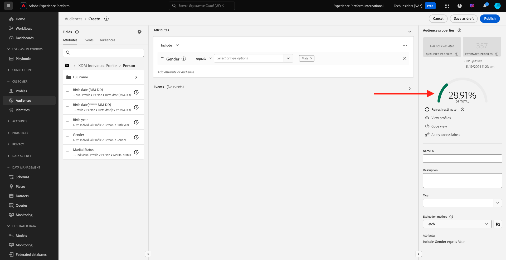

# 2.1.4建立對象 — UI

在本練習中，您將使用Adobe Experience Platform的Audience Builder來建立對象。

移至[Adobe Experience Platform](https://experience.adobe.com/platform)。 登入後，您會登入Adobe Experience Platform的首頁。


繼續之前，您必須選取&#x200B;**沙箱**。 要選取的沙箱名為``--aepSandboxName--``。 選取適當的[!UICONTROL 沙箱]後，您將會看到畫面變更，現在您已在專屬的[!UICONTROL 沙箱]中。


在左側的功能表中，移至&#x200B;**對象**。 您可以在此頁面上檢視所有現有對象的概觀。 按一下&#x200B;**+建立對象**&#x200B;按鈕以開始建立新對象。


選取&#x200B;**建置規則**&#x200B;並按一下&#x200B;**建立**。


進入新的受眾產生器後，您會立即注意到&#x200B;**屬性**&#x200B;功能表選項和&#x200B;**XDM個人設定檔**&#x200B;參考。


由於XDM是支援體驗業務的語言，因此XDM也是對象產生器的基礎。 Platform擷取的所有資料都應對應至XDM，因此無論資料來自何處，所有資料都會成為相同資料模型的一部分。 這可讓您在建立受眾時享有絕佳優勢，因為從這個受眾產生器UI，您可以在相同工作流程中合併來自任何來源的資料。 在Audience Builder中建立的對象可傳送至Adobe Target、Adobe Campaign和Adobe Audience Manager等解決方案以進行啟用。

讓我們建立一個對象，其中包含所有&#x200B;**男性**&#x200B;客戶。

若要取得性別屬性，您需要瞭解並瞭解XDM。

性別是「人員」的屬性，可在「屬性」下找到。 若要開始進行，請先按一下&#x200B;**XDM個人設定檔**。 您將會看到此訊息。 從&#x200B;**XDM Individual Profile**&#x200B;視窗中，選取&#x200B;**人員**。


您將會看到此訊息。 在&#x200B;**人員**&#x200B;中，您可以找到&#x200B;**性別**&#x200B;屬性。 將「性別」屬性拖曳至對象產生器。


現在您可以從預先填入的選項中選擇特定的性別。 在這種情況下，讓我們選擇&#x200B;**男性**。


選取&#x200B;**男性**&#x200B;後，您可以按下&#x200B;**重新整理預估值**&#x200B;按鈕，以取得對象母體的預估值。 這對於業務使用者非常有用，因此他們可以檢視特定屬性對結果受眾規模的影響。


然後您會看到如下所示的估計：



接下來，您應該稍微調整對象。 您需要建立已檢視產品&#x200B;**iPhone 15 Pro**&#x200B;的所有男性客戶的對象。

若要建立此對象，您必須新增體驗事件。 按一下&#x200B;**欄位**&#x200B;功能表列中的&#x200B;**事件**&#x200B;圖示，即可找到所有體驗事件。 接下來，您將會看到最上層&#x200B;**XDM ExperienceEvents**&#x200B;節點。 按一下&#x200B;**XDM ExperienceEvent**。


移至&#x200B;**產品清單專案**。


選取「**名稱**」，然後從左側功能表將「**名稱**」物件拖放至對象產生器畫布的「**事件**」區段。


然後您會看到以下內容：


比較引數應為&#x200B;**等於**，並在輸入欄位中輸入&#x200B;**iPhone 15 Pro**。


每次將元素新增至對象產生器時，您都可以按一下&#x200B;**重新整理預估值**&#x200B;按鈕，以取得對象中母體的新預估值。

到目前為止，您僅使用UI來建立對象，但也有程式碼選項來建立對象。

建立受眾時，您實際上是構成Profile Query Language (PQL)查詢。 若要以視覺效果呈現PQL程式碼，您可以按一下對象產生器右上角的&#x200B;**程式碼檢視**&#x200B;切換器。


現在您可以檢視完整的PQL陳述式：

```sql
person.gender in ["male"] and CHAIN(xEvent, timestamp, [C0: WHAT(productListItems.exists(name.equals("iPhone 15 Pro", false)))])
```

您也可以按一下&#x200B;**檢視設定檔**，以預覽屬於此對象之客戶設定檔的範例。


最後，讓我們為您的對象命名，
將&#x200B;**評估方法**&#x200B;設定為&#x200B;**串流**，然後按一下&#x200B;**Publish**。

作為命名慣例，請使用：

- `--aepUserLdap-- - Male customers with interest in iPhone 15 Pro`


系統將會帶您返回「對象概覽」頁面。


下一步： [2.1.5在客服中心檢視您的即時客戶設定檔實際運作中](./ex5.md)

[返回模組2.1](./real-time-customer-profile.md)

[返回所有模組](../../../overview.md)
