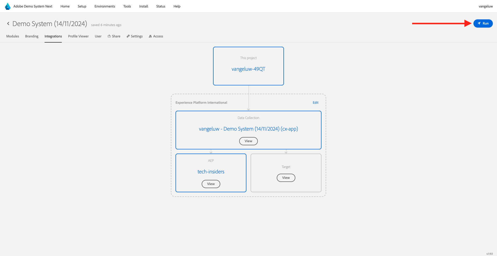
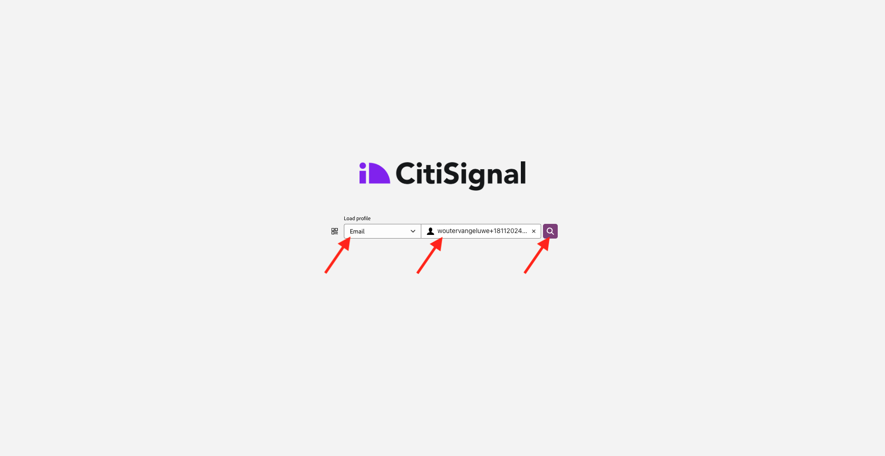

# 2.1.5在客服中心檢視您正在使用的即時客戶個人檔案

在本練習中，目標是讓您逐步瞭解客戶歷程，並像真實客戶一樣操作。

在此網站上，我們已實作Adobe Experience Platform。 每個動作都會視為體驗事件，並即時傳送至Adobe Experience Platform，以補充即時客戶設定檔。

在之前的練習中，您一開始是作為匿名客戶瀏覽網站，經過幾個步驟後，您成為了已知客戶。

當同一客戶最終接聽電話並致電您的客服中心時，請務必立即取得其他管道的資訊，以便讓客服中心體驗變得相關且個人化。

## 使用您的CX應用程式

移至[https://dsn.adobe.com](https://dsn.adobe.com)。 使用Adobe ID登入後，您會看到此訊息。 按一下您CX App專案上的3個點&#x200B;**...**，然後按一下[編輯]**以開啟它。**

在您的CX App專案中，移至&#x200B;**整合**。 按一下&#x200B;**選取環境**。

選取在快速入門中建立的Adobe Experience Platform Data Collection屬性。 您必須選取名稱中有&#x200B;**(cx-app)**&#x200B;的屬性。

您將會看到此訊息。 按一下&#x200B;**執行**。

接下來，您必須選取其中一個身分和相應的名稱空間，然後按一下&#x200B;**搜尋圖示**。

| 身分 | 命名空間 |
|:-------------:| :---------------:|
| Experience CloudID (ECID) | 79943948563923140522865572770524243489 |
| Experience CloudID (ECID) | 70559351147248820114888181867542007989 |
| 電子郵件ID | woutervangeluwe+18112024-01@gmail.com |
| 行動電話號碼ID | +32473622044+18112024-01 |

當客戶致電您的客服中心時，可使用電話號碼來識別客戶。 因此，在本練習中，您將使用電話號碼來擷取CX應用程式中的客戶設定檔。

您現在會看到客服中心中理想的資訊，讓客服中心員工在與客戶交談時，可以立即取得所有相關資訊。

下一步： [摘要與優點](./summary.md)

[返回模組2.1](./real-time-customer-profile.md)

[返回所有模組](../../../overview.md)
