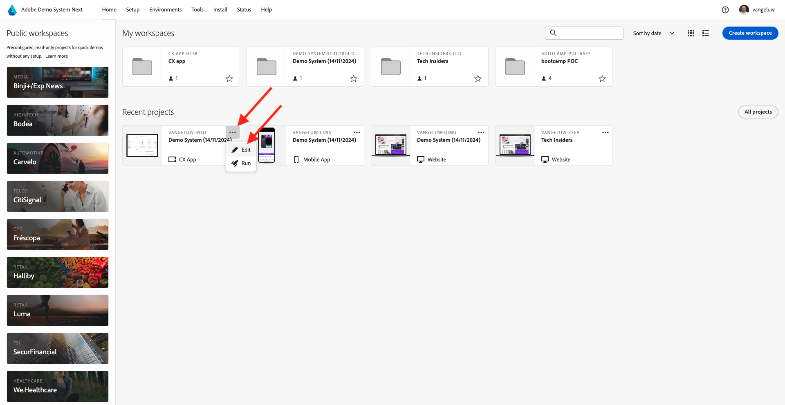

# 2.1.6在客服中心檢視您正在使用的即時客戶個人檔案

在本練習中，目標是讓您逐步瞭解客戶歷程，並像真實客戶一樣操作。

在此網站上，我們已實作Adobe Experience Platform。 每個動作都會視為體驗事件，並即時傳送至Adobe Experience Platform，以補充即時客戶設定檔。

在之前的練習中，您一開始是作為匿名客戶瀏覽網站，經過幾個步驟後，您成為了已知客戶。

當同一客戶最終接聽電話並致電您的客服中心時，請務必立即取得其他管道的資訊，以便讓客服中心體驗變得相關且個人化。

## 2.1.6.1使用您的CX應用程式

在示範系統中，我們已建立CX應用程式範本，可用來模擬客服中心環境。 請依照下列步驟建立這樣的CX App專案。

移至[https://builder.adobedemo.com/projects](https://builder.adobedemo.com/projects)。 按一下&#x200B;**新增專案**。

然後您會看到您的CX App專案。 按一下專案以開啟。

在您的CX App專案中，移至&#x200B;**整合**。 選取在模組0中建立的Adobe Experience Platform Data Collection屬性。 您必須選取名稱中有&#x200B;**（啟用）**&#x200B;的屬性。 然後，按一下&#x200B;**執行**。

您將會看到此訊息。

在「設定檔檢視器」面板上，您可以看到ID和名稱空間的下列組合：

| 身分 | 命名空間 |
|:-------------:| :---------------:|
| Experience CloudID (ECID) | 12507560687324495704459439363261812234 |
| 電子郵件ID | woutervangeluwe+06022022-01@gmail.com |
| 行動電話號碼ID | +32473622044+06022022-01 |

當客戶致電您的客服中心時，可使用電話號碼來識別客戶。 因此，在本練習中，您將使用電話號碼來擷取CX應用程式中的客戶設定檔。

在下拉式清單中選取&#x200B;**電話號碼**，然後輸入您在網站上使用的電話號碼。 按&#x200B;**Enter**。

您現在會看到客服中心中理想的資訊，讓客服中心員工在與客戶交談時，可以立即取得所有相關資訊。

下一步： [摘要與優點](./summary.md)

[返回模組2.1](./real-time-customer-profile.md)

[返回所有模組](../../../overview.md)
